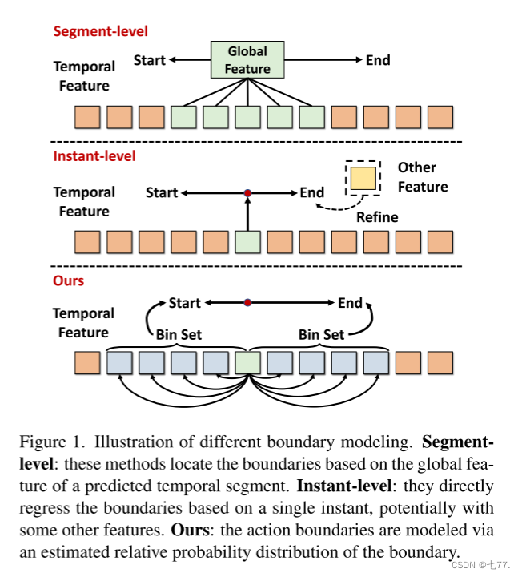
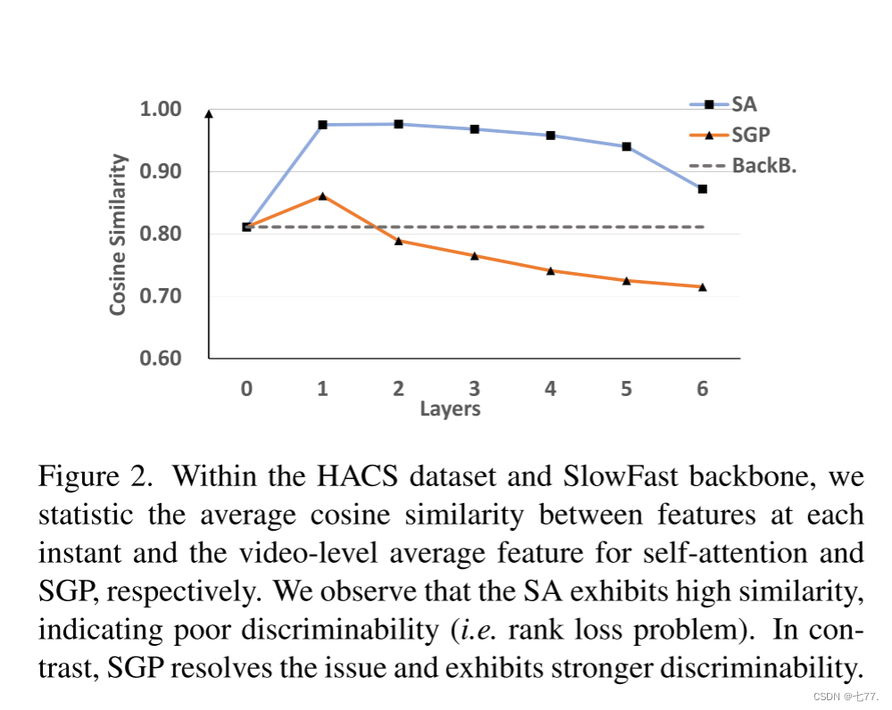

# TriDet: Temporal Action Detection with Relative Boundary Modeling

TriDet：采用相对边界建模的时间动作检测

> https://blog.csdn.net/weixin_46687145/article/details/138000431

原文链接：
https://openaccess.thecvf.com/content/CVPR2023/papers/Shi_TriDet_Temporal_Action_Detection_With_Relative_Boundary_Modeling_CVPR_2023_paper.pdf

源码链接：
https://github.com/dingfengshi/TriDet

## 摘要

这篇论文介绍了一个名为TriDet的单阶段框架，用于时间动作检测。现有方法通常由于视频中动作边界的模糊性而导致边界预测不精确。**为了缓解这个问题，我们提出了一种新颖的Trident-head，通过估计边界周围的相对概率分布来建模动作边界**。在TriDet的特征金字塔中，我们提出了一种高效的可扩展粒度感知（SGP）层，以减轻视频特征中自注意力引起的排名损失（rank loss）问题，并在不同时间粒度上聚合信息。受Trident-head和基于SGP的特征金字塔的影响，TriDet在三个具有挑战性的基准数据集THUMOS14、HACS和EPIC-KITCHEN 100上实现了最先进的性能，而计算成本较低，与先前的方法相比。例如，TriDet在THUMOS14上的平均mAP达到了69.3%，比先前最佳表现提高了2.5%，但计算延迟仅为其的74.6%。代码已发布到 https://github.com/dingfengshi/TriDet。

1.介绍
**时间动作检测（TAD）旨在从未修剪的视频中检测所有动作的开始和结束时刻以及相应的动作类别，这引起了广泛关注。**深度学习的帮助显著提高了TAD的性能。然而，由于一些未解决的问题，TAD仍然是一个非常具有挑战性的任务。

**TAD中的一个关键问题是动作边界通常不明显。与物体检测中通常存在明确的物体与背景之间的边界不同，视频中的动作边界可能是模糊的。**这一问题的具体表现是，在视频特征序列中，**边界周围的时刻（即视频中的时间位置）通常具有相对较高的分类器预测响应值。**

一些先前的工作尝试**基于预测的时间段的全局特征来定位边界**[21,22,29,46,51]，这可能会忽略每个时刻的详细信息。另一种方法是**直接基于单个时刻回归边界**[32,47]，可能还会使用其他一些特征[20,33,49]，但**这些方法不考虑边界周围相邻时刻之间的关系（例如，相对概率）**。如何有效利用边界信息仍然是一个未解决的问题。

为了促进定位学习，我们假设视频中时间特征的相对响应强度可以减轻视频特征复杂性的影响并增加定位准确性。受此启发，我们提出了一种具有**专门用于动作边界定位的新型检测头部Trident-head的单阶段动作检测器**。具体来说，与直接基于中心点特征预测边界偏移不同，**提出的Trident-head通过估计边界的相对概率分布来建模动作边界（见图1）**。然后，根据相邻位置（即区间）的期望值计算边界偏移量。

> 图1。说明不同的边界建模。**分段级:这些方法基于预测的时间段的全局特征来定位边界。**即时级:**它们直接基于单个瞬间回归边界，可能带有一些其他特征。**我们的:动作边界是**通过边界的估计相对概率分布来建模的**。
>

除了Trident-head之外，在这项工作中，提出的动作检测器**由主干网络和特征金字塔组成**。近期的TAD方法[9, 40, 47]采用了基于Transformer的特征金字塔，并展示了令人期待的性能。然而，视**频主干网络的视频特征往往在片段之间表现出很高的相似性**，这种相似性被SA进一步恶化，导致了排名损失问题（见图2）。此外，SA还带来了显著的计算开销。

> 图2. 在HACS数据集和SlowFast主干网络中，**我们分别统计了自注意力（SA）和SGP在每个时刻的特征与视频级别平均特征之间的平均余弦相似度**。我们观察到SA表现出很高的相似性，表明其辨识能力较差（即排名损失问题）。相比之下，SGP解决了这个问题，并表现出更强的辨识能力。

幸运的是，我们发现先前基于Transformer的层（在TAD中）的成**功主要取决于它们的宏观架构，即归一化层和前馈网络（FFN）如何连接，而不是自注意力机制。因此，我们提出了一种高效的基于卷积的层，称为可扩展粒度感知（SGP）层，来缓解自注意力的两个上述问题。**SGP包括两个主要分支，其作用是增加每个时刻特征的区分度，并捕获具有不同尺度感受野的时间信息。

最终的动作检测器被称为TriDet。大量实验证明，TriDet超越了所有先前的检测器，并在三个具有挑战性的基准测试（THUMOS14、HACS和EPIC-KITCHEN 100）上实现了最先进的性能。

## 2.相关工作

时间动作检测。时间动作检测（TAD）涉及从未修剪的视频中定位和分类所有动作。现有方法大致可分为两类，即两阶段方法和一阶段方法。两阶段方法[33, 36, 43, 46, 53]将检测过程分为两个阶段：候选框（proposal）生成和候选框分类。大多数先前的工作[8, 13, 19, 21, 22, 26]都着重于候选框生成阶段。具体而言，一些工作[8,21,22]预测动作边界的概率，并根据预测分数密集地匹配起始和结束时刻。基于锚点的方法[13,19]从特定的锚窗口中对动作进行分类。然而，两阶段方法存在高复杂度的问题，并且无法以端到端的方式进行训练。一阶段方法使用单个网络进行定位和分类。一些先前的工作[20, 44, 45]使用卷积网络（CNN）构建了这种分层结构。然而，CNN-based 方法与最新的TAD方法之间仍然存在性能差距。

目标检测。目标检测是时间动作检测（TAD）的姊妹任务。通过Focal Loss [18] 将边界框回归从学习Dirac delta（狄拉克δ）分布转换为一个通用的分布函数。一些方法 [10, 15, 28] 使用深度卷积来建模网络结构，而一些分支设计 [16, 37] 展示了高度的泛化能力。它们对TAD的架构设计具有启发作用。

基于Transformer的方法。受到Transformer在机器翻译和目标检测领域取得的巨大成功的启发，一些最近的工作 [9, 25, 27, 35, 38, 47] 在时间动作检测任务中采用了注意力机制，这有助于提高检测性能。例如，一些工作 [27, 35, 38] 使用类似DETR的基于Transformer的解码器来检测动作，它将动作实例建模为一组可学习的内容。其他工作 [9, 47] 利用基于Transformer的编码器提取视频表示。然而，大多数这些方法都基于局部行为。也就是说，它们只在局部窗口内进行注意力操作，这引入了类似于CNN的归纳偏差，但带来了更大的计算复杂性和额外的限制（例如，序列的长度需要预先填充为窗口大小的整数倍）。

## 3.方法

问题定义。首先**，我们给出时间动作检测（TAD）任务的形式化定义。具体来说，给定一组未修剪的视频，我们从每个视频Vi中提取出一组RGB（和光流）的时间视觉特征，其中T对应于时刻数。每个视频Vi都有Ki个段标签，其中包括动作段的起始时刻、结束时刻以及对应的动作类别。时间动作检测的目标是基于输入特征Xi检测出所有分段Yi。**

### 3.1. 方法概述

我们的目标是构建一个简单高效的单阶段时间动作检测器。如图3所示，TriDet的整体架构包括三个主要部分：视频特征主干网络、SGP特征金字塔和面向边界的Trident-head。首先，使用预训练的动作分类网络（例如I3D [7]或SlowFast [14]）提取视频特征。随后，构建一个SGP特征金字塔，以应对具有不同时间长度的动作，类似于一些最近的TAD工作 [9, 20, 47]。换句话说，时间特征被迭代地下采样，并且每个尺度级别都经过一个提出的可扩展粒度感知（SGP）层（第3.2节）处理，以增强不同时间范围内特征之间的交互作用。最后，通过设计的面向边界的Trident-head（第3.3节）检测动作实例。我们将在接下来详细介绍所提出的模块。

