# TTPOINT:A Tensorized Point Cloud Network for Lightweight Action Recognition with Event Cameras

摘要：事件相机由于其数据稀疏性、高动态范围和低延迟而在计算机视觉中越来越受欢迎。作为一种仿生传感器，事件相机产生的数据稀疏且异步，这与传统的基于帧的方法有本质的不兼容性。另外，基于点的方法可以避免额外的模态变换，自然地适应事件的稀疏性。尽管如此，它通常无法达到与基于帧的方法相当的精度。我们提出了一个轻量级和广义的点云网络，称为TTPOINT，它在仅使用1.5%的计算资源的情况下，在动作识别任务中取得了与最先进的(SOTA)基于帧的方法相比具有竞争力的结果。该模型善于用层次结构对局部和全局几何图形进行抽象。**通过利用张量序列压缩特征提取器**，TTPOINT可以用最小的参数和计算复杂度来设计。此外，我们开发了**一种简单的下采样算法来保持时空特征**。在实验中，TTPOINT作为三个数据集上的SOTA方法出现，同时在所有五个数据集上也获得了点云方法中的SOTA。此外，通过使用张量序列分解方法，在所有五个数据集的参数大小压缩55%的情况下，所提出的TTPOINT的精度几乎不受影响。

​	一基于帧的方法忽略了帧内的细粒度时间信息，并且在快速移动的动作场景中积累的图像会变得模糊。**此外，这种方法增加了数据密度和处理量，削弱了基于事件的相机的稀疏数据优势。**因此，基于框架的方法不适用于动作快速移动的场景，并且无法在有限的计算资源下完成。

为了克服上述问题，已经提出了其他方法，例如基于点的方法。这种方法非常适合分析分布式交换机数据，因为每个事件都可以被视为一个坐标为(x，y，𝑡)的三维点，然后可以直接将其输入点云网络，如图2 (b)所示。这样，数据转换过程大大简化，并保留了细粒度的时间信息[29]。然而，值得注意的是，大多数现有的努力都集中在优化网络结构上，而对采样点的关注相对较少。**由于在点云中只对所有点的一小部分(通常为0.1%至1%)进行采样，因此确保以谨慎的方式对它们进行采样非常重要，以避免丢失有价值的信息并保持动作识别的高精度**。由于DVS events的点密度随时间变化，随机抽样可能无法在时间点密度低的区域捕获足够的点，从而对捕获完整的动作时间信息产生不利影响。

TTPOINT具有时空先验、由张量序列分解模块组成的层次结构和分类器。首先，将事件流划分为多个固定长度的滑动窗口。对于每个滑动窗口，我们从𝑑子窗口中采样点，以确保动作在时间上的一致性。然后，将采样点送入层次结构，提取点云特征。层次结构由张量序列分解模块组成，该模块由残差局部提取器和残差全局提取器组成。最后，利用多层感知器(MLP)的通用分类器进行动作识别。

这项工作的主要贡献是:

•我们提出了一个轻量级的基于点的网络，具有处理不同大小的基于事件的任务的泛化能力。

•通过子窗口采样将时间信息关联起来，通过残差提取器获取空间特征，形成时空网络结构。

•我们利用张量序列分解使架构更轻，更高效，损失可接受。

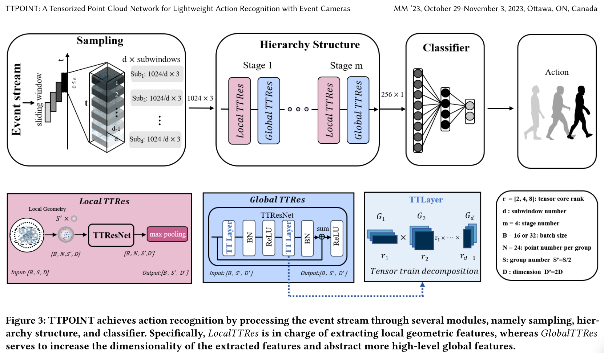

## 3 方法

我们的方法建立在基于点的方法的优势之上，同时提高了整个算法的效率和有效性。我们通过一种行动友好的抽样方法来实现这一点。为了实现最优的轻量级设计，我们为网络采用了分层结构，然后对其进行进一步优化和压缩，以实现精度和网络大小之间的良好平衡。

### 3.1事件流

事件流是按时间顺序记录图像空间强度变化的时间序列数据。一个简单的事件可以表示为𝑒𝑚=(𝑥𝑚, 𝑦𝑚, 𝑡𝑚, 𝑝𝑚),，其中m表示标识序列中第m个元素的索引。那么单个动作识别的事件集，即:

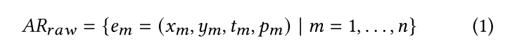

要应用点云方法，必须将四维𝑒𝑚简化为三维时空事件。一个直接的方法是将𝑡𝑚转换为z𝑚:

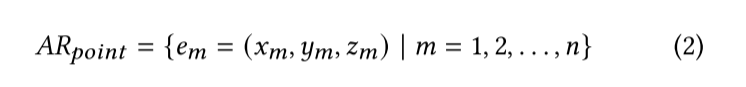

其中，𝑚=(𝑡𝑚−𝑡1)/(𝑡𝑛−𝑡1) |𝑚∈(1，𝑛)，𝑡1和𝑡𝑛分别为滑动窗口的开始和结束时间戳。And 𝑥𝑚, 𝑦𝑚, 𝑧𝑚 are normalized between [0, 1].

样本被分成滑动窗口有两个原因。首先，如表1所示，动作识别数据集中每个样本的长度是不同的。利用滑动窗口可以对每个滑动窗口内的采样范围进行归一化。其次，在大多数数据集中，移动在样本内是重复的，滑动窗口可以将单个动作从整个样本内的一组重复动作中分离出来。

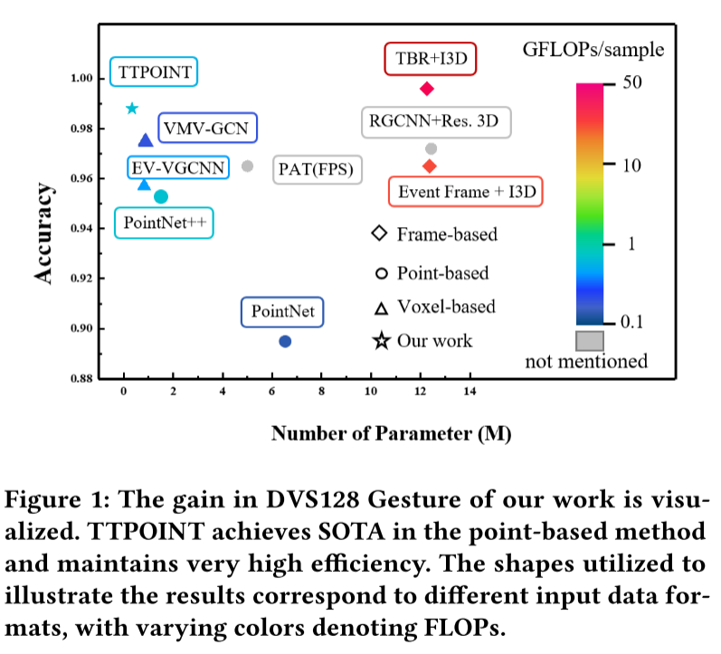

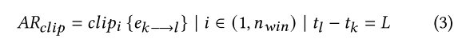

其中𝐿为滑动窗口的长度，𝑛𝑤I𝑛为滑动窗口的个数。𝑘和𝑙分别为第i个滑动窗口的起始点和结束点的时间戳。

如前所述，滑动窗口内的随机抽样是直接和广泛使用的，但它有其局限性。图4用IBM DVS128手势数据集的0.5 s的空气鼓移动切片窗口说明了这个缺点。如图4 (b)所示，在快速移动时，dvs产生高密度的事件，而在缓慢移动时产生低密度的事件。**因此，传统的随机抽样方法会从运动速度快的时刻得到点，<u>而运动速度慢的时刻代表性不足</u>。**这在图4 (c)的1024个随机采样点中可以清楚地看到。

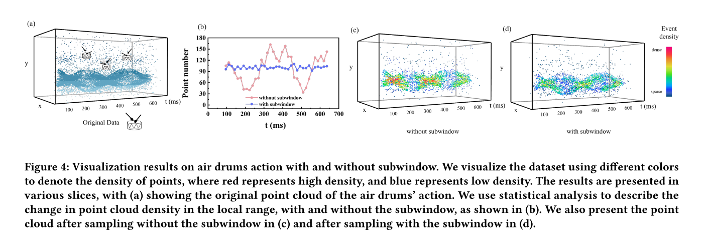

为了解决这个问题，我们<u>提出了一种进一步的分割策略</u>，以确保在时域内均匀地捕获动作事件。引入了毫秒级的子窗口:

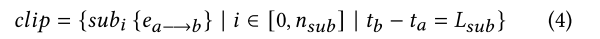

其中<u>𝐿𝑠𝑢𝑏是子窗口的长度，𝑛𝑠𝑢𝑏是子窗口的编号</u>。因此，当在0.5 s的切片内对事件进行采样时，**每个子窗口的采样点是点数(二进制)除以𝑛𝑠𝑢𝑏**。这样，随着时间的推移，这些点的<u>采样更加均匀，并保证即使是缓慢的运动也可以被表示出来</u>，如图4 (b)， (d)所示。在下一节中，我们将列出实验结果，并比较不同采样点对性能的影响。

### 3.2网络

当我们通过上述采样方法从事件流中得到维数为[1,1024,3]的一系列三维数据𝑐𝑙𝑝𝑠𝑎𝑚𝑝𝑙𝑒后，我们可以将数据输入到未压缩的模型中进行点云特征提取。我们在事件处理领域采用残差结构，在点云领域[17]被证明取得了很好的效果。接下来，我们将介绍未压缩模型的特征提取器的设计。

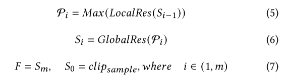

其中，F为提取的点云特征，可将其送入分类器完成动作识别任务。未压缩模型具有提取全局和局部特征的能力，具有层次结构(Pointnet++[24])。其中𝐿𝑜𝑐𝑎𝑙𝑅𝑒𝑠 input∈的维数为[B, S, D]，𝑚为层次结构的阶数，*𝑀𝑎x*为最大池化操作，P为𝐿𝑜𝑐𝑎𝑙𝑅𝑒𝑠的输出，𝐺𝑙𝑜𝑏𝑎𝑙𝑅𝑒𝑠input∈[B, S '，D ']的维数如图3所示。其中，B为批大小，N为一组的点的数量，𝐷为数据的维数，𝑆为整个点云数据中的组数。从宏观的角度来看，𝐿𝑜𝑐𝑎𝑙𝑅𝑒𝑠主要是提取空间域的局部特征，并通过最远点采样和分组的方法对局部进行操作。𝐺𝑙𝑜𝑏𝑎𝑙𝑅𝑒𝑠主要对提取的局部特征进行综合，建立全局关系。

### 3.3 张量列分解 Tensor train decomposition

为了达到必要的轻量化水平，甚至超越最先进的基于体素的方法，并在资源受限的设备上实现实时处理，张量分解技术具有很大的前景。其中，张量序列分解(TTD)框架与常规的正则多进分解(CP)和塔克分解等方法相比有几个显著的优点。

首先，TTD在处理高维张量方面非常高效，将存储复杂度从$𝑂(𝑛^𝑑)$降低到$𝑂(𝑑·𝑛·𝑟^2)$，将计算复杂度从$𝑂(𝑛^{2𝑑})$降低到$𝑂(𝑑·𝑛·𝑟^3)$(其中𝑛是张量的维数，𝑑是张量的阶数，𝑟是秩大小)。其次，TTD只需要设置秩大小来平衡精度和模型大小，而CP分解需要指定每个张量的形状并引入额外的超参数。第三，在TTD中，每个分解张量核的大小是一致的，而Tucker分解具有超大核张量的特点，对边缘计算提出了挑战。此外，我们提出的TTPOINT网络中的特征提取器是使用多层感知器(mlp)实现的，这与TTD框架完美匹配。我们的实验证实了TTPOINT在基于事件的动作识别任务中利用TTD的优越性能。

#### 张量分解与多层感知器（MLP）压缩过程

我们使用张量-序列分解方法来压缩Res模块，这将在下面详细描述。一个𝑛维张量$$W∈𝑅^{𝑙_1×𝑙_2×…x𝑙_𝑛}$$可以用若干张量核$\Alpha _𝑚∈𝑅^{𝑟_{𝑚−1}\times 𝑙_𝑚 \times 𝑟_𝑚}(𝑚∈[1，𝑛])$来近似，其中$W(𝑙_1，𝑙_2，…，𝑙𝑛)$是由索引$𝑙_1，𝑙_2，…,𝑙_𝑛$指定的元素。表示如下:

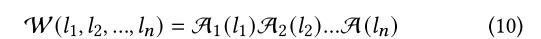

​	**$ A_m(l_m) \in \mathbb{R}^{r_{m-1} \times r_m} $** 是一个从三维张量 $ A_m $ 中截取的矩阵切片，$ r_m $ 是 $ A_m $ 的秩。对于每个整数 $ l_m $，它可以进一步分解为 $ l_m = o_m \times p_m $，其中 $ o $ 和 $ p $ 分别表示两层神经网络的宽度。考虑图5(b)中展示的示例，假设 $ l = 16384 $，原始模型被重塑为一个四维张量，其权重表示为 $ l_m = [16, 16, 8, 8] $，即 $ 16 \times 16 \times 8 \times 8 = 16384 $。类似地，参数 $ o = 256 $ 和 $ p = 64 $ 也被重塑为 $ o_m = [4, 4, 4, 4] $ 和 $ p_m = [4, 4, 2, 2] $。因此，每个张量核 $ A_m $ 可以被转换并重塑为：
$
A_m^* \in \mathbb{R}^{r_{m-1} \times r_m \times o_m \times p_m}
$
这种双索引技巧是分解 MLP 单元中全连接计算的核心方法：
$
\mathcal{W}((o_1, p_1), (o_2, p_2), \dots, (o_n, p_n)) = A_1^*(o_1, p_1) A_2^*(o_2, p_2) \dots A_n^*(o_n, p_n)
$

整个权重压缩过程在图5(a)中有详细说明，图5(b)展示了一个通过特定数据来简化理解的场景。如果这种方法用于 CNN，它代表图像的高度和宽度；如果用于点云处理，则表示输入和输出的维度。

在一般情况下，大规模矩阵-向量乘法是 MLP 单元中计算最昂贵的部分，其通用形式为：
$
\mathbf{Y} = \mathcal{W} \mathbf{X} + \mathbf{B} \tag{12}
$
为了用更少的参数近似 $ \mathcal{W} $，权重矩阵 $ \mathcal{W} $ 被重塑为一个张量：
$
\mathcal{W} \in \mathbb{R}^{(o_1 \times o_2 \times \dots \times o_n) \times (p_1 \times p_2 \times \dots \times p_n)}
$
类似地，输入 $ \mathbf{X} $ 和偏置 $ \mathbf{B} $ 也被重塑为 $ n $-维张量：
$
\mathbf{X} \in \mathbb{R}^{l_1 \times l_2 \times \dots \times l_n}, \quad \mathbf{B} \in \mathbb{R}^{l_1 \times l_2 \times \dots \times l_n}
$
结果是，输出 $ \mathbf{Y} $ 也变成一个 $ n $-维张量：
$
\mathbf{Y} \in \mathbb{R}^{l_1 \times l_2 \times \dots \times l_n}
$

因此，MLP 单元中的矩阵-向量乘法可以被重新公式化为：
$
\mathbf{Y}(l_1, l_2, \dots, l_n) = \sum \dots \sum \left[ A_1^*(o_1, p_1) A_2^*(o_2, p_2) \dots A_n^*(o_n, p_n) \mathbf{X} \right] + \mathbf{B}(l_1, l_2, \dots, l_n) \tag{13}
$

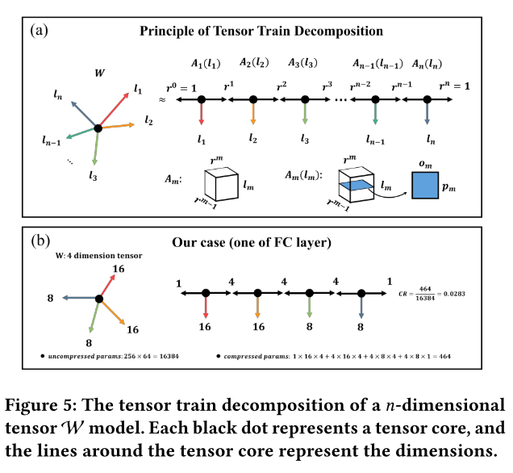

由于采用张量分解策略，张量压缩MLP的计算复杂度大大降低。对于上面提到的基本未压缩模型，经过压缩后，模型大小压缩了55%，仅为0.334 M，浮点运算次数减少了46%，为0.587 GFLOPs。在TTPOINT中，我们将Res块中的MLP替换为TTlayer，这是通过以下公式压缩的MLP:

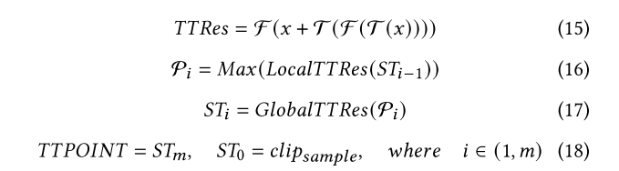

其中TTlayer的秩将在下一节中提供。建立了一个张量列分解的轻量点云网络。