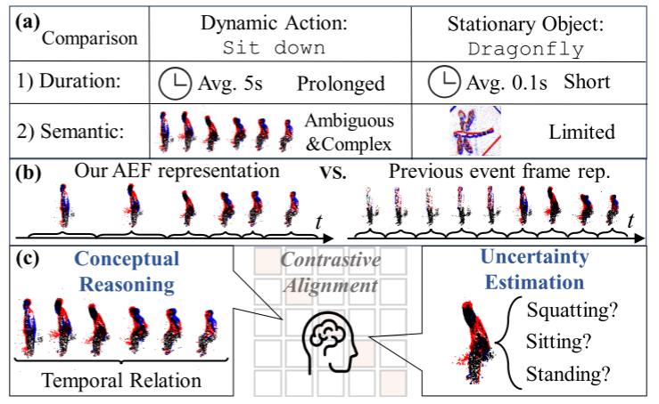
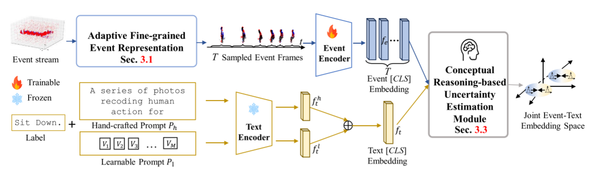
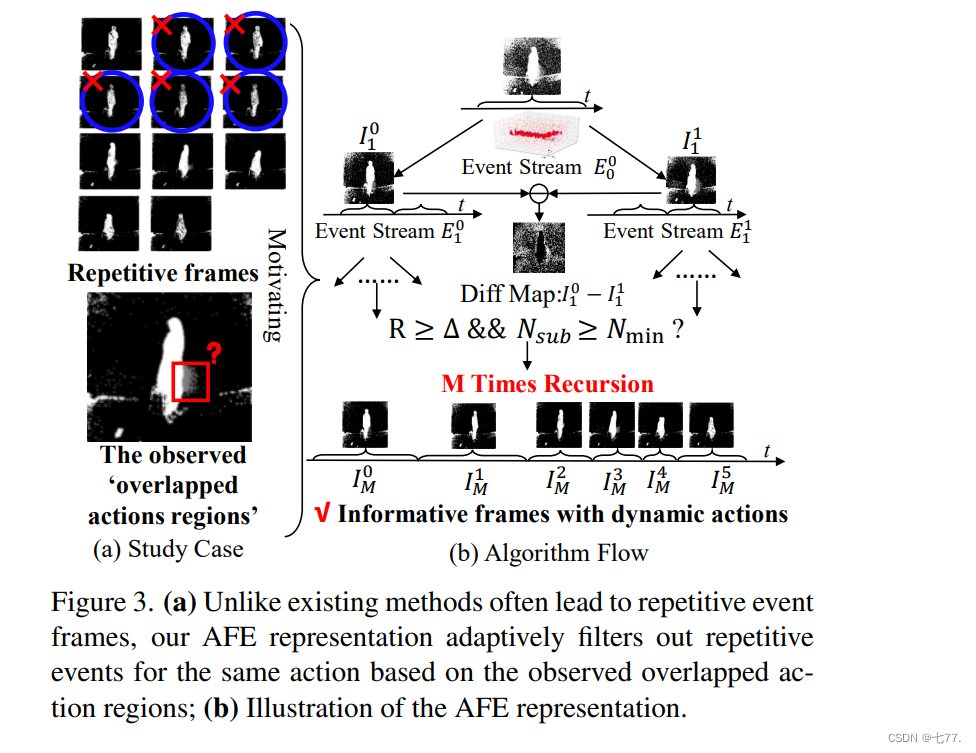
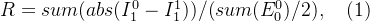
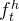
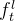

# ExACT: Language-guided Conceptual Reasoning and Uncertainty Estimation for Event-based Action Recognition and More

> https://blog.csdn.net/weixin_46687145/article/details/140044904

## Abstract

事件摄像头最近被证明有利于实际的视觉任务，如动作识别，这要归功于它们的高时间分辨率、高能效和减少隐私问题。然而，当前的研究受到以下两个问题的阻碍：1)事件持续时间长，动态动作具有复杂和模糊的语义，难以处理；2)固定堆栈的事件框架表示存在冗余的动作描述。我们发现，语言自然传达了丰富的语义信息，使其在减少语义不确定性方面具有惊人的优势。鉴于此，我们提出了一种新的方法，首次从跨通道概念化的角度来处理基于事件的动作识别。我们的Exact带来了两个技术贡献。首先，我们提出了一种自适应细粒度事件(AFE)表示法，在保留动态事件的同时，自适应地滤除静止目标的重复事件。这在不增加计算代价的情况下巧妙地提高了Exact的性能。然后，我们提出了一个基于概念推理的不确定性估计模块，该模块模拟了识别过程，丰富了语义表示。特别是，概念推理基于动作语义建立时态关系，不确定性估计基于分布表示处理功能的语义不确定性。实验表明，该算法在PAF、HARDVS和我们的片段数据集上的识别率分别达到了94.83%(+2.23%)、90.10%(+37.47%)和67.24%。

## 1.引言

动作识别是一项重要的视觉任务，具有许多应用，如机器人导航[33，43]和人类异常行为识别[25，35]。已经提出了许多基于框架的学习方法，导致了令人印象深刻的性能改进[24，43]。然而，对于功率受限的场景，例如监视[3，24]，这些方法可能不是理想的解决方案。由于运动模糊和光线变化等环境偏差[36]，RGB相机也会降级。此外，基于帧的摄像头由于直接捕捉用户的外表，引发了相当大的隐私问题。

最近，受生物启发的活动相机越来越受欢迎[1，14，27]，它忽略了背景，只记录下移动的物体。这导致了低功耗的传感效率和对快速运动和照明变化的适应能力。此外，活动摄像头大多反映物体的边缘，这缓解了用户对肤色和性别等隐私问题的担忧。由于这些优势，基于事件的动作识别为现实世界的实现提供了更实用的解决方案。这激发了基于事件的动作识别领域的研究努力[14，27，36，39，49，54，55]，表现合理。

然而，上述方法的不足有两个原因：1)它们识别大量不同的人类行为的能力有限，在包含300个类别的Tab中的HARDVS[48]数据集上的实验证明了这一点。1.这可能是由于动态动作和持续时间延长(约5s[48])导致的复杂和模棱两可的语义，而不是持续时间较短(约0.1s[48])和有限语义的对象。例如，如图1(A)所示，‘蜻蜓’vs.“请坐”。2)缺乏定制的事件表示，因为原始事件被直接堆叠到具有固定堆栈的事件帧中，导致具有描述相同动作的重叠或模糊边缘信息的事件帧，见图3和图1(B)。

视觉语言模型的最新进展[6，11，37]开创了跨文本和视觉通道整合语义概念的想法，旨在模拟人类概念化和推理的过程[19，41，42]。关键的洞察是，语言自然地传达着内在的语义丰富，这有助于对语义不确定性进行建模，并建立复杂的语义关系。受此启发，我们引入了语言作为基于事件的动作识别的指导。作为第一次探索，研究的障碍包括：1)如何在没有冗余事件框架的情况下表示事件以详细描述动态动作？2)如何将文本嵌入和事件嵌入结合起来，帮助推理动态动作的复杂语义，减少语义不确定性。

为此，我们提出了一个新的准确框架，从跨模式概念推理的角度来处理基于事件的动作识别，如图1(B)和(C)所示。为了解决第一个挑战，提出了一种自适应细粒度事件(AFE)表示(SEC.3.1)的灵感来自于图3中观察到的“重叠的动作区域”。这些区域表明一帧中的事件堆栈过多，这对于以前基于帧的固定堆栈的表示是不可避免的。不同的是，我们的AFE递归地和离线地根据重叠区域来寻找不同动作的分界线。它消除了重复事件并保留了动态动作，从而在不增加计算成本的情况下提高了模型的性能(Tab.2)。

> 
>
> 图1.(A)不同于静止物体，例如具有短持续时间(0.1秒)和有限语义的‘蜻蜓’，像‘坐下’这样的动态动作具有延长的持续时间(5秒)，具有模棱两可和复杂的语义。(B)与以往的事件表示方法相比，采用固定数量的事件堆叠，自适应地过滤出记录静态动作的事件，同时保留动态动作；(C)引入语言指导来刺激识别过程，特别是在概念推理时间关系和估计不确定语义方面。

对于第二个挑战，我们提出了一种新的基于概念推理的不确定性估计(CRUE)模块。3.3)模拟人类的动作识别过程。具体地说，CRUE通过利用文本嵌入来推理每个框架的语义，从而建立事件帧之间的时间关系，从而获得融合的事件嵌入。随后，CRUE将事件和文本嵌入从离散表示转换为分布表示，其中分布变化量化了语义不确定性。通过这种方式，我们提出的CRUE模块建立了一个语义丰富和不确定性感知的嵌入空间，以提高模型的性能(Tab.3)。

同时，由于现有的数据集只提供类别级别的标签，我们提出了包含58个动作类别的具有丰富语义的标题级别标签的摘要数据集。我们的数据集作为第一个用于事件文本动作识别的数据集(准确率为67.24%)。我们还进行了大量的实验，结果表明，我们的方法在公共数据集上的准确率明显优于以前的方法，PAF[34]的准确率为94.83%(+2.23%)，特别是在HARDVS[48]上的准确率为90.10%(+37.47%)。除了动作识别，我们的Exact还可以灵活地应用于事件-文本检索任务。

综上所述，我们的主要贡献是：(I)我们提出了第一个利用语言指导进行基于事件的动作识别的框架；(Ii)我们提出了CRUE模块来模仿人类的动作识别，为动作识别创造了一个丰富的、具有不确定性感知的跨模式嵌入空间。此外，我们的AFE表示自适应地过滤冗余事件，产生对动态动作的有效表示。(3)我们引入了带有详细文本字幕的Sact数据集来评估由多个具有不同语义的子动作组成的动作的识别能力。大量的实验证明了我们的框架在特定数据集和公共数据集上的优越性。

## 2.相关工作

基于事件的动作识别方法可以分为纯事件识别方法和事件-其他通道识别方法。对于纯事件框架，最广泛的技术包括将事件流堆叠到紧凑的框架中，然后使用现成的卷积神经网络(CNN)[14]或视觉转换器(VITS)[39，55]进行有效的特征提取。由于CNN/VIT主干的出色表现，这种方法目前展示了最先进的性能。同时，考虑到事件数据的异步性，研究界探索了仿生尖峰神经网络(SNN)[27]的适用性和图卷积网络(GCNS)[54]的时空能力，以更好地与事件数据的独特结构共振。然而，这些方法产生的性能不佳，适应性有限，部分原因是SNN固有的特殊硬件要求。

与此同时，人们一直在努力将事件数据与其他模式相结合。例如，将RGB[49]数据中丰富的颜色和纹理信息与事件信息结合在一起，或者利用光流[36]中的补充运动知识。综上所述，这些方法大多依赖于密集的连续事件帧，不可避免地导致具有重叠动作和不确定语义的冗余帧。为了表示事件以描述详细的动态行为，提出了自适应采样事件帧的AFE表示，而不引入额外的计算代价。

视觉语言模型 近年来，人们对用于多通道表示的大规模预训练的视觉语言模型[6，11]越来越感兴趣。受此启发，几个开创性的工作[7，52，58]研究了将VLM的能力转移到事件模式的可能性，从而重振了反对识别的最佳性能。此外，VLMS卓越的零激发能力促使研究人员探索基于事件的无标签[7]或零(少)激发应用[58]，从而解决了高质量事件数据集的稀缺问题。然而，现有的事件-文本方法侧重于识别语义有限的对象，而不能识别持续时间较长、语义复杂和模糊的事件。因此，我们的目标正是从跨通道概念推理的角度来增强基于事件的动作识别。

## 3.拟议的确切框架

概述。图2描述了我们的Exact框架的概述。Exact的关键思想是引入语言作为估计语义不确定性和建立基于事件的动作识别的语义关系的指南。以下小节解释了1)建议的自适应细粒度事件(AFE)表示(SEC.3.1)；2)事件编码器和文本编码器(Sec.3.2)；3)基于概念推理的不确定性估计(CRUE)模块(SEC.3.3)。此外，在SEC中。3.5，我们提出了语义丰富的基于事件的动作识别(SEACT)数据集，作为事件-文本动作识别的第一个数据集。

> 
>
> 图2.我们提议的确切框架的总体框架。它由四个部分组成：(1)AFE表示递归地消除重复事件并生成描述动态动作的事件帧(SEC。3.1)；(2)事件编码器和(3)文本编码器，分别负责事件和文本嵌入(Sec.3)；(4)CRUE模块模拟动作识别过程，对子动作建立复杂的语义关系，减少语义不确定性。(Sec.3)

### 3.1 AFE 表示法

大多数基于事件的动作识别模型[14, 39, 55]主要依赖于事件帧表示[31, 56]，这与现成的CNN/ViT主干兼容。对于这些模型，事件流被空间整合成固定事件数量或持续时间的帧[57]，如图1(b)所示。然而，事件数据的高时间分辨率不可避免地导致大量展示相同静止物体的重复事件帧（参见图3(a)中的蓝色圆圈）。因此，这种表示法难以描绘动态动作。为此，我们试图回答以下问题：能否在保留记录动态动作事件的同时，自适应地过滤掉静止物体的重复事件？

> **图3.** (a) 与现有方法常常导致事件帧重复不同，我们的AFE表示形式能够根据观察到的重叠动作区域，自适应地过滤掉相同动作的重复事件；(b) AFE表示形式的示意图。

相应地，我们在图3(a)中可视化了之前的事件帧表示[57]。一个显著的观察是标记为红色方框的“重叠动作区域”，这是帧转换过程中的副产品，由于过多的事件堆叠，连续动作在此区域重叠。这个“重叠动作区域”成为不适当事件采样间隔的关键指示。基于这一点，我们提出了AFE表示法。

具体而言，为了根据“重叠动作区域”找到不同动作之间最合适的分界线，我们采用了经典的二分查找法，并通过高效的O(logn)算法复杂度实现了离线及递归操作。如图3(b)所示，搜索算法可视为在一个二叉树中寻找叶节点的过程。首先，我们将原始事件流（根节点）等分为两个子流（节点）和（节点），并生成它们相应的事件计数图像和。接着，我们对与进行相减以得到差异图。接下来，为了基于差异图衡量动作重叠的比例，我们定义了一个名为差分率R的因素，其表达式为：

这里，sum(.)和abs(.)函数分别代表事件计数和绝对值操作。直观上，R值高表明将记录两个不同动作的事件堆叠到同一帧中的概率高。在这种情况下，我们需要递归地划分事件子流。

对于递归算法，边界条件至关重要。在我们的案例中，如果差分率R高于最低采样阈值Δ，我们将重复上述分割过程，直到它低于Δ或子流的事件数量Nsub小于最小聚合事件数量Nmin。需要注意的是，超参数Nmin和Δ会根据不同数据集而变化。关于如何选择Nmin和Δ的更多讨论，请参考补充材料。经过上述M次递归的搜索过程后，我们最终获得了一系列细粒度的事件帧ITM，共包含T帧（所有叶节点）。

> 事件数据是一连串的信号，每个信号代表着某个像素亮度的瞬间变化。如果我们简单地把一定时间跨度内的所有事件打包成一个“帧”，可能会出现这样的情况：这个“帧”里的事件实际上包含了两个不同动作的事件，因为这两个动作恰好在这个时间段里都有事件产生。这就好比在拍摄快速交替的两个动作时，快门速度不够快，导致两个动作在一张照片中都模糊不清。
>
> 通过比较两个子事件流生成的事件计数图像的差异，来衡量这两个子流是否包含大量重叠的事件（可能属于不同动作）。如果R值高，说明这两个子流的差异大，即它们可能各自记录了不同的动作，但这些不同的动作在之前的处理中被错误地合并到了一起，形成了具有混淆事件的帧。
>
> 因此，当R值高时，表明当前的事件分组或帧划分方法可能导致了不同动作事件的混合，这不利于准确识别每个独立的动作。为了提高识别的精确度，就需要通过递归地细分事件流，尝试找出更佳的切割点，使得每个细分后的事件流尽可能只包含单一动作的事件，从而降低R值，提高事件数据的纯净度和动作识别的准确性。

### 3.2. 特征编码器

采用AFE表示法后，事件流被处理成一系列精细的时间事件帧。随后，利用来自预训练的EventText模型[58]中的事件编码器和文本编码器来建立一个统一的事件-文本嵌入空间。这一过程具体分为以下几个步骤：

事件编码器：如图2所示，该编码器接收空间尺寸为H×W的RGB事件帧∈ RH×W×3作为输入，其中i = 1, 2, ..., T代表事件帧的序号。它输出对应的事件嵌入。对于T个事件帧，事件编码器逐一处理这些帧，总共执行T次操作，并最终生成事件的[CLS]嵌入向量。这里，[CLS]嵌入通常用于汇总整个序列的关键信息。

文本编码器：它接受两种不同类型的文本提示作为输入：
1. 手工编写的文本提示：“一系列记录[动作类别]行为的照片。” 其中，[动作类别]代表具体的类别名称。编码之后，每个词被转换成Dp维的词嵌入，并组合形成最终的文本标记Ph。
2. 可学习的文本提示: Pl = [P1, P2, ..., Pn, PCLASS.]，其中Pi (i = 1, 2, ..., nl)是一个随机初始化的Dp维参数；nl表示可学习文本提示的数量；PCLASS代表[类别]及句点符号的编码词嵌入，“.”表示连接操作。通过这种方式，文本编码器将手工编写的文本提示Ph和可学习的文本提示Pl分别转化为相应的文本嵌入和。最终，通过平均和得到文本的[CLS]嵌入向量ft。

### 3.3. CRUE模块

先前基于事件的动作识别方法[14, 26]未能充分考虑以下两个方面：

1. 时间关系：与静止物体不同，动态动作随时间展开。事件数据中蕴含的时间信息对于理解动作的意义至关重要。例如，在图1中，“坐下”和“站起来”包含相似的子动作，但发生顺序相反，即“站立”→“蹲下”→“坐下”与“坐下”→“蹲下”→“站立”，这导致了不同的语义含义。

2. 语义不确定性：由多种子动作组成的行为比静止物体呈现更高的语义复杂性。“坐下”作为一个例子，包括“站立”、“蹲下”和“坐着”等子动作，每个子动作都有其特定意义。因此，仅使用任何单一子动作来表达“坐下”这一完整动作的含义是不够且不确定的。

受这两方面因素的启发，我们提出了CRUE模块，旨在通过概念推理融合和不确定性估计来模拟人类的动作识别过程。

概念推理融合：与简单平均融合事件帧的方法[14, 36, 39, 55]不同，提出的CRUE模块利用文本嵌入指导事件帧的融合。具体而言，如图4所示，给定事件[CLS]嵌入fe和文本[CLS]嵌入ft，使用两层多层感知机（MLP）网络进行维度投影。这样可以获得投影后的事件嵌入fp_e和文本嵌入fp_t。然后，我们将fp_e和fp_t相乘并接上softmax函数以生成概念推理权重。接下来，这些权重与原始的投影事件嵌入fp_e相乘，得到融合后的事件嵌入ffuse_e。直观上，概念推理权重作为基于事件帧时间序列产生的语义权重，用于指导帧的融合。