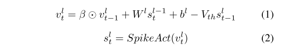
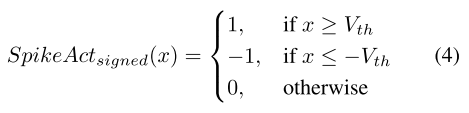
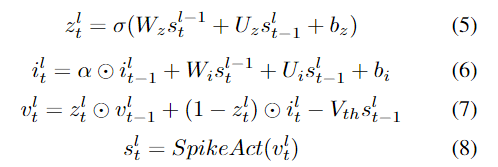
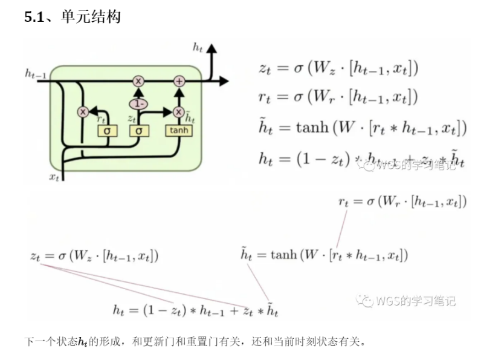
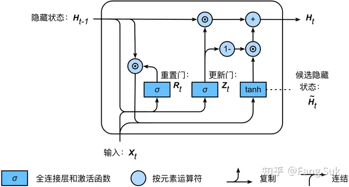
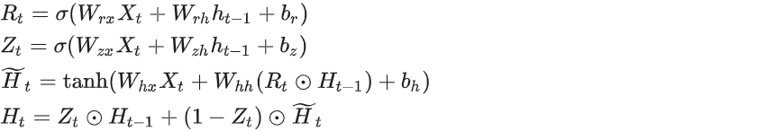
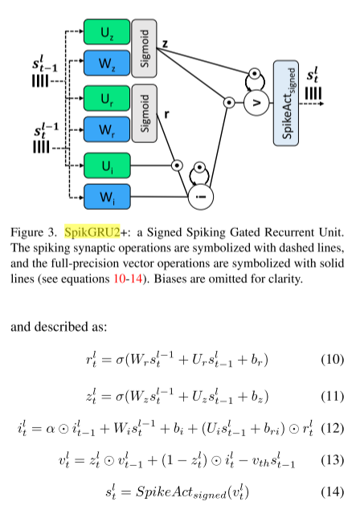

# Neuromorphic Lip-Reading with Signed Spiking Gated Recurrent Units

## 写在前面

- 论文提出了一种新的SNN模型，即Signed Spiking Gated Recurrent Unit（SpikGRU2+），该模型作为事件驱动自动唇读（ALR）任务的任务头。
  - SpikGRU2+其实就是基于SpikGRU往GRU更逼近了，原来的SpikGRU没有看到重置门，现在SpikGRU2+有了重置门。
  - 有两个显著的改进:(1)使用带符号的峰值激活函数来取代标准的峰值激活函数;(2)在神经元细胞模型中增加了第二个门。这个模型被称为有符号尖峰门控循环单元(SpikGRU2+，“2”代表第二个门，“+”代表有符号激活函数)。
- SNN架构由前端和后端组成。前端基于ResNet-18的脉冲版本（Spiking ResNet-18），用于特征提取；后端则使用新提出的SpikGRU2+模型，用于处理序列数据并输出预测结果。
- 论文中使用了signed spiking activation function（SpikeAct signed），这种激活函数比传统的脉冲激活函数更能提高SNN的准确性。它允许神经元在正向和负向两个方向上产生脉冲，从而更细致地表示信息。
  - 带符号的尖峰激活函数(SpikeActsigned)更接近于双曲正切函数(tanh)，这是ANN GRU[6]中典型的激活函数。
- 通过引入spike loss来增强SNN的稀疏性，从而在保持准确性的同时减少操作次数。此外，论文还估计了SNN在神经形态实现中的能效，预计比专用的ANN加速器更高效。

## 预备知识

深层snn基于时间离散版的Leaky-Integrate-and-Fire (LIF)神经元模型，该模型描述了神经元膜电位和spike放电的动态[14,37]:

**$v^l_t$和$s^l_t$分别是第l层神经元在t时刻的膜电位和输出峰。**泄漏β∈[0,1]决定了膜电位随时间的指数衰减。W和b表示SNN层的权重和偏置参数。⊙表示元素乘法。

### SpikeAct signed

少数人[24,44]考虑使用符号尖峰神经元来代替传统的尖峰激活函数，符号尖峰神经元可以发射正尖峰和负尖峰。这是由使用ANN-to-SNN转换训练(将训练好的ANN映射到SNN)引起的。实际上，在这种情况下，负尖峰可以补偿过量的正尖峰触发(由于尖峰触发的异步性质)，以便SNN的总激活更好地匹配等效ANN的激活。有符号尖峰激活函数可定义为:

### Spiking Gated Recurrent Units

在[28]中提出了长短期记忆网络(LSTM)的尖峰适应，其中细胞模型中的每个激活函数(包括门)都被一个尖峰函数取代。然而，与原始的人工神经网络门控循环单元(GRU)相比，这在很大程度上降低了精度，如图[3]所示。[11]中引入了另一个尖峰激活函数(SpikGRU)，它只在单元的输出端使用尖峰激活函数。因此，**候选状态(输入电流)i和隐藏状态(膜电位)v可以完全精确地计算**，这已被证明可以提高精度，同时诱导可忽略不计的开销[11]。SpikGRU模型定义为gate(z)，如下:

Wi, Wz和Ui, Uz分别为前馈连接和循环连接的权矩阵，bi和bz为偏置，σ为s型函数，α∈[0,1]决定电流i的衰减率。

> 对比GRU
>
> 
>
> 
>
> 

## 创新点

### Signed Spiking Gated Recurrent Unit

### Spike Loss

在基于事件的神经形态实现中，每秒的操作数与SNN[13]的尖峰稀疏度成正比。虽然SNN自然是稀疏的，但它们的稀疏性可以通过训练来增强，方法是在精度损失的基础上增加一个尖峰损失。这种损失可以用尖峰的数量直接计算[12,36]。然而，在这些实验中，尖峰是由它们影响的突触连接的数量加权的，因为它以更高的保真度代表了最终的操作数量[13]。

