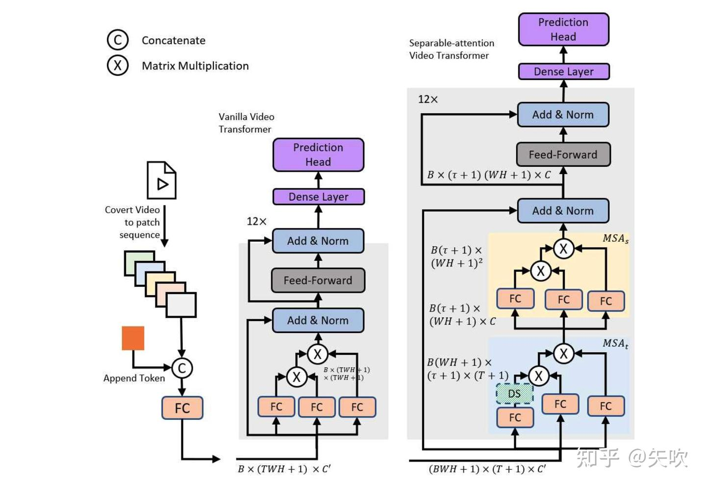

# VidTr: Video Transformer Without Convolutions

## 1 Motivation

传统基于卷积的视频分类建模方法一般是先提取图像特征，再对多帧图像特征进行聚合得到视频特征。考虑到 Transformer 模型在[时序数据](https://zhida.zhihu.com/search?content_id=170752589&content_type=Article&match_order=1&q=时序数据&zhida_source=entity)建模上具有先天优势，再加上 ViT 在[图像分类](https://zhida.zhihu.com/search?content_id=170752589&content_type=Article&match_order=1&q=图像分类&zhida_source=entity)领域上的成功，因此作者提出了 VidTr 这一基于 Transformer 直接对视频像素级数据进行时空[特征提取](https://zhida.zhihu.com/search?content_id=170752589&content_type=Article&match_order=1&q=特征提取&zhida_source=entity)的分类模型。

作者首先提出了 vanilla video transformer 直接利用 ViT 对视频进行像素级数据建模，但存在内存消耗过大的问题，因此借鉴了R(2+1)D模型中3D卷积空域和时域分离执行的思想，提出了 separable-attention 分别执行 spatial & temporal attention，spatial attention 能够关注到信息量更大的patches，[temporal attention](https://zhida.zhihu.com/search?content_id=170752589&content_type=Article&match_order=2&q=temporal+attention&zhida_source=entity) 能够减少视频数据中存在的过多冗余。

## 2 Video Transformer

### 2. Vanilla Video Transformer

首先将一个帧数为  $ T $  的视频片段  $ V \in \mathbb{R}^{C \times T \times H \times W} $  转化为一段大小为  $ s \times s $  的 patches 序列，然后将每个 patch 使用全连接层 转化为 embedding 得到序列  $ S \in \mathbb{R}^{\frac{T \times H \times W}{s^2} \times C'} $ ，其中  $ C' $  是根据网络而定的自定义维度，再对  $ S $  增加一个用于最终分类的 token 维度后，叠加 positional embedding 得到  $ S' \in \mathbb{R}^{\left(\frac{T \times W \times H}{s^2} + 1\right) \times C'} $  作为 transformer encoder 的输入。

一个基础的 transformer encoder 结构由两部分组成：MSA（multi-headed self-attention）和 MLP（multi-layer perceptron）。如上图所示，vanilla video transformer 采用和 ViT-Base 几乎一样的参数设置：12层叠加，每层中 MSA head 数量为8，MSA channel 数量为768，MLP channel 数量为3072。

由于视频数据在图像以外引入了额外的时序维度  $ T $ ，因此在进行参数优化反向传播时内存消耗增加了  $ T^2 $  倍，为了解决这个问题，作者进一步提出了 separable-attention 结构。

## 2. VidTr

作者将传统的 MSA 结构解耦为 spatial 和 temporal 进行两阶段计算：

 $$ \text{MSA}(S) = \text{MSA}_s(\text{MSA}_t(S)) $$ 

具体做法是将一维的 embedding 序列  $ S $  分解为二维的 embedding 序列

 $$ \hat{S} \in \mathbb{R}^{(T+1) \times (\frac{W \times H}{s^2} + 1) \times C'} $$ ，同时增加对应空间的分类 token 和对应时间的分类 token，两种 token 的交集用于最终的视频分类。

首先在每个 spatial location 独立进行 temporal attention 的计算得到  $ \hat{S}_t $ ；然后对其进行 spatial attention 的计算。

