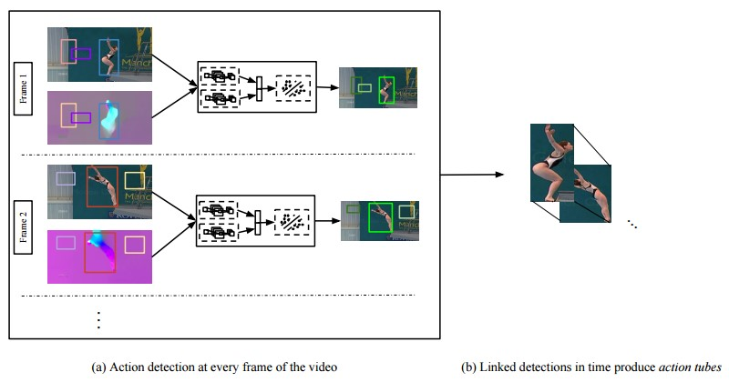
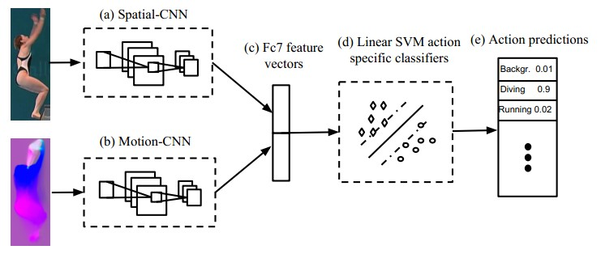
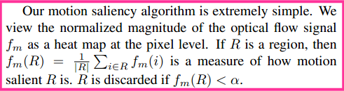
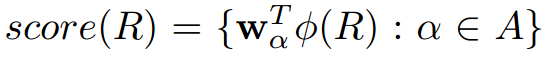
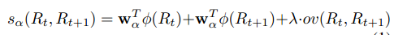
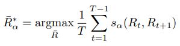
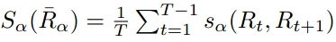
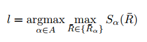

# Finding Action Tubes - cvpr - 2015

https://blog.csdn.net/sherry_gp/article/details/50957049

论文题目Finding Action Tubes, [论文链接](http://www.cs.berkeley.edu/~gkioxari/ActionTubes/action_tubes.pdf)

该篇论文是CVPR 2015的, 主要讲述了action tube的localization.

直接看图说话, 该论文的核心思想/步骤可以分为两个components:

 1 Action detection at every frame of the video

 2 Linked detection in time produce action tubes

下面就分开来说每个component.

1 Action detection at every frame of the video

 大概思想就是: 训练Spatial-CNN和Motion-CNN来提feature, 在feature上为每个类别训练线性svm.   

具体步骤如下:

   a. 找出each frame的interesting regions. 基于ground-truth的region及action label, 构建正负样本.

​       这里用IoU的方法: >0.5 为positive region, <0.3为negative region.

​      为什么要这样做呢? 个人觉得论文里面的action tube是针对里面的actor来弄的, 

​       也就是对视频里面的某个actor进行action的跟踪和action 分类. 

​       必然数据集会给出视频的每一帧的action类别和对应的actor.

​    那么怎么找出这些regions? 以及怎么消除不必要的regions?

​       对于proposals的产生会有很多方法, 论文里面采用了selective search的方法来产生视频里每帧的proposals(大约2K)

​       显然这些proposals很大一部分是non- discriminative的, 而且会造成计算上严重的消耗, 不利于实时检测.

​       论文里面用了一种很简单的方法来消去这些 not descriptive的regions:

我们的动作显著性算法非常简单。我们将光流信号的归一化幅度  $ f_m $  视为像素级别的热图。如果  $ R $  是一个区域，那么  $ f_m(R) = \frac{1}{|R|} \sum_{i \in R} f_m(i) $  是衡量  $ R $  动作显著性的一个指标。如果  $ f_m(R) < \alpha $ ，则丢弃  $ R $ 。

   需要注意的是, rgb和motion images的regions是一样的, 

​       也就是prososals是用上述方法在rgb上提取到, 然后直接用到motion上的.

   b. 训练 Spatial-CNN和Motion-CNN

​     这里就展开说这两个CNN模型的framework了, 具体看论文. 

​     训练它们的方式和RCNN的方式差不多. 具体可以实验室师兄的一篇[blog](http://zhangliliang.com/2015/05/17/paper-note-fast-rcnn/)

​     个人觉的该训练的要点有两个:

​       i. 在单帧上训练的.

​       ii. CNN模型的初始化. 

​          众所周知, deep model的初始化很重要.

​          Spatial-CNN是用在Pascal Voc 2012的detection task上训练好的CNN模型来初始化.

​          Motion -CNN则是在 UCF101 Motion数据集上训练好的CNN模型来初始化.

​     至于训练时的一些细节问题, 如学习率, 数据argumentation等, 请各位看官自己看论文哈.

  c. 提取 训练Spatial-CNN和Motion-CNN的FC7特征

​     这里只是将CNNs的fc7特征拼接起来, 简单暴力. 

​     可以看下[这篇blog](http://blog.csdn.net/zimenglan_sysu/article/details/49802769)的特征是怎么进一步融合的.

  d. 训练actions的linear svms.

2 Linked detection in time produce action tubes

 这一步是基于component 1来弄的.

​    a. 对每帧提取相应的regions, 每个region过Spatial-CNN和Motion-CNN, 来提取fc7特征, 

​      后经svms, 来获取对应的action scores.

​    b. 对每个类别, 每个视频, 利用下图的公式来找出linked-action tubes.

​     

​     

​     即通过找出相邻两帧之间属于某个action类别的得分最高(score+IoU)的两个regions(一帧一个)

​     然后将这些regions串联起来形成action tube.

​     那么怎么计算一个action tube的action acore?

​        

当然论文没有这么就完事了, 基于action tube的基础上, 进行了video的 action classification.

这个非常简单, 请看公式:

   