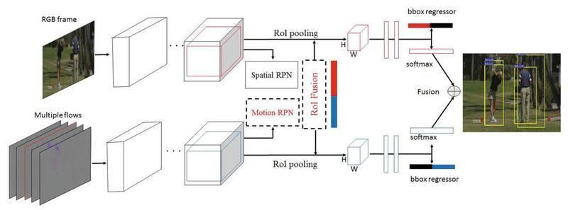
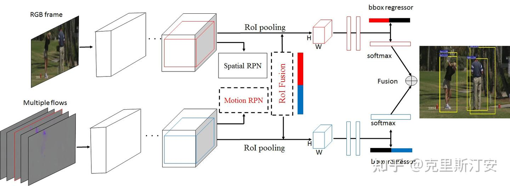
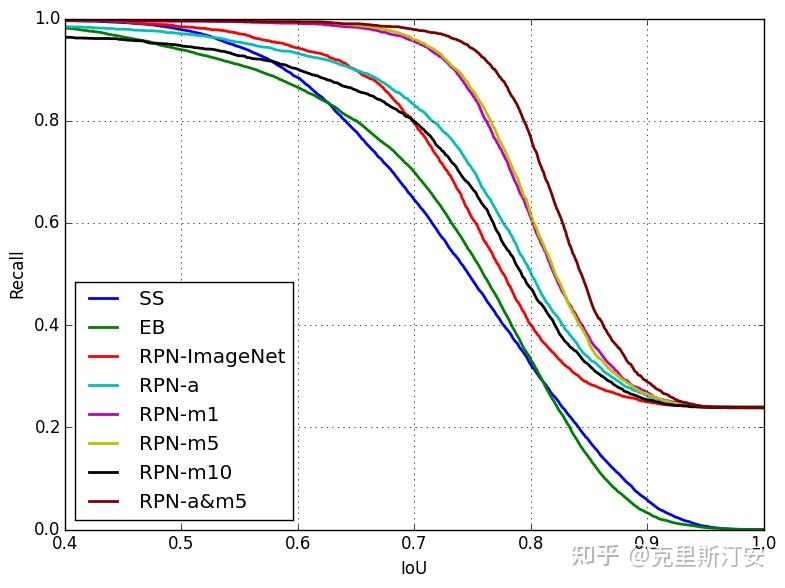
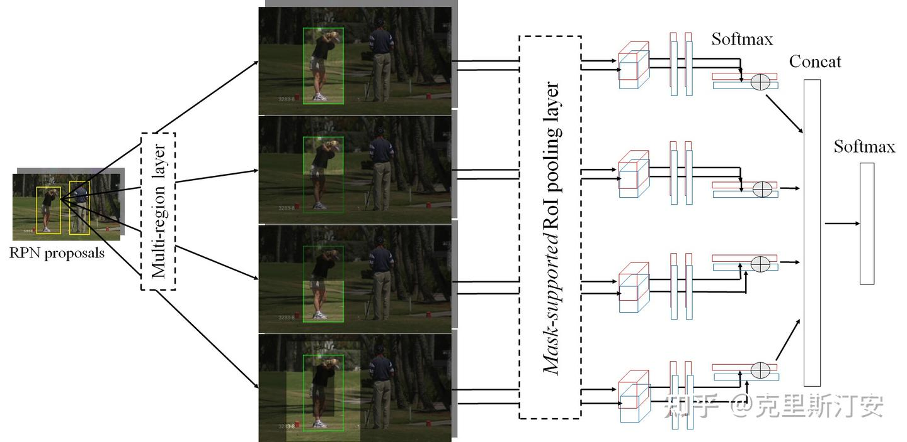
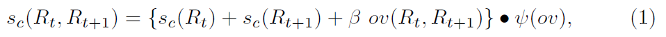
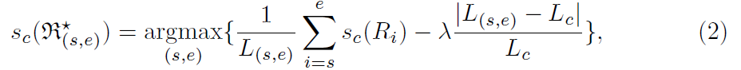

# Multi-region Two-Stream R-CNN for Action Detection

## motivation

视频中的行为识别具有许多现实的应用，例如监控，人机交互以及基于内容的检索。Action Recognition一般完成的研究内容是对给定的视频流输出行为类别。Temporal Action Detection研究的对给定的[视频流](https://zhida.zhihu.com/search?content_id=4982733&content_type=Article&match_order=2&q=视频流&zhida_source=entity)，输出行为发生的开始和结束时间。而论文研究的[视频识别](https://zhida.zhihu.com/search?content_id=4982733&content_type=Article&match_order=1&q=视频识别&zhida_source=entity)是给定一个视频流，输出行为发送的精确时间和空间范围。

在论文发表之前，其实已经有很多帧级的[行为检测](https://zhida.zhihu.com/search?content_id=4982733&content_type=Article&match_order=1&q=行为检测&zhida_source=entity)方法。作者在前人工作基础上总结：高质量的RPN帮助CNNs精确地提取行动表示，行为表示对检测至关重要。论文主要工作也是推进这两个关键因素：帧级的行为proposal和行为表示。

**Frame-level action proposal**

说白了就是Object detection中的RPN。我们回忆一遍R-CNN系列的RPN方法：selective search、EdgeBoxes和region proposal network (RPN)。依现在写笔记时间看，R-CNN系列的Mask R-CNN代表了[state-of-the-art](https://zhida.zhihu.com/search?content_id=4982733&content_type=Article&match_order=1&q=state-of-the-art&zhida_source=entity)水平。除空间的RPN，论文扩展到[光流](https://zhida.zhihu.com/search?content_id=4982733&content_type=Article&match_order=1&q=光流&zhida_source=entity)数据上训练运动RPN(motion RPN)，两者互补提高RPN的质量。

**Action representation**

行为表示对行为识别至关重要。受[two-stream](https://zhida.zhihu.com/search?content_id=4982733&content_type=Article&match_order=1&q=two-stream&zhida_source=entity)启发，论文提出改进的行为表示方法。首先，在faster R-CNN模型中堆叠多个光流帧，显著改进motion R-CNN。再次，论文在appearance R-CNN和motion R-CNN中选择多个身体区域（既上半身，下半身和边界区域），提高帧级行为检测的性能。

论文主提出多区域 two-stream R-CNN模型，在行为识别数据集UCF-Sports, J-HMDB 和UCF101 取得state-of-the-art的效果。论文主要有以下贡献：

(1)提出高质量的motion RPN，和appearance RPN(其实就是Object detection中的RPN)互补。(2)堆叠光流现在提高帧级检测。(3)在[faster R-CNN](https://zhida.zhihu.com/search?content_id=4982733&content_type=Article&match_order=2&q=faster+R-CNN&zhida_source=entity)中嵌入多区域方案，改善模型的结果。

**Two-Stream Faster R-CNN**

如上图所示，论文提出的TS R-CNN（two-stream faster R-CNN )网络架构。TS R-CNN输入1个RGB图像和多个光流特征图（一半帧来自于t时刻之前，一半帧来自于t时刻之后）。two-stream的两个支流独自经过若干卷积层和[池化层](https://zhida.zhihu.com/search?content_id=4982733&content_type=Article&match_order=1&q=池化层&zhida_source=entity)，分别输出到appearance RPN 和motion RPN。两个支流有个RoI fusion layer，合并appearance RPN 和motion RPN。每个支流经过RoI pooling输出 H × W特征图。每个支流经过两个全连层，bounding box用于边界回归，两个softmax layer输出后进行融合。

在训练阶段，TS R-CNN两个支流独自自使用VGG16(VGG16已经在ImageNet训练好参数)训练。光流stream因为chanel众多，论文在第一层多次复制滤波器。中间帧的ground-truth bounding boxes用于训练。在测试阶段，通过RoI fusion layer融合appearance RPN 和motion RPN到一个模型，在softmax层输出求平均值。 bounding box regressor被应用于每个流的相应的RoI，这些框的融合是最终检测结果。

**Multi-region Two-Stream Faster R-CNN**

在TS R-CNN基础上，论文提出Multi-region Two-Stream Faster R-CNN（MR-TS R-CNN），其实就是在TS R-CNN的RPNs和 RoI pooling layer之前嵌入multi-region generation layer。MR-TS R-CNN的结构如上图所示。论文选择4个身体区域（既全身，上半身，下半身和边界区域），说白了就是数据增广的一种方式。

**Linking and Temporal Localization**

基于以上方法，求出帧级行为检测。为了获取视频级检测，linking基于《Finding action tubes》的方法，而时序定位基于最大子数组算法。具体可参考相应论文。

## Experiment

论文在三个数据集上进行评估：UCF-Sports、J-HMDB、UCF-101.评价指标采用frame-AP，video-AP。论文没有给出详细的实验细节，更多的是各个[数据集](https://zhida.zhihu.com/search?content_id=4982733&content_type=Article&match_order=3&q=数据集&zhida_source=entity)上性能评估，不再赘述。

## 过程描述

https://zhuanlan.zhihu.com/p/684044411

Structure of single frame action detection

输入：一张RGB图像，以及这个图像时间前后的[光流](https://zhida.zhihu.com/search?content_id=240140335&content_type=Article&match_order=1&q=光流&zhida_source=entity)（RGB图片时间之后的光流有待商榷，因为实际testing的时候无法预测未来的光流）分为上下两个Stream独立处理，分别经过ImageNet-pretrained VGG-16 backbone， VGG之后上下stream分别进入各自的Faster R-CNN中的RPN形成一万多个候选框*2，候选框均割成M*N块并进行ROI pool（每个候选框直接resize或者降采样成M*N分辨率）。跟Faster RCNN不同的是， Fast RCNN在ROI pool的时候已经通过筛选合并降低到了300个候选框，但该模型是不筛选直接进入ROI pooling。

双路ROI pool之后的[feature map](https://zhida.zhihu.com/search?content_id=240140335&content_type=Article&match_order=3&q=feature+map&zhida_source=entity)则进入融合框架来分配各自的feature map，假设[fusion](https://zhida.zhihu.com/search?content_id=240140335&content_type=Article&match_order=1&q=fusion&zhida_source=entity)之后只剩下1000个框，其中600个分给appearance（红色），400个给motion（蓝色），则上一路为600 appearance+400dummy，下一路为600 dummy+400 motion, 两路1000框分别输入到全连接层FC进行softmax分类跟微调anchor (bounding box regressor)，，而bounding box则只会回归分配的那些feature map，dummy的不会回归，最终回归结果会concat在一起(600+400)作输出，而某一个[bounding box](https://zhida.zhihu.com/search?content_id=240140335&content_type=Article&match_order=3&q=bounding+box&zhida_source=entity)的类别（action region detection scores）则是上下两路的softmax进行相加然后平均（分类修正）

Notes: 【分类修正】因为图片有的时候没法判断动作，像walk一类的动作，中间某些帧看起来就像是站着(stand)，假设这种情况被box #21遇到，则需要依靠optic flow stream输出的softmax 进行指数级别override，只要optic flow的box 21对应的walk > appearance box 21的stand数值，经过softmax (exponential)之后会差距更大。如此，修正appearance stream预测的stand为walk（Paper Section 3第一段作者发现修正过程直接使用softmax相加结果最好） 。

（注意：到此为止，由于upper stream一次输入一个图片，因此一次只能检测一个动作，虽然bottom stream使用了时序上的动作帧辅助，但本质还属于frame level detection），后续会有video level detection。

关键词：【光流(Optic Flow)】相当于一个渐变的HSV的图像，原始图片中速度更快（下一张图跟这张图的差异更大）的对应像素部分颜色跟亮度会更加突出, 如果是图片流（链接），则可以针对两张连续的图片进行3D卷积 temporal kernel size =2 -> (2*m*n)。静止相机拍摄的静止部分则不会有颜色变化，统一为背景色。

Dataset测评：UCF Sports (注：包围的面积越大，效果越好)

RPN-a = single appearance channel estimation / RPN-m(k) = single motion channel with k frames of optic flow input

Ablation Study / 消融实验总结：不论哪一种RPN都吊打SS跟EB方案（初版RCNN还是不行欸），RPN-m版本：optic frame太少的话，只适用于激烈运动的数据集，而时间跨度太长的话，则针对剧烈运动会额外引入不属于该运动的后续action导致扰乱判断，但有可能有一些生活行为偏慢动作，需要更多的帧来满足需求。RPN-a(appearance)+m(motion)的双通道合并方案表现最好。

多区域拓展

Overview of the multi-region two-stream faster R-CNN architecture.

由于人体的分为手部动作（出拳，拥抱）跟脚步动作（跑步），以及人可能需要跟周围的物体接触，所以特意在identify出合适的候选框之后，在ROI之前，就只使用mask关于图片的某几个区域（原始，上部，下部，周围一圈同心矩形），这样做进一步提高了performance。

多frame的物体连接方案 - Video level detection

重点来了，之前都是输入一帧去检测，但是现实世界中的动作其实都是持续一段时间的。**Video检测的实现跟[行人重识别](https://zhida.zhihu.com/search?content_id=240140335&content_type=Article&match_order=1&q=行人重识别&zhida_source=entity)（REITs）是一个道理，为了判断时间上前后脚的(t → t+1)，两个框是否是同一个人，是否做的是同一个action。**通过前后的IOU重合率以及softmax预测结果重合率（文中直接相加，但我认为使用softmax之前的向量内积更好，使用内积并且相加的情况下的β可以大一些）来判断，但人是通过物体模型来判断的，即针对该物体压缩的信息。Sc即为连接函数，Sc数值越高越可能是同一个人在连续时间上做出的同一个动作。

Original Link Function

推荐的Link function：

 $$ s_c(R_t, R_{t+1}) = \left( vec_{softmax(s_c(R_t))} \cdot vec_{softmax(s_c(R_{t+1}))} \right) * ov(R_t, R_{t+1}) $$ 

建议理由：使用内积并且相乘，则无需β，上述loss可以实现不论是动作突然不符，还是IOU突变，都可以直接中断Anchor连接，Link的成立条件属于“AND”关系

通过link函数将每一帧的同一个物体关联起来，紧接定义如下value function来判断某个action是从哪一帧到哪一帧的，（因为使用了softmax，所以一个框在某一段时间内只能是一个最终的action）。这个value function分为两部分，前半部分是针对这个action class在这一段时间内的平均概率，后一段是一个loss，即这一段时间大于或者小于平均时间都不行（例如踢球动作在数据集统计下，平均时间是0.5s，那么实际的时间是5s肯定不会是踢球动作），然后通过平均时间归一化（不归一化的话，平均时间短的就很吃亏，loss会显得很大）。

时间窗口函数，求取使得{}内数值最大的的s,e

但文章提到，实际判断时间窗口的时候，是直接使用平均时间做moving average，然后看滑动到哪个阶段时候的平均概率最大。

### AVA[数据集](https://zhida.zhihu.com/search?content_id=240140335&content_type=Article&match_order=3&q=数据集&zhida_source=entity)与时空修正

AVA数据集

AVA选用了电影的数据（主要是youtube一些短视频的数据有bias，比如关键词搜关门，能登上youtube的关门肯定是不走寻常路的，根本不是平时我们做的关门动作）3.4节 - 通过行人重识别将分立的数据框联系在一起（匈牙利匹配），最后实际test的时候需要[link函数](https://zhida.zhihu.com/search?content_id=240140335&content_type=Article&match_order=2&q=link函数&zhida_source=entity)。在4.3节也通过互信息统计了两个动作一般是否连续出现（乘车 -> 开车）或者成对出现（说 <-> 听）。但是这个成对出现并不会将两个人物框直接联系起来（例如[binary](https://zhida.zhihu.com/search?content_id=240140335&content_type=Article&match_order=1&q=binary&zhida_source=entity) 0 or 1表示有联系或者无联系）。

AVA的架构是基于上一篇改的，鉴于上一篇是frame level detection，也就是说虽然是个video，但是检测器的upper flow每次只能输入一帧，所以即便有link函数来连接前后的候选框，但对于候选框的动作判断都是基于当前帧以及前后光流。在AVA propose的架构下，上下两路的Faster-RCNN改成了I3D，这样时间上也可以做卷积，就能够输入多个帧了（最多3s）。

I3D跟RCNN最大的不一样是没有RPN网络，所以需要其中一个关键帧单独通过ResNet50做初步候选框的proposal（相当于用一个pre-train encoder加上全连接层为这个model专门做一个行人检测的小功能），虽然理论上候选框是随着时间变化的，但是实际上只用key frame来代替前后3s时间的所有候选框。

最后，上一篇文章用的是softmax，所以动作是非此即彼的（但是也通过多区域拓展解决了这个问题，但限制依然是上半身不能有两个框架）在这个框架下，直接每个action class都使用了[sigmoid](https://zhida.zhihu.com/search?content_id=240140335&content_type=Article&match_order=2&q=sigmoid&zhida_source=entity)，然后优选前3个作为可能的human interaction，另外再优选前三个作为object interaction，而针对自身的状态（站立，走，躺着）则可以采用softmax。

最后一点不同的是，RGB跟flow的融合是在最后阶段feature level完成的，融合之后只生成统一的框，而上一篇候选框是分给RGB跟flow两路单独生成的，最后保持总数不变。

## 原文

## 5 链接和时间定位

基于上述描述的方法，我们获得了帧级别的动作检测。为了实现视频级别的检测，我们应用类似于[7]的链接和基于最大子数组算法[41]的时间定位。

给定来自连续帧  $ t $  和  $ t+1 $  的两个区域  $ R_t $  和  $ R_{t+1} $ ，我们定义动作类别  $ c $  的链接分数为

 $$ s_c(R_t, R_{t+1}) = \{s_c(R_t) + s_c(R_{t+1}) + \beta \cdot ov(R_t, R_{t+1})\} \cdot \psi(ov), $$ 

其中  $ s_c(R_i) $  是区域  $ R_i $  的类别分数， $ ov $  是两个区域的交集与并集的重叠， $ \beta $  是一个标量。 $ \psi(ov) $  是一个阈值函数，定义为  $ \psi(ov) = 1 $  如果  $ ov $  大于  $ \tau $ ，否则  $ \psi(ov) = 0 $ 。我们实验观察到，我们的链接分数比[7]中的更好，并且由于额外的重叠约束而更稳健。在计算所有动作的链接分数后，我们通过使用维特比算法迭代确定最优路径来获得视频级别的动作检测。我们最终通过  $ s_c(\mathfrak{R}) = \frac{1}{T} \sum_{i=1}^{T} s_c(R_i) $  来评分视频级别的动作检测  $ \mathfrak{R} = [R_1, R_2, ..., R_T] $ 。

为了确定视频轨道中动作检测的时间范围，可以应用滑动窗口方法，使用多个时间尺度和步长，如[8]。这里我们依赖于一个高效的最大子数组方法。给定一个视频级别的检测  $ \mathfrak{R} $ ，我们旨在找到一个从帧  $ s $  到帧  $ e $  的检测，满足以下目标，

 $$ s_c(\mathfrak{R}^*_{(s,e)}) = \arg\max_{(s,e)} \left\{ \frac{1}{L_{(s,e)}} \sum_{i=s}^{e} s_c(R_i) - \lambda \frac{|L_{(s,e)} - L_c|}{L_c} \right\}, $$ 

其中  $ L_{(s,e)} $  是轨道长度， $ L_c $  是训练集上类别  $ c $  的平均持续时间。我们提出通过三个步骤来近似解决这个目标：(1) 从所有帧级别的动作分数中减去视频长度的动作分数  $ s_c(\mathfrak{R}) $ ，(2) 使用Kadane算法[41]找到减去数组的最大子数组，(3) 将最优范围扩展或缩短到  $ L_c $ 。我们的解决方案只搜索一次轨道。对于每个视频长度的动作检测，我们只保留最佳范围作为时空检测。注意，三步启发式方法是对方程(2)的近似，步骤(3)将步骤(2)的最优管的长度设置为平均长度以避免退化解。