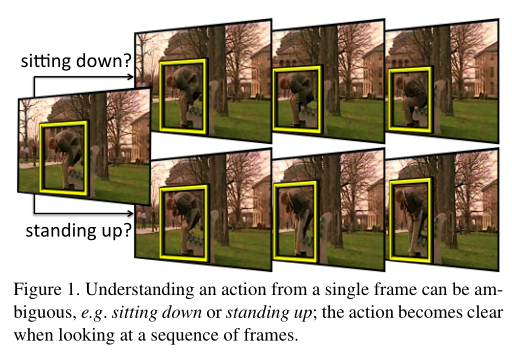
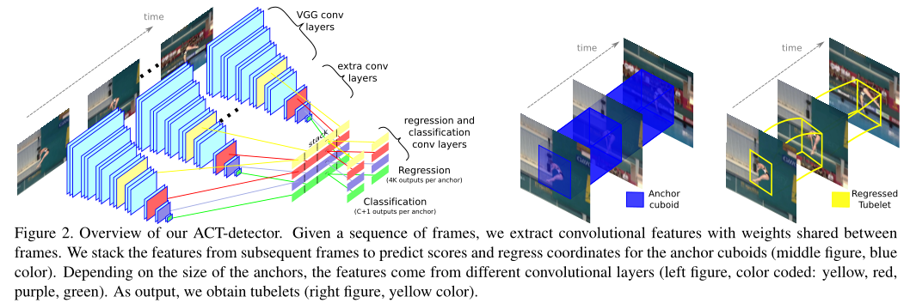
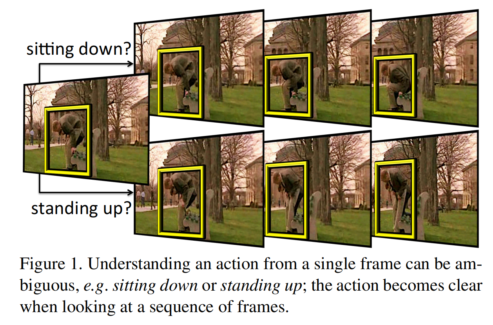
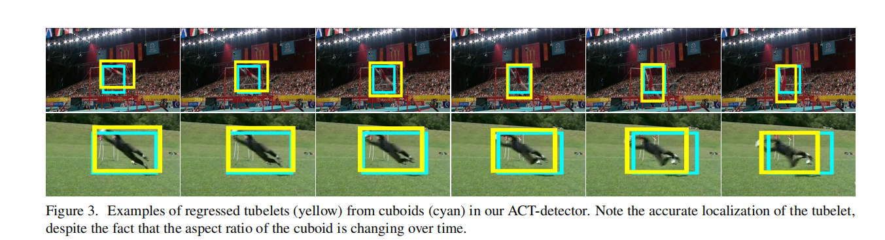

# Action Tubelet Detector for Spatio-Temporal Action Localization

https://blog.csdn.net/irving512/article/details/108489248

### 0. 前言

- 相关资料：
  - [arxiv](https://arxiv.org/abs/1705.01861)
  - [github(CAFFE)](https://github.com/vkalogeiton/caffe/tree/act-detector)
  - [论文解读](https://blog.csdn.net/sinat_24674017/article/details/99731174)
- 论文基本信息
  - 领域：时空行为检测
  - 作者单位：格勒诺布尔大学 & 爱丁堡大学
  - 发表时间：CVPR 2017

### 1. 要解决什么问题

- 之前的时空检测模型都是先检测frame的结果，然后再link。
  - 单独处理每一帧图片并不是最优方法。
  - 没有完全利用到视频的连续性（temporal continuity）
  - 例如下图，从一张图片中并不能判断是要坐下还是起身。

用了什么方法

- 提出了ACT-Detector，主要目标就是输入一组图片，输出tubelet。
- 假设输入有K张图片。
- 那就是先用普通SSD，对K张图片分别执行特征提取。
- 对于K张图片对应SSD中指定层的feature map进行拼接，利用拼接结果执行bbox reg。
- bbox reg的输出结果长度为4K，即K次bbox reg。
- 分类任务只执行一次。
- 注意，这里的bbox reg当然也是基于 anchor 的修改，不过是基于 anchor cuboids 的修改（我的感觉就是，每个anchor cuboid是对所有帧的分别制定了anchor）

### 3.1. ACT-探测器

在本文中，我们主张动作定位可以从预测管状序列作为输入中受益，而不是在帧级别操作。实际上，单个帧的外观甚至运动可能是模糊的。考虑更多的帧进行预测分数可以减少这种模糊性（图 1）。此外，这允许我们在连续帧上进行联合回归。我们的 ACT-探测器基于 SSD，参见图 2 以了解该方法的整体概述。接下来，我们将详细回顾 SSD 探测器，然后介绍我们的 ACT-探测器。
SSD 探测器。SSD 探测器（单次多框探测器）[18] 通过考虑一组在不同位置、尺度和纵横比的锚框来执行对象检测。每个锚框都被（a）为每个对象类和背景类打分，以及（b）进行回归以更好地适应对象的范围。SSD 使用完全卷积架构，没有任何对象提案步骤，从而实现快速计算。分类和回归是使用不同的卷积层根据锚框的尺度进行的。请注意，用于预测给定锚框的分类分数和回归的神经元的感受野仍然显著大于该框。

#### ACT-检测器

给定一系列  $ K $  帧，ACT-检测器为每一帧计算卷积特征。这些卷积特征的权重在所有输入帧中共享。我们通过假设空间范围在  $ K $  帧中是固定的，将SSD的锚框扩展为锚立方体。然后，我们将每帧对应的卷积特征堆叠起来（图2）。堆叠的特征是两个卷积层的输入，一个用于评分动作类别，另一个用于**回归锚立方体**。例如，当考虑一个基于图2中“红色”特征图进行预测的锚立方体时，分类和回归是通过卷积层执行的，这些卷积层以  $ K $  帧的“红色”堆叠特征图为输入。分类层为每个锚立方体输出  $ C+1 $  个分数：每个动作类别一个加上一个背景。这意味着小管分类是基于帧序列进行的。回归输出每个锚立方体的  $ 4 \times K $  个坐标（每帧  $ K $  个坐标中的4个）。请注意，尽管小管中的所有框都是联合回归的，但它们对每帧产生不同的回归结果。

初始锚立方体在时间上具有固定的空间范围。在第4.2节中，我们通过实验表明，这样的锚立方体可以处理短序列帧中的移动演员。请注意，用于评分和回归锚立方体的神经元的感受野大于其空间范围。这使我们能够基于立方体周围的上下文进行预测，即，利用可能移出立方体的演员的知识。此外，回归显著改变了立方体的形状。尽管锚立方体具有固定空间范围，但在回归  $4 \times K$  坐标后获得的小管并不具有固定空间范围。我们在图3中展示了两个示例，其中锚立方体（青色框）和结果回归小管（黄色框）。请注意，尽管动作框的纵横比随时间变化，回归输出仍然能够准确定位。

> 图3.在我们的ACT检测器中，从长方体（青色）回归的小管（黄色）的例子。注意长方体的精确定位，尽管长方体的长径比随着时间而变化。

训练损失。对于训练，我们只考虑所有帧都包含真实动作的帧序列。由于我们想要学习动作小管，所有正负训练数据都来自动作发生的序列。我们排除动作开始或结束的序列。设  $ \mathcal{A} $  为锚立方体的集合。我们用  $ \mathcal{P} $  表示至少有一个真实小管与锚立方体重叠超过0.5的锚立方体集合，用  $ \mathcal{N} $  表示互补集合。小管之间的重叠通过平均  $K$  帧中框的交并比（IoU）来测量。来自  $ \mathcal{P} $  的每个锚立方体都被分配给IoU超过0.5的真实框。更准确地说，设  $ x_{ij}^y \in \{0, 1\} $  为二进制变量，其值仅当锚立方体  $ a_i $  被分配给标签  $ y $  的真实小管  $ g_j $  时为1。训练损失  $ \mathcal{L} $  定义为：

$$
\mathcal{L} = \frac{1}{N} (\mathcal{L}_{\text{conf}} + \mathcal{L}_{\text{reg}})
$$
其中  $ N = \sum_{i,j,y} x_{ij}^y $  表示正样本分配的数量。

 $\mathcal{L}_{\text{conf}}$ （分别  $\mathcal{L}_{\text{reg}}$ ）表示如下定义的置信度（分别回归）损失。

置信度损失使用softmax损失定义。设  $\hat{c}_i^y$  为锚  $a_i$  对于类别  $y$  的预测置信度分数（经过softmax）。置信度损失为：

$$
\mathcal{L}_{\text{conf}} = -\sum_{i \in \mathcal{P}} x_{ij}^y \log(\hat{c}_i^y) - \sum_{i \in \mathcal{N}} \log(\hat{c}_i^0) \,.
$$

回归损失使用预测回归和真实目标之间的Smooth-L1损失定义。我们回归小管中每个框的中心  $(x, y)$  的偏移量，以及宽度  $w$  和高度  $h$ 。回归损失在  $K$  帧上平均。更准确地说，设  $\hat{r}_i^{x_k}$  为在帧  $f_k$  中锚  $a_i$  的  $x$  坐标的预测回归，设  $g_j$  为真实目标。回归损失定义为：

$$
\mathcal{L}_{\text{reg}} = \frac{1}{K} \sum_{i \in \mathcal{P}} \sum_{c \in \{x, y, w, h\}} x_{ij}^y \sum_{k=1}^K \text{SmoothL1} \left( \hat{r}_i^{c_k} - \mathfrak{g}_{ij}^{c_k} \right) \,,
$$

其中

$$
\mathfrak{g}_{ij}^{x_k} = \frac{g_j^{x_k} - a_i^{x_k}}{a_i^{w_k}} \quad \mathfrak{g}_{ij}^{y_k} = \frac{g_j^{y_k} - a_i^{y_k}}{a_i^{h_k}} \,,
$$

$$
\mathfrak{g}_{ij}^{w_k} = \log \left( \frac{g_j^{w_k}}{a_i^{w_k}} \right) \quad \mathfrak{g}_{ij}^{h_k} = \log \left( \frac{g_j^{h_k}}{a_i^{h_k}} \right) \,.
$$

### 3.2 双流 ACT-检测器

遵循动作定位的标准实践[22, 26, 35]，我们使用双流检测器。我们训练一个外观检测器，其输入是  $K$  个连续的 RGB 帧序列，以及一个运动检测器，其输入是[1]获得的光流图像[9]。

每个流输出一组带有置信度分数的回归小管，这些小管来自同一组锚立方体。为了在测试时合并这两个流，我们比较了两种方法：联合融合和后期融合。对于联合融合[29]，我们考虑两个流的输出集合的并集：来自 RGB 流的小管及其相关分数，以及来自光流流的小管及其分数。对于后期融合[6]，我们对每个锚立方体从两个流中平均分数，因为两个流的锚点集合是相同的。我们保留来自 RGB 流的回归小管，因为外观对于回归框来说更相关，特别是对于运动有限的动作。我们的实验表明，后期融合优于联合融合（第4.3节）。

### 3.3 从动作小管到时空管

为了构建动作管，我们基于[29]的帧链接算法，因为它对漏检具有鲁棒性，并且可以生成跨越视频不同时间范围的管。我们将他们的算法从帧链接扩展到小管链接，并提出一种时间平滑方法，以从链接的小管构建动作管。该方法是在线的，通过在处理帧的同时迭代地将小管添加到一组链接中进行。以下， $ t $  是一个小管， $ L $  是一个链接，即一系列小管。

输入小管。给定一个视频，我们为每组  $ K $  帧提取小管。这意味着连续的小管重叠  $ K-1 $  帧。由于卷积特征的权重是共享的，因此可以以极低的成本计算重叠小管。我们只为每帧计算一次卷积特征。对于每组帧，只有最后几层在给定堆叠卷积特征（图2）的情况下预测分数和回归，仍然需要计算。为了链接，我们在每组帧中在阈值为0.3的非最大抑制（NMS）后，只为每个类别保留得分最高的  $ N=10 $  个小管。

链接和小管之间的重叠。我们的链接算法依赖于链接  $ L $  和与链接末端时间上重叠的小管  $ t $  之间的重叠度量  $ \text{ov}(L, t) $ 。我们定义  $ L $  和  $ t $  之间的重叠为链接  $ L $  的最后一个小管和  $ t $  之间的重叠。两个小管之间的重叠定义为它们在重叠帧上的框的平均交并比（IoU）。

初始化。在第一帧中，为每个  $ N $  小管启动一个新链接。在给定帧中，新链接从小管开始，这些小管未与任何现有链接关联。

链接小管。给定一个新的帧  $ f $ ，我们按得分降序逐一扩展每个现有链接，与从该帧开始的  $ N $  个小管候选项之一进行扩展。链接的得分定义为其小管的平均得分。为了扩展链接  $ L $ ，我们选择满足以下条件的小管候选项  $ t $ ：(i) 尚未被其他链接选择，(ii) 得分最高，以及 (iii) 满足  $ \text{ov}(L, t) \geq \tau $ ，其中  $ \tau $  是给定的阈值。在我们的实验中，我们使用  $ \tau = 0.2 $ 。

终止。当这些条件在超过  $ K-1 $  个连续帧中不满足时，链接停止。

时间平滑：从小管链接到动作管。对于每个链接  $ L $ ，我们构建一个动作管，即一系列边界框。管的得分设置为链接的得分，即链接中小管的平均得分。为了设置边界框，请注意我们每帧有多个框候选项，因为小管是重叠的。可以简单地使用得分最高的小管的框。相反，我们提出了一种时间平滑策略。对于每一帧，我们平均通过该帧的小管的框坐标。这使我们能够构建平滑的管。

时间检测。初始化和终止步骤产生的管跨越视频的不同时间范围。每个管因此确定了它所覆盖动作的开始和结束时间。对于时间定位，不需要进一步的处理。