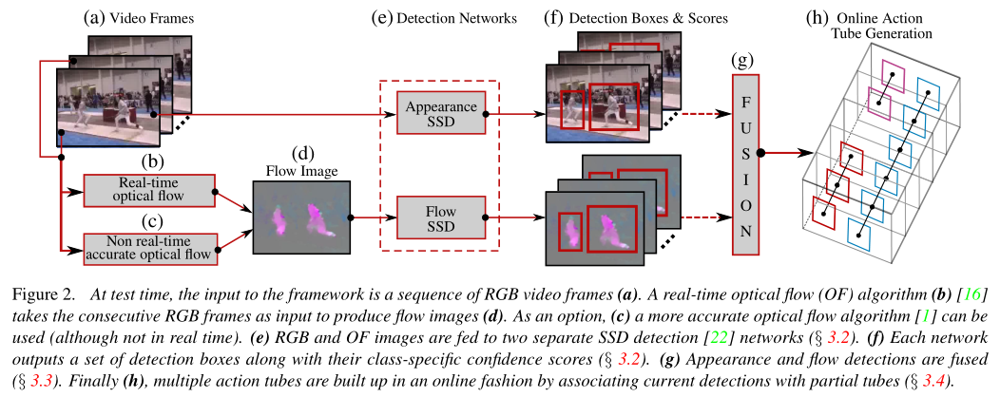

# 2017 ICCV Online Real-time Multiple Spatiotemporal Action Localisation and Prediction

https://github.com/gurkirt/realtime-action-detection

https://blog.csdn.net/irving512/article/details/108471473

Online Action Tube Generation

问题定义：假设在时间点 t=1 ... T 内，对特定行为有一组检测结果，我们要寻找时间上连续的一组检测结果（即action tubes）。

注意：每类行为是单独处理的。

对于得到的 action tube 有以下要求

- 相邻检测结果之间的iou大于一定阈值

- 每个action detection的结果只属于一个action tube。
- 在线更新tube的 temporal labels。
- 提出了一种贪心方法，关联当前帧结果以及之前的结果。
- 算法的输入每一帧的检测结果，即bbox+行为类别+scores。
- 每一个step，在满足IOU的情况下，对于每一类行为，当前最好（score最高）的bbox匹配历史最好的tube。

### 还存在什么问题&有什么可以借鉴

- 直接使用图像检测网络来执行行为识别，对于一些动作来说不靠谱。

### 方法论

如我们在图 2 中概述的，我们的方法利用一个集成的检测网络 [22]（见第 3.2 节-图 2e）来独立预测外观和流动（见第 3.1 节）视频帧的检测框和类别特定的置信度分数。然后应用两种替代融合策略之一（见第 3.3 节-图 2g）。最后，使用一种新的高效动作管生成算法（见第 3.4 节-图 2h）以在线和实时的方式逐步构建动作管，该算法可以应用于早期动作预测（见第 3.5 节）。

#### 3.1. 光流计算

我们的框架的输入是一系列 RGB 图像。如同在动作定位的先前工作 [33, 7, 53] 中，我们使用一种双流 CNN 方法 [37]，在其中光流和外观在两个并行、独立的流中处理。由于我们的目标是在实时中进行动作定位，我们采用实时光流（图 2b）[16] 来生成流图像（图 2d）。作为一种选择，可以使用 Brox 等人的方法 [1] 更准确地计算光流（图 2c）。因此，我们为两种光流算法训练两个不同的网络，而在测试时只使用一个网络，这取决于我们是更注重速度还是准确性。在迁移学习方法的基础上，我们...

#### 3.2. 综合检测网络

我们使用一个单阶段的卷积神经网络（图 2e）进行边界框预测和分类，该网络遵循 [22] 中提出的端到端可训练架构。该架构在单个 CNN 中统一了多种功能，这些功能在其他动作和物体检测器中是由单独的组件 [7,53,30,33] 执行的，即：(i) 区域提议生成，(ii) 边界框预测和 (iii) 对预测框的类别特定置信度分数的估计。这允许相对更快的训练和更高的测试时间检测速度。
检测网络设计和训练。对于我们的综合检测网络，我们采用了 SSD [22] 物体检测器的网络设计和架构，输入图像大小为 300 x 300。我们没有使用 512 x 512 的 SSD 架构 [22]，因为检测速度要慢得多 [22]。与 [22] 一样，我们还使用了 [22] 提供的预训练的 VGG16 网络（https://gist.github.com/weiliu89/2ed6e13bfd5b57cf81d6）。我们采用了 [22] 描述的训练程序以及他们公开可用的网络训练代码（https://github.com/weiliu89/caffe/tree/ssd）。我们对 UCF101-24 的外观流使用了 0.0005 的学习率，对流流使用了 0.0001 的学习率，而对 JH-MDB，外观流和流流的学习率都设置为 0.0001。所有实现细节都在补充材料中。

#### 3.3. Fusion of appearance and flow cues

• Boost-fusion（提升融合）：这种方法基于文献[33]的方法，并进行了轻微的修改。首先，在融合后对检测框的分数进行L-1归一化处理。其次，保留那些没有找到相关外观检测框的光流检测框，因为研究发现丢弃这些框会降低整体的召回率。

• 通过取并集进行融合：这是一种不同的、有效的融合策略，它包括保留外观检测框集合$\left\{b_{i}^{a}\right\}$和光流检测框集合 $\left\{b_{j}^{f}\right\}$的并集。其理论依据是，在UCF-101数据集中，例如，有几个动作类别（如“骑自行车”、“冰上舞蹈”或“萨尔萨旋转”）在大多数视频剪辑中都有并发的动作实例：增加检测框的数量可能有助于定位并发的动作实例。

#### 3.4.在线动作管生成

给定在时间$t=1$到$T$的一组检测结果，对于每个给定的动作类别$c$，我们寻找连续检测（或动作管）的集合$\mathcal{T}{c}=\{b{t_{s}},b{t_{e}}\}$，这些集合在所有可能的集合中，更有可能构成一个动作实例。这是为每个类别单独完成的，以便类别$c$的结果不会影响其他类别的结果。我们允许动作管的数量$n{c}(t)$随时间变化，但要受到可用输入检测数量的限制。我们允许动作管在任何给定时间开始或结束。最后，我们要求：(i)动作管中连续检测的空间重叠超过阈值$\lambda$；(ii)每个类别特定的检测属于单个动作管；(iii)在线更新管的时间标签。

之前解决这个问题的方法[7,33]限制管子跨越整个视频时长。在[33]和[28]中，此外，动作路径通过使用动态规划的第二遍来修剪到合适的动作管。

与此相反，我们提出了一个简单但高效的在线动作管生成算法，该算法逐帧（frame by frame）并行地为每个动作类别构建多个动作管。动作管被视为“tracklets”（轨迹片段），就像在多目标跟踪方法[26]中一样。我们提出了一个贪婪算法（3.4.1），类似于[25,39]，用于将即将到来的帧中的检测框与当前的（部分）动作管集合关联起来。同时，每个管子在在线时间标签设置（3.4.2）中被时间上修剪。

##### 3.4.1 一种新颖的贪婪算法

该算法的输入是融合了帧级检测框及其类别特定分数（见第3.3节）。在每个时间步$t$，通过在每个类别上应用非极大值抑制（non-maximum suppression），选择前$n$个类别特定的检测框$\{b_c\}$。在视频的第一帧，对于每个类别$c$，使用$t=1$时的$n$个检测框初始化$n_c(1)=n$个动作管（action tubes）。算法通过一次添加一个框的方式随时间递增地增长这些管。管的数量$n_c(t)$随时间变化，因为新的管被添加和/或旧的管被终止。

在每个时间步，我们对现有的部分管进行排序，以便最佳管可以潜在地与下一帧$t$中的检测框集合中的最佳框匹配。此外，对于时间$t-1$的每个部分管$T_c^i$，我们将潜在匹配限制在时间$t$的检测框上，这些检测框与$\mathcal{T}c^i$的最后一个框的交并比（IoU，Intersection over Union）超过一个阈值$\lambda$。通过这种方式，管不能简单地漂移，如果连续$k$帧没有找到匹配，它们可以被终止。最后，每个新更新的管通过使用在线维特比算法（online Viterbi algorithm）进行二进制标记来临时修剪。这在第3.4.2节中有详细描述。

总结来说，动作管是通过以下7个步骤构建的，应用于每个新帧在时间$t$：

• 对每个类别$c$执行步骤 2 到 7。

• 根据管状结构（action tubes）成员检测框的类别得分的平均值，将时间$t-1$之前生成的动作管按降序排序。

• 循环开始：$i=1$到$n_c(t-1)$-遍历排序后的动作管列表。

• 从列表中选择管$T_c^i$并在时间$t$的$n$个类别特定的检测框$\{b_c^j,j=1,\ldots,n\}$中为其找到一个匹配框，基于以下条件：

(a)对于所有$j=1,\ldots,n$，如果管$T_c^i$的最后一个框与检测框$b_c^j$之间的交并比（IoU）大于$\lambda$，则将其添加到潜在匹配列表$B^i$中；

(b)如果潜在匹配列表不为空，$B^i\neq\emptyset$，从$B^i$中选择具有最高类别$c$得分的框$b_c^{\max}$作为匹配项，并将其从时间$t$的可用检测框集合中移除；

(c)如果$B^i=\emptyset$，则无论如何保留该管，不添加任何新的检测框，除非超过$k$帧没有找到匹配项。

• 使用所选框$b_c^{\max}$的得分$s(b_c^{\max})$更新管$T_c^i$的时间标签（参见第 3.4.2 节）。

• 循环结束。

• 如果有任何检测框未被分配，使用该框在时间$t$开始一个新的管。

在我们的所有实验中，我们设置了$\lambda=0.1$，$n=10$，和$k=5$。

请注意，这个翻译是基于对原文的理解，可能需要根据具体的上下文进行调整。

##### 3.4.2 时间标签 (Temporal labelling)

虽然每个类别在帧 $t=1$ 初始化了 $n$ 个动作管（action tubes），但我们希望所有特定于动作的管能够在任意时间点 $t_{s}$ 和 $t_{e}$ 开始和结束。上述算法中的在线时间重标记步骤5就是为了处理这个问题。

类似于 [33, 4]，每个检测框 $b_{r}$（其中 $r=1,\ldots, T$，$T$ 是管的当前持续时间，$r$ 是它在管中的时间位置）在一个管 $T_{c}$ 中，被分配一个二元标签 $l_{r}\in\{c, 0\}$，其中 $c$ 是管的类别标签，0 表示背景类别。因此，动作管的时间修剪就简化为为所有构成的边界框找到一个最优的二元标签集合 $1=\{l_{1},\ldots, l_{T}\}$。这可以通过最大化每个管 $\mathcal{T}_{c}$ 的能量来实现：

$$
E(l)=\sum_{r=1}^T s_{l_r}(b_r)-\alpha_l\sum_{r=2}^T\psi_l(l_r, l_{r-1}),
$$

其中 $s_{l_{r}}(b_{r})=s_{c}(b_{r})$ 如果 $l_{r}=c$，如果 $l_{r}=0$ 则 $s_{l_{r}}(b_{r})=1-s_{c}(b_{r})$，$\alpha_{l}$ 是一个标量参数，成对势能 $\psi_{l}$ 定义为：如果 $l_{r}=l_{r-1}$，则 $\psi_{l}(l_{r}, l_{r-1})=0$；否则 $\psi_{l}(l_{r}, l_{r-1})=\alpha_{c}$。

**在线维特比算法 (Online Viterbi)**。最大化问题 (1) 可以通过维特比动态规划 [33] 来解决。对于管 $\mathcal{T}_{c}$，可以通过在任意时间点 $t$ 进行维特比向后传递（backward pass）在线性时间内生成一个最优标签 $\widehat{I}$。我们从管的开始到 $t-1$ 跟踪过去的框到管的关联，这消除了在每个时间步骤都需要一个完整向后传递的需求。这使得时间标签非常高效，并且适合在线使用。通过找到凝聚点 [44]，这可以进一步优化，以适应更长的视频。如上文步骤5所述，每当添加一个新的框时，每个管的时间标签在每个时间步骤都会更新。在补充材料中，我们提供了我们的在线动作管生成算法的伪代码。

#### 3.5. 早期动作预测

对于每个测试视频，在每个时间步 *t*（第3.4节）都会逐步构建多个管子，我们可以在任何时刻预测整个视频的标签为当前得分最高的管子的标签，其中管子的得分定义为管子框的个体检测得分的平均值：

$$
c(t) = \arg\max_c \left( \max_{T_c} \frac{1}{T} \sum_{r = 1}^{T} s(b_r) \right)
$$