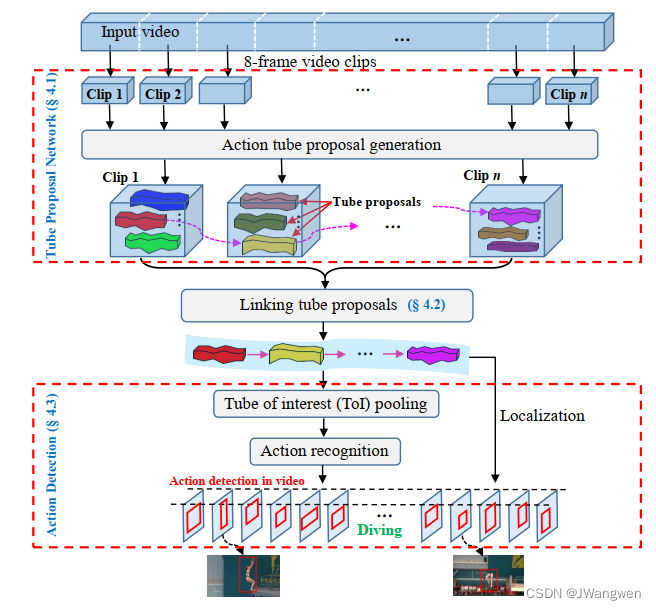
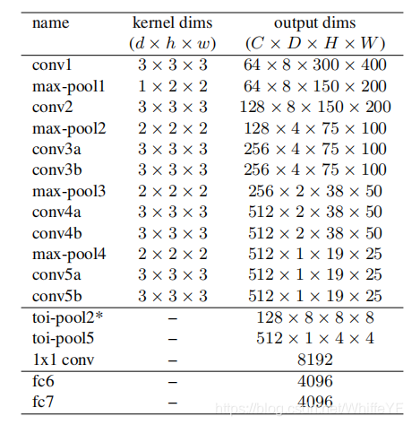
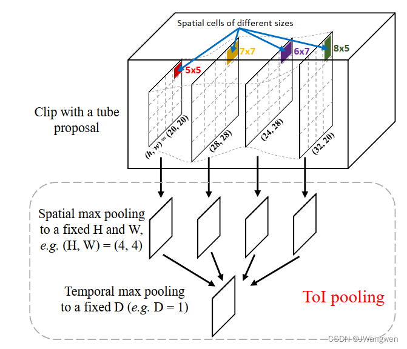
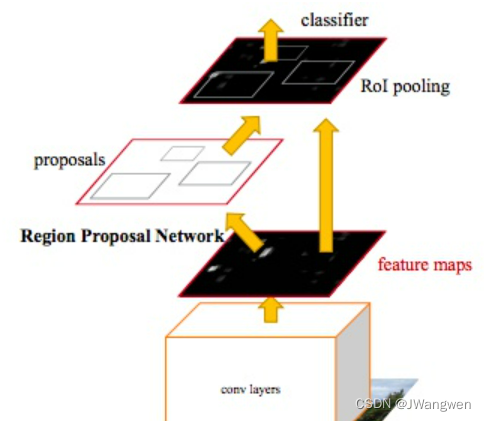
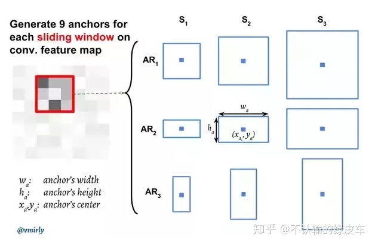
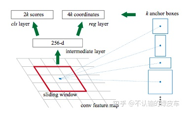

# Tube Convolutional Neural Network (T-CNN) for Action Detection in Videos

https://blog.csdn.net/WhiffeYF/article/details/114254448

https://blog.csdn.net/qq_42740834/article/details/128948892

### 摘要及贡献

本文提出了端到端的深度卷积网络T-CNN

首先一段视频首先被分割成固定长度的片段（8帧）-------> 这些片段被送到Tube Proposal Network（TPN）并生成一系列的 tube proposal --------> 根据每个视频片段中的tube proposal 的行为得分和相邻proposal之间的重叠进行连接起来（即linking tube proposals），形成一个完整的tube proposal用于视频中的时空行为定位 -------> 最后the Tube-of-Interest（TOI）pooling被用于连接的行为tube proposal 来形成一个固定长度的特征向量用于行为标签预测。

受faster R-CNN开创性工作的启发，我们提出了管道卷积神经网络(T-CNN)用于行为检测。更好地捕捉视频的时空信息，我们利用三维ConvNet来进行行为检测，因为它能够捕捉视频中的运动特征，并在视频行为识别方面取得了很好的效果。我们提出了一个新的框架，利用3D ConvNet的描述能力。在我们的方法中，输入视频首先被分成等长的剪辑。然后将这些片段送入TPN (Tube Proposal Network)，得到一组Tube Proposal。接下来，根据每个视频片段中的tube提案的行为得分和相邻提案之间的重叠进行链接，形成一个完整的tube提案，用于视频中的时空行为定位。最后，将兴趣管池(ToI)应用于链接的行为管建议，以生成一个固定长度的特征向量，用于行为标签预测。

最近，在[21]中提出了faster 的R-CNN。它引入了一个RPN(区域提议网络)来代替选择性搜索来生成提议。RPN与检测网络共享完整的图像卷积特征，因此proposal的生成几乎是免费的。faster R-CNN实现了最先进的对象检测性能，同时在测试期间是有效的。由于其高性能，在本文中，我们探索将 faster R-CNN从2D图像区域推广到3D视频容量，用于行为检测。

表1 T-CNN的网络结构。我们用形状d × h × w d \times h \times wd×h×w来指代核，其中d是核深度，h和w是高度和宽度。其中C为通道数，D为帧数，H和W为帧的高度和宽度。toi-pool2仅存在于TPN中。

贡献如下：

提出了一种基于端到端深度学习的视频行为检测方法。它直接对原始视频进行操作，利用单个3D网络捕捉时空信息，根据3D卷积特征进行行为定位和识别。据我们所知，这是第一个利用3D ConvNet进行行为检测的工作。
我们引入了一个Tube Proposal Network (TPN)，它利用在时间域的跳跃池，以保存时间信息的行动定位在三维体积。
我们在T-CNN中提出了一种新的池化层Tube-of-Interest (ToI) pooling,ToI pooling是R-CNN感兴趣区域(Region-of-Interest, RoI)池化层的3D形式。它有效地缓解了变化的空间和时间大小的Tube Proposal Network的问题。我们证明了ToI池化可以大大提高识别结果。

### 相关工作

1.CNN和3DCNN在action detection的相关方法

2.action detecction相关方法

3.object detection流程

本文将R-CNN从2D图像区域推广到3D视频用于action detection

#### Generalizing R-CNN from 2D to 3D

由于空间和时间的不对称性，将R-CNN从2D图像区域推广到3D视频管道具有挑战性。与可以裁剪和重塑成固定尺寸的图像不同，视频在时间维度上有很大的差异。因此，我们将输入视频分成固定长度(8帧)的视频片段，这样视频片段就可以在固定大小的ConvNet架构下进行处理。此外，基于剪辑的处理降低了GPU内存的成本。

为了更好地捕捉视频中的时空信息，我们利用3D CNN来生成动作建议和行为识别。3D CNN相对于2D CNN的一个优点是它通过在时间和空间上应用卷积来捕捉运动信息。由于我们的方法不仅在空间维度上使用了3D卷积和3D max pooling，而且在时间维度上也使用了3D卷积和3D max pooling，从而减小了视频片段的大小，同时集中了可区分的信息。正如在[28]中所展示的，时间池化在识别任务中是很重要的，因为它能更好地建模视频的时空信息并减少一些背景噪声。然而，时间顺序信息丢失了。这意味着如果我们任意改变视频剪辑中的帧的顺序，最终的3D最大特征集将是相同的。这在行为检测中是有问题的，因为它依赖于特征立方体来获得原始帧的边界框。

由于一个视频被一个片段一个片段地处理，**action tube为不同的片段产生了不同的空间和时间大小的action tube proposal**。<u>这些片段候选框需要链接到一个tube proposal sequence，该序列用于行为标签预测和定位</u>。为了产生一个固定长度的特征向量，我们提出了一种新的池化层-Tube-of Interest。ToI池化层是R-CNN感兴趣区域(Region-of-Interest, RoI)池化层的三维泛化。经典的最大池化层定义了内核大小、步长和填充，这些决定了输出的形状。而对于RoI池化层，首先确定输出形状，然后确定核的大小和步幅。相对于以二维特征图和二维区域作为输入的RoI池，ToI pooling deals with feature cube and 3D tubes。表示特征立方体的大小为d × h × w ，其中d、h、w分别表示特征立方体的深度、高度和宽度。feature cube中的ToI由一个d-by-4 矩阵定义，该矩阵由分布在所有帧中的d个box组成。Box由一个四元组( x 1 i , y 1 i , x 2 i , y 2 i )定义，该四元组指定第i个特征图的左上角和右下角，<u>由于d bounding boxes 不同的大小、纵横比和位置，为了应用时空池化，空间域池化和时间域池化是分开进行的</u>。首先，h × w 特征图映射被分为H × W bins，每个单元对应一个大小为h/w的单元，在每个单元格钟，应用最大池化来选择最大值，其次，空间池化的d个特征被暂时分为D bins，和第一步相似，d/D相邻特征图被分组在一起来形成标准的时间最大池化。因此，TOI池化层的固定输出大小是DxHxW，如下图

图2:Tube of interest pooling

由于一个视频被一个片段一个片段地处理，action tube为不同的片段产生了不同的空间和时间大小的提名。这些剪辑建议需要链接到一个管道提名序列，该序列用于行为标签预测和定位。为了产生一个固定长度的特征向量，我们提出了一种新的池化层-Tube-of Interest。

Tol池化层是R-CNN感兴趣区域(Region-of-Interest, RoI)池化层的三维泛化。经典的最大池化层定义了内核大小、步长和填充，这些决定了输出的形状。而对于RoI池化层，首先确定输出形状，然后确定核的大小和步幅。相对于以二维特征地图和二维区域作为输入的RoI池，Tol池处理特征立方体和三维管道。表示特征立方体的大小为 $d \times h \times w$ ，其中d、h、w分别表示特征立方体的深度、高度和宽度。特征立方体中的Tol由一个 $d \times 4$ 矩阵定义，该矩阵由分布在所有帧中的d个盒组成。方框由一个四元组 $(x_1^i, y_1^i, x_2^i, y_2^i)$ 定义，该四元组指定第i个特征图的左上角和右下角。由于d边框可能有不同的大小、纵横比和位置，为了应用时空池化，空间域池化和时间域池化是分开进行的。首先，首先， $h \times w$ 特征映射被分为 $H \times W$ 个bins，每个单元对应一个大小约为 $h/ H \times w / W$ 的单元。在每个单元格中，应用最大池化来选择最大值。其次，空间池的d个特征映射被暂时划分为D个bins。与第一步类似，d/D相邻的特征映射被分组在一起，以执行标准的时间最大池化。因此，Tol池化层的固定输出大小是 $D \times H \times W$ 。图2展示了Tol池化的图解。

Tol池化层的反向传播将导数从输出返回到输入。假设 $x_i$ 是对Tol池化层的第i次激活， $y_j$ 是第j次输出。那么损失函数Q(L)对每个输入变量 $x_i$ 的偏导数可以表示为：

$$
\frac{\partial L}{\partial x_i} = \sum_{j}[i = f(j)] \frac{\partial L}{\partial y_j}.
$$

每个池化输出 $y_j$ 都有对应的输入位置i。我们使用函数 $f(\cdot)$ 来表示argmax选择。这样，下一层 $\partial L / \partial y_j$ 的梯度只传递给达到最大 $\partial L / \partial x_i$ 的那个神经元。由于一个输入可能对应多个输出，偏导数是多个源的累加。

### 框架结构

核心结构是TPN为每个片段产生tube proposals

**Tube Proposal Network（TPN）**
**目标：输入8帧图片，输出8个连续的bbox。**

![[外链图片转存失败,源站可能有防盗链机制,建议将图片保存下来直接上传(img-3mQKPXSy-1675910590283)(C:%5CUsers%5C%E7%8E%8B%E4%B8%80%E4%BA%8C%5CAppData%5CRoaming%5CTypora%5Ctypora-user-images%5Cimage-20230207165308635.png)]](./assets/4d8cb3fec0b1fae9f3231c9abf9519e3.png)

针对8帧视频片段，采用三维卷积和三维池化方法提取spatio-temporal feature cube ，我们的3D ConvNet由七个三维卷积层和四个三维最大池化层组成。我们用d×h×w表示三维卷积/池化的核形状，其中d;h;W分别为深度、高度和宽度。在所有卷积层中，kernel size 为3×3×3, padding和stride保持为1。filter数量是前3个卷积层分别为64、128和256，其余的卷积层为512。第一个3D最大池化层的kernel size设置为1 ×2×2，其余3D最大池化层的内核大小设置为2×2×2。网络架构的详细信息如表1所示。我们使用C3D模型作为预训练模型，并在我们的实验中对每个数据集进行微调.

在conv5之后，时间大小减少到1帧(即深度为D = 1的特征立方体)，我们在conv5 feature tube生成bounding box proposals

#### Region proposal network （RPN）vs Tubelet proposal network（TPN）理解

首先我们先回顾一下物体检测的主流方式，通常会包含以下几步：

生成一系列的候选框，这些候选框称为proposals

根据候选框判断候选框里的内容是前景还是背景，即是否包含了检测物体

用回归的方式去微调候选框，使其更准确地框取物体，这过程我们称bounding box regression

> **region proposal： 候选框区域，选出来的区域。**
>
> **anchor box： 手工设计或者聚类得到的定位中心点框（与proposal区别是这些框是基于某一点的）**
>
> **Bounding box（bbox）： 将这些 anchor bbox回归之后的结果叫bounding box，就是更进一步的候选框，离标答更近了，从某种程度也是proposal（候选框）。**

RPN主要包含以下几步：

生成Anchor boxes.

判断anchor boxes包含的是前景还是背景.

回归学习anchor boxes和groud truth的标注的位置差，来精确定位物体

假设每个anchor生成了k个boxes，每个anchor box会输入到2个卷积网络，分别是cls layaer和reg layer。RPN的训练数据是通过比较anchor boxes和GT boxes生成的，会在图片中采样一些anchor boxes，然后计算anchor box和GT box的IOU来判断该box是前景还是背景，对于是前景的box还要计算其与GT box之间各个坐标offset。

#### Tubelet Proposal Network（TPN）

与静态目标检测中的候选边框(bounding box proposals)相同，视频目标检测中的边框被称为tube，tube是一系列候选边框的集合，视频目标检测算法使用tube来获得时间上的信息。因此，在Tubelet Proposal Network(TPN)中，从上一步得到了base 3D network的特征图，采用手工设计或者聚类的方法设计tube anchor ，每个tube anchor都有两个标签，一个是CLS——显示来自该空间位置的foreground tube与proposal tube是否有很高的重叠。一个是REG——输出一个4T-dimensional矢量编码位移，该位移是根据tube anchor中每个box的坐标得来tube bounding box。

相当于
region proposal = tube proposal
feature map = feature cube 由d个boxes组成的四维矩阵（因为加了时间）
anchor = tube anchor 采用手工设计或者聚类的方法设计tube anchor(如本文使用的12个anchor聚类)
bounding box = tube bounding box 从tube anchor中进行有无action进行打分并计算IOU，坐标为（x1，y1，x2，y2）为左上和右下角
conv5得到的feature cube