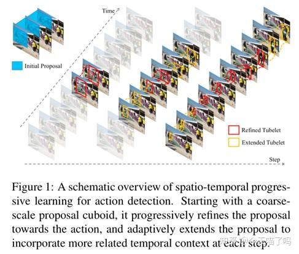
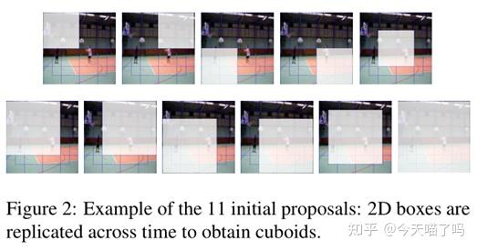
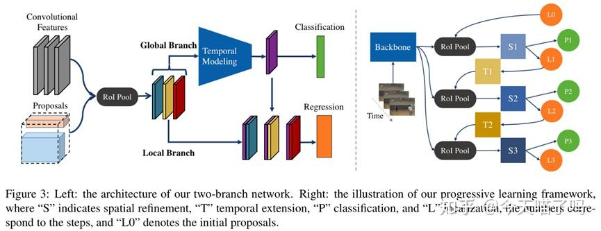
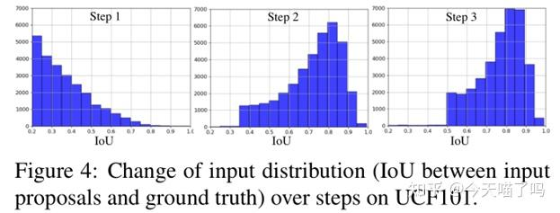

# STEP: Spatio-Temporal Progressive Learning for Video Action Detection

https://zhuanlan.zhihu.com/p/619937935

## 1. 背景介绍

时空动作检测致力于识别兴趣动作，并在时空中定位它们。受到目标检测领域影响，大多现有方法基于一个2阶段的框架，第一阶段通过区域提议算法或者密集锚点产生动作提议，第二阶段对提议进行动作分类和定位优化。

时空动作检测更加具有挑战性。大多挑战是视频时序特性带来的。（1）一个动作立方体（即，一组动作的包围框）通常包含了时间上的空间位移，引入了提议生成和优化的额外复杂性；（2）有效的时序建模对动作分类是重要的，因为一些动作在时序上下文可获得的时候才能很好鉴定。

一些工作通常在片段（即，一个短视频段）上进行动作检测来利用时序信息。比如有个工作输入一个帧序列，输出动作类别和回归的每个片段的边界。为了生成动作提议，他们扩展2D区域提议到3D，通过在时间上复制它们，假设空间上下文在一个片段内是固定的。然后这种假设在遇到大的空间位移的时候会被推翻，特别是快速的移动。因此直接使用长的动作立方体并不是很好，因为它们对于动作分类会引入噪声，并且使得动作定位更加挑战。最近地，有一些工作使用自适应的提议，然后这些方法需要一个额外的离线关联过程。

在这个工作中，给出一个新的学习框架，叫时空逐级动作检测器。如图所示，不像现有方法直接一次检测，这个工作引入一个多个步骤的优化过程，逐级地优化初始的提议。特别地，这个框架包含两个成分，空间优化和时间扩展。空间优化：从一小组粗粒度的提议开始，并且逐渐地更新，来更好地分类和定位动作区域。在多个步骤上顺序迭代进行。空间优化启发于回归的输出能够更好地跟着动作发生区域并且比输入的提议更加适应动作立方体的实际信息。时序扩展：致力于引入更长的时序信息来提高分类精度。然而，简单地将更长的片段作为输入是低效且无效的，因为更长的序列往往具有更大的空间位移，如图1所示。为此，我们在每个步骤逐级地处理更长的序列，自适应地扩展提议。所以，STEP能够自然地处理空间位移问题，并且提供更加有效的建模能力。

第一个提供逐级端到端优化框架用于视频动作检测。带来空间位移问题，展示了方法如何处理，并进行实验。

## 2. 相关工作

**动作识别。**在视频动作中的一系列研究是关于动作的分类的，提供了动作检测的基本工具，比如在多模态的双流网络、3D-CNN用于同时时空特征学习、RNN来捕获时序上下文和可变长度视频序列。另一个活跃的研究方向是时序动作检测，致力于定位每个动作的时序上下文。许多方法被提出了，从快速时序提议、区域提议3-D网络，再到基于预算的循环协议网络。

**时空动作检测。**受到目标检测的启发，包括光流捕获运动线索、关联算法连接帧间检测作为动作立方体。尽管这些方法取得了好的效果，视频的时序信息没有挖掘好，因为时序信息没好好利用。为了更好地利用时序线索，一些现有工作提出在clip的基础上进行动作检测。比如ACT用的就是短序列，大概6帧，输出回归的边界，随便通过多个小边界进行关联。随后也有一些工作提出说，长一些的序列效果更好，比如40帧。和这些不同的也有把提议边界连接起来的。

**逐级的优化。**这个技术在许多视觉任务中有了，比如姿态估计、图像生成和目标检测。多区域检测器使用R-CNN引入了迭代的包围框回归产生更好的回归结果。AttractioNet利用了一个多阶段的过程来生成准确的提议，随后输入到Fast R-CNN。G-CNN训练一个回归器来迭代地移动包围框到物体。级联的R-CNN提出一个级联的框架，R-CNN的检测器的序列结合不断增加的IoU阈值来抑制近似False Positives。

## 3. 方法

### 3.1. 方案总览

在clip级进行动作检测，即，先从每个clip中得到检测结果，随后连接成整个视频的动作立方体。假设在一个clip中一个时期的变化是恒定的。

我们的目标是通过一些逐级的步骤来处理动作检测问题，而不是直接一次检测。为了检测到，首先提取一组clips的卷积特征，使用VGG16或者I3D。逐级学习过程从预定义好的提议长方体开始，这些长方体在一开始稀疏地采样得到。如图是11个初始的提议。这些初始提议随后逐级地更新，并且更好地分类和定位运动。在每个步骤中，通过如下的过程更新提议：

**·扩展：**提议在时序上扩展连续的clip来包含更长尺度的时序上下文，随后时序的扩展对动作的移动进行自适应。

**·优化：**扩展的提议前向到空间的优化，输出分类和回归结果。

**·更新：**所有提议使用一个简单的贪婪算法更新，即，每个提议通过回归输出来更新，使用最高的分类分数。

### 3.2. 空间优化

在每个步骤中，空间优化解决一个多任务学习问题，包含空间分类和定位回归。设计了一个双分支架构，学习两个任务的特征，如图所示。

对于准确的动作分类，需要空间和时间的上下文特征，而对于定位的回归，需要在帧级别上的更准确的空间线索。结果，双分支网络包含了一个*全局分支*进行在整个输入序列上进行时空建模，以及一个*局部分支*进行在帧上包围框回归。

给定帧级的卷积特征和当前步骤的提议，首先提取区域特征。随后将区域特征送到全局分支进行时空建模。每个全局特征编码了一小段序列的特征，并能够用来预测分类结果。全局特征随后和对应的区域特征连接，构成局部特征，用于特定类别的回归输出。这里的局部特征不仅关注了时空上下文，还提取了每帧的局部细节。通过联合训练两个分支，网络学习两个不同的特征用于对应的任务。

### 3.3. 时序扩展

视频时序信息，特别是长期的时序依赖对动作分类很关键。为了利用更长尺度的时序上下文，扩展提议来引入更多的帧作为输入。空间位移问题对于动作检测来说问题比较大，它可能会复制2D的提议来增加时序长度。

为了解决这个问题，逐级并且自适应地进行时序扩展。从第二个步骤，扩展了提议到两个连续的clip。有两种方法来进行时序扩展。

（1）外推（Extrapolation）。通过假设空间位移在一定时间内满足线性方程，以一种线性外推方程来扩展。

（2）预测（Anticipation）。通过位置预测，自适应进行时序扩展，即，训练一个额外的分支来基于当前的clip推断后续的位置。

### 3.4. 网络训练

尽管STEP包含了多个逐级的步骤，整个网卡能够端到端训练，在不同的步骤联合优化。给定一个训练数据中的小batch，首先进行前向推理，来获取迭代的输入。检测的输出被收集来选择训练的正负样本。我们收集了所有步骤的损失，并回传。

和先前的工作相比，这里的训练更加挑战性，因为输入输出的分布在不同步骤间会改变。这是因为不同步骤间的稀疏程度是不同的。对应地，输出分布的范围在不同步骤间会降低。这里有三种方法来解决：（1）在不同的步骤使用不同的头网络；（2）在不同的步骤间，IoU阈值越来越大。直觉地，一个较低的IoU阈值能够达到粗糙的效果；（3）一个采样策略，在训练过程中根据困难程度改变。