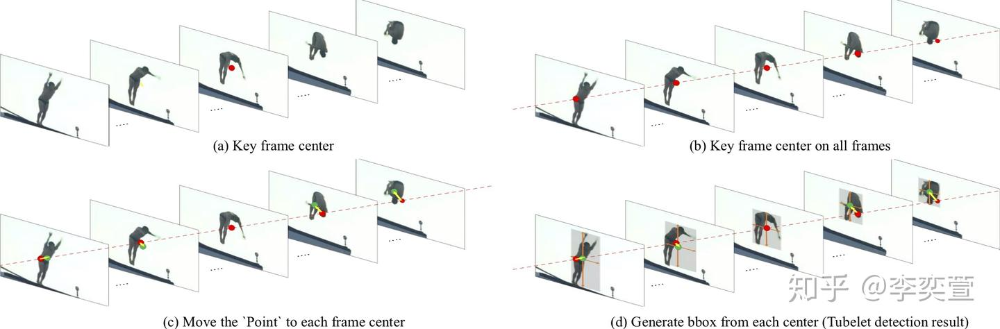
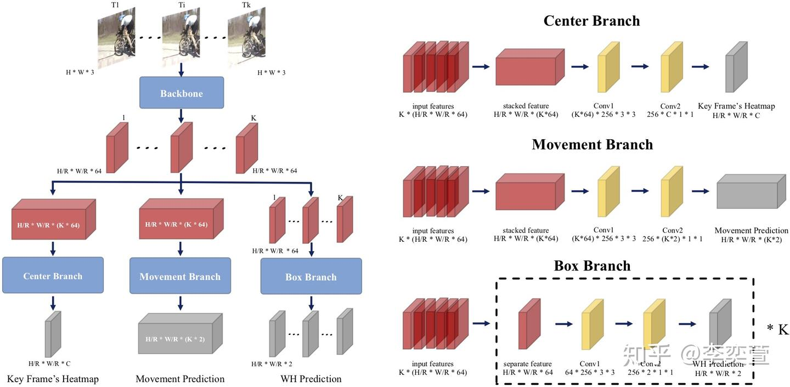

# Actions as Moving Points (ECCV 2020)

https://zhuanlan.zhihu.com/p/164968681

**时空动作检测 (spatio-temporal action detection) ：**相比于时序动作检测略有不同，时空动作检测不仅需要识别动作出现的区间和对应的类别，还要在空间范围内用一个包围框 (bounding box)标记出人物的空间位置。

早期的时空动作检测是先逐帧处理 (frame-level detector)，得到每帧内人物的包围框和动作类别，然后再沿时间维度将这些框连起来，形成时空动作检测结果，但这样逐帧处理的方式导致沿时间连接比较困难，且因为缺乏时序信息的利用导致动作识别精度不高；近期工作中 (ACT，T-CNN，STEP) 提出了基于tubelet的检测方式 (tubelet-level detector)，此类检测器每次输入连续K帧并产生连续K帧的检测结果action tubelet（tubelet内相邻帧的框已连接），再将这些tubelet在时序上进行连接，得到视频级别的时空动作检测结果action tube。

## 2. 研究动机

目前的时空动作检测框架主要是基于anchor-based目标检测方法，例如faster rcnn，ssd等。这些方法会预先设计大量的anchor，尽管他们已经在图片领域取得很好的成果，但是仍然存在超参敏感 (e.g. box size, aspect ratio, and box number) 和密集设置anchor造成的效率低下的问题，当扩展到视频领域需要设计3D anchor时，随着输入tubelet长度增加，可能的anchor数目急剧增加，超参数目增多，对于训练和测试都是一种挑战。受到最近anchor-free object detector的影响，我们提出了一个简洁、高效、准确的action tubelet detector, 称为MovingCenter detector (MOC-detector)。

## 3. 方法

基于运动信息可以有效提高识别精度，协助人物定位的分析，我们将动作实例建模为每一帧动作中心点沿时序的运动轨迹，依照这种对动作的简化建模方式，流程图如下：

红点表示中心点预测分支预测的中间帧动作实例的中心点，黄色箭头代表运动估计分支预测的相邻帧中心点相对于中间帧中心点的运动矢量，绿点表示动作实例在当前帧的中心点，深灰色矩形代表每个动作实例对应的包围框

具体来讲，首先将连续K帧图像分别输入共享的2D Backbone提取每一帧的高层语义特征，即K张特征图，然后由三个分支共同协作来完成时空动作检测，我们的网络结构如下图：

左边是MOC的网络结构，红色的立方体是backbone抽取的feature或者是后期延时序拼接的feature；右边是每个分支的具体结构，每个分支由一个3*3卷积层，一个ReLu层，一个1*1卷积层组成，由黄色立方体代表（ReLu被忽略）。

三个分支处理过程为：

**（1）中心点预测分支 (Center Branch)** 用于检测每个tubelet中间帧动作实例中心点的空间位置和所属类别。将K张特征图沿通道拼接，经过一个3x3卷积得到时空融合特征，再通过一个1x1卷积得到K帧图像序列中间帧的“heatmap”，响应高的点对应中间帧动作实例中心点的位置和类别。

**（2）运动估计分支 (Movement Branch)** 用于估计中间帧动作实例中心点到相邻帧对应动作实例中心点的运动矢量，形成中心点运动轨迹。将（1）中预测的中间帧动作中心点移动到当前帧的对应中心点。至此可以形成连续K帧内每个动作实例中心点的运动轨迹。

**（3）包围框回归分支 (Box Branch)** 在每一帧的预测中心点直接回归bbox大小来得到动作实例在空间上的包围框。逐帧处理，输入单帧特征图，预测由（2）得到的当前帧动作中心点对应动作的包围框大小。

这三个分支可以相互协作生成tubelet检测结果，并采用现有的link算法。在同等实验设置下，UCF101-24和JHMDB数据集上得到了当前最好的结果，尤其是对于更精确的检测要求（高IoU, 如IoU=0.75）。且因为同一个视频中每一帧的特征只需提取一次，之后对于不同的视频序列可重复使用，MOC-detector的效率也很高双流速度达25FPS。同时由于我们采用了在线的link算法，MOC可以实时处理在线视频流，单流RGB速度达53FPS。