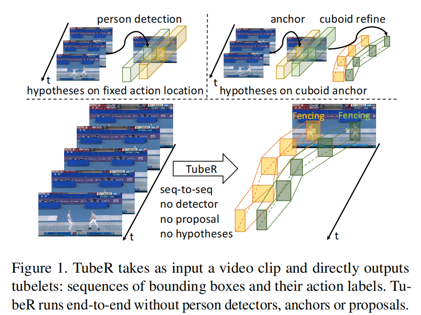
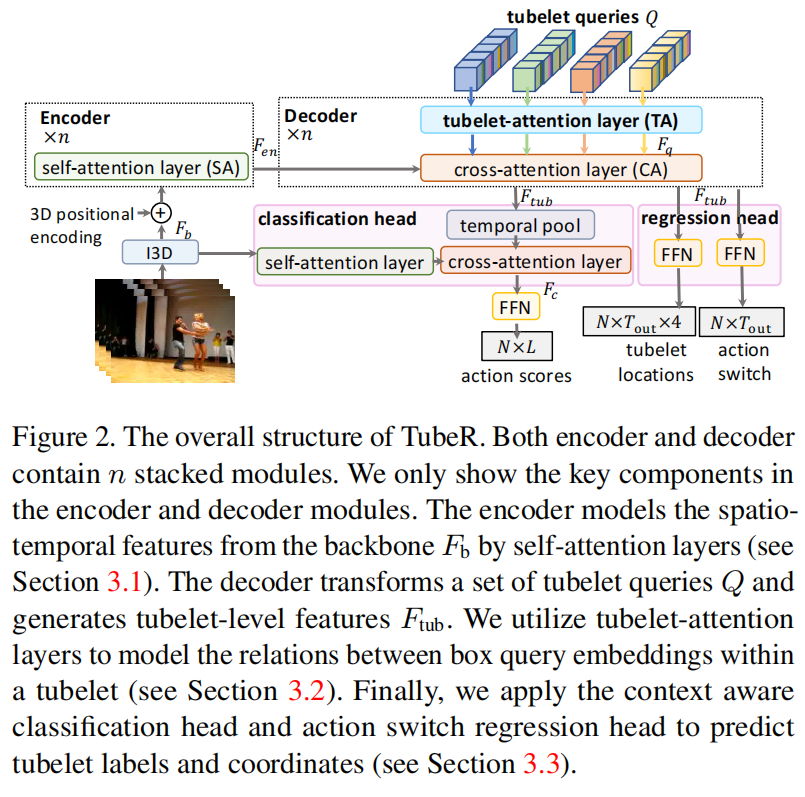

# TubeR: Tubelet Transformer for Video Action Detection

https://blog.csdn.net/qq_58484580/article/details/132810663

这是2022年的一篇CVPR，整个的模型的结构是在目标检测中的DETR的基础上更改而来，但观察代码发现编码器和解码器的方式都一样，说白了就是把2D的方法用到了3D中，后边又用了《Action Tubelet Detector for Spatio-Temporal Action Localization》这篇文章中Tubes的聚合方法，将每一帧预测的box聚合成Tubes，从时间线上来看就如同管道一样，不过这与之前的一些Tubes的论文不同，这里的Tubes的大小是可变的，也就是每一帧的box大小是可变的，这样就能更好的检测动作，尤其是一些距离镜头远处的人的动作也能检测到。能达到这样的效果，很大程度上都得益于DETR。后面在FFN网络中，作者又做了一定的改进，加入了前面的信息，最后才输出的结果。整篇文章以及代码的思路在我看来是：先利用DETR对每一帧进行目标检测，然后通过Tubes_Link聚合起来。下面就来讲讲整个流程。

## 1. 引言

本文探讨了视频中时空人体动作检测的问题[3,17,39]，这在高级视频搜索引擎、机器人技术和自动驾驶汽车中起着核心作用。动作检测是一项复杂任务，需要定位每帧中的人实例，将这些检测到的人实例链接成动作管，并预测它们的动作类别标签。文献中普遍存在两种时空动作检测方法：帧级检测和动作管级检测。帧级检测方法[14,29,32]独立于每帧检测和分类动作，然后将每帧检测结果链接成连贯的动作管。为了弥补时间信息的不足，几种方法简单地重复2D提议[12,15,35]或离线人检测[9,28,37,43]以获取时空特征（图1左上）。

或者，动作管级检测方法[16,19,26,33,45,49]直接从视频片段生成时空体积，以捕捉动作的连贯性和动态特性。它们通常在时空假设下联合预测动作定位和分类，如3D长方体提议[16,19]（图1右上）。不幸的是，这些3D长方体只能捕捉短时间，即使当人的空间位置因移动或相机运动而变化时也是如此。理想情况下，这类模型将使用灵活的时空动作管，这些动作管可以长时间跟踪人，但这种参数化的大配置空间限制了以前的方法仅使用短长方体。在这项工作中，我们提出了一种动作管级检测方法，能够灵活地同时定位和识别动作管，允许动作管在大小和位置上随时间变化（图1底部）。这使我们的系统能够利用更长的动作管，这些动作管在更长的时间内聚合了人及其动作的视觉信息。

我们从自然语言处理（NLP）中的序列到序列建模，特别是机器翻译[21,24,36,40]及其在对象检测中的应用，DETR[4]中汲取灵感。作为一个检测框架，DETR可以简单地应用于帧级动作检测方法，但DETR所基于的变换器框架的强大之处在于其能够生成序列上的复杂结构化输出。在NLP中，这通常以句子的形式出现，但在这项工作中，我们使用解码器查询的概念来表示视频序列中的人及其动作，而无需将动作管限制为固定长方体。

我们提出了一种名为TubeR的动作管变换器，用于从单一表示中定位和识别动作。**基于DETR框架[4]，TubeR学习一组动作管查询，从时空视频表示中提取动作特定的动作管级特征。**我们的TubeR设计包括专门的空间和时间动作管注意力，使我们的动作管在空间位置和随时间变化的尺度上不受限制，从而克服了以前仅限于长方体方法的限制。TubeR在时间上联合回归动作管内的边界框，考虑动作管之间的时间相关性，并聚合动作管上的视觉特征以分类动作。这个核心设计已经表现良好，超越了许多以前的模型设计，但仍然没有改进使用离线人员检测器的帧级方法。我们假设这部分是由于我们的基于查询的特征缺乏更多的全局上下文，因为仅通过观察一个人很难分类涉及“听”和“说”等关系的动作。因此，我们引入了一个上下文感知分类头，它与动作管特征一起，从我们的分类头可以提取上下文信息的完整片段特征中提取。这种设计允许网络有效地将人员动作管与动作管出现时的完整场景上下文相关联，并在我们结果部分单独证明是有效的。这种设计的一个限制是上下文特征仅从我们的动作管占据的相同片段中提取。已经证明[43]，对于最终动作分类，包括长期上下文特征也很重要。因此，我们引入了一个受[44]启发的记忆系统，以压缩和存储动作管周围视频内容的上下文特征。我们使用相同的特征注入策略将这种长期上下文记忆输入到我们的分类头，并再次证明这比仅使用短期上下文有重要的改进。我们在三个流行的动作检测数据集（AVA[15]，UCF101-24[34]和JHMDB51-21[18]）上测试了我们的完整系统，并展示了我们的方法可以超越其他最先进的结果。

总之，我们的贡献如下：
1. 我们提出了TubeR：一个用于人体动作检测的动作管级变换器框架。
2. 我们的动作管查询和基于注意力的公式能够生成任意位置和尺度的动作管。
3. 我们的上下文感知分类头能够聚合短期和长期上下文信息。
4. 我们在三个具有挑战性的动作检测数据集上展示了最先进的结果。

## 2. 相关工作

### 帧级动作检测

视频的时空动作检测有着悠久的传统，例如[3,15,17,28,29,37,39,42]。受深度卷积神经网络用于目标检测的启发，视频动作检测通过帧级方法[29,31,32,42]得到了显著改进。这些方法逐帧进行定位和识别，然后将逐帧预测链接到动作管。具体来说，它们在关键帧上应用2D位置假设（锚点）或离线人员检测器来定位演员，然后更专注于改进动作识别。他们通过额外的流利用光流来整合时间模式。其他人[12,15,35]应用3D卷积网络来捕捉识别动作的时间信息。Feichtenhofer等人[9]提出了一种慢速网络，以更好地捕捉时空信息。Tang等人[37]和Pan等人[28]提出显式建模演员和对象之间的关系。最近，Chen等人[5]提出从单一骨干网络端到端训练演员定位和动作分类。与这些帧级方法不同，我们针对动作管级视频动作检测，采用统一配置同时进行定位和识别。

### 动作管级动作检测

通过将动作管作为表示单元[23,26,33,45,49]来检测动作，自从Jain等人[17]提出以来一直很受欢迎。Kalogeiton等人[19]在每帧重复2D锚点以池化ROI特征，然后堆叠帧特征以预测动作标签。Hou等人[16]和Yang等人[45]依赖于精心设计的3D长方体提议。前者直接检测动作管，后者随着时间的推移逐步改进3D长方体提议。除了框/长方体锚点，Li等人[26]依靠中心位置假设来检测动作管实例。基于假设的方法在处理长视频剪辑时存在困难，如我们在介绍中所讨论的。我们通过学习一组动作管查询来表示动作管的动态特性，从而增加了动作管传统的内容。我们将动作检测任务重新表述为序列到序列学习问题，并明确建模动作管内的时间相关性。我们的方法能够处理长视频剪辑。

### 基于变换器的动作检测

Vaswani等人[40]提出了用于机器翻译的变换器，之后很快成为序列到序列任务最受欢迎的骨干，例如[21,24,36]。最近，它在目标检测[4,50]、图像分类[6,46]和视频识别[7,10,47]方面也展示了令人印象深刻的进展。Girdhar等人[13]提出了一种视频动作变换器网络来检测动作。他们应用区域提议网络进行定位。变换器用于通过聚合演员周围时空上下文的特征来进一步改进动作识别。我们提出了一个统一的解决方案，以同时定位和识别动作。

## 3. 通过TubeR进行动作检测

在本节中，我们介绍了我们的TubeR，它将视频片段作为输入，并直接输出一个管状区域（tubelet）：一系列边界框和动作标签。TubeR的设计灵感来自基于图像的DETR[4]，但重新构建了用于视频序列到序列（sequence-to-sequence）建模的Transformer架构（图2）。

给定一个视频片段  $ I \in \mathbb{R}^{T_{\text{in}} \times H \times W \times C} $ ，其中  $ T_{\text{in}}, H, W, C $  分别表示帧数、高度、宽度和颜色通道数，TubeR首先应用一个3D骨干网络来提取视频特征  $ F_b \in \mathbb{R}^{T' \times H' \times W' \times C'} $ ，其中  $ T' $  是时间维度， $ C' $  是特征维度。然后，一个Transformer编码器-解码器被用来将视频特征转换为一组管状区域特定的特征  $ F_{\text{tub}} \in \mathbb{R}^{N \times T_{\text{out}} \times C'} $ ，其中  $ T_{\text{out}} $  是输出时间维度， $ N $  是管状区域的数量。为了处理长视频片段，我们使用时间下采样来使  $ T_{\text{out}} < T' < T_{\text{in}} $ ，这减少了我们的内存需求。在这种情况下，TubeR生成稀疏的管状区域。对于短视频片段，我们移除时间下采样以确保  $ T_{\text{out}} = T' = T_{\text{in}} $ ，这导致密集的管状区域。管状区域回归和相关动作分类可以通过分离的任务头同时实现：

 $$ y_{\text{coor}} = f(F_{\text{tub}}); y_{\text{class}} = g(F_{\text{tub}}), $$ 

**其中  $ f $  表示管状区域回归头**， $ y_{\text{coor}} \in \mathbb{R}^{N \times T_{\text{out}} \times 4} $  表示  $ N $  个管状区域的坐标，每个管状区域跨越  $ T_{\text{out}} $  帧（或长视频片段的  $ T_{\text{out}} $  采样帧）。这里  $ g $  表示动作分类头， $ y_{\text{class}} \in \mathbb{R}^{N \times L} $  表示  $ N $  个管状区域的动作分类，有  $ L $  个可能的标签。

图2. TubeR的整体结构。编码器和解码器都包含n个堆叠模块。我们仅展示了编码器和解码器模块中的关键组件。编码器通过自注意力层（参见第3.1节）从骨干  $ F_b $  建模时空特征。解码器转换一组管状区域查询  $ Q $  并生成管状区域级别的特征  $ F_{\text{tub}} $ 。我们利用管状区域注意力层来建模管状区域内框查询嵌入之间的关系（参见第3.2节）。最后，我们应用上下文感知分类头和动作切换回归头来预测管状区域标签和坐标（参见第3.3节）。

### 3.1 TubeR编码器

与标准的Transformer编码器不同，TubeR编码器设计用于处理3D时空空间中的信息。每个编码器层由自注意力层（SA）、两个归一化层和前馈网络（FFN）组成，遵循[40]。我们只在下面列出核心注意力层。

 $$ F_{\text{en}} = \text{Encoder}(F_b), $$ 

 $$ SA(F_b) = \text{softmax}\left(\frac{\sigma_q(F_b) \times \sigma_k(F_b)^T}{\sqrt{C'}}\right) \times \sigma_v(F_b), $$ 

 $$ \sigma(*) = \text{Linear}(*) + \text{Emb}_{\text{pos}}, $$ 

其中  $ F_b $  是骨干特征， $ F_{\text{en}} \in \mathbb{R}^{T' \times H' \times W' \times C'} $  表示  $ C' $  维编码特征嵌入。 $ \sigma(*) $  是线性变换加上位置嵌入。Emb_pos 是3D位置嵌入[47]。可选的时间下采样可以应用于骨干特征，以缩小输入序列长度，以提高内存效率。

### 3.2 TubeR解码器

**管状区域查询**。直接基于锚点假设检测管状区域是非常具有挑战性的。管状区域空间在时空维度上比单帧边界框空间大得多。例如，考虑用于目标检测的Faster-RCNN[30]，它需要在空间大小为  $ H' \times W' $  的特征图中的每个位置  $ K (=9) $  个锚点。总共有  $ KH'W' $  个锚点。对于跨越  $ T_{\text{out}} $  帧的管状区域，它将需要  $ (KH'W')^{T_{\text{out}}} $  个锚点来保持相同的时空采样。为了减少管状区域空间，几种方法[16,45]采用3D长方体来近似管状区域，通过忽略短视频片段中的空间动作位移。然而，视频片段越长，3D长方体假设表示管状区域的准确性就越低。我们提出学习由视频数据驱动的一组小的管状区域查询  $ Q = \{Q_1, \ldots, Q_N\} $ 。 $ N $  是查询的数量。第  $ i $  个管状区域查询  $ Q_i = \{q_{i,1}, \ldots, q_{i,T_{\text{out}}}\} $  包含  $ T_{\text{out}} $  个框查询嵌入  $ q_{i,t} \in \mathbb{R}^{C'} $  跨越  $ T_{\text{out}} $  帧。我们学习一个管状区域查询来表示管状区域的动态，而不是手工设计3D锚点。我们为管状区域查询初始化框嵌入。

**管状区域注意力**。为了模拟管状区域查询中的关系，我们提出了一个包含两个自注意力层的管状区域注意力（TA）模块（如图2所示）。首先

我们有一个空间自注意力层，它处理帧内框查询嵌入之间的空间关系，即  $\{q_{1,t}, \ldots, q_{N,t}\}, t=\{1, \ldots, T_{\text{out}}\}$ 。这一层的直观理解是，识别动作受益于同一帧中演员之间或演员与对象之间的交互。接下来，我们有我们的时间自注意力层，它模拟同一管状区域内不同时间的框查询嵌入之间的相关性，即  $\{q_{i,1}, \ldots, q_{i,T_{\text{out}}}\}, i=\{1, \ldots, N\}$ 。这一层有助于TubeR查询跟踪演员，并生成专注于单个演员的动作管状区域，而不是帧中的固定区域。TubeR解码器将管状区域注意力模块应用于管状区域查询  $Q$  以生成管状区域查询特征  $F_q \in \mathbb{R}^{N \times T_{\text{out}} \times C'}$ ：

 $$ F_q = TA(Q). $$ 

**解码器**。解码器包含一个管状区域注意力模块和一个交叉注意力（CA）层，用于从  $F_{\text{en}}$  和  $F_q$  解码管状区域特定特征  $F_{\text{tub}}$ ：

 $$ CA(F_q, F_{\text{en}}) = \text{softmax}\left(\frac{F_q \times \sigma_k(F_{\text{en}})^T}{\sqrt{C'}}\right) \times \sigma_v(F_{\text{en}}), $$ 

 $$ F_{\text{tub}} = \text{Decoder}(F_q, F_{\text{en}}). $$ 

 $F_{\text{tub}} \in \mathbb{R}^{N \times T_{\text{out}} \times C'}$  是管状区域特定特征。注意，通过时间池化， $T_{\text{out}} < T_{\text{in}}$ ，TubeR生成稀疏的管状区域；对于  $T_{\text{out}} = T_{\text{in}}$ ，TubeR生成密集的管状区域。

### 3.3 任务特定头

每个管状区域的边界框和动作分类可以通过独立的任务特定头同时完成。这种设计最大限度地减少了计算开销，并使我们的系统具有可扩展性。

#### 上下文感知分类头
分类可以通过线性投影简单地实现。

 $$ y_{\text{class}} = \text{Linear}_c(F_{\text{tub}}), $$ 

其中  $ y_{\text{class}} \in \mathbb{R}^{N \times L} $  表示  $ L $  个可能标签的分类得分，每个管状区域一个。

#### 短期上下文头
众所周知，上下文对于理解序列[40]是重要的。我们进一步提出利用时空视频上下文来帮助视频序列理解。我们从某些上下文特征  $ F_{\text{context}} $  查询特定动作特征  $ F_{\text{tub}} $  以增强  $ F_{\text{tub}} $ ，并得到用于最终分类的特征  $ F_c \in \mathbb{R}^{N \times C'} $ ：

 $$ F_c = CA\left(\text{Pool}_t\left(F_{\text{tub}}\right), SA\left(F_{\text{context}}\right)\right) + \text{Pool}_t\left(F_{\text{tub}}\right). $$ 

当我们设置  $ F_{\text{context}} = F_b $  以利用骨干特征中的短期上下文时，我们称之为短期上下文头。首先对  $ F_{\text{context}} $  应用自注意力层，然后交叉注意力层利用  $ F_{\text{tub}} $  从  $ F_{\text{context}} $  查询。线性  $ \text{Linear}_c $  应用于  $ F_c $  进行最终分类。

#### 长期上下文头
受[41, 43, 47]的启发，这些研究探索了视频理解中的长期时间信息，我们提出了一个长期上下文头。为了在一定的内存预算下利用长期时间信息，我们采用了一个两阶段解码器进行长期上下文压缩，如[444]中所述：

 $$ \text{Emb}_{\text{long}} = \text{Decoder}\left(\text{Emn}_{n1}, \text{Decoder}\left(\text{Emb}_{n0}, F_{\text{long}}\right)\right). $$ 

长期上下文  $ F_{\text{long}} \in \mathbb{R}^{T_{\text{long}} \times H' \times W' \times C'} $  （ $ T_{\text{long}} = (2w + 1) T' $  $  是一个缓冲区，包含从沿时间连接的长

$ 2w $  相邻剪辑中提取的骨干特征。为了将长期视频特征缓冲压缩到具有较低时间维度的嵌入  $ \text{Emb}_{\text{long}} $ ，我们应用两个堆叠解码器，具有两个令牌嵌入  $ \text{Emb}_{n0} $  和  $ \text{Emb}_{n1} $ 。具体来说，我们首先应用压缩令牌  $ \text{Emb}_{n0} $ （ $ n_0 < T_{\text{long}} $    从  

$ F_{\text{long}} $  查询重要信息，并得到具有时间维度  $ n_0 $  的中间压缩嵌入。然后我们进一步利用另一个压缩令牌  $ \text{Emb}_{n1} $ （ $ n_1 < n_0 $   查询中间压缩嵌入，并得到最终压缩嵌入  $ \text{Emb}_{\text{long}} $ 。 $ \text{Emb}_{\text{long}} $  包含长期视频信息，但具有较低的时间维度  $ n_1 $ 。然后我们采用交叉注意力层到  $ F_b $  和  $ \text{Emb}_{\text{long}} $  生成长期上下文特征  $ F_{\text{lt}} \in \mathbb{R}^{T' \times H' \times W' \times C'} $ ：

 $$ F_{\text{lt}} = CA\left(F_b, \text{Emb}_{\text{long}}\right), $$ 

我们在方程9中设置  $ F_{\text{context}} = F_{\text{lt}} $  以利用长期上下文进行分类。

#### 动作切换回归头

管状区域中的  $ T_{\text{out}} $  个边界框通过FC层同时回归：

 $$ y_{\text{coor}} = \text{Linear}_b\left(F_{\text{tub}}\right), $$ 

其中  $ y_{\text{coor}} \in \mathbb{R}^{N \times T_{\text{out}} \times 4}, N $  是动作管状区域的数量， $ T_{\text{out}} $  是动作管状区域的时间长度。为了移除管状区域中的非动作框，我们进一步包括一个FC层来决定框预测是否描绘管状区域中执行动作的演员，我们称之为动作切换。动作切换允许我们的方法以更精确的时间范围生成动作管状区域。 $ T_{\text{out}} $  个预测框在管状区域中可见的概率为：

 $$ y_{\text{switch}} = \text{Linear}_s\left(F_{\text{tub}}\right), $$ 

其中  $ y_{\text{switch}} \in \mathbb{R}^{N \times T_{\text{out}}} $ 。对于每个预测的管状区域，其  $ T_{\text{out}} $  个边界框获得动作切换得分。

### 3.4 损失

总损失是四个损失的线性组合：

 $$ \mathcal{L} = \lambda_1 \mathcal{L}_{\text{switch}}(y_{\text{switch}}, Y_{\text{switch}}) + \lambda_2 \mathcal{L}_{\text{class}}(y_{\text{class}}, Y_{\text{class}}) + \lambda_3 \mathcal{L}_{\text{box}}(y_{\text{coor}}, Y_{\text{coor}}) + \lambda_4 \mathcal{L}_{\text{iou}}(y_{\text{coor}}, Y_{\text{coor}}), $$ 

其中  $ y $  是模型输出， $ Y $  表示真实值。动作切换损失  $ \mathcal{L}_{\text{switch}} $  是二元交叉熵损失。分类损失  $ \mathcal{L}_{\text{class}} $  是交叉熵损失。 $ \mathcal{L}_{\text{box}} $  和  $ \mathcal{L}_{\text{iou}} $  表示每帧边界框匹配误差。当  $ T_{\text{out}} < T_{\text{in}} $  时，管状区域是稀疏的，坐标真实值  $ Y_{\text{coor}} $  来自相应的时间下采样帧序列。我们使用了类似于[4]的匈牙利匹配，更多细节可以在补充材料中找到。我们经验性地设置比例参数为  $ \lambda_1 = 1, \lambda_2 = 5, \lambda_3 = 2, \lambda_4 = 2 $ 。
