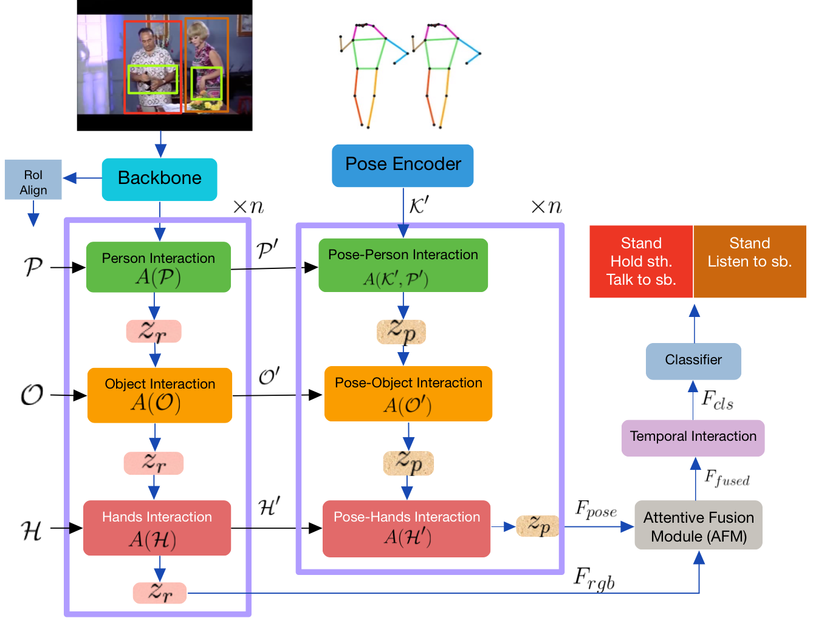
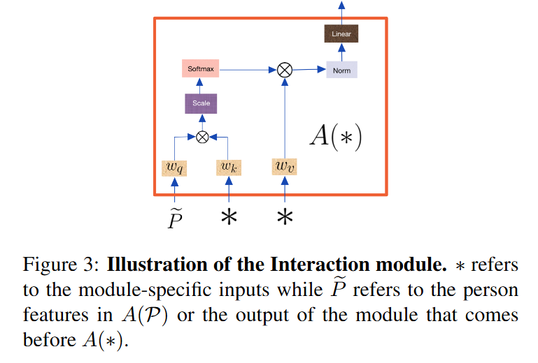
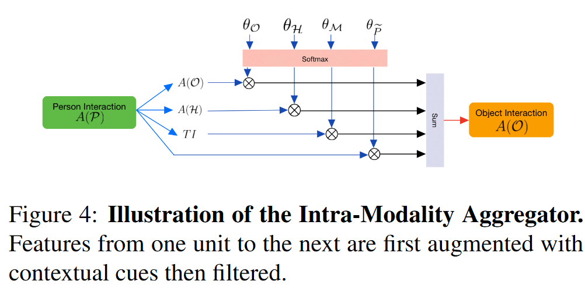

# **Holistic Interaction Transformer Network for Action Detection**

摘要

行动是我们如何与环境互动，包括与其他人、物体和自身的互动。在本文中，我们提出了一种新颖的多模态整体交互变换网络（HIT），该网络利用了大部分被忽视但至关重要的手部和姿态信息，这些信息对于大多数人类动作至关重要。所提出的HIT网络是一个综合的双模态框架，包括RGB流和姿态流。每个流分别对人物、物体和手的交互进行建模。在每个子网络中，引入了一个内部模态聚合模块（IMA），该模块选择性地合并个体交互单元。然后使用注意力融合机制（AFM）将每个模态的结果特征粘合在一起。最后，我们从时间上下文中提取线索，以更好地使用缓存记忆对发生的动作进行分类。我们的方法在J-HMDB、UCF101-24和MultiSports数据集上显著优于以前的方法。我们还在AVA上取得了有竞争力的结果。代码将在https://github.com/joslefaure/HIT上提供。

我们提出的整体交互变换器（HIT）网络使用细粒度的上下文，包括人的姿势、手和物体，来构建双模态交互结构。每个模态包括三个主要组成部分：人交互、物体交互和手交互。每个组成部分都学习有价值的局部动作模式。然后，我们使用注意力融合机制在不同的模态之间进行组合，然后在学习来自相邻帧的时间信息之前，帮助我们更好地检测当前帧中发生的动作。我们在J-HMDB [13]、UCF101-24 [35]、多运动 [18] 和AVA [10] 数据集上进行了实验，我们的方法在前三个数据集上取得了最先进的性能，同时在AVA上与最先进的方法具有竞争力。
本文的主要贡献可以总结如下：

- 我们提出了一种新颖的框架，该框架结合了 RGB、姿态和手部特征进行动作检测。
- 我们引入了一种双模态整体交互变换器（HIT）网络，该网络以直观且有意义的方式结合了不同类型的交互。
- 我们提出了一种注意力融合模块（AFM），它作为一个选择性滤波器，保留每个模态中最具信息量的特征，以及一种内部模态聚合器（IMA），用于学习模态内部的有用动作表示。
- 我们的方法在三个最具挑战性的时空动作检测数据集上达到了最先进的性能。

> 
>
> 图2：我们的HIT网络概述。在我们的RGB流之上是一个3D CNN骨干网，我们用它来提取视频特征。我们的姿态编码器是一个空间变换器模型。我们并行地从两个子网络中使用人、手和物体特征计算丰富的局部信息。然后，我们使用注意力融合模块组合学到的特征，再建模它们与全局上下文的交互。

### **3. Proposed Method**

在这一部分，我们将详细介绍我们的方法。我们的整体交互变压器（HIT）网络由RGB和姿态子网络共同组成。每个子网络旨在通过关注驱动我们大部分动作的关键实体（例如，物体、姿态、手）来学习人与周围环境（空间）的互动。在融合两个子网络的输出后，我们进一步通过查看过去和未来帧的缓存特征来模拟动作在时间上的演变。这种全面的活动理解方案有助于我们实现优越的动作检测性能。

本节的组织如下：我们首先描述第3.1节中的实体选择过程。在第3.2节中，我们在介绍其姿态对应部分之前详细介绍了RGB模态。此外，在第3.4节中，我们解释了我们的注意力融合模块（AFM），然后是时间交互单元（第3.5节）。

给定一个输入视频  $ V_{\text{in}} \in \mathbb{R}^{C \times T \times H \times W} $ ，我们通过应用一个3D视频骨干网络提取视频特征  $ V_b \in \mathbb{R}^{C \times T \times H \times W} $ 。之后，**使用ROIAlign，我们从视频中裁剪出人物特征  $ \mathcal{P} $ 、物体特征  $ \mathcal{O} $  和手部特征  $ \mathcal{H} $** 。我们还保持一个记忆特征的缓存  $ \mathcal{M} = [t-S, \ldots, t-1, t, t+1, \ldots, t+S] $ ，其中  $ 2S+1 $  是时间窗口。同时，我们使用一个姿态模型从数据集中每个关键帧提取人物关键点  $ \mathcal{K} $ 。进一步地，RGB和姿态子网络分别计算RGB特征  $ F_{\text{rgb}} $  和姿态特征  $ F_{\text{pose}} $ 。这些特征随后被融合，并用作学习全局上下文信息的锚点以获得  $ F_{\text{cls}} $ 。最后，我们的网络输出  $ \hat{y} = g(F_{\text{cls}}) $ ，其中  $ g $  是分类头。整体框架如图2所示。

### 3.1 实体选择

HIT由两个镜像模态组成，每个模态都设计有独特的模块，用于学习不同类型的交互。人类行为主要基于他们的姿态、手部动作（及其姿态），以及与周围环境的互动。基于这些观察，**我们选择人体姿态和手部边界框作为我们模型的实体，同时包括物体和人物的边界框。**

**我们使用Detectron进行人体姿态检测，并创建一个包围人物手部位置的边界框**。**遵循最先进的方法[40][32][28]，我们使用Faster-RCNN[31]来计算物体边界框的提议**。视频特征提取器是一个3D CNN骨干网络[5]，而姿态编码器是一个受[51]启发的轻量级空间变换器。我们应用ROIAlign[12]来修剪视频特征，并提取人物、手部和物体的特征。

### 3.2 RGB分支

RGB分支由三个主要组件组成，如图2所示。每个组件执行一系列操作以学习有关目标人物的特定信息。人物交互模块学习当前帧中人物之间的交互（或者当帧中只包含一个主题时的自我交互）。物体和手部交互模块分别模拟人物-物体和人物-手部的交互。每个交互单元的核心是一个交叉注意力计算，其中查询是目标人物（或前一个单元的输出），键和值来自物体或手部特征，这取决于我们所在的模块（见图3）。这就像是在问“这些特定特征如何帮助检测目标人物正在做什么？”。以下方程总结了RGB分支的流程。

$$
\begin{align*}
F_{rgb}=&\left(A(\mathcal{P})\rightarrow z_r\rightarrow A(\mathcal{O})\rightarrow z_r\rightarrow A(\mathcal{H})\rightarrow z_r\right)\\
&A(*)=softmax\left(\frac{w_q(\widetilde{P})\times w_k(*)}{\sqrt{d_r}}\right)\times w_v(*)\\
&z_r=\sum_b A(b)\times softmax(\theta_b),b\in(\widetilde{P},\mathcal{O},\mathcal{H},\mathcal{M})
\end{align*}
$$

$d_{r}$ 表示RGB特征的通道维度，$w_{q}, w_{k}$ 和 $w_{v}$ 分别将它们的输入投影到查询、键和值。$A(*)$ 是交叉注意力机制。在计算人物交互 $A(\mathcal{P})$ 时，它只接受人物特征作为输入。然而，对于手部交互（物体交互），它接受两组输入：**$z_{r}$ 的输出，作为查询（表示为 $\bar{P}$）**，以及我们**从中获取键和值的手部特征（物体特征）**。

模态内聚合组件，$z_{r}$ 是所有交互模块的加权和，包括时间交互模块TI（见图4）。$z_{r}$ 对于两个主要原因至关重要。首先，它允许网络尽可能高效地聚合信息。其次，可学习参数 $\theta$ 有助于过滤不同的特征集，挑选每个特征集中最好的部分，同时丢弃噪声和不重要的信息。关于 $z_{r}$ 的更详细讨论在补充材料中提供。

### 3.3. 姿态分支

姿态模型与其RGB对应模型相似，并重用其大部分输出。**我们首先使用受[51]启发的轻量级Transformer编码器 $ f $ 提取姿态特征 $ \mathcal{K}' $ 。**

$$
\mathcal{K}' = f(\mathcal{K})
$$

然后我们通过镜像RGB模态的不同组成部分并重用其相应输出来计算 $ F_{\text{pose}} $ 。这里， $ \mathcal{P}', \mathcal{O}', $ 和 $ \mathcal{H}' $ 是 $ A(\mathcal{P}), A(\mathcal{O}), $ 和 $ A(\mathcal{H}) $ 的相应输出。

$$
F_{\text{pose}} = (A(\mathcal{K}', \mathcal{P}') \rightarrow z_p \rightarrow A(\mathcal{O}') \rightarrow z_p \rightarrow A(\mathcal{H}') \rightarrow z_p)
$$

$$
A(\mathcal{K}', \mathcal{P}') = \text{softmax}\left(\frac{w_q(\mathcal{K}') \times w_k(\mathcal{P}')}{\sqrt{d_p}}\right) \times w_v(\mathcal{P}')
$$

 $ A(\mathcal{K}', \mathcal{P}') $ 计算姿态特征 $ \mathcal{K}' $ 和增强的人交互特征 $ \mathcal{P}' $ 之间的交叉注意力。这种跨模态融合通过关注RGB特征的关键对应属性来强化姿态特征。其他组件， $ A(\mathcal{O}') $ 和 $ A(\mathcal{H}') $ ，将 $ z_p $ 作为查询进行线性投影，而它们的键值对来自 $ A(\mathcal{O}) $ 和 $ A(\mathcal{H}) $ 。 $ z_p $ 是姿态模型的模态内聚合组件。类似于 $ z_r $ ，它过滤并聚合来自每个交互模块的信息。

### 3.4. 注意力融合模块 (AFM)

在网络的某个点，RGB和姿态流需要在输入到动作分类器之前合并为一组特征。为此，我们提出了一个注意力融合模块，该模块应用两个特征集的通道级连接，然后进行自注意力以进行特征细化。然后我们使用投影矩阵 $ \Theta_{\text{fused}} $ 来减小输出特征的幅度。我们的消融研究中的表5a验证了我们的融合机制与文献中使用的其他融合类型相比的优越性。

$$
F_{\text{fused}} = \Theta_{\text{fused}}(\text{SelfAttention}(F_{\text{rgb}}, F_{\text{pose}}))
$$

### 3.5 时间交互单元

在融合模块之后是一个时间交互块（TI）。人类行为发生在连续体中；因此，长期上下文对于理解动作至关重要。除了$F_{fused}$，该模块还接收长度为$2S+1$的压缩内存数据$\mathcal{M}$。受[40]的启发，内存缓存包含由视频骨干提取的人物特征。$F_{fused}$询问$\mathcal{M}$，以确定哪些邻近帧包含信息特征，然后吸收这些特征。TI是另一个交叉注意力模块，其中$F_{fused}$是查询，而内存$\mathcal{M}$的两个不同投影形成键值对。

$$
F_{cls} = TI(F_{fused}, \mathcal{M}) \qquad (5)
$$

最后，分类头$g$由两个具有ReLU激活的前馈层和输出层组成。

$$
\hat{y} = g(F_{cls}) \qquad (6)
$$