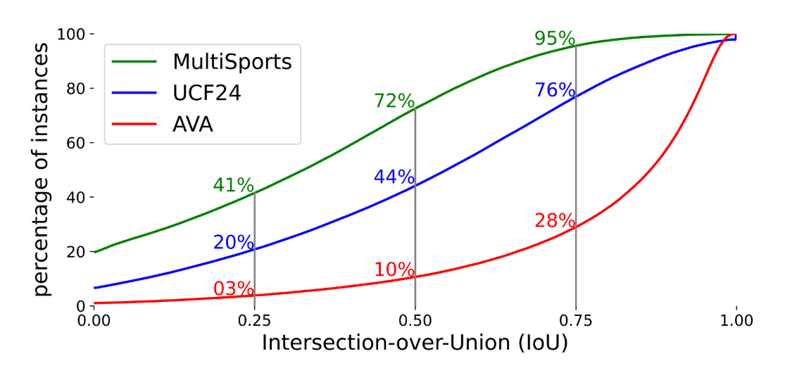
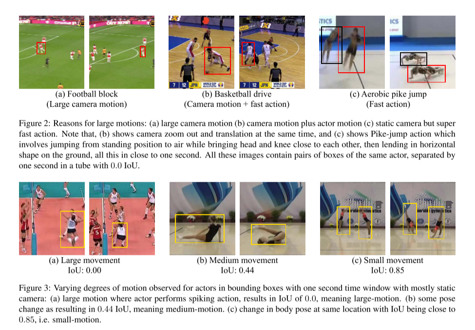
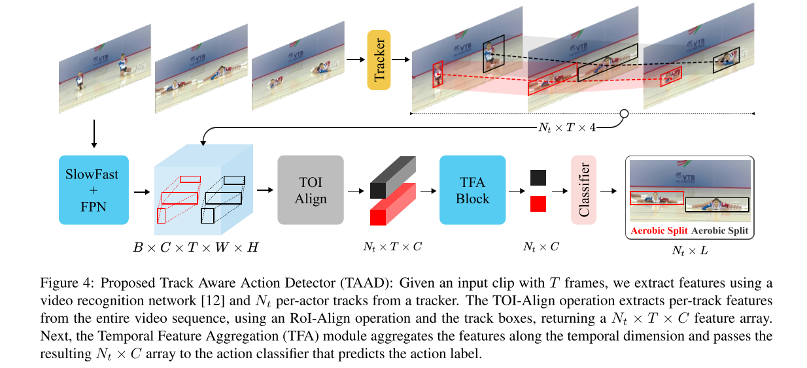

# **WACV 2023 Spatio-Temporal Action Detection Under Large Motion**

CODE:https://github.com/gurkirt/TrackAwareActionDetection

当前的空间-时间动作管检测方法通常会在给定的关键帧处扩展一个边界框提案，将其变为一个3D时间立方体，并从附近的帧中提取特征。然而，如果演员的位置或形状在帧之间显示出大的2D运动和变化，由于相机的大幅度运动、演员形状的大幅度变形、演员动作过快等原因，这种池化方法无法积累有意义的空间-时间特征。在这项工作中，我们旨在研究在大动作下的立方体感知特征聚合在动作检测中的性能。进一步，我们提出通过跟踪演员并在各自的轨迹上进行时间特征聚合，以增强在大动作下的演员特征表示。我们通过在不同固定时间尺度上的动作管/轨迹的盒子之间的交并比（IoU）来定义演员的运动。具有大动作的动作会在时间上导致IoU降低，而较慢的动作会保持较高的IoU。我们发现，轨迹感知的特征聚合在动作检测性能上一致地实现了大幅度的提升，特别是在大动作下的动作与立方体感知基线相比。因此，我们还在大规模的多运动数据集上报告了最先进的性能。

## 1.引言

大的物体运动可以由各种原因引起，例如，快速的相机运动，快速的动作，由于姿势变化导致的身体形状变形，或混合的相机和动作运动。这些原因如图所示。此外，由于上述原因和动作类型的性质(例如，基于姿势或基于交互的动作)的混合，动作类中的动作速度可能会发生变化。这些原因中的任何一个都可能导致次优特征聚合，并导致给定原因的动作分类错误。

图1:在AVA、UCF24和MultiSports的训练集中，相隔一秒的真实值边界框对的IoU测量的累积密度函数，绘制为y轴上显示的落在累积箱中的实例的百分比。例如，20%的MultiSports实例的IoU小于或等于0.0，这表明20%的实例存在非常大的运动。相比之下，只有10%的AVA实例的IoU小于0.5，这意味着其90%的实例在一秒后有很大的重叠，即数量大的实例运动小。

我们建议将动作分为三类:大动作、中动作和小动作，如图1和图3所示。这种区别是基于同一参与者的盒子随时间的IoU，我们可以使用参与者的真实值管来计算。我们建议研究基线长方体感知方法在不同运动类别上的性能，而不需要像上下文特征[27,28,41]或长期特征[41,47]那样的额外的花里胡哨，因为大运动在小时间窗口内发生得很快，如图1和图2所示。在大运动的情况下，IoU会很小(图 (a))，因此3D长方体感知特征提取器将无法在整个动作中捕获以演员位置为中心的特征。为了处理大运动的情况，我们建议随着时间的推移跟踪参与者，并使用track -of interest Align (TOI-Align)提取特征;从而产生轨迹感知动作检测器(TAAD)。此外，我们研究了基于toi对齐特征的不同类型的TAAD网络特征聚合模块，如图图所示。

我们建议将动作分为三类：大动作、中动作和小动作，如图1和图3所示。区分的依据是同一演员在一段时间内的IoU（交并比），我们可以使用演员的地面真实轨迹来计算。我们建议研究基线立方体感知方法在不同运动类别上的性能，而不使用额外的上下文特征[27, 28, 41]或长期特征[41, 47]，因为大动作在短时间内迅速发生，如图1和图2所示。在大动作情况下，IoU会很小（图3(a)），因此3D立方体感知特征提取器将无法在整个动作过程中捕捉到以演员位置为中心的特征。为了处理大动作情况，我们建议随时间跟踪演员并使用兴趣点对齐（Track-ofInterest Align, TOI-Align）提取特征，从而得到跟踪感知动作检测器（Track Aware Action Detector, TAAD）。此外，我们研究了在我们的提出的TAAD网络中，基于TOI对齐特征的不同类型的特征聚合模块，如图4所示。

为此，我们做出了以下贡献：(a) 我们是首次系统地研究大动作行为检测，使用针对每种动作类型的评估指标，类似于基于对象大小的 MS COCO [23] 上的对象检测研究。(b) 我们提出使用管/轨迹感知特征聚合模块来处理大动作，并且我们展示了这种模块在实现显著改进方面的帮助，尤其是对于具有如此大动作的实例。(c) 在这个过程中，我们通过大幅领先去年的挑战获胜者，为 MultiSports 数据集设立了新的最先进水平。

## Methodology

在这一部分，我们描述了提出的处理大动作的方法，我们称之为跟踪感知动作检测器（Track Aware Action Detector，TAAD）。我们首先通过使用第3.2节中描述的跟踪器在视频中跟踪演员。同时，我们使用一个专为视频识别设计的神经网络，SlowFast [12]，从每个片段中提取特征。利用跟踪框和视频特征，我们通过RoI-Align操作[16]对每帧特征进行池化。然后，时间特征聚合（Temporal Feature Aggregation，TFA）模块接收每轨特征并计算一个单一的特征向量，从中分类器预测最终的动作标签。图4展示了我们提出的方法的每个步骤。

图4：提出的跟踪感知动作检测器（TAAD）：给定一个包含T帧的输入片段，我们使用视频识别网络[12]和从跟踪器中获得的Nt个每个演员的轨迹来提取特征。TOI-对齐操作使用RoI-对齐操作和跟踪框从整个视频序列中提取每个轨迹的特征，返回一个Nt × T × C特征数组。接下来，时间特征聚合（TFA）模块沿时间维度聚合特征，并将结果Nt × C数组传递给预测动作标签的动作分类器。

### 3.2. Tracker

我们使用了一种类别不可知的YOLOv5-DeepSort [2]作为我们的跟踪器，该跟踪器基于YOLOv5 [30, 42]和TorchReID[54]。我们对中等大小的YOLOv5版本进行微调，作为“人”类的检测模型。预训练的OsNet-x0-25 [55]被用作重新识别（ReID）模型。正如我们将在实验部分展示的那样，具有高召回率的跟踪器，即缺失关联数量较少，是提高动作管检测性能的关键。我们还将展示，对检测器进行微调是必要的步骤，特别是对于UCF24，因为视频的质量和分辨率较低。

该跟踪器还可以作为边界框建议过滤模块。有时，检测器产生多个高分检测，这些检测是虚假的，并导致假阳性，但这些检测不匹配任何正在生成的轨道，因为它们不是暂时一致的。由轨迹生成的建议可以在测试时与基线方法一起使用。这有助于提高基线方法的性能。

### 3.3. 时间特征聚合

**Track-of-Interest Align (TOI-Align)**：SlowFast视频骨干网络处理输入剪辑并产生一个大小为$T \times H \times W$的特征张量，而我们的跟踪器返回一个大小为$N_t \times T \times 4$的数组，其中包含子轨迹周围的边界框。An RoI-Align [16] 操作这些框来提取大小为$N_t \times T \times H \times W$的特征，即每个轨迹一个特征管。在轨迹长度小于输入剪辑长度的情况下，我们复制最近可用的边界框在时间维度上，这在MultiSports数据集中大约占输入剪辑的3%。

**特征聚合**：为了预测一个边界框的标签，我们需要聚合特征管在时间和空间上的信息。首先我们应用平均池化在TOI-Align提取的特征的空间维度上，然后时间特征聚合通过以下几种变体之一进行：

1. 在时间轴上进行最大池化（MaxPool）。
2. 一系列时间卷积（TCN）。
3. Atrous Spatial Pyramid Pooling（ASPP）的时间变体[15]。我们修改了Detectron2的[48] ASPP实现，将2D卷积替换为1D卷积。

我们还尝试了ConvNeXt [24] 和VideoSwin [25] 块的时间版本，然而这些在MultiSports上不稳定。

在学习率和其他超参数调整的情况下，即使增加了时间卷积层，我们的TCN模块也没有带来额外的改进。请参见补充材料以获取更多细节。

### 3.4. 管道构建

视频级的管道检测需要从每帧检测中构建动作管道。这个过程被分成两步[32]。第一步是将提议链接到管道假设（即，动作轨迹）。第二步是将这些假设合并成一个动作管道。我们可以将这两步视为一个跟踪步骤加上一个时间（开始和结束时间）动作检测步骤。多数现有的动作管道检测方法[20, 21, 33, 36] 使用贪婪提议链接算法作为第一步。对于基线方法，我们使用相同的链接过程[37]。由于我们已经有了轨迹，链接步骤已经完成。时间修剪是通过标签平滑优化来完成的[32]，这是很多前作[18, 21]所使用的。我们使用了类别特定的时间修剪，如[37]所提供。

### 3.5. 数据集

我们评估了我们的方法在两个密集标注的数据集MultiSports [20] 和UCF24 [40] 上，使用帧和管道级别的评估指标进行动作检测，与AVA [15] 不同，后者是稀疏标注的，主要用于帧级别的动作检测。

