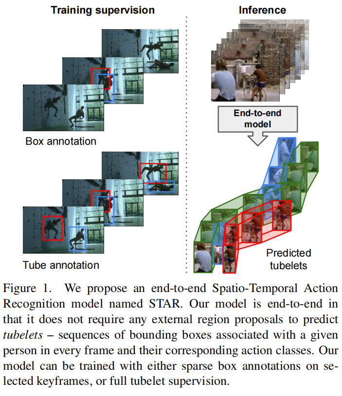

# End-to-End Spatio-Temporal Action Localisation with Video Transformers

## 摘要

最优秀的时空动作定位模型使用外部人员提案和复杂的外部内存库。我们提出了一种完全端到端的、基于纯变换器的模型，该模型直接摄取输入视频，并输出管片段 - 每帧的边界框和动作类别的序列。我们的灵活模型可以使用单个帧上的稀疏边界框监督或完整的管片段注释进行训练。在两种情况下，它都预测出一致的管片段作为输出。此外，我们的端到端模型不需要以提案形式的额外预处理，也不需要以非最大抑制形式的后处理。我们进行了广泛的消融实验，并在五个不同的时空动作定位基准测试中显著提高了稀疏关键帧和完整管片段注释的状态。

图1。我们提出了一种端到端时空动作识别模型STAR。我们的模型是端到端的，因为它不需要任何外部区域建议来预测管——每一帧中与给定人相关的边界框序列及其相应的动作类。我们的模型可以在选定的关键帧上使用稀疏框注释进行训练，也可以使用完整的管道监督。

**3. Spatio-Temporal Action Transformer**