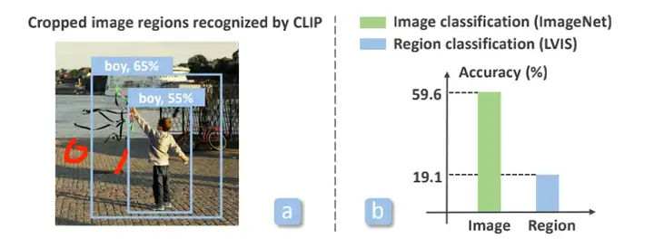
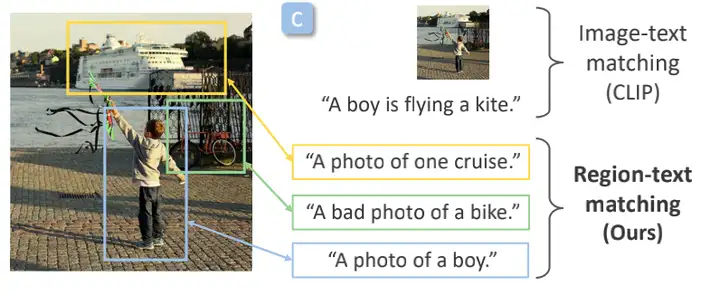
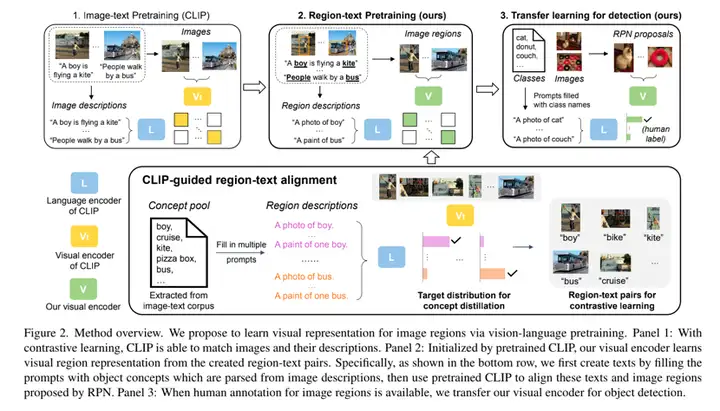
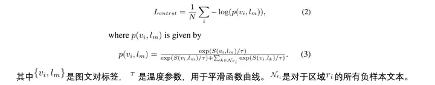
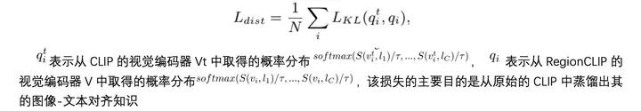
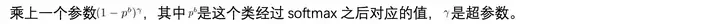
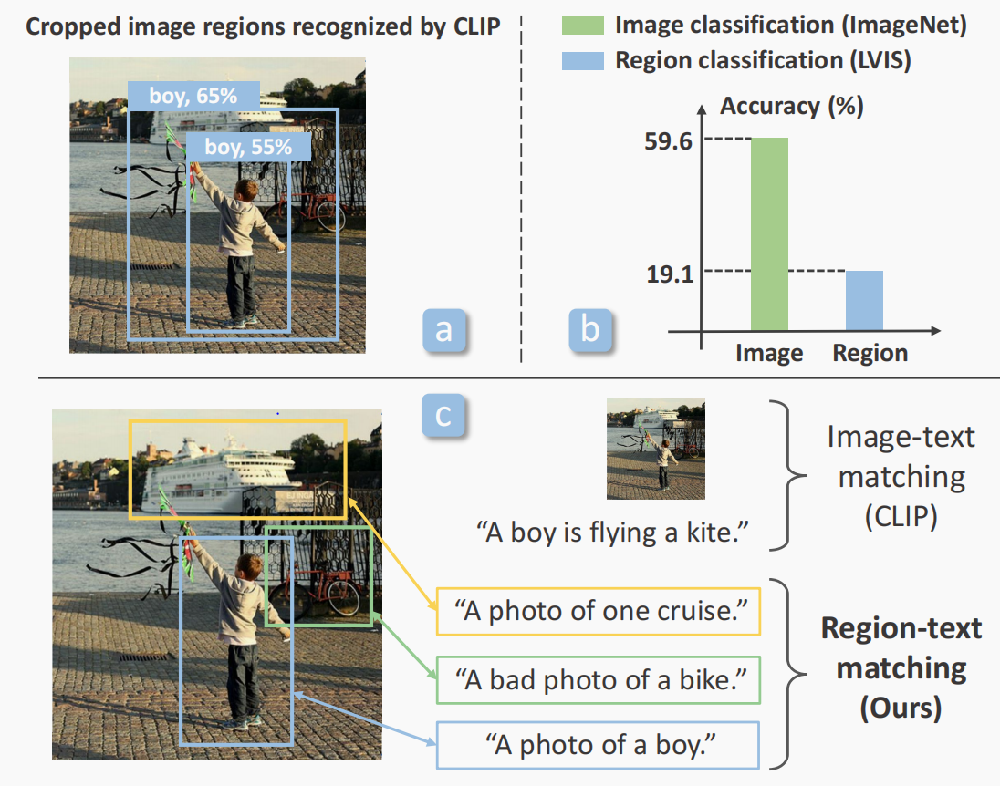
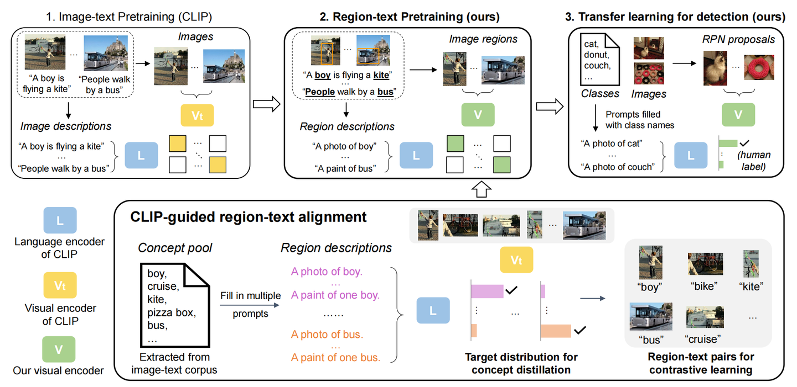

# RegionCLIP: Region-based language-image pretraining

> 论文： [RegionCLIP: Region-based Language-Image Pretraining](https://arxiv.org/pdf/2112.09106.pdf)
>
> 代码：https://github.com/microsoft/RegionCLIP
>
> https://zhuanlan.zhihu.com/p/669472617
>
> https://www.zhihu.com/question/438649654/answer/2503813690
>
> https://blog.csdn.net/jiaoyangwm/article/details/131960703

主要思路：

先从输入图像中抠出候选区域
然后使用 CLIP 模型将抠出的区域和 text embedding 进行匹配

作者首先将CLIP直接运用到目标检测任务上，观察其在区域级别的图文对齐能力是否也像在图片分类上那么强大。

作者构建了一个简单的类R-CNN的目标检测器，只是将抽取图片特征的backbone换成了预训练的CLIP模型。目标检测器会根据一定算法裁剪出图片里的一些候选框，然后再利用CLIP去匹配这些候选框和物体目录里的文本，如上图a中的框0，其去和所有物体目录中的单词去计算余弦相似度，“boy”与该框的相似度最高，所以该框对应的物体即为“boy”。从上图a中我们可以看出一个问题：CLIP的定位能力较差，在0和1两个框中，1号框显然比0号框更精准地框出了“boy”这个物体，但是CLIP在计算相似度时，却认为0号框的分数更高，显然这也是由于其没有进行过颗粒度的图文对齐学习。作者在LVIS上对CLIP的目标检测能力做了实验，如图b所示，对比其在ImageNet上的图像分类的60%准确率，其在目标检测方面仅取得了19%的准确率，实在是下降得厉害！

作者再一次重复了自己的观点：包括CLIP在内的许多视觉语言模型在训练时使用的是图片级别的图文对而非区域级别的图文对，所以模型并未学习到一块图片区域与对应的图片描述中的某段文本的对齐关系。想要进行这种区域级别的预训练，需克服两个挑战：（1）我们只有图片-文本对，但是图片中的哪一个区域对应文本中的哪一段话，这并未显式地标注出来。（2）文本描述中可能并没有完整地将图片中出现的所有物体都进行描述，如下所示，图片中出现了物体“船”，但在对应的文本描述中并未体现。

对于这两个问题，作者提出了相应的解决方法：（1）利用预训练的CLIP模型，来帮助标注图片区域和其对应的文字，作者称这种标签为“虚假”的标签，虽然这样的标签有噪声，但是仍然提供了足够的信息来帮助训练。（2）作者构建了一个“概念池”，里面有许许多多的名词词汇，然后将这些词汇套入到模版中（这与CLIP的做法很类似），再将这些套入到模板中的句子与图片区域去计算相似度，而这些无数个词汇，可以帮助弥补那个没有在文字描述中出现的物体。

这篇文章的贡献如下：（1）提出了一个新颖的区域-文本对齐的方法，且该方法不需要人工标注。（2）提出了“概念池”，通过该池可以很轻松地进行文本扩展（比如要向目标检测的目录中添加几个新的类别，只需要将这些类别对应的词汇放入“概念池”中即可），同样地，该方法不需要人工标注。（3）作者提出的预训练模型在迁移到open-vocabulary目标检测任务上时展现出了十分不错的结果，且在关于目标检测的zero-shot推理上表现除了非常强大的能力。

## ■ RegionCLIP预训练

作者首先做了一个设定：将候选框的抽取与目标识别两个过程分开将，本文使用现存的候选框抽取工具（RPN），专注于目标识别方面的学习。

如上图所示Vt和L指代经过预训练CLIP中的视觉编码器和文本编码器，V指代作者的RegionCLIP中的意图训练的区域级视觉编码器。图中下方部分即为作者提出的“概念池”，这是为了解决图文对中文本缺少对图像足够的描述，仿照CLIP，作者也将每一个名词词汇嵌入到一个语句模版中，让模型看到的是一个完整的句子而非单一的词汇，从而让判断更加精准（如“boy”会扩展成“a photo of boy”），前文有提到，作者的候选框与候选框对应的目标之间的对应关系是不需要人工标注的，是一种“虚假”的标签，那这个“虚假”的标签是怎么来的呢？正是通过CLIP实现的，作者运用CLIP将候选框与“概念池”中的标签一一计算相似度，取相似度最高的匹配来作为对齐的图文对，如图a中的框1与“概念池”中所有的物体标签进行匹配，最后其和“boy”匹配的分数最高，所以这个候选框对应的标签就是“boy”。
接下来介绍如何进行区域级别的多模态预训练：
在视觉区域表示方面，作者选用RPN来抽取候选框（候选框中并未标注object label的信息），得到这些候选框之后，通过作者的视觉编码器V抽取出整张图片的feature map，再在对应的候选框的区域抽取出对应的特征图，再对这张特征图运用RoIAlign的方法将其pooling成固定尺寸。特别的，作者的视觉编码器V中的参数是直接使用CLIP中的视觉编码器Vt来初始化的，这让它有了一个良好的起始点，有助于之后的训练。

在语言区域表示方面，就比较简单，直接将“概念池”中的object label嵌入到模版中，然后使用CLIP的语言编码器L来将它编码成语言嵌入向量。
语言表示与区域图像表示的匹配分数用余弦相似度来表示：

作者在预训练中设计了三种损失函数：
（1）对比损失。给定图文对标签，视觉编码器使用对比损失来学习图像-文本对齐能力。其定义如下：

（2）蒸馏损失。蒸馏损失用KL散度来定义：

（3）虽然作者主要是想要让模型学到颗粒度的图文对齐能力，但是考虑到一些特殊情况，比如RPN抽取框的时候抽取的是整个图像，也就是说让整张图片去和文本对齐，此时作者希望模型也能像CLIP那样拥有图片级别的图文对齐能力，所以，

作者在这一章中特别提到了对于目标检测的迁移学习。当在一些数据集上进行目标检测时，图像区域和对应的物体标签是强监督的，因为此时这种对应关系是人工标注的，RegionCLIP的视觉编码器可以在这种人工标注的数据集上做进一步微调来让它更加适应该数据集，能够在这个数据集的测试集上获得更好的迁移效果，而“概念池”的存在让这种目标检测物体目录的扩展变得十分简单，我们只需要把相应的目标类别对应的词汇替换“概念池”中原有的词汇即可。该视觉编码器用于替换目标检测器中的backbone，然后通过RPN选出一定的候选框，再经过RoIAlign对其进行pooling，将pooling后的特征矩阵与每一个目标类别去匹配，计算分数，分数最高的对应的类别就是该区域框检测出来的类别。

对于open-vocabulary目标检测，作者做了专门的优化，首先对于基础类别，他采用了focal loss，在每一个类之前

经验而论，这种做法可以有效地避免在下游任务微调时遗忘预训练时学会的内容。此外，对于背景类别，作者使用了全零的embedding。

如何预训练：

由于 CLIP 缺少 region 层面的训练，所以 RegionCLIP 构建了一些 region 的伪标签来和 image-text 一起预训练
伪标签如何构建：从网络数据中收集图像描述语句，然后使用 NLP parser 来提取出有效的目标词汇，构建词汇池，然后将词汇池的每个词都填入 prompt 模版（a photo of kite），并且对每个词汇对应的 prompt 模版使用 CLIP 的 text encoder 来得到语义特征，所有的 region concept 都能够使用 semantic embedding 来表示了
构建的 region 伪标签如何和 region 进行对应：使用 CLIP 的 visual encoder Vt 来提取每个 region 的 visual feature，计算其和词汇池中的向量的距离，得分最大的向量就被分配给该 region 了，就能得到每个 region 对应的伪标签了，之后用于 pretraining
联合预训练：将 images-concept 和 region-concept 的数据联合进行预训练，训练的时候会同时使用对比学习 loss 和蒸馏 loss
region-text 对比学习 loss：计算学生模型学习的 region-text pairs 的相似度
蒸馏 loss：计算教师模型和学生模型得到的 region-text 的 matching score
image-text 对比学习 loss：从网络得到的 image-text pairs

如何 zero-shot 推理：

经过预训练的 visual encoder 可以直接用于 region reasoning，也就是对区域内容的识别（注意是没有定位能力的呦！）
例如使用预训练好的 RPN 网络来提取目标，就可以预测目标的类别
而且，作者也将 RPN objectness score 和 category confidence score 做了平均来作为最终得分，这样能够提升效果
如何迁移到目标检测：

使用上面预训练好的 visual encoder 来初始化目标检测器的 visual backbone
使用预训练好的 RPN 来进行目标的定位
使用人工标注的目标检测数据集中的基础类别（base）来训练 visual backbone，我们可以看到这里 visual backbone 是会训练的，那么怎么保证它预训练时候学习到的权重不被忘记呢，这里借用了 focal scaling 的思想，也就是对参与训练的 base 类别设置一定的权重，缓解模型对之前学习到的 object concept 忘记的情况（尤其是 base 类别很少的时候，模型很容易过拟合，对新类的识别产生影响）
然后通过使用预训练得到的 visual backbone 来提取 proposal 的视觉特征并且和目标的类别进行匹配

------------------------------------------------

## ■ 实验结果

作者主要在open-vocabulary目标检测上做了迁移学习的实验，然后在目标检测上做了zero-shot推理。

关于数据集，作者提到预训练数据集使用的是CC3M，其中包揽了300万图文对。在open-vocabulary目标检测上做迁移学习时，训练数据集分别使用了COCO检测数据集和LVIS数据集。COCO上，目标类别被分为48个基础类和17个新颖类（即在训练时没有见过的类）。在LVIS上，目标类别被氛围866个基础类和337个新颖类。

------------------------------------------------------------------------------------------------------------------------------------------------------------------------------------------------------------------

## 1. Introduction

视觉语言表征学习领域的最新进展创造了许多杰出的模型，如 CLIP [37]、ALIGN [26] 和 Florence [59]。这些模型是通过将图像与其标题进行匹配，使用数以亿计的图像-文本对进行训练的，在识别大量概念方面取得了令人印象深刻的成果，而无需人工标注，并且能够转移到许多视觉识别任务中。在图像分类方面取得成功后，一个自然而然的问题是，这些模型能否用于物体检测等任务。

为了回答这个问题，我们使用预训练的 CLIP 模型构建了一个简单的 R-CNN 风格 [16] 物体检测器，类似于在 ImageNet 上调整预训练的卷积网络。该**检测器从输入图像中裁剪候选物体区域，并通过匹配裁剪区域的视觉特征和物体类别的文本嵌入**，应用 CLIP 模型进行检测。图 1（a-b）显示了在 LVIS 数据集上的结果[19]。当使用对象建议[42]作为输入区域时，CLIP 的得分往往无法反映定位质量（图 1a）。即使使用地面真实对象框，在类别数量相似的情况下，使用 CLIP 的分类准确率也会从 ImageNet 上的 60% 显著下降到 LVIS 上的 19%（图 1b）。因此，在使用预训练的 CLIP 模型进行物体检测时，性能会大幅下降。*我们该如何增强视觉语言预训练模型对图像区域的推理能力呢？*

图1 (a).预训练的 CLIP 模型 [37] 无法捕捉定位质量。(b).使用相同的预训练 CLIP 对图像区域进行分类时，准确率大幅下降。(c).我们的关键思路是学习如何匹配图像区域及其文本描述。

我们认为，主要差距在于这些视觉语言模型的训练。大部分已经存在的[视觉大模型](https://zhida.zhihu.com/search?content_id=236902018&content_type=Article&match_order=1&q=视觉大模型&zhida_source=entity)经过训练，可将图像与其图像级文本描述相匹配，包括CLIP。**训练时并不知道局部图像区域和文本标记之间的对齐情况。因此，模型无法将文本概念精确地定位到图像区域。**此外，裁剪局部图像区域并将其与文本标记进行匹配在很大程度上忽略了对物体识别至关重要的周围视觉环境，更不用说高昂的计算成本了，例如**在现代 GPU 上每张图像需要几秒钟的时间**。

在本文中，我们探讨了通过视觉语言预训练学习区域表征来进行物体检测。我们的主要想法是在预训练过程中明确**对齐图像区域和文本标记**。然而，这其中存在两个关键挑战。首先，**图像区域和文本标记之间的细粒度对齐在图像-文本对中不可用，而且注释成本高昂**。其次，图像的文本描述往往不完整，即许多图像区域没有被文本描述。为了应对这些挑战，我们建议从预先训练好的视觉语言模型中进行引导，以对齐图像区域和文本标记，并填补缺失的区域描述，如图 1c 所示。

具体来说，**我们的方法是从文本语料库中解析出的对象概念库开始，通过将这些概念填入预定义模板来合成区域描述**。给定输入图像及其来自对象建议或密集滑动窗口的候选区域，使用预训练的 CLIP 模型对齐区域描述和图像区域，为区域文本对齐创建 "伪 "标签。此外，我们还将 "伪 "区域文本对和地面真实图像文本对结合起来，通过对比学习和知识提炼对视觉语言模型进行预训练。虽然 "伪 "区域-文本对是有噪声的，但它们仍然为区域表征的学习提供了有用的信息，因此有助于缩小物体检测方面的差距，我们的实验也验证了这一点。

我们的贡献概述如下(1) 我们提出了一种新方法，无需人工标注即可将图像区域与其文本描述对齐，从而为学习视觉区域表征提供视觉语言预训练。(2）促进我们预训练的一项关键技术创新是使用**文本提示**将对象描述与图像区域对齐的可扩展方法，不依赖人类注释，也不局限于与图像配对的文本。(3) 我们的预训练模型在应用于开放词汇对象检测时取得了很好的效果，并在对象检测的zeroshot推理方面展示了良好的能力。

## 2. Related Work

**图像表征学习。**视觉表征学习的早期研究主要集中在使用劳动密集型人工标注来训练图像分类模型[13, 22, 30, 46, 50]。学习到的特征可以转移到识别任务中 [16]，分类器可用于标记图像以进行半监督学习 [36, 55, 57]。为了减轻标注负担，自监督学习[5,6,17,20]最近受到了广泛关注。

最相关的工作是从自然语言中学习视觉表征，如图像标签 [3, 8, 12, 25, 28] 和文本描述 [11,23,43,53,62]。利用从互联网上收集到的数百万图像-文本对，最近的视觉语言预训练方法[26,37]学会了将图像与文本描述相匹配，并在图像分类的零点推理和迁移学习方面表现出色。然而，这些工作都集中在为图像分类量身定制的全局表示上。在本文中，我们建议学习局部图像区域的视觉表征，以实现基于区域推理（如物体检测）的零镜头推理和迁移学习。

**图像区域的表征学习**。许多基于区域的推理任务，如物体检测 [4, 41, 42, 52]，都依赖于密集的人类注释 [14, 19, 29, 32]。最近，人们开始探索半监督学习 [48, 56, 66]，即使用预先训练好的检测器来创建图像区域的伪标签。除物体标签外，区域表示学习还得益于物体属性的附加标签[1, 29, 61]，在视觉语言任务中显示出明显的改进[9, 31, 33, 51, 58, 63]。然而，这些研究在很大程度上依赖于人工标注，而且仅限于预定义的类别。作为部分补救措施，自监督学习被扩展到区域表征 [24,40]。受 CLIP [37] 的启发，我们提出通过视觉语言预训练来学习区域表征，这与之前的研究有所不同。我们学习到的表征能够识别图像区域中的许多视觉概念。

**零镜头和开放词汇对象检测。**零镜头物体检测旨在检测在检测器训练过程中未出现过的新物体类别[2, 18, 38, 39, 60, 65]。Bansal 等人[2]利用最大边际损失学习如何将裁剪图像区域的视觉特征与词嵌入[35]相匹配。Rahman 等人[38] 提出了极性损失来模拟背景类别，并对具有相似语义的类别进行聚类。Zhu 等人[65] 探索了通过合成视觉特征的生成模型来提高新类别的定位性能。

最近，Zareian 等人[60] 提出了用于开放词汇对象检测的 OVR，即首先在图像-文本对上对视觉编码器进行预训练以学习对象概念，然后将其转移到零镜头对象检测设置中。另一项相近的研究是 ViLD [18]，其重点是通过从预训练的 CLIP 模型[37]中提炼视觉特征来学习物体检测器，但仍需要物体标签和方框来进行训练。与 OVR 和 ViLD 类似，我们的检测器也利用了从视觉语言预训练中学到的视觉语义空间。与 OVR 不同的是，我们建议从预训练的 CLIP 模型给出的 "伪 "区域-文本对中学习区域表征。因此，我们的方法并不局限于现有的图像文本描述。与 ViLD 不同，我们的工作解决的是区域表征学习问题，重点是从区域-文本对中进行预训练。因此，我们学习的表示法支持零镜头推理，而 ViLD 则不支持。

## 3. Region-based Language-Image Pretraining

我们的目标是学习一个涵盖丰富对象概念的区域视觉语义空间，以便用于开放词汇对象检测。在视觉语义空间中，从 r 提取的视觉区域表示 V(I, r) 应与文本表示 L(t) 匹配。V 是一个视觉编码器，它将图像 I 和一个区域位置 r，并输出该区域的可视化表示。L 是一个语言编码器，可将自然语言文本描述转换为语义表示。

**识别与定位的分离：**基于区域的推理有两个关键部分：定位和识别。受 [47] 的启发，**我们将这两个部分分离开来**，使用现有的区域定位器，并考虑识别问题。因此，我们的重点是学习视觉语义空间，以便在没有人类注释的情况下识别图像区域。

**方法概述：**如图 2 所示，我们将 Vt 和 L 分别表示为经过预训练的视觉编码器和语言编码器，以便将图像与其描述（如 CLIP）相匹配。我们的目标是训练视觉编码器 V，使其能够对图像区域进行编码，并将其与语言编码器 L 编码的区域描述相匹配。为了解决区域描述缺失的难题（如图 2 底部所示），我们构建了一个对象概念库，通过将概念填入提示来创建区域描述，并利用教师编码器 Vt 将这些文本描述与图像区域定位器提出的图像区域相匹配。给定已创建的区域-文本对，我们的视觉编码器 V 通过对比学习和概念提炼来匹配这些对。经过预训练后，我们的模型可支持区域识别的零镜头推理，并可在获得人类注释后用于训练对象检测器。

> 图2 方法概述。我们建议通过视觉语言预训练来学习图像区域的视觉表征。图 1：通过对比学习，CLIP 能够匹配图像及其描述。面板 2：通过预训练的 CLIP 初始化，我们的视觉编码器从创建的区域-文本对中学习视觉区域表示。具体来说，如最下面一行所示，我们首先通过在提示中填入从图像描述中解析出的对象概念来创建文本，然后使用预训练的 CLIP 将这些文本与 RPN 提出的图像区域对齐。面板 3：当有了人类对图像区域的注释后，我们将视觉编码器用于对象检测。

现在我们来描述区域级视觉和语义表征、图像区域和文本描述之间的对齐。

### 3.1. Visual and Semantic Region Representation

视觉区域表示。图像区域可以通过现成的物体定位器（如 RPN [42]）或密集滑动窗口来表示。默认情况下，我们使用在人类标注的无对象标签的对象边界框上预训练的 RPN。我们使用 RPN 提出图像区域并获得 N 个图像区域，表示为 {ri}i=1,...N 。

有了提出的区域，我们就会使用特征汇集方法（如 RoIAlign [21]）从视觉编码器 V 中提取区域 ri 的视觉表示 vi。RoIAlign 通过插值法从完整图像的特征图中汇集区域视觉特征。我们注意到，我们的视觉编码器 V 是由教师 Vt 初始化的，这样它就能在视觉语义空间中有一个良好的起点。

**语义区域表示：**一张图像通常包含丰富的语义，涵盖数千个类别中的一个或多个对象。在大规模图像-文本数据集中注释所有这些类别的成本很高。为此，我们首先建立了一个庞大的概念库，以详尽地涵盖区域概念。如图 2 底部所示，我们使用现成的语言解析器 [27, 44]，从文本语料（如从互联网上收集的图像描述）中解析出对象概念池。

给定概念库后，通过两个步骤创建区域的语义表征：(1) 根据提示模板（如 CLIP 的提示模板 [37]）为每个概念创建一个短句，如将 "风筝 "概念转换为 "风筝的照片"；(2) 使用预训练的语言编码器 L 进一步将生成的文本描述编码为语义表示。

虽然我们的区域描述是建立在现有的图像描述基础上的，但我们的方法不受与图像配对的特定文本描述的限制。重要的是，我们使用了一个强大的语言编码器 L，该编码器经过数以亿计、包含数以万计单词的文本描述的训练，使我们能够轻松地定制和扩展我们的概念库。这种能力是人类注释难以实现的。此外，视觉识别和定位的分离使我们的方法可以灵活地采用不同的方式提取候选区域。

### 3.2. Visual-Semantic Alignment for Regions区域的视觉语义对齐

区域-文本对的对齐。我们利用教师视觉编码器 Vt 来连接图像区域和我们创建的文本（表示为语义嵌入）。同样，区域 ri 的视觉表示 vt i 是通过使用 RoIAlign 从局部图像区域中汇集特征，从教师编码器 Vt 中提取的。vt i和lj之间的匹配分数计算公式如下：

选择匹配得分最高的对象概念（表示为 lm），并将其链接到区域 ri。最后，我们为每个区域获得一个伪标签，形成 {vi, lm} 对。

**我们的预训练方案：**我们的预训练同时利用创建的区域-文本对和现有的图像-文本对。给定对齐的区域-文本对（{vi, lm}），我们根据不同图像中的区域设计了对比损失和提炼损失，对视觉编码器进行预训练。受 [34] 的启发，对比损失的计算公式为

其中，*p*(*vi , lm*) 由下式给出：

这里的 τ 是预定义的温度，Nri 代表区域 ri 的负文本样本集，即与区域 ri 不匹配但与批次中其他区域匹配的对象概念。

由于对比损失中的正对不可避免地会产生 "噪声"，因此我们还考虑对图像区域进行知识提炼。知识蒸馏是从软目标中学习的，有助于处理这些伪区域-文本对中的噪声。这种蒸馏损失定义为

qt i 是教师模型中的软目标，计算公式为 softmax(S(vt i , l1)/τ, ..., S(vt i , lC )/τ )。

鉴于从互联网上收集到的图像-文本对，我们的区域级对比度损失 Lcntrst 可以自然地扩展到图像级对比度损失 Lcntrst-img。它可以被视为一种特殊情况，即：(1) 视觉表示是针对覆盖整个图像的单个全局框提取的；(2) 来自互联网的相应文本描述了整个图像；(3) 负样本是与其他图像相关的文本描述。最后，我们的总体损失函数为

**零点推理：**经过预训练后，我们的视觉编码器可直接应用于区域推理任务。例如，给定 RPN 的区域建议后，从我们的视觉编码器中提取的区域表征可用于匹配目标对象概念的嵌入，从而识别局部图像区域中的概念，从而实现对象检测的零点推理。

### 3.3. Transfer Learning for Object Detection物体检测的迁移学习

我们的预训练利用了教师模型创建的区域-文本对齐。这种对齐不需要人工操作，但准确度不高。如图 2 的面板 3 所示，当有了对图像区域的有力监督（例如人类注释的检测标签）时，我们的视觉编码器可以通过用人类注释替换区域描述来进一步微调。

具体来说，我们通过初始化视觉骨干，将预先训练好的视觉编码器转移到物体检测器上。**在检测图像对象时，与预训练一样，我们使用现成的 RPN 来定位对象区域**，并通过将其视觉区域表示与目标对象类别（如检测数据集中的对象类别）的语义嵌入相匹配来识别这些区域。

## 4. Experiments实验

