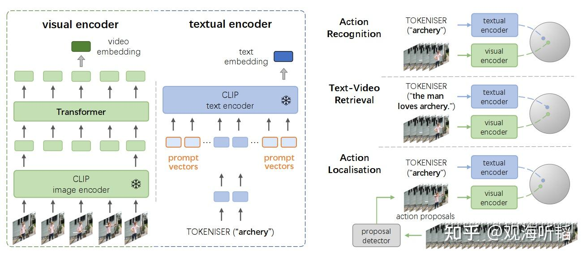
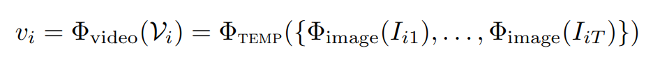

# Prompting Visual-Language Models for Efficient Video Understanding

> https://zhuanlan.zhihu.com/p/586430186

## 2 Abstract

基于图片的视觉语言预训练对于学习联合特征非常有潜质，并发挥出了较为不错的性能表现。涌现出了一大批优秀的模型。本文针对资源受限情况下的视频理解任务，结合提示学习提出了一种简单并且强大的模型。

通过向基于图片的视觉多模态模型中增加一组可学习向量，便可将视频任务统一起来，使用同一个预训练目标。

此外，为了学习视频中的时序关系，本文向CLIP的图片编码器后加入了一个temporal encoder来学习时序信息。

## 3 Introduction

当前诸如LCIP等基于图片的视觉多模态模型具有非常强大的零样本泛化能力。只要有了充足的计算资源、海量的数据（actually money），训练更加优秀的模型不是问题。

但是，如何最好的发挥模型的性能，更加高效的迁移到不同的任务和数据集上，是一个需要思考的问题。

> how can we best exploit the ability in the powerful I-VL models, and effectively adapt it to solve novel vision tasks of interest?

目前主流的微调还是存在很多不足。因此，受到CLIP模型中“提示”的启发，我们也可以针对I-VL model进行提示，让多模态模型迁移到不同的视觉任务中。

针对resource-hungry video understanding，主要有三个方面的原因：

1）相对于图片文本对，视频文本对更难收集，而且可能有不对齐风险；

2）处理视频这类任务需要更多的计算资源；

3）视频具有时序信息，向强大的I-VL model中增加时序处理模块，来处理视频理解任务是非常直觉的做法。

这就是本文的动机。

**向I-VL模型中加入针对视频理解任务的prompt，各种视频任务就被统一到了一个形式下**，比如最大化相似度。

本文处理了三个视频理解中的经典任务：**动作识别**、**文本-[视频检索](https://zhida.zhihu.com/search?content_id=218452583&content_type=Article&match_order=1&q=视频检索&zhida_source=entity)**以及**动作定位**。

## 5 Method

Framework

方法部分关键的地方有三个：

1）不同任务的prompt构建

如上图

2）时序建模模块

由于CLIP使用的是图片文本对进行预训练，因此，对于视频来说，其编码器不能捕获时序关系。**作者便在encoder之后加了一个轻量化的transformer来学习时序信息。**这个做法是比较直觉的。

视频级特征公式

3）训练损失

时序模块的输出仍然是一个token序列，为了能够计算loss，作者对时序模块的输出进行了平均池化。

训练时，需要优化的地方有两个：一是提示向量，二是时序模块。损失函数就选择常见的NCE Loss。