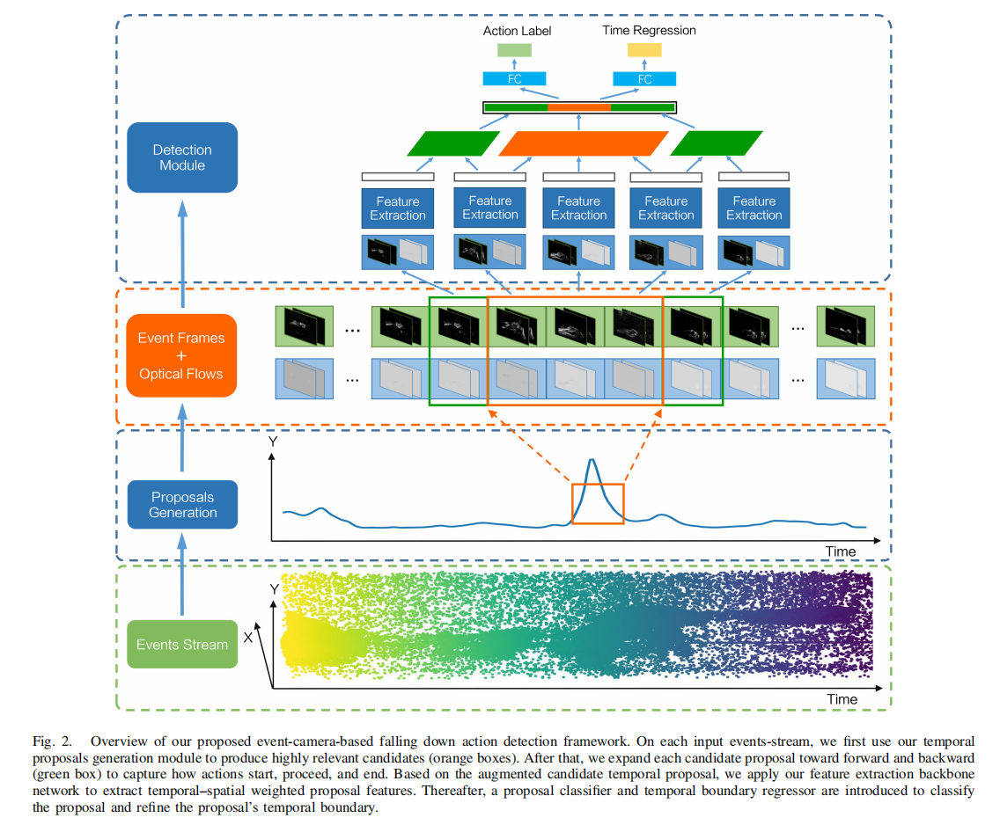
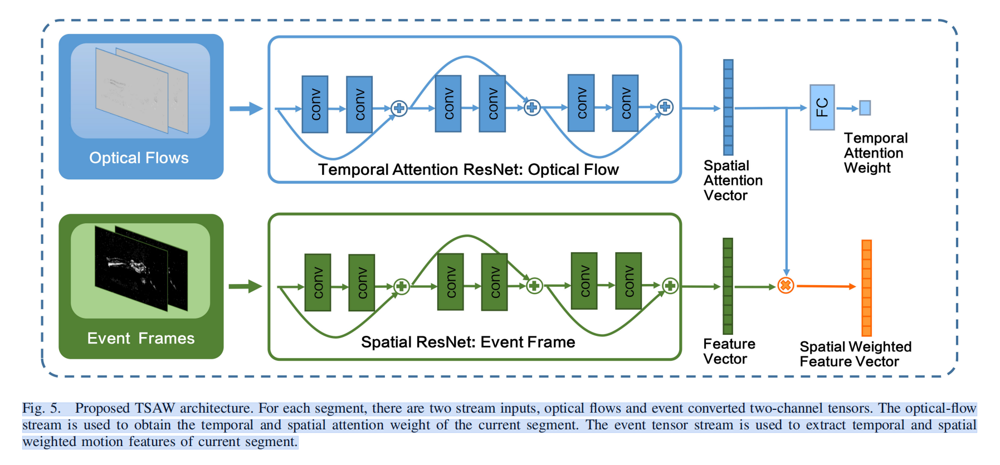
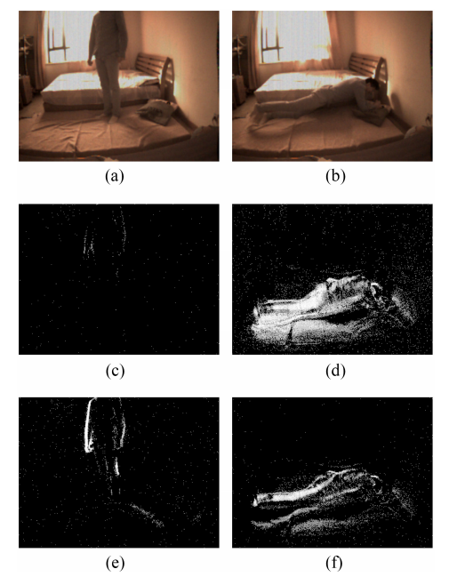

# Neuromorphic Vision-Based Fall Localization in Event Streams With Temporal–Spatial Attention Weighted Network

与基于可穿戴传感器的跌倒识别系统相比，基于非接触式视觉传感器的跌倒识别系统更为实用，已被用于跌倒识别[11]-[14]。传统算法[11]、[12]通常先提取老年人的轮廓，然后跟踪头部轨迹或身体形状的变化来识别跌倒。由于这些手工制作的基于特征的算法很容易受到遮挡和光线变化的影响，[13]，[14]设法将深度学习算法应用于跌倒识别。然而，根据[15]的说法，大多数跌倒发生在凌晨3点到7点之间极低的照明条件使得传统的基于视觉传感器的相机难以正常工作。此外，还存在隐私泄露的风险，因为卧室里需要安装摄像头来监控老年人的活动。**此外，几乎所有基于视觉传感器的跌倒检测系统都使用视频片段作为输入，只输出二值分类结果(是否跌倒)，这使得无法在长视频中定位何时发生跌倒。**

为了解决这些问题，在本文中，我们提出了一种基于仿生视觉传感器的跌倒时间定位框架。该系统中使用的传感器是一种基于事件的神经形态视觉传感器，称为动态和活动像素视觉传感器（DAVIS）[17]。与测量所有像素绝对亮度的传统RGB摄像头不同，事件摄像头能够实时（微秒级别）捕捉每个像素的亮度变化（称为事件）[18]–[20]。这一特性使得基于事件的传感器具有非常高的动态范围（> 120 dB），并允许它们在极端光照条件下，如黑暗环境中获取信息。此外，这种稀疏特性也使得它具有固有的隐私保护能力。

与基于视频片段的跌倒识别相比，在连续视频中对跌倒进行时间定位是一项更具挑战性的任务，这不仅需要识别，还需要准确地定位跌倒的时间边界。在本项工作中，开发了一种时空注意力加权框架（TSAW），以基于DAVIS摄像头输入事件流实现精确的时间定位跌倒。整个工作采用了提案和分类的成熟范式，并可以分为三个阶段。**第一阶段是生成一系列与发生时间和持续时间高度相关的时空范围提案。与传统的基于滑动窗口的方法相比，后者生成了太多的冗余提案，或者与需要耗时的动作性分类器的动作性得分方法相比，我们提出了一种高效的基于事件密度的提案策略。提案生成后，第二阶段是通过我们提出的时空注意力加权网络提取时空特征。**注意力机制在视频理解中并不新颖，已有研究将空间注意力机制[21]、[22]或时间注意力机制[23]应用于提升动作识别的性能。为了提升跌倒时间定位的性能，我们将时间和空间注意力机制与我们的检测框架相结合。

在特征提取过程中，事件数据表示也是一个关键因素。目前，在典型的计算机视觉领域，例如基于事件流的动作或物体识别，大多数事件数据表示算法都是在恒定的时间窗口上实现的，这有一个明显的缺点，即如果运动太快或太慢，表示的数据将难以识别。因此，为了实现更好的事件数据表示，我们提出使用自适应时间窗口对事件数据进行编码。
在我们获得提取的时间-空间特征之后，我们使用一个分类器和一个回归器来对候选提案进行分类，并细化时间边界以实现完全的时间定位。

这项工作的主要贡献如下。

1) 据我们所知，这是我们首次为基于事件相机的跌倒检测研究提出的时间定位框架。由于事件相机的特性，这个框架可以在没有其他辅助设备的情况下，在明暗环境中正常工作。
2) 我们提出了第一个基于事件时间密度的动作建议生成方案，用于动作检测，该方案比现有的基于滑动窗口的方案更简单、更有效。
3) 为了便于事件相机特征表示用于动作识别和检测，我们开发了一种自适应时间窗口聚合机制，可以自适应地处理各种快速和慢速动作。
4) 为了促进基于事件的动作识别和定位社区的发展，本文的数据集、相关源代码和实验结果将公开发布。

图2. 我们提出的基于事件相机的跌倒动作检测框架概述。对于每个输入的事件流，我们首先使用我们的时间提案生成模块来产生高度相关的候选（橙色框）。之后，我们将每个候选提案向前和向后扩展（绿色框），以捕捉动作的开始、进行和结束。基于增强的候选时间提案，我们应用我们的特征提取骨干网络来提取时间-空间加权的提案特征。然后，引入提案分类器和时间边界回归器对提案进行分类并细化提案的时间边界。

图5. 提出的TSAW架构。对于每个段，有两个流输入，即光流和转换为双通道张量的事件。光流流用于获取当前段的时间和空间注意力权重。事件张量流用于提取当前段的时间和空间加权运动特征。

### II. RELATED WORK

*B. Vision-Based Fall Recognition*

C. 时间动作检测

基于检测策略，时序动作检测算法可以分为三类：1）方法执行帧级别的分类，并应用平滑和合并算法以获得时间边界[40]，[41]；2）方法采用两阶段的提议和分类范式，包括提议生成[42]–[44]，分类，以及时间边界细化[43]，[45]；以及3）方法开发了一个端到端的框架，该框架集成了提议生成和识别[46]，[47]。在这项工作中，我们采用了经过验证的提议和分类范式，并提出了我们的TSAW。

时间提案生成：对于提案生成，目前主要有两种方法：

基于滑动窗口的方法[48]，[49]和2) 基于动作性评分的方法[43]，[44]。基于滑动窗口的方法通常以固定间隔扫描连续的视频流，并生成各种预定义尺度的时间范围提案。尽管这种基于滑动窗口的方法在一般物体检测工作中取得了巨大成功[50]，并且直观且直接，但它不适合临时动作检测，特别是对于稀疏动作检测（如跌倒），因为太多冗余的提案需要大量的计算资源进行训练和推理，这严重限制了其实际应用。基于动作性评分的方法可以生成更准确且冗余较少的提案。这种方法通常寻找那些连续时间区域，其中大部分具有高动作性评分，以作为提案。动作性评分最初在[51]中为时空动作检测引入，然后引入到动作定位的时间提案生成中。赵等人[43]设计了一种有效的提案方法，称为TAG，它使用经典的分水岭算法[52]应用于1-D动作性评分。与赵等人[43]基于分水岭算法的动作提案生成不同，林等人[44]设计了一种称为BSN的边界敏感网络用于时间动作提案生成。他们评估每个时间位置的边界和动作性概率，然后基于边界排列生成时间提案。然而，上述所有动作提案生成方法要么基于滑动窗口生成过多冗余提案，要么基于动作性评分需要预训练的二进制动作性分类器网络，这也可以非常耗时。由于事件相机的异步稀疏性和运动敏感特性，我们直接将事件密度设置为动作性评分以挖掘兴趣提案。

### 3 方法论

图展示了我们提出的基于事件摄像机的跌倒定位框架，该框架将事件流作为预测跌倒类别和时间范围(由开始和结束边界表示)的输入和输出。整个瀑布定位系统可分为三个阶段。第一阶段是制定一套与瀑布发生和持续时间高度相关的时间范围建议。时间提案生成方法将在第III-B节全面讨论。对于每个时间建议，我们的秋季定位框架将使用我们的特征提取骨干网络提取时空注意力加权特征。建议的特征提取细节将在第III-D节中讨论。最后，我们引入分类器和时间边界回归器分别对候选提案进行分类和细化时间边界。

### B. 提案生成（Proposal Generation）

由于生成更准确的提案方法对于动作检测网络取得更好的性能至关重要，本文基于DAVIS相机的异步稀疏性和运动敏感特性，提出了一种高效的基于事件的动作提案策略，该策略将时间段的动作性分数设置为提案的关键指标。

对于任意输入的事件流，我们首先以固定的时间间隔 $t_i$ 对动作性分数进行采样。为此，可以将输入事件流划分为固定时间间隔 $t_i$ 的片段集合 $S$。对于某个特定片段 $s_i \in S$，我们统计其中的事件数量 $E_c(s_i)$，并计算该片段的动作性分数 $P(s_i)$，公式如下：

$$
P(s_i) = \frac{E_c(s_i) - \min(E_c(s_k))}{\max(E_c(s_k)) - \min(E_c(s_k))}, \quad s_k \in S。
$$

在获取输入事件流的动作性分数后，我们应用经典的分水岭算法（Watershed Algorithm）来生成时间动作提案。分水岭算法是一种数学形态学中的常用方法，自1970年代以来广泛应用于图像分割问题。其基本理念相当直观：可以将输入事件流的动作性分数视为一维地形，然后从地形的最低点开始“淹没”到特定的水位 $\beta$，从而获得不同的时间区间提案集合 $R(\beta)$。其中，每个 $r_i \in R(\beta)$ 对应于一个动作性分数超过阈值 $\beta$ 的时间区间。图3展示了基于分水岭算法的提案生成过程。

---

根据我们广泛的实验结果，我们以0.1的步长对水位阈值 $\beta \in (0, 1)$ 进行均匀采样，从而获得完整的时间提案集合 $R$。然后，我们对这些提案应用非最大抑制（Non-Maximum Suppression, NMS），设置IoU阈值为0.90，以过滤掉高度重叠的提案。此外，我们还引入了一种分组策略（参考文献[43]），在不同时间IoU上对提案进行连接。

### C. 事件数据表示 (Event Data Representation)

正如前面提到的，仿生相机的输出事件通常表示为事件集 $e = \{e_k\}_{k=1}^N$，并通常转换为网格状的张量（grid-like tensors），从而兼容于标准卷积神经网络（CNN）。然而，大多数现有的转换方案是基于固定时间窗口实现的，这种方法有一个明显的缺点：

- 如果运动速度过快，许多异步事件将被积累，导致转换后的网格张量模糊，难以识别。
- 如果运动速度过慢，则只会积累少量异步事件，这会导致信噪比低，转换后的网格张量过于稀疏，难以识别。

> 
>
> 图4. 通过自适应时间窗口和恒定时间窗口转换的网格状事件张量在慢动作和快动作场景中的比较。为了清晰起见，我们还展示了DAVIS相机在转换场景下同时记录的RGB图像[(a)和(b)]。 (e)和(f)是通过自适应时间窗口转换的。(c)和(d)是通过恒定时间窗口转换的。

为了实现更好的事件数据表示，我们将事件集 $e$ 转换为基于累积事件数量的**自适应时间窗口**网格张量。当事件数据量超过预设阈值时，我们旋转时间窗口开始下一次转换。我们将基于自适应时间窗口的方法与基于固定时间窗口的方法在慢速和快速运动场景下的表现进行了比较，如图4所示。

- 在基于固定时间窗口的转换方法中，时间窗口设置为0.05秒。
- 在基于自适应时间窗口的方法中，通过多次对比实验，预定义的事件数量阈值设置为1000。

从图4可以推断出，与固定时间窗口方法相比，基于自适应时间窗口的事件数据转换方法能够在慢速和快速运动场景下实现更为稳健的数据表示。

---

对于指定时间窗口中的事件数据，我们使用两个通道来表示空间和时间信息：

1. **第一通道**：
   - 我们使用事件发生频率（事件计数）来编码网格中像素点的值，计算公式如下：
     $$
     \sigma(x, y) = 255 \times \frac{1 - e^{-E_c(x, y)}}{1 + e^{-E_c(x, y)}}
     $$
     其中，$(x, y)$ 是像素的位置，$E_c(x, y)$ 是该像素位置的事件发生频率。通过这种频率编码方法，可以显著抑制噪声数据。

2. **第二通道**：
   - 我们采用[62]中提出的“活跃事件表面 (Surface of Active Events, SAEs)”编码方法。对于每个像素点，值 $g(x, y)$ 由最近一次的时间戳 $t_{x, y}$ 决定，计算公式如下：
     $$
     g(x, y) = 255 \times \frac{t_{x, y} - t_\text{start}}{t_\text{end} - t_\text{start}}
     $$
     其中，$t_\text{start}$ 和 $t_\text{end}$ 分别是当前自适应时间窗口的开始和结束时间。

虽然这种编码方法会显著抑制空间纹理信息，但像素值的梯度可以揭示运动的速度和方向，这为第一通道的信息提供了补充。