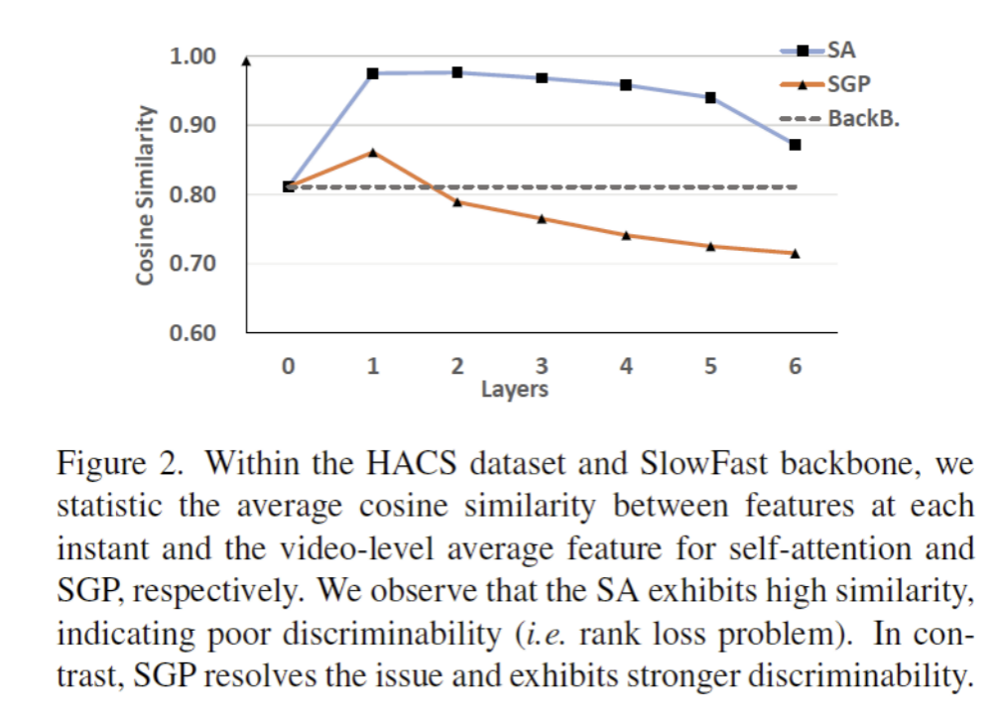
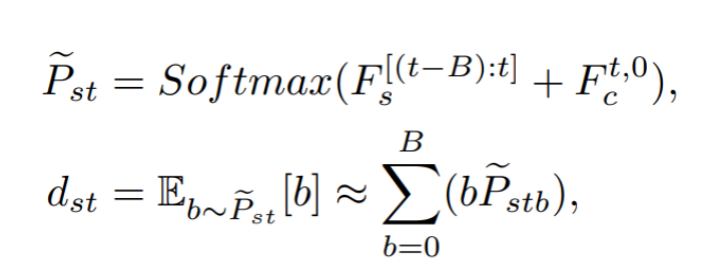
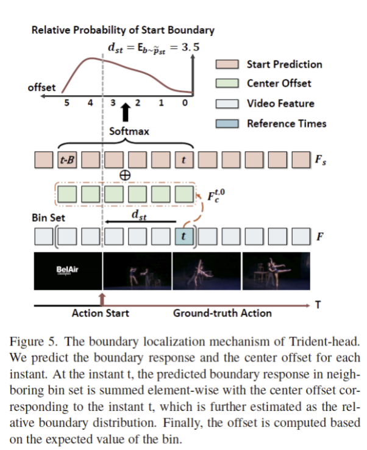
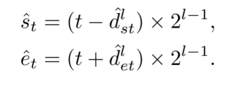

# TriDet: Temporal Action Detection with Relative Boundary Modeling

首先我们先简单介绍一下本文主要解决的两个问题：

第一个问题是，在时序动作检测（TAD）任务里，动作的边界很多时候是不明确的，我们曾尝试通过用Actionness（即每个时刻是否为动作的概率）来区分动作的边界。但我们发现，训练好的检测器对不同视频的Actionness预测存在较大差异，主要表现在两方面：1. 响应强度不一致，有些视频动作内部的Actionness明显高于背景位置，有些则只稍高一些。2. 除了动作内部有较高的Actionness外，有些视频还会在超出边界的时刻也有较高响应。因此，用单一阈值来划分动作边界并不灵活。一个比较直观的方法是利用不同时刻之间的相对关系来建模边界。这就是本文提出的Trident-head的Motivation。

第二个问题和Transformer相关，近年来，Transformer在TAD领域也有不少应用，包括我们之前发表在ECCV2022上的ReAct[5] 方法。但我们发现，单纯使用Transformer并不能显著提升检测性能，相反，Pipeline的设计往往更重要。比如去年中了ECCV2022的Actionformer[3] （感谢他们solid的工作，也统一了不同数据集的Pipeline！），采用了LongFormer[4] 的local self-attention来构建网络。我们实验发现，即使去掉了它的self-attention，性能也不会下降太多。所以是什么让原始self-attention版本的Transformer在TAD任务里哑火，这个问题引起了我们的好奇。刚好之前读到过谷歌大佬Yihe Dong的论文[1] ，里面推导了self-attention会使输入特征矩阵以双指数速度收敛到秩为1（丢帙问题）。换句话说，self-attention会让输入序列变得越来越相似，但是残差连接和MLP可以减缓这个问题。这个结论启发了我们：我们发现动作识别任务上pretrain过的backbone提取到的特征往往具有较高的相似性，在HACS数据集上跟踪原始self-attention的Transformer每层输出特征时，我们也观察到self-attention降低了每个时刻特征的可区分性，这对TAD任务来讲是非常不利的。

于是，我们分析了self-attention，发现问题是因为在输入特征集合非常相似的情况下，通过概率矩阵进行凸组合导致特征相似度增大（具体的推导烦请大家看补充材料啦！）。此外，self-attention还需要计算成对相似度矩阵，增加了计算负担。所以我们想要取其精华去其糟粕，用卷积代替self-attention来实现这一目标。这也是我们提出的SGP层的原因。

## **方法：**

我们论文的两个主要贡献，Trident-head和SGP层的设计思路就比较直观了。

**Trident-head：**

Trident-head是一种替换掉原始回归头的模块。给定一个视频序列，与之前只根据每个Instant特征回归该Instant到动作边界的距离的Anchor-free方法不同，我们的Trident-head结合了Instant特征和相邻B个Instant特征来回归边界。具体来讲，我们预测三个分支：开始边界分支、结束边界分支以及中间偏移量分支。开始边界分支、结束边界分支分别预测的是每个时刻作为开始边界和结束边界的响应强度，而中间偏移量分支的预测的是，以某个instant为参考时，其左右相邻的局部时间集合中每个时刻作为动作起点或者终点的响应强度。然后我们通过在局部窗口内计算期望值，得到每个 Instant 到边界的预测值。比如估计第 t个 instant 到动作起点的距离 dst ，就可以通过如下计算:

这里 FS 和 Fc 分别是开始边界分支和中间偏移量分支的预测强度。

值得一提的是，关于局部窗口的大小，因为FPN的存在，我们可以简单地对每一层都采用相同的窗口，再通过每层FPN的感受野大小将起点时刻和终点时刻重新解码：

**SGP：**

我们论文的另一个主要贡献是SGP层的设计。SGP层利用了depth-wise convolution[2]. 来降低运算量，同时实现了类似self-attention类instant特征之间的交互。为了抑制丢帙问题，我们在Instant-level分支中引入了视频平均特征，通过拉大每个时刻的特征和视频的平均特征的距离，从而增加时序特征的可区分性。而在Window-level分支中，我们采用了不同尺度的卷积来提取局部信息，并且增加了ψ分支，来让网络自适应的选择关注哪个尺度的特征。此外，我们还发现将第二个Layer Norm替换为Group Norm能进一步提升网络效果。SGP层的结构如下图所示。

> https://blog.csdn.net/weixin_46687145/article/details/138000431