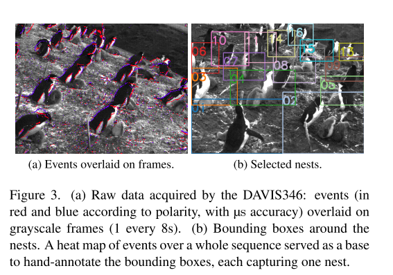
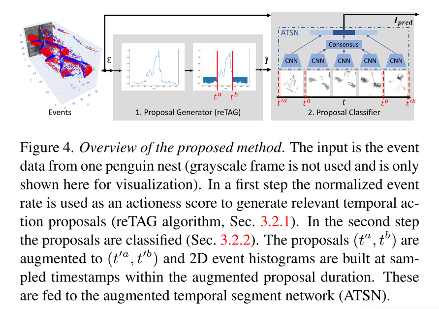

# Low-power, Continuous Remote Behavioral Localization with Event Cameras

**Abstract**：自然科学研究人员需要可靠的方法来量化动物的行为。最近，出现了许多计算机视觉方法来自动化这一过程。然而，由于恶劣的照明条件、电力供应和数据存储的限制，在偏远地区观察野生物种仍然是一项具有挑战性的任务。事件摄像机由于其低功耗和高动态范围能力，为依赖电池的远程监控提供了独特的优势。我们使用这种新型传感器来量化帽带企鹅的一种行为，这种行为被称为欣喜若狂的表现。我们将问题表述为一个临时动作检测任务，确定行为的开始和结束时间。为此，我们在南极洲对一群繁殖的企鹅进行了数周的记录，并在16个巢穴上标记了事件数据。所开发的方法由候选时间间隔(建议)生成器和其中的动作分类器组成。实验表明，事件相机对运动的自然响应对于连续的行为监测和检测是有效的，平均精度(mAP)达到58%(在良好的天气条件下增加到63%)。结果还证明了对具有挑战性的数据集中包含的各种照明条件的鲁棒性。事件相机的低功耗功能使它能够比传统相机记录更长的时间。这项工作开创了使用事件相机进行远程野生动物观察的先机，开辟了新的跨学科机会。https://tub-rip.github.io/eventpenguins/

## Introduction

野生动物行为的量化是许多学科的关键，从生态学[1]到保护学[1]和神经科学[3]。行为研究需要知道特定行为发生的时间、地点和持续时间，以便理解它，或者得出关于动物关系[4]、喂养习惯[5]、福利[6]或文化[7]的结论。计算机视觉的进步最近导致了各种系统(数据采集和处理)的发展，用于动物行为的自动量化[3,8,9]。这是一个具有挑战性的话题，因为:(i)野生动物监测系统预计将在不同的光照和天气条件(雪、雨、雾)下工作;(ii)在偏远地区对动物的长期观察限制了记录系统的电力使用和存储;(iii)从大量数据中提取生物学相关信息既困难又耗时，(iv)缺乏用于开发鲁棒的机器学习系统的具有真实值标签的精心策划的数据集。

本文研究了南极帽带企鹅(Pygoscelis antarctica)在一个月的繁殖季节中的狂喜表现(ED)。ED是一种独特的行为，筑巢的企鹅站直，头向上，来回拍打翅膀，发出响亮的叫声(见图和随附的视频)。这种行为背后的原因还没有得到很好的理解。因此，我们的目标是通过大规模的自动检测来更好地理解这种行为。我们将这个问题表述为一个临时动作检测(TAD)任务，它包括从原始数据流(通常是视频)中定位动作实例(例如，每个巢中的ED)。TAD是一项具有挑战性的计算机视觉任务，因为它需要估计动作的精确开始和结束时间。此外，ED的TAD具有挑战性，因为:(1)不同实例的ED长度差异很大，在我们的数据中大约在1到40秒之间;(2)鸟类表现出相似的拍打翅膀的行为，而不是ED;并且很难使用单个快照区分(见图)。只有连续的时间信息的可用性使我们能够可靠地区分ED与其他机翼襟翼的实例。

目前对野生动物行为的观察方法主要依赖于产生一系列运动触发图像的相机陷阱。对企鹅行为的长期观察(数周)是由每分钟获取一张图像的系统提供的。这种电池供电的系统受到能量限制，在昏暗的光线条件下需要用红外闪光灯照明，这就增加了能量限制。由于时间分辨率不足或覆盖观测时间太短，上述两种方法都不适合分析EDs等细尺度行为。

我们建议使用事件相机来量化像ED这样的行为。事件相机[10]是一种新型的生物传感器，它以固定的速率输出逐像素的强度变化，而不是帧。通过设计，它们提供了几个优点，如高速、高动态范围(HDR)、低功耗和数据效率[11]。野生动物行为监测是一个完美的场景事件相机和他们的自然属性突出运动。为此，我们使用了一台DAVIS346相机，在南极洲记录了一群帽带企鹅。注释的数据由24个序列组成，每个序列10分钟，观察16对企鹅在巢中繁殖。除了提供这种独特且难以获取的数据外，我们还介绍了一种方法，可以分两个阶段检测ED实例:生成行为开始和结束时间的候选对，并将对中的数据分类为ED或背景。

实验表明，事件数据在自然捕捉运动和鲁棒的具有挑战性的室外条件方面为ED量化提供了独特的信号。结果表明，在各种测试中都有可靠的性能，平均精度(mAP)为58%。在夜间和下雪时的性能比较，以及与灰度帧的定性比较，显示了对不同照明条件的鲁棒性。

我们的贡献总结如下:

**首次使用事件摄像机进行野生动物行为观察**。节能连续记录系统克服了以往基于帧的解决方案的局限性。

一种用于时间动作检测的方法，包括提出和分类两个阶段。这两个阶段都依赖于利用事件数据特征的高效算法(第3节)。

一个广泛的(长达数周的)事件相机数据集，记录了南极洲帽带企鹅在繁殖季节的聚居地(第4节)。24个序列，每个10分钟，在16个巢穴上注释了ED实例，构成了一个基准，以促进这一重要野生动物监测领域的研究(第5节)。

## Related Work

### 2.1.相关工作

事件摄像机事件摄像机是一项相对较新的技术。自从开创性的工作b[10]以来，由于其吸引人的特性，它们获得了越来越多的兴趣，这使得它们能够在具有挑战性的标准相机场景中表现良好，例如高速，高动态范围(HDR)和低功耗。它们已经在计算机视觉中的各种应用中得到了研究，如光流估计、深度估计和SLAM。请看b[11]最近的调查。

在模式识别的背景下研究的问题主要是目标分类(如识别)[13-16]和检测[17,18]。由于这种成像技术的新颖性，使用事件相机进行模式识别任务的努力受到数据集可用性的限制。

为此，[13]使用了一个泛倾斜相机平台，将传统的基于帧的数据集转换为事件数据集。其他的则为手势识别[14]或手语识别[15]提供数据。更大的数据集可用于汽车目标分类和检测任务[17-19]。尽管最近研究界努力为各种模式识别任务提供数据集，但仍然缺乏涉及各种环境条件的许多应用的数据集以及超过几秒钟的数据流。

### 2.2. 利用计算机视觉观察野生动物

目前，野生动物监测的自动数据采集主要依赖于通过使用相机陷阱和无人机记录彩色(即RGB)图像。然后，数据被手工注释[20]，通常由各种计算机程序辅助。直到最近，计算机视觉才进入[8]领域，应用于计数[9,21]、物种分类[22-25]、检测[26,27]、个体识别[28-30]和跟踪[9,26]。在所有这些问题中，只有[21]使用计算机视觉来计算企鹅，这是一项在单个静态图像上执行的任务，比我们的行为监控问题简单。目前其他自动行为监测的方法包括安装和检索三轴加速度计来学习行为分类[31,32]。这种侵入性的、非视觉的方法也可以监测海洋中的行为，但它会带来更大的努力、成本和对动物的干扰，因为要在相同的时间内监测相同数量的个体。

### 2.3. 时间动作检测

**时间动作检测(TAD)的目标是确定未修剪视频中每个动作实例的标签和时间间隔**。对于常规RGB数据，已经进行了广泛的研究。以前的方法大致可以分为自底向上和自顶向下两种方法。**自下而上的方法首先进行帧级分类，然后将结果合并到检测中[33,34]**。**自顶向下的方法可以有一个[35,36]或多个阶段[37]，通常遵循一个方案，其中提案被生成并馈送到分类器[38-40]**。最近，端到端学习方法被引入[41-43]。传统RGB数据的TAD是一项成熟的计算机视觉任务，在大规模数据集的辅助下，如[44,45]。

在动物观察的背景下，[46]在受控的室内环境中对猪的咬尾行为进行了时空动作识别。[47]的工作使用基于事件的TAD进行室内人体跌倒检测;该方法分为提出和分类两个阶段。对于提案，他们采用了[38]中引入的时间动作分组(temporal actioness grouping, TAG)算法，并以事件率作为动作评分。

**据我们所知，没有公开可用的数据集，用于使用事件相机的野生动物，这种场景比室内条件下的干扰更多。通过这项工作，我们展示了事件摄像机为详细的野生动物监测提供的可能性，并展示了事件数据如何通过高效的计算方法轻松确定TAD的兴趣间隔。**

## 3.从事件数据进行时间动作检测

本节将事件相机数据的时间动作检测(TAD)问题形式化(第3.1节)，并介绍我们开发的方法(第3.2节)。

### 3.1. 问题表述

设 $\mathcal{E} = \{e_i\}$ 为一个输入事件序列，表示企鹅巢中的事件。每个事件 $e_i = (x_i, y_i, t_i, p_i)$ 包含像素坐标 $(x_i, y_i)$、时间戳 $t_i$，以及亮度变化的极性 $p_i$（即亮度变化的符号）。假设像素坐标 $(x_i, y_i)$ 已经相对巢的位置范围进行了归一化（由巢的边界框坐标定义，见图3b）。

> 图3。(a) DAVIS346获取的原始数据:事件(根据极性显示为红色和蓝色，精度为µs)覆盖在灰度帧上(每8秒1次)。(b)巢周围的围框。整个序列上的事件热图作为手工注释边界框的基础，每个边界框捕获一个巢。

假设企鹅展示一种兴奋显示（ecstatic display, ED）的时间间隔为 $I = (t^a, t^b)$（也称为动作实例），其起始时间为 $t^a$，结束时间为 $t^b$。所有的真实动作实例集合 $I_{gt} = \{I_n\}_{n=1}^{N_{gt}}$ 是 $\mathcal{E}$ 的时间注释集合。

时间动作检测器的目标是生成预测集合 $I_{pred}$，以准确且完全地覆盖 $I_{gt}$。**检测器的输入是每个巢中的事件，且仅需检测时间边界，因为巢的空间边界已知。**此过程允许我们可靠地将每个ED检测分配到特定巢中，从而能够量化企鹅在巢中配对期间的行为。这一步是可行的，因为企鹅在繁殖时通常会待在自己的巢中。

### 3.2 方法

我们采用两步法（图4）。首先，根据动作性得分生成候选框（第3.2.1节）。然后，通过我们的增强时间段网络（Augmented Temporal Segment Network, ATSN）将这些候选框分类为ED（兴奋显示）或“背景”（第3.2.2节）。

#### 3.2.1 时间区域候选生成

事件相机的自然运动响应通常是连续的，这为生成相关候选框提供了高效的可能性。设事件序列 $\mathcal{E}$ 的事件速率为 $r(t)$（以事件/秒衡量）。在第一步中，动作性得分通过归一化事件速率计算，公式如下：

$
\tilde{r}(t) = \frac{r(t) - \min(r(t))}{\max(r(t)) - \min(r(t))}
$

这里我们使用了稳健的最小值和最大值，由第 $p$-百分位和第 $(100-p)$-百分位定义，并将 $r(t)$ 限制在这些值范围内。同时，未考虑事件的极性。

在第二步中，通过分水岭算法[48]对高事件速率间隔（即活动性）进行分割：将 $\tilde{r}(t)$ 视为一个“地形”，并通过水位阈值 $\lambda$ 对其进行“淹没”。超过阈值 $\tilde{r}(t) > \lambda$ 的区域被视为时间候选框。

第三步中，为避免时间候选框的短暂中断，对候选框进行合并处理。从初始候选框 $\tilde{I}_1 = (t_1^a, t_1^b)$ 开始，如果与后续候选框 $\tilde{I}_2 = (t_2^a, t_2^b)$ 的持续时间之和与合并后时间段的总持续时间比值超过合并阈值 $\mu$，则将两者合并。

最后，步骤(ii)和(iii)针对所有阈值组合 $\lambda \in \{0.05, 0.1, \dots, 0.95\}$ 和 $\mu \in \{0.05, 0.1, \dots, 0.95\}$ 进行迭代操作。最终生成的时间候选框集合 $\tilde{I}$ 是从所有阈值组合中得到的候选框的联合结果。此外，为减少冗余，对候选框进一步应用非极大值抑制（NMS），其阈值设置为0.95。

上述方法被称为稳健事件速率标记（reTAG），是基于事件的时间活动性标记（TAG）算法[38]的扩展。主要改进包括：(i) 动作性得分基于高时间分辨率的稳健归一化事件速率；(ii) 搜索策略在候选框生成过程中引入了全局优化。阈值参数（$\lambda$、$\mu$ 和 NMS）可以灵活调整，以适应具体任务的需求。

> 图4。提出的方法概述。输入是来自一个企鹅巢的事件数据(这里没有使用灰度帧，只是为了可视化而显示)。第一步，将归一化事件率用作无动作评分，以生成相关的临时动作建议(reTAG算法，第3.2.1节)。第二步，对提案进行分类(第3.2.2节)。将提案(ta, tb)增强为(t’a, t’b)，并在增强的提案持续时间内的采样时间戳上构建2D事件直方图。这些被馈送到增强时间段网络(ATSN)。

#### 3.2.2 候选分类

**提案分类的挑战**：

- 提案长度可变，不同提案之间时间跨度可能差异较大。
- 事件数据是异步的，不是传统的连续帧序列。

**提案分类的方法**：

- **时间区间扩展（Temporal Augmentation）**：
  - 对每个提案区间进行扩展，包含：
    - **开始阶段**：`[t'_a, t_a]`，扩展至提案开始之前的时间段。
    - **结束阶段**：`[t_b, t'_b]`，扩展至提案结束之后的时间段。
  - 这样能为分类器提供更多上下文信息，帮助区分完整的动作与不完整的片段。
- **稀疏采样（Sparse Sampling）**：
  - 在每个扩展后的时间区间中，均匀采样固定数量的时间戳（例如中心区域采样 3 个时间戳，扩展区域分别采样 1 个）。
  - 对每个时间戳，利用一个滑动窗口将事件数据转化为张量表示（如直方图或时间图）。
- **基于 CNN 的分类器（ATSN）**：
  - 利用一个基于 ResNet 的时空卷积网络对提案进行特征提取。
  - 特征通过“中心区域共识（Consensus Function）”聚合后，进行全连接分类。
  - 分类器输出提案是否属于目标动作（如“ED”行为）或背景。

本步骤的输入为候选时间区间 $\hat{I}$ 及其包含的事件 $\mathcal{E}_{\hat{I}}$。对这些候选框进行分类时面临两个挑战：一是候选框长度的变化，二是事件数据的异步特性。为解决第一个挑战，我们借鉴了动作识别和定位中的常见方法[49]，对候选框进行稀疏的时间快照采样。针对第二个挑战，我们将事件数据转换为类似张量的表示形式，从而使得可以应用基于卷积神经网络（CNN）的学习方法。

[49]: ECCV 2016 Temporal segment networks: Towards good practices for deep action recognition

分类阶段的主要组成部分是一个模型，我们称之为增强时空网络(ATSN)。与[38]类似，它通过添加“开始”和“结束”阶段来处理暂时增强的候选。ATSN的输入是稀疏采样的类张量表示，输出是候选预测。

[38]: ICCV 2017 Temporal Action Detection With Structured Segment Networks

##### 数据增强（Augmentation）

形式化地说，对于一个候选框 $\hat{I} = (t^a, t^b)$，其持续时间为 $d = t^b - t^a$，我们定义两个额外的时间区间：开始阶段 $\hat{I}_{\text{start}} = (t^a, t^a + d/W)$ 和结束阶段 $\hat{I}_{\text{end}} = (t^b - d/W, t^b)$，其中 $W = 3$ 表示33%的增强宽度（参见图4）。候选框的增强对于向分类器提供候选框完整性的信息至关重要[38]：那些完全位于ED（兴奋显示）时间区间内部的短候选框，可以基于增强区间的信息被拒绝。每个增强候选框由三个连续的区间组成：$\{\hat{I}_{\text{start}}, \hat{I}, \hat{I}_{\text{end}}\}$。

##### 稀疏采样（Sparse Sampling）

对于每个增强候选框，我们分别从 $\hat{I}$ 和 $\hat{I}_{\text{start}}, \hat{I}_{\text{end}}$ 中均匀采样 $N_f = 3$ 个时间戳。这个步骤与候选框的实际持续时间无关，因此不同候选框之间时间戳的间隔可能有所不同。

##### 张量表示（Tensor-like Representation）

我们将事件数据转换为张量形式，以兼容CNN网络。在每个采样时间戳 $t_i$，使用一个窗口 $[t_i - \Delta t/2, t_i + \Delta t/2]$ 计算直方图[50]或事件图[51]，生成的快照被输入到ATSN（增强时间段网络）。

##### ATSN（增强时间段网络）

ATSN接收来自 $\hat{I}$、$\hat{I}_{\text{start}}$、和 $\hat{I}_{\text{end}}$ 的 $N_f + N_{\text{start}} + N_{\text{end}} = 5$ 个快照，并通过ResNet[52]骨干网络对这些快照进行编码，生成对应的特征向量（见图4）。$\hat{I}$ 中心区间的特征通过共识函数（例如均值）进行聚合，然后与 $\hat{I}_{\text{start}}$、$\hat{I}_{\text{end}}$ 的特征向量进行拼接，得到完整的特征表示。

最终生成的特征向量被输入到全连接分类器中进行分类。最后一步是基于时间上的非极大值抑制（NMS），其中时间上的交并比（tIoU）阈值设为0.6。
