# OpenTAL: Towards Open Set Temporal Action Localization

# ABS

Temporal Action Localization (TAL)在监督学习范式下取得了显著的成功。然而，现有的TAL方法都植根于封闭集假设，不能处理开放世界场景中不可避免的未知动作。本文首次针对Open-set TAL(OSTAL)问题，提出了一种基于证据深度学习(EDL)的通用框架OpenTAL。具体来说，OpenTAL由不确定性感知动作分类、动作预测和时间位置回归组成。该方法主要通过从重要样本中收集分类证据来学习分类不确定性。为了将未知动作从背景视频帧中区分出来，通过正向无标记学习来学习动作。通过利用来自时间定位质量的指导来进一步校准分类不确定性。在THUMOS14和ActivityNet1.3基准测试程序上的实验结果表明了该方法的有效性。

# 1. Introduction

TAL在近几年关注的都是封闭集的任务，并没有针对开集进行相关的解释。对于OSTAL任务，他不仅需要时序上的定位动作区间，同时还需要拒绝来自其他未知类别的动作。但不变的是不管开集闭集都需要正确分辨背景。

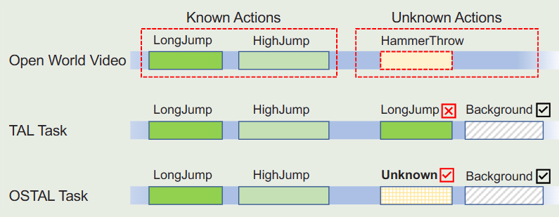

OSTAL的任务相比单纯的TAL或者OSR任务都要困难，原因有两点：由于背景帧和未知前景动作的混合，使得对已知动作的识别和定位变得更加困难，传统的TAL任务一般是把错误的类别和背景信息混合起来进行赋值；与OSR问题不同的是，拒绝未知动作的条件是能够正确的对前景动作进行定位，因此定位质量对最终结果至关重要。

为了应对这些挑战，我们提出了一个通用框架OpenTAL，它将整个OSTAL目标分解为三个相互关联的组件：不确定性感知动作分类、动作预测和时间位置回归。本质上，通过动作性预测将前景动作与背景区分开来，并通过时间定位来定位前景动作，同时通过分类模块学习到的证据不确定性来区分已知和未知的前景动作。整个框架中的创新设计包含三个部分：首先，动作分类是为了识别已知动作，并通过最近证据深度学习(EDL)来量化分类不确定性[1，4，53，72]。为了使该模块能够从重要样本中学习，我们利用EDL梯度的大小和证据特征，提出了一种重要性平衡的EDL方法。第二，动作性预测是区分前景动作(积极的)和背景帧(消极的)。在开集设置中，由于未知前景动作(未标记的)和背景帧的混合，从已标记的已知动作和混合固有地归结为positive-unlabeled(PU)学习问题[5]。我们提出一种PU学习方法，从前景背景的混合中选择最负面的样本作为真负样本。第三，训练时间定位模块，不仅定位已知动作，而且校准分类不确定性。提出了一种基于时间交集的不确定度校正方法(IoUC)，利用时间交集联合(IOU)作为定位质量对不确定度进行校正。

基于现有的TAL数据集THUMOS14[27]和ActivityNet1.3[8]，我们建立了一个新的基准来评估基线，并提出了用于Ostal任务的OpenTAL方法，其中引入了Open Set检测率来综合评估Ostal任务的性能。实验结果表明，该方法具有明显的优越性，在这一方向上还有很大的改进空间。我们的主要贡献有三个方面：

-据我们所知，这项工作是开放集合时间动作局部化(OSTAL)的第一次尝试，它在开放世界环境中基本上更具挑战性，但具有很高的价值。

-与现有的TAL和OSR问题相比，我们提出了一个通用的OpenTAL框架来解决OSTAL的独特挑战。可以灵活地为开放场景启用现有的TAL模型。

-基于OpenTAL框架，提出的重要性平衡的EDL、PU学习和IoUC方法对于Ostal任务是有效的。

# 3.Proposed Method

给定一个未裁剪的视频，OSTAL任务需要一个模型来定位具有时间位置li=(si，ei)的所有动作，分配具有标签yi∈{0，1，.。。，K}，其中yi=0表示由背景帧组成的动作，并且拒绝来自新类的动作作为未知数。在训练中，模型只能访问视频数据和已知动作的标注，而不能给出未知动作的标注。该设置不同于未给出未知类别的注释和数据的OSR问题，因为在TAL任务中丢弃未知动作的视频片段是不切实际的。3

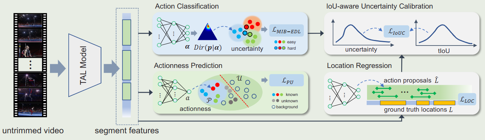

根据Fig2显示的整体流程。对一个未经裁剪的视频，动作proposal是通过现有的TAL方法来提取的。但为了能够挖不出各部分ISTAL的方法，整体的结构还是遵循一个三叉结构。三个子任务分别为动作分类、动作预测、位置定位。三个分支通过多任务损失函数进行学习。

现有的TAL模型往往把背景作为第K+1类完成分类任务，但在开集中不能这样来处理，因为一个能够分类Unknown的分类器依赖于对位置动作的时间边界进行标注。虽然通过提供未知的时间注释能够放松OSTAL的问题，但是对于未知的模糊语义信息，学习（K+1）类的分类器非常重要，而且这个方法对于开放世界的问题没有实际意义，因为位置行为的先验知识几乎没有。另一方面，TAL能够从训练数据中删除未知类或者背景类，但同样对OSTAL问题不适用。因为(i)我们没有未知动作的时间注释来删除它们，(ii)纯背景帧为动作本地化提供了不可或缺的时间上下文。因此，与OSR问题相比，OSTAL的一个独特的技术挑战在于区分已知类和未知类的动作以及背景帧。

此外，由于未知动作与没有标注的背景帧混合在一起，学习区分前景动作本质上减少为半监督的OSR问题[50,67]，即在使用包含“未知未知”动作的数据进行测试时，使用有标记的“known-known”动作和未标记的“known-unknown”动作来训练模型。

为了解决这些独特的挑战，我们将(K + 1)类的动作分类分离为K类不确定性感知分类(第3.1节)和动作预测(第3.2节)。因此，我们可以通过联合利用两级决策中的不确定性和动作标注来解决上面的第一个挑战(见表1)，通过PU学习来解决第二个挑战(第3.2节)

## 3.1. Action Classification

K-way Uncertainty-aware Classification

根据现有的证据深度学习（EDL）[4，53]，它可以有效地量化分类的不确定性，我们假设分类概率p∈RK上的狄利克雷分布Dir（p|α），其中α∈RK是狄利克雷强度。EDL旨在通过深度神经网络（DNN）直接预测α。通过最小化数据{xi，yi}的以下负对数似然来训练模型：

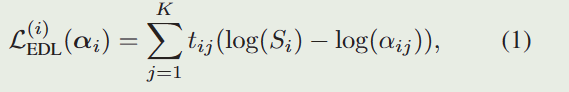

其中t_ij是从标签y提取的一个二元one-hot向量，当y=j的时候t=1。S是\alpha强度的总和。在测试中，给定样本x，动作分支DNN产生非负的证据输出。再通过证据理论和主观逻辑（evidence theory [54] and subjective logic），计算出分类概率的期望。

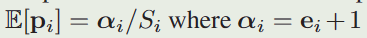

分类的不确定度和OSR中保持一致。

然而，根据经验，上述EDL方法在OSTAL任务中无效，因为等式（1）对每个样本都给予了同等的考虑，而OSTAL中的情况实际上并非如此。在本文中，我们建议通过鼓励模型以有原则的方式更多地关注重要样本来提高EDL的泛化能力。

Momentum Importance-Balanced EDL

受不平衡视觉分类[32，46]最新进展的启发，样本重要性可以通过由梯度范数确定的影响函数来测量。具体的，假设h是最后一个DNN层的特征输入，我们应用指数证据函数（exponential evidence function）来预测证据：

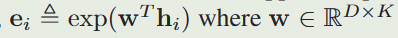

其中w是DNN层中的可学习权重参数。

因此EDL loss的梯度计算如下：

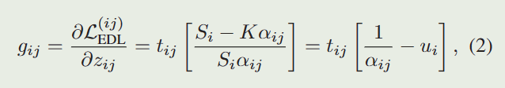

其中我们使用链式规则来化简，u可以通过K/S来表示。由于j和标签y不相同的时候t=0，所以能够看到一个很有意义的简单梯度表示：

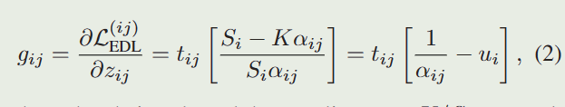

其中k=y。在如下的梯度计算方法下，网络参数的计算也可以进一步明确。

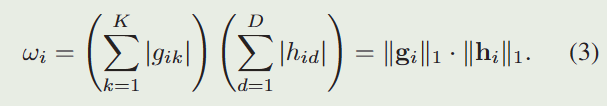

我们将样品xi的损失权重定义为‖g_i‖_1相邻区域内影响值的移动平均值：

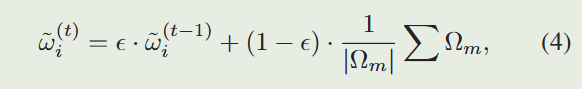

其中：

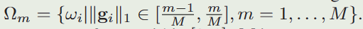

最终结合上面所有内容，Momentum Importance-Balanced EDL loss计算为：

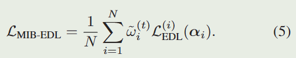

随着训练迭代的增加，所提出的MIB-EDL损失鼓励模型平稳地关注重要样本。在实践中，为了稳定训练，在T0次训练迭代之后应用重新加权。与[46]不同的是，[46]使用ωi的倒数来对有影响的样本进行加权以进行平衡闭集识别，我们使用等式。（3）对这些样本进行加权，以进行开集识别，以及（4）实现样本权重的平滑更新。

## 3.2. Actionness Prediction

由于未知动作和纯背景帧的混合，通过K个已知类别的证据不确定性来区分它们是不够的。因此，预测一个样本作为前台操作的可能性是至关重要的。我们注意到，来自已知类的数据是正数据，而来自“背景”混合物的样本是未标记的。这本质上归结为一个半监督学习问题，称为positive-unlabeled（PU）学习[5]。在本文中，我们提出了一种简单而有效的PU学习方法来预测行动性。

假设a是样本x中的动作得分，在一个batch中的所有a能够被分为正样本集合和未标注的背景集合：

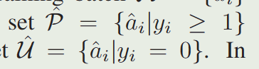

在本文的实现中，将所有a递增排序，并采取前M个样本来构成最有可能的负样本集：

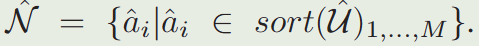

然后用二进制的交叉熵应用到P和N上：

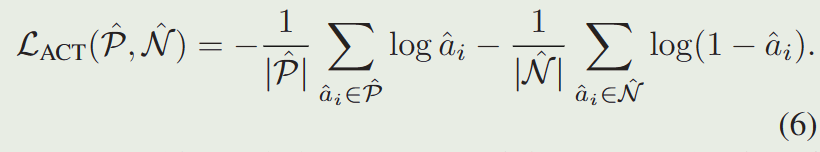

在此，为了平衡BCE的计算，需要限制一下负样本的总数，即M的大小。M被设定为P和U中更小的那一个。这种BCE的损失将使可能是简单背景的样本远离作为正样本的行动。尽管这种方法很简单，但在OSTAL设置中，学习到的动作性得分足以区分前景动作和背景帧。

## 3.3. Location Regression

为了保持我们的方法在现有TAL模型上的灵活性，时间位置回归遵循TAL模型的设计。以最先进的TAL模型AFSD[36]为例，它由预测位置建议的粗略阶段和预测相对于位置建议的时间偏移的精细阶段组成。粗略阶段通过时间上的并集交集（tIoU）损失来学习，而精细阶段通过L1损失来学习：

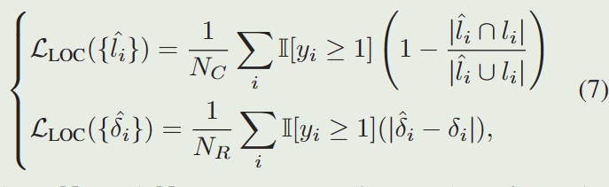

其中Nc和Nr是通过IoU阈值和ground truth动作定位给匹配的相应数量的样本。指标函数I[yi≥1]过滤掉不匹配的样本，这些样本被视为“背景”数据。在测试中，预测的定位信息通过

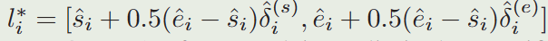

来计算。这个框架也可以迁移到其他的TAL方法中去。

## 3.4. IoU-aware Uncertainty Calibration

尽管方程（5）（6）（7）定义的损失函数对于完整的OSTAL任务是足够的，但分类模块中的学习不确定性并没有通过定位的准确性来校准。直观地说，与GT位置高度时间重叠的行动proposal应该包含更多的证据，从而降低不确定性。为此，我们提出了一种新的IoU感知不确定性校准方法：

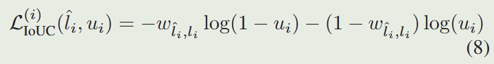

其中权重w是预测位置和地面实况位置之间的时间IoU：

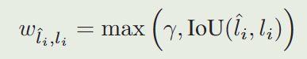

其中γ是一个小的非负常数。两个公式中的交叉熵形式的计算能够促使模型产生更高不确定性、对于动作定位版主不大的proposal。而使用max来进行分段的原因是：在已知动作的GT下，背景和位置动作的proposal都没办法和gt重叠，使得IoU<0，裁剪可以避免将损失值从正变为负值。此外通过一个较小的非负常数γ来鼓励更高不确定性的u是很合理的。

## 3.5. Training and Inference

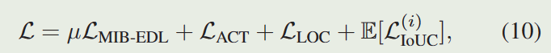

μ是超参，E是计算平均值。在inference的过程中，未修建的视频输入被输入到TAL模型中，并且OpenTAl能够产生多个动作定位、分类标签、分类不确定性和动作得分。由此可以根据不同的动作得分来分类是否属于已知动作类别。

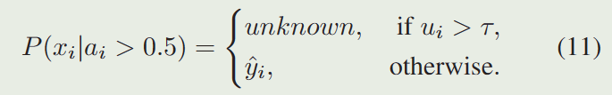

完整的推理如算法所示。除了这个两级的决策方式，一层的决策也是很合理的（消融实验证明了这一点）。但等式（11）在实践中表现出了最好的性能。

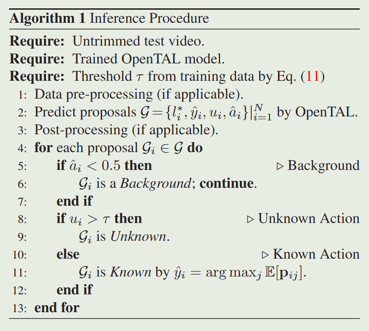