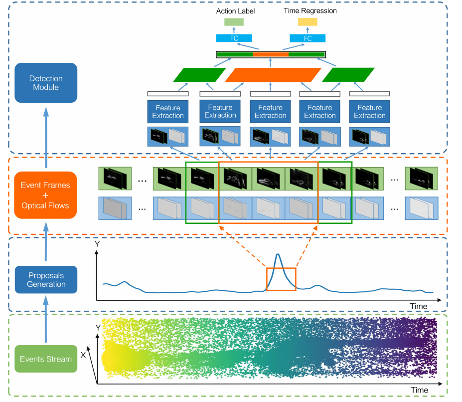

> 2022 ECCV ActionFormer: Localizing Moments of Actions with Transformers: https://zhuanlan.zhihu.com/p/7360467554

## 相关工作

以前的方法大致可以分为自底向上和自顶向下两种方法。**自下而上的方法首先进行帧级分类，然后将结果合并到检测中[33,34]**。**自顶向下的方法可以有一个[35,36]或多个阶段[37]，通常遵循一个方案，其中提案被生成并馈送到分类器[38-40]**。最近，端到端学习方法被引入[41-43]。

### **两阶段TAL方法**

在传统的两阶段TAL方法中，整个过程可以分为两个主要步骤：

1. **动作提议生成**：这一步骤生成视频中的候选时间段（或称为提议），即可能包含动作的时间段。这些提议可以通过不同的技术生成。
2. **提议分类和边界精调**：在生成提议后，模型会对每个提议进行分类，判断该时间段的具体动作类别，并进一步调整其边界，使动作识别更加精确。

这种方法的核心挑战在于生成高质量的提议。如果提议的质量较差，后续的动作分类和边界调整也会受到影响。

意思就是先生成不同的时间段，之后再来分类这些时间段里面的动作。

### 单阶段TAL方法

单阶段TAL（Temporal Action Localization）方法的核心目标是在一次前向传播中定位视频中的动作，而无需像传统的两阶段方法那样先生成候选时间段或提议。这种方法可以简化模型结构，减少计算开销，并提高推理效率。

在**单阶段TAL**中，**动作定位和分类**通常会在同一阶段完成，区别于传统的两阶段方法（先生成提议，再分类和精调）。这些方法可以基于锚点（anchor-based）或无锚点（anchor-free）设计。（**瞄点可以理解成一个时间段的视频帧）**

- **基于锚点的方法**：使用类似滑动窗口的策略，生成固定大小的锚窗口，并为每个窗口分配动作类别和边界回归值。
- **无锚点方法**：直接对每一时刻进行分类并回归边界，无需预定义的锚点或提议，通常会简化模型并提升其灵活性。

### **时空动作定位**

时空动作定位不仅仅定位动作在视频中的**时间段**（即何时发生），还需要进一步确定动作发生的**空间位置**（即动作发生的区域）。这种任务通常涉及到：

- **时间维度**：动作的起始时间和结束时间（即TAL中的时间边界回归）。
- **空间维度**：动作的空间位置，通过**边界框（bounding box）**来表示。这意味着不仅要标定动作发生的时段，还需要框定出视频中动作发生的具体区域。

ActionFormer的工作关注于**TAL任务**，而不是时空动作定位（即同时定位动作的时间和空间）。

## 基础理解

### 时间动作定位 (Temporal Action Localization, TAL)

给定一个输入视频 $X$，假设 $X$ 可以表示为一组特征向量集合：

$$ X = \{x_1, x_2, \dots, x_T\} $$

这里，特征向量定义在离散的时间步 $t \in \{1, 2, \dots, T\}$ 上，而总的时间长度 $T$ 随不同视频而变化。例如，$x_t$ 可以是从 3D 卷积网络中提取的视频片段在时间点 $t$ 的特征向量。时间动作定位 (TAL) 的目标是基于输入的视频序列 $X$ 预测动作标签集合：

$$ Y = \{y_1, y_2, \dots, y_N\} $$

---

### 动作标签定义

- **$Y$ 包含 $N$ 个动作实例 $y_i$**，且 $N$ 随视频而变化。
- 每个动作实例 $y_i = (s_i, e_i, a_i)$ 包括：
  - **起始时间**：$s_i$ (onset)
  - **结束时间**：$e_i$ (offset)
  - **动作类别标签**：$a_i$

---

### 约束条件

- $s_i \in [1, T], e_i \in [1, T]$  
  （时间范围限制在视频长度内）
- $a_i \in \{1, \dots, C\}$  
  （$C$ 是预定义的类别集合）
- $s_i < e_i$  
  （确保起始时间早于结束时间）

---

### 时间动作定位的简单表示方法

我们的方法基于一种无需锚点的动作定位表示形式，灵感来源于 [77,35]。核心思想是将每一时间步 $t$ 分类为某个动作类别或背景，同时回归当前时间步与动作的**起始时间**（onset）和**结束时间**（offset）的距离。这样，我们将复杂的**结构化输出预测问题**：

$$
X = \{x_1, x_2, \dots, x_T\} \rightarrow Y = \{y_1, y_2, \dots, y_N\}
$$

转化为一个更易处理的**序列标注问题**：

$$
X = \{x_1, x_2, \dots, x_T\} \rightarrow \hat{Y} = \{\hat{y}_1, \hat{y}_2, \dots, \hat{y}_T\}
$$

在时间步 $t$ 的输出 $\hat{y}_t = (p(a_t), d_t^s, d_t^e)$ 定义为：

1. **$p(a_t)$**：
   - 包含 $C$ 个值，每个值表示动作类别 $a_t \in \{1, 2, \dots, C\}$ 的二分类概率，即当前时刻属于该动作类别的概率。这可以看作是 $C$ 个独立的二分类任务输出。

2. **$d_t^s > 0, d_t^e > 0$**：
   - 分别表示当前时间步 $t$ 到动作的**起始时间**和**结束时间**的距离。如果时间步 $t$ 属于背景，这两个值没有定义。

---

### 方法步骤

直观地，这种方法将视频 $X$ 中的每一时间 $t$ 视为一个**动作候选项**，并预测该时刻的动作类别 $a_t$，以及该时刻与动作边界的距离 $d_t^s$ 和 $d_t^e$（如果存在动作）。从输出中直接解码出动作定位结果：

$$
a_t = \arg\max p(a_t), \quad s_t = t - d_t^s, \quad e_t = t + d_t^e
$$

## 开山论文

2022 IEEE TRANSACTIONS ON CYBERNETICS: Neuromorphic Vision-Based Fall Localization in Event Streams With Temporal–Spatial Attention Weighted Network

图2. 我们提出的基于事件相机的跌倒动作检测框架概述。对于每个输入的事件流，我们首先使用我们的时间提案生成模块来产生高度相关的候选（橙色框）。之后，我们将每个候选提案向前和向后扩展（绿色框），以捕捉动作的开始、进行和结束。基于增强的候选时间提案，我们应用我们的特征提取骨干网络来提取时间-空间加权的提案特征。然后，引入提案分类器和时间边界回归器来对提案进行分类并细化提案的时间边界。

