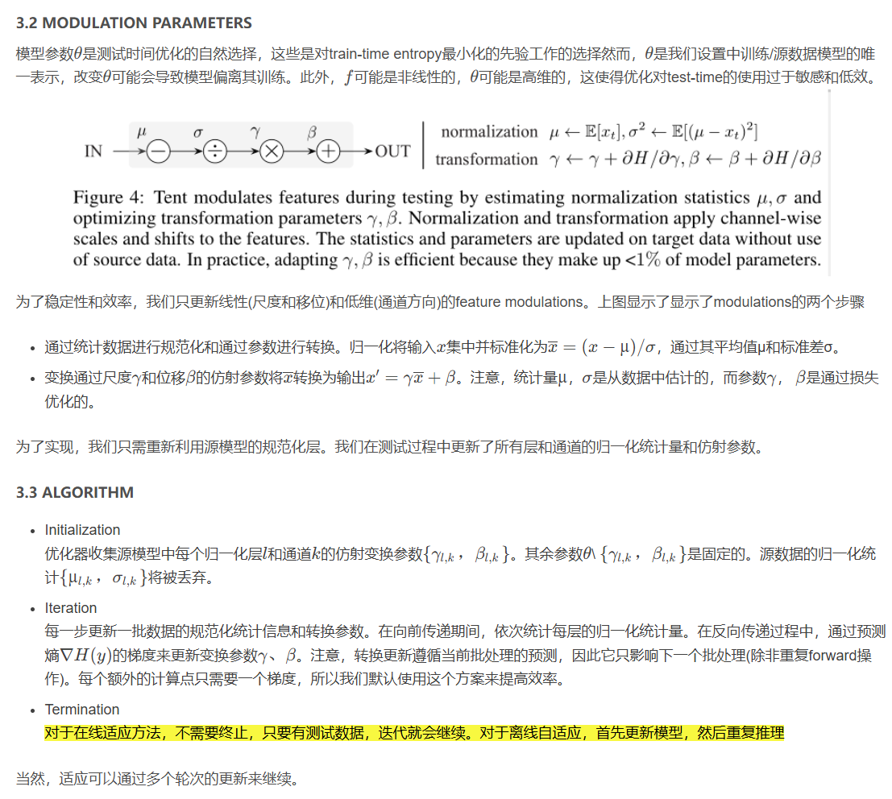

# TENT: FULLY TEST-TIME ADAPTATION BY ENTROPY MINIMIZATION

### 摘要

在测试期间，模型必须自我调整以适应新的和不同的数据。在这种完全自适应测试时间的设置中，模型只有测试数据和它自己的参数。我们建议通过test entropy minimization (tent[1])来适应:我们通过其预测的熵来优化模型的置信度。我们的方法估计归一化统计量，并优化通道仿射变换，以在线更新每个批次。Tent降低了ImageNet和CIFAR-10/100上图像分类的泛化误差，并在ImageNet- c上达到了新的最先进的误差。Tent处理从SVHN到MNIST/MNIST- m /USPS的数字识别的source-free domain 适应，从GTA到cityscape的语义分割，以及在VisDA-C基准上。这些结果是在不改变训练的情况下在测试时间优化的一个epoch中获得的。

### 3 论文方法的概述

#### 2 设置：完全测试时适应 (Fully Test-Time Adaptation)

适应性 (Adaptation) 旨在解决从源域到目标域的泛化问题。一个模型 $ f_\theta(x) $ 通过参数 $ \theta $ 在源数据和标签 $ x^s, y^s $ 上训练，但在具有偏移的目标数据 $ x^t $ 上测试时可能无法很好地泛化。**表 1** 总结了不同的适应性设置、所需数据以及训练和测试时的损失类型。我们的**完全测试时适应 (Fully Test-Time Adaptation)** 设置在推理过程中只需要模型 $ f_\theta $ 和未标注的目标数据 $ x^t $。

---

表 1：**适应性设置总结**

| 设置 (setting)                              | 源数据 (source data) | 目标数据 (target data) | 训练损失 (train loss)         | 测试损失 (test loss) |
| ------------------------------------------- | -------------------- | ---------------------- | ----------------------------- | -------------------- |
| 微调 (fine-tuning)                          | -                    | $ x^t, y^t $           | $ L(x^t, y^t) $               | -                    |
| 领域适应 (domain adaptation)                | $ x^s, y^s $         | $ x^t $                | $ L(x^s, y^s) + L(x^s, x^t) $ | -                    |
| 测试时训练 (test-time training)             | $ x^s, y^s $         | $ x^t $                | $ L(x^s, y^s) + L(x^s) $      | $ L(x^t) $           |
| 完全测试时适应 (fully test-time adaptation) | -                    | $ x^t $                | -                             | $ L(x^t) $           |

---

图解：**方法概述**

图 3 (a): **训练流程**

1. 输入源数据 $ x^s $。
2. 模型通过参数 $ \theta $ 计算预测值 $ \hat{y}^s = f(x^s; \theta) $。
3. 通过监督损失 $ \text{Loss}(\hat{y}^s, y^s) $ 进行训练，使模型适应源数据。

图 3 (b): **完全测试时适应**

1. 输入目标数据 $ x^t $。
2. 模型通过参数 $ \theta $ 和一个约束调制项 $ \Delta $ 计算预测值 $ \hat{y}^t = f(x^t; \theta + \Delta) $。
3. 通过最小化预测熵 $ \text{Entropy}(\hat{y}^t) $ 来优化模型，使其在目标数据上适应。

---

**翻译和解释**

1. **微调 (fine-tuning):**
   - 需要目标数据和标签 $ (x^t, y^t) $。
   - 使用目标数据上的监督损失 $ L(x^t, y^t) $ 进行训练。
   - **限制：** 需要目标标签。

2. **领域适应 (domain adaptation):**
   - 需要源数据 $ (x^s, y^s) $ 和目标数据 $ x^t $。
   - 使用跨域损失 $ L(x^s, y^s) + L(x^s, x^t) $。
   - **限制：** 源数据和目标数据必须同时可用。

3. **测试时训练 (test-time training, TTT):**
   - 在训练期间联合优化源数据的监督损失 $ L(x^s, y^s) $ 和自监督损失 $ L(x^s) $。
   - 在测试时使用目标数据上的无监督损失 $ L(x^t) $ 进行适应。
   - **限制：** 源数据在测试时不可用时难以应用。

4. **完全测试时适应 (fully test-time adaptation):**
   - 只使用目标数据 $ x^t $ 和模型 $ f_\theta $。
   - 通过最小化目标数据上的无监督损失 $ L(x^t) $ 或预测熵来调整模型。
   - **优势：** 不依赖源数据或训练阶段，减少了对数据和计算的需求。

