# [Zero-Shot Temporal Action Detection via Vision-Language Prompting](https://www.cnblogs.com/lhiker/articles/16551250.html)

# 摘要

　　现有的时序动作检测(temporal action detection, TAD)方法依赖于包含片段级标注的大量训练数据，在推断时只能识别之前看到的类别。为每个感兴趣的类收集和注释大型训练集是昂贵的，因此是不可伸缩的。Zero-shotTAD (ZS-TAD)解决了这一障碍，它使预训练模型能够识别未见过的动作类别。与此同时，ZS-TAD的挑战性也大大降低了。受CLIP等视觉语言(ViL)模型辅助zero-shot图像分类成功的启发，我们的目标是解决更复杂的TAD任务。一种直观的方法是将现成的提案检测器与CLIP样式分类集成在一起。但是由于顺序定位(如提案生成)和分类设计，容易导致定位错误传播。为了克服这一问题，本文提出了一种基于视觉语言提示(STALE)的zero-shot时序动作检测模型。这种新颖的设计打破了错误传播的路径，有效地消除了定位和分类之间的依赖关系。我们进一步引入了分类和定位之间的交互机制，以改进优化。在标准ZS-TAD视频基准测试上的广泛实验表明，我们的STALE明显优于最先进的类似工作。此外，我们的模型在有监督TAD方面的结果也优于近期的强大竞争对手。

# 1.介绍

　　近年来，大型预训练视觉语言(ViL)模型(如CLIP[35]和ALIGN[16])的引入，推动了通过提示将zero-shot迁移到不同下游任务的研究尝试。这条研究路线的核心是一种从自然语言中综合分类权重的有利能力，它可以描述几乎所有感兴趣的类别，以及一个强图像编码器训练的目标是在一个共同的特征空间对齐大量潜在的噪声图像-文本对。

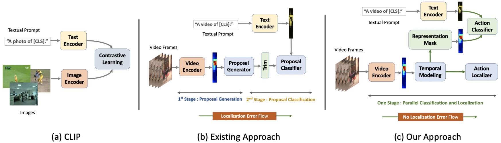

　　图1所示。(a)标准视觉语言模型CLIP[35]的说明。(b)现有的ZS-TAD方法[17]由于顺序定位(如提案生成)和分类设计，存在固有定位误差传播问题。(c)我们通过设计一个具有并行定位和分类架构的STALE模型来解决这个问题。

　　虽然现有的工作主要集中在图像识别任务[54,12]，但如何将这些ViL模型的知识用于自然视频理解任务(例如时序动作检测[20,47,4,28,26,27,29,46,46,47])仍然是一个很大的未解决问题。有几个挑战需要解决。首先，由于公众可访问的大型ViL模型通常使用大图像数据进行预训练，缺乏时序结构化信息，限制了模型的视频表示;其次，ViL模型更倾向于在公式中没有内置检测能力的任务分类类型。也就是说，它们的优化假定隐含训练数据中背景相对于前景内容是有限的。相比之下，自然视频通常有很大比例的背景，检测感兴趣的内容(如人类动作)是至关重要的[1]。克服这些障碍并非易事。在将ViL模型用于时序动作检测(TAD)方面，最近进行了[17]的尝试。具体而言，[17]提出了一个two-stage的视频模型:利用现成的预训练proposal检测器(如BMN[20])生成多个动作proposal，然后对proposal进行分类。该方法存在明显的局限性:(1)不能适应定位模块(即proposal检测)，该模型经过预训练并被完全冻住。(2)这样，定位与分类之间的兼容性受到限制，进而导致基于顺序定位和分类流程的定位误差传播问题。

　　在本文中，为了克服上述限制，提出了一种具有分类与定位并行性的one-stage zero-shot时序动作定位架构。这种平行头设计自然地消除了误差传播。重要的是，我们引入了一个基于表示掩码概念的可学习的定位模块-该概念是class-agnostic的，因此可推广到未见过的类。该模型可以端到端优化，与基于ViL模型的分类构件一起进行zero-shot迁移，从而解决构件兼容性问题。为了提高跨模态(从图像到视频)任务的适应性，我们进一步设计了一种带有自注意力机制的流间对齐正则化算法。我们将该方法命名为基于视觉语言提示的zero-shot时序动作检测模型(STALE)。

　　**贡献.**(1)我们研究了如何利用大量预训练的ViL模型进行未修剪视频中的zero-shot时序动作定位(ZS-TAD)的问题。(2)提出了一种新的one-stage分类定位模型STALE，该模型在并行分类和定位设计的同时引入了一个可学习的class-agnostic掩码组件，以实现zero-shot迁移到未见过的类。为了增强跨模态任务的自适应能力，在Transformer框架中引入了流间对齐正则化。(3)在标准ZS-TAD视频基准上的大量实验表明，我们的STALE优于最先进的替代方法，通常有很大的优势。此外，我们的模型也可以应用于全监督TAD设置，并取得比最近的监督竞争对手更优越的性能。

# 2.相关工作

　　**视觉语言模型** 在计算机视觉与自然语言处理领域的交互方面已经有了一系列的研究成果，如文本到图像检索[42]，图像标题[45]，视觉问题回答[2]等。在这些工作中，视觉语言(vision language, ViL)预训练在过去几年受到越来越多的注意力[19,23]。作为一个里程碑，Radford等人[35]设计了一个大规模的预训练ViL模型CLIP，该模型使用对比学习策略在4亿对图像文本上进行训练。它在30个分类数据集上显示出了令人印象深刻的zero-shot迁移能力。此后，研究者提出了许多后续研究，包括改进的训练策略(如CoOp[54]，CLIP- Adapter[12]，Tip-adapter[50])。在视频领域，类似的思想也被应用于可迁移表示学习[24]，基于文本的动作定位[32]等领域。CLIP最近也被用于动作识别(例如ActionCLIP[41])和TAD[17]。从概念上讲，所有这些方法都从分类的角度使用CLIP。通常应用two-stage流程，其中第一阶段需要裁剪前景，然后在第二阶段使用CLIP对齐前景。然而，这种策略往往会遇到错误传播问题，即第一阶段的错误会流入第二阶段，并可能被放大。为此，设计了一种具有并行分类和定位功能的one-stageZS-TAD结构。

　　**时序动作检测** 在TAD研究中取得了实质性进展。R-C3D[44]受到静态图像[37]中目标检测的启发，遵循提案生成和分类的设计，使用了锚框。采用类似的模型设计，TURN[11]聚合局部特征来表示片段级特征，用于时序边界回归和分类。SSN[52]将动作实例分解为3个阶段(起始，过程和结束)，采用结构化的时序金字塔池化方法生成建议。BSN[21]预测在每个时序定位的开始，结束和行动，并生成具有高开始和结束概率的提议。在BMN[20]中，通过额外生成一个边界匹配置信图来改进提议生成，进一步改进了动作性。GTAN[22]使用可学习的高斯核进行加权平均，改进了特征池化过程。G-TAD[47]通过图卷积网络学习语义和时序上下文，以更准确地生成提议。BSN++[39]通过一个互补的边界生成器进一步扩展了BMN，以捕获丰富的上下文。CSA[38]通过注意力迁移丰富了提案的时序上下文。最近，VSGN[51]利用跨尺度多层次金字塔结构改进了短动作定位。现有的TAD模型多采用两阶段顺序定位和分类体系结构。这将导致定位错误传播问题，特别是在低数据设置，如ZS-TAD。我们的STALE旨在通过设计一个单阶段模型来解决这一限制，从而消除定位和分类之间的依赖，并切断错误传播路径。

　　**zero-shot时序动作检测** zero-shot学习(Zero-shot learning, ZSL)旨在识别[43]训练过程中未见过的新类别。其思想是从先验信息中学习共享知识，然后将这些知识从见过的类迁移到未见过的类[30,34]。视觉属性(如颜色，形状和任何属性)是先验信息的典型形式。如Lampert等人[18]独立学习属性分类器来完成对未见过类的ZSL, Parikh等人[31]学习相对属性。尽管在ZSL上有很好的结果，但是基于属性的方法的可伸缩性很差，因为属性需要手工定义。seen和unseen概念的语义嵌入(另一种类型的先验信息)可以解决这个可伸缩性问题[48]。它们通常以无监督的方式学习，如Word2Vec[13]或GloVe[33]。Zhang等人[49]首先使用Word2Vec将zero-shot学习应用于TAD上。最近，EffPrompt[17]使用图像-文本预训练从CLIP[35]为ZS-TAD。**然而，由于采用two-stage设计，该方法除了无法学习动作定位模块外，还存在误差传播问题。我们通过引入一种新的one-stage ZS-TAD架构来解决所有这些限制。**

# 3.方法

　　我们的目标是有效地引导基于图像的ViL模型(CLIP[35])来处理密集视频下游任务，如未裁剪视频中的zero-shot时序动作检测(ZS-TAD)。这本质上是一个模型调整的过程，目的是利用大型语料库中丰富的语义知识。

## 3.1.准备:视觉-语言预训练

　　CLIP的关键功能是对齐视觉数据和语言数据的嵌入空间[35]。它由两个编码器组成，即一个图像编码器(例如:ResNet[14]或ViT[9])和文本编码器(如Transformer[40])。为了学习丰富的可迁移语义知识，CLIP在训练过程中利用了4亿对图像-文本对。为了利用CLIP的知识进行下游的分类任务，一种有效的方法是构造一组带有模板的文本提示，例如“a photo of [CLS]”，其中[CLS]可以被任何感兴趣的类名替换。给定一幅图像，然后可以使用CLIP计算该图像与嵌入空间中的文本提示之间的相似度得分，并以得分最高的类作为预测。最近的一些研究[54,12]表明，CLIP在每一类训练样本很少甚至为零的情况下也能获得较好的分类性能。我们提出了一个有趣的问题:CLIP令人印象深刻的能力是否可以迁移到更复杂的视觉任务，比如密集预测?

　　这种扩展的迁移在本质上可能不是微不足道的。首先，如何在密集预测任务中利用视觉语言预训练模型，尤其是zero-shot设置[36]，是一个很少被研究的问题。一种简单的方法是只使用CLIP的图像编码器。然而，我们认为预先训练的文本编码器的语言先验也非常重要，应该一起使用。其次，由于存在较大的任务差异，将CLIP知识转化为密集预测任务比分类任务更困难。预训练侧重于图像和文本的全局表示学习，这与下游任务所需的局部像素级输出不兼容。最近，RegionCLIP[53]采用了两阶段的设计来解决这个问题，包括class-agnostic的掩码，可泛化到未见过的类，然后是CLIP style分类。EffPrompt[17]类似地处理密集视频理解任务TAD。尽管如此，这种方法仍然面临着定位错误传播挑战。

## 3.2.语言引导的时序动作检测

　　为了解决上述问题，我们提出了一个语言指导的无提案框架。它可以更好地利用预先训练的CLIP模型的语言先验。在下面的部分中，我们首先描述问题场景和符号，然后介绍通过快速学习进行模型调整的思想。然后，我们讨论了在one-stage设计中掩码如何帮助保持zero-shot迁移特性。最后，我们讨论了边界的细化。

我们假设数据集 $ D $ 具有训练集 $ D_{\text{train}} = \{V_i, \psi_i\}_{i=1}^N $ 和验证集 $ D_{\text{val}} $。每个未修剪的训练视频 $ V_i $ 被标记为时序分段 $ \Psi_i = \{(\Psi_j, \xi_j, y_j)\}_{j=1}^{M_j} $，其中 $ \Psi_j / \xi_j $ 表示开始/结束时序，$ y_j $ 是动作类别，$ M_j $ 是动作实例数。$ y_j $ 分别指的是文本格式的训练集($ D_{\text{train}} $)动作标签之一，用于识别，例如，$ y_j $ 替换“一张[CLS]的照片”句子中的[CLS]标记。我们同时考虑封闭集和开放集两种情况。在封闭场景中，训练和评估的动作类别是相同的，即：$ D_{\text{train}} = D_{\text{val}} $。而在开放式情况下，训练和评估的动作类别是不一致的，即 $ D_{\text{train}} \cap D_{\text{val}} = \varphi $。

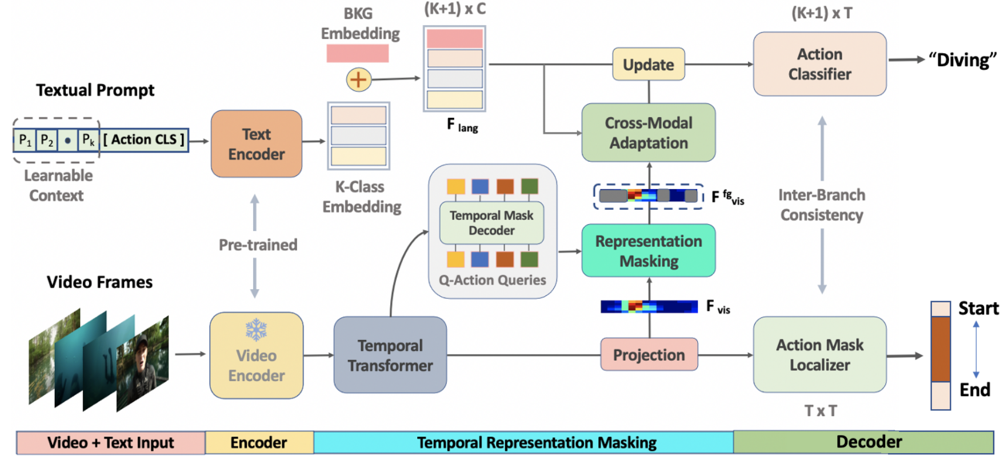

　　**图2所示。**基于视觉语言提示的zero-shot时序动作检测(STALE)方法概述。给定一个未裁剪的视频V。 (a)首先通过预训练的冻结视频编码器提取一组T个片段特征序列，并使用时序嵌入执行自注意力学习得到具有全局上下文的片段嵌入E。(b)对于每个片段嵌入，我们然后通过掩码前景特征并与文本编码器嵌入对齐来预测分类流的分类分数P，以获得分类器输出P，片段嵌入的另一个分支被动作掩码分类器并行使用，得到前景掩码M。 (c)两者进一步用于特征层面的一致性细化。

　　**视觉语言嵌入** 给定一个可变长度的未修剪视频V，按照标准实践[47,20]，我们首先在整个长度上采样一个非常大的T等距分布的时序片段(点)。

　　视觉嵌入：为了从视频片段中提取特征，我们使用一个冻结的预训练视频编码器（如I3D[6]，CLIP[35]）在片段级提取RGB $ X_r \in \mathbb{R}^{d \times T} $ 和光流特征 $ X_o \in \mathbb{R}^{d \times T} $，其中 $ d $ 表示特征维度。然后将它们连接为 $ E = [X_r; X_o] \in \mathbb{R}^{2d \times T} $。每个片段是一个连续帧的短序列（例如在我们的例子中是16）。虽然 $ F $ 包含局部时空信息，但它缺乏对TAD至关重要的全局上下文。因此，我们利用自注意力机制[40]来学习全局上下文。形式上，我们将多头注意力编码器 $ T() $ 的输入（查询，键，值）设置为特征 $ (F, F, F) $（图2）。位置编码不适用，因为它被发现是有害的（见补充材料）。然后得到最终的视频片段嵌入为：

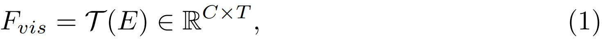

　　C为嵌入维度。

​	对于文本嵌入，我们使用一个标准的CLIP预训练Transformer[35]，具有可学习的提示（prompt），类似于[54]，而不是CLIP[35]中使用的手工制作的提示。通过使其可学习，文本上下文现在可以通过直接使用反向传播优化上下文，在下游分类任务中实现更好的可转移性。文本编码器的输入形式为：

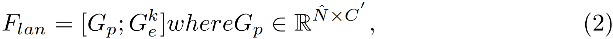

其中，$ G_{p} $ 是可学习的文本上下文，$\hat{N}$ 是上下文的长度。嵌入 $ G_{e}^{k} \in \mathbb{R}^{C^{\prime}} $ 表示来自CLIP词汇表的第k个类别名称的文本嵌入。背景类别的文本嵌入不是直接从CLIP词汇表中获得的，但在TAD中是必要的。为了解决这个问题，我们学习了一个特定的背景嵌入，记为 $ G_{e}^{bg} \in \mathbb{R}^{C^{\prime}} $。我们将其附加到动作类别嵌入 $ G_{e}^{k} $ 上，使得 $ F_{\text{lan}} $ 成为具有 $ K+1 $ 个类别的嵌入。背景嵌入 $ G_{e}^{bg} $ 是随机初始化的。

　　**class-agnostic表示掩码** 我们引入了一个新的class-agnostic表示掩码概念，旨在使视觉语言（ViL）模型能够用于零样本动作检测（ZS-TAD）。这种方法在概念上受到了掩码变换器（mask-transformer）的启发，但关注的是一个完全不同的问题：在没有ViL模型辅助的情况下进行图像分割。

具体来说，给定每个视频的片段嵌入 $ F_{\text{vis}} $ 和在这项工作中特别引入的 $ N_{z} $ 个掩码查询，研究者利用一个变换器解码器（transformer decoder）来生成 $ N_{z} $ 个潜在嵌入。然后，每个潜在嵌入通过一个掩码投影层，以获得每个片段的掩码嵌入 $ B_{q} \in \mathbb{R}^{q \times C} $，其中 $ q $ 索引一个查询。然后，可以计算每个查询的二进制掩码预测：

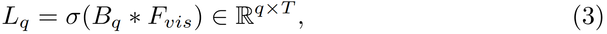

　　其中 $ \sigma $ 是sigmoid激活函数。这样，每个片段位置就与 $ q $ 个查询相关联。为了选择每个位置的最优查询，研究者部署了一个小型多层感知器（MLP）来以位置特定的方式权衡这些查询。这是通过学习一个权重向量 $ W_{q} \in \mathbb{R}^{1 \times q} $ 来实现的：

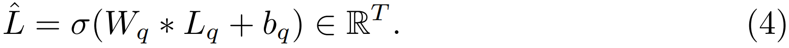

​	然后，研究者在这个掩码上应用一个阈值 $ \theta_{\text{bin}} $ 进行二值化，并选择前景掩码，记为 $ \hat{L}_{\text{bin}} $。为了获得前景特征 $ F_{\text{vis}}^{fg} $，研究者使用 $ \hat{L}_{\text{bin}} $ 来检索片段嵌入 $ F_{\text{vis}} $。鉴于这个前景特征掩码 $ \hat{L}_{\text{bin}} $ 的二进制特性，表示掩码可以首先在已见动作类别上进行优化，然后进一步推广到未见动作类别。

　　**视觉-语言跨模态自适应** 直观地说，整合视觉上下文的描述可以丰富文本表示。比如说，“一个男人在大公园踢足球的视频”比“一个男人在踢足球的视频”具有更丰富的文本表示，这促使我们研究如何使用视觉上下文来细化文本特征。具体来说，我们利用上下文级的视觉特征来指导文本特征来自适应地探索视频中的信息区域。为了实现交叉注意力，采用了transformer[40]的标准体系结构。具体而言，交叉注意力模块由自注意层，co-attention层和前馈网络组成，如下:

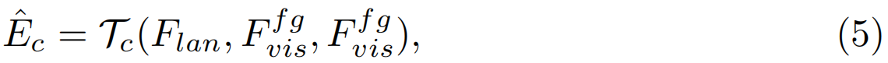

　　其中 $ \mathcal{T}_c $ 是一个变换器层，它将 $ F_{\text{lan}} $ 作为查询（query），将 $ F_{\text{vis}}^{fg} $ 作为键（key）和值（value）。这个模块鼓励文本特征在前景片段中找到最相关的视觉线索。然后，通过残差连接（residual connection）更新文本特征：

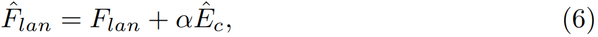

　　其中 $ \alpha \in \mathbb{R}^C $ 是一个可学习的参数，用于控制残差缩放。$ \alpha $ 被初始化为非常小的值（例如 $ 10^{-3} $），以最大限度地保留文本特征的语言先验。

　　我们的TAD头具有并行分类和掩码预测的特点，具体如下。

​		(I) 上下文化的视觉-语言分类器

​		在CLIP模型的标准训练过程中，全局特征通常用于对比对齐。一般来说，它通过计算片段特征的平均池化来估计片段-文本分数对，然后将其与语言特征一起使用。然而，这种公式不适用于像TAD这样的密集分类任务，因为每个时间片段都需要被分配一个类别标签。考虑到这一点，研究者改用更新后的文本特征 $\hat{F}_{\text{lan}} \in \mathbb{R}^{(K+1) \times C}$ 和掩码前景特征 $F_{\text{vis}}^{fg} \in \mathbb{R}^{T \times C}$，如下所示：

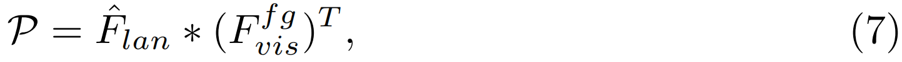

　　其中 $\mathcal{P} \in \mathbb{R}^{(K+1) \times T}$ 表示分类输出，每个片段位置 $t \in T$ 被分配一个概率分布 $p_t \in \mathbb{R}^{(K+1) \times 1}$。注意，在应用公式(7)之前，沿着通道维度进行了 $l_2$ 归一化。

　　(II) 动作掩码定位器

​		与分类流并行，这个流预测整个视频时间跨度上动作实例的一维掩码。由于一维掩码是基于时间位置 $t$ 条件的，研究者利用动态卷积。这是因为，与标准卷积相比，动态滤波器允许利用单独的网络分支在每个片段位置生成一个滤波器。因此，动态滤波器可以单独学习每个片段位置的动作（背景）实例的上下文。更具体地说，给定第 $t$ 个片段 $F_{\text{vis}}(t)$，它输出一个一维掩码向量 $m_t = [q_1, ..., q_T] \in \mathbb{R}^{T \times 1}$，其中每个元素 $q_i \in [0,1] (i \in [1, T])$ 表示第 $i$ 个片段的前景概率。这是通过三个一维动态卷积层 $H_m$ 的堆叠实现的，如下所示：

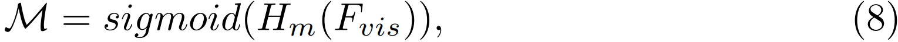

　　其中，M的第t列是通过第t个片段进行的时序掩码预测。补充材料中给出了动态卷积公式的更多细节。

## 3.3 模型训练与推理

#### 标签分配
为了训练我们的单阶段STALE模型，需要将真实标签整理成设计好的格式。具体来说，给定一个带有时间间隔和类别标签的训练视频，我们将单个动作实例的所有片段标记为相同的动作类别。所有不在动作间隔内的片段被标记为背景。对于类别流中特定实例的动作片段，我们在动作掩码流中相同片段位置分配与视频长度相同的二进制实例掩码。每个掩码都是特定动作实例的。特定动作实例的所有片段共享相同的掩码。更多细节请参阅补充材料。

#### 学习目标

分类流由简单的交叉熵损失组成。对于训练片段，我们用 $ y \in \mathbb{R}^{(K+1) \times T} $ 表示真实类别标签，用 $ p \in \mathcal{P} $ 表示分类输出。我们计算分类损失如下：

$ L_{c} = \text{CrossEntropy}(p, y). $

对于分割掩码分支，我们结合了加权交叉熵和二进制Dice损失。形式上，对于一个片段位置，我们用 $ m \in \mathbb{R}^{T \times 1} $ 表示预测的分割掩码，用 $ g \in \mathbb{R}^{T \times 1} $ 表示真实掩码。分割掩码分支的损失公式如下：

$
\begin{align*}
L_m = \beta_{fg} \sum_{t=1}^T g(t) \log(m(t)) + \beta_{bg} \sum_{t=1}^T (1 - g(t)) \log(1 - m(t)) +  \\ 
\lambda_2 \left(1 - \frac{m^\top g}{\sum_{t=1}^T (m(t)^2 + g(t)^2)}\right),
  \end{align*}
$

其中 $ \beta_{fg} / \beta_{bg} $ 是前景/背景片段比例的倒数。我们将损失权衡系数 $ \lambda_2 $ 设置为 0.4。

我们进一步施加由二进制交叉熵（BCE）形成的一维动作完整性损失。它可以惩罚前景掩码输出 $ \hat{L} \in \mathbb{R}^{T \times 1} $。给定真实前景掩码 $ \hat{g} \in \mathbb{R}^{T \times 1} $，我们设计损失来模拟前景的完整性如下：

$ L_{\text{comp}} = -\left(\hat{g} * \log(\hat{L}) + \log(\hat{g}) * \hat{L}\right). $

#### 跨分支一致性
在我们的STALE中，类别和掩码标签在前景方面具有结构一致性。为了利用这种一致性进行优化，我们将一致性损失公式化为：

$ L_{\text{const}} = 1 - \text{cosine}(\hat{F}_{\text{clf}}, \hat{F}_{\text{mask}}), $

其中 $ \hat{F}_{\text{clf}} = \text{topk}(\text{argmax}((P_{\text{bin}} * E_p)[:K,:])) $ 是从分类输出 $ P_{\text{bin}} := \eta(P - \theta_c) $ 中获得的，使用 $ \theta_c $ 作为阈值，$ E_p $ 是通过将嵌入 $ E $ 传递到一维卷积层来获得的，以匹配 $ P $ 的维度。掩码输出 $ M $ 的最高得分特征也类似地获得：$ \hat{F}_{\text{mask}} = \text{topk}(\sigma(1DPool(E_m * M_{\text{bin}}))) $，其中 $ M_{\text{bin}} := \eta(M - \theta_m) $ 是掩码预测 $ M $ 的二值化，$ E_m $ 是通过将嵌入 $ E $ 传递到一维卷积层来获得的，以匹配 $ M $ 的维度，$ \sigma $ 是sigmoid激活函数。

#### 总体目标
我们STALE的总体目标损失函数定义为：

$ L = L_c + L_m + L_{\text{comp}} + L_{\text{const}}. $

这个损失用于端到端训练模型，同时由于GPU内存限制，保留预训练视频编码器不变。

#### 模型推理
在测试时，我们通过分类 $ P $ 和掩码 $ M $ 预测为每个测试视频生成动作实例预测。对于 $ P $，我们只考虑类别概率大于 $ \theta_c $ 的片段，并选择得分最高的片段。对于每个这样的高分动作片段，我们通过使用定位阈值 $ \Theta $ 阈值化 $ M $ 的第 $ t_i $ 列来获得时间掩码。为了产生足够的候选，我们使用一组阈值 $ \Theta = \{\theta_i\} $。对于每个候选，我们通过乘以分类和最大掩码分数来计算置信度分数 $ s $。最后应用SoftNMS来获得最高分结果。

# 4.实验

　　**数据集** 我们对两个流行的TAD基准进行了广泛的实验。(1) ActivityNet-v1.3[4]有200动作类的19994个视频。我们按照标准设置，以2:1:1的比例将所有视频分成训练，验证和测试子集。(2) THUMOS14[15]包含200个验证视频和213个测试视频，分别来自20个类别，标记了时序边界和动作类

　　我们使用Kinetics预训练的I3D[6]作为ActivityNet和THUMOS的视频编码器，与现有的TAD工作进行公平的比较。我们还使用[17]中使用的双流特征进行公平比较。为了与基于CLIP的TAD基线进行比较，我们还采用了来自预训练CLIP (vitb /16+Transformer)的图像和文本编码器。在模型自适应过程中，保持视觉编码器的冻结，可训练的部分包括文本提示嵌入，文本编码器，时序嵌入模块，时序掩码模块和TAD解码头。CLIP编码器对视频帧进行空间分辨率224 × 224的预处理，最大文本标记数为77个(遵循原CLIP设计)。在actitivtynet /THUMOS中，利用线性插值将每个视频的特征序列F缩放为T = 100/256片段。我们的模型使用Adam训练了15个epoch，学习率为10−4/ 10−5 分别用于ActivityNet/THUMOS。

## 4.1比较结果

　　**Zero-shot动作检测设置** 在本节中，我们将在Dtrain∩Dval = ϕ的开放数据集场景中进行验证，即训练的动作类别和测试是不相交的。我们遵循[17]提出的设置和数据集分割。具体而言，我们在THUMOS14和ActivityNet1.3上初始化了两种评估设置:(1)75%动作类别的训练和剩下25%动作类别的测试;(2) 50%类别训练，剩下50%类别测试。为确保统计显著性，我们对每个设置进行了10次随机抽样，以[17]为基准，对每个设置进行分类。

　　由于[17]没有开源实现，我们使用他们相同的报告基线。更具体地说，(1)一个基线，使用BMN[20]作为提议生成器，使用CLIP[35]，手工制作提示。这与[17]中报告的基线相同。这是一个使用CLIP的two-stageTAD基线。我们称之为B-I。(2)一个基于comparative CLIP的TAD EffPrompt[17]。(3)CLIP+TAD模型的one-stage基线:ZS-TAD是一个相对较新的问题，我们需要使用CLIP自己扩展现有的TAD方法来实现有竞争力的模型。我们利用已有的CLIP预训练权重为密集预测任务[36]选择了一个CLIP的变体。我们将这种基线，DenseCLIP (w/ CLIP预训练图像编码器)+ TAD称为B-II。然而，使用CLIP预训练权重的文本编码器对于两个基线是相同的。然而，由于没有可用的代码以及[49]和[17]之间没有共同的数据分割，我们无法与早期的zero-shotTAD方法ZS-TAD[49]进行比较。

　　**性能** ZS-TAD结果如表1所示。有了50%的标记数据，我们的STALE在ActivityNet上超过了1阶段和2阶段的基线，以及基于CLIP的TAD方法[17]不少。这表明，与传统的两阶段设计相比，我们的表征掩码能够更好地执行zero-shot迁移。这也说明在低训练数据环境下，定位误差的传播是有害的。还注意到one-stage基线(B-II)在所有其他基线中表现最差。这表明，为了在ZS-TAD中获得强大的性能，需要一个class-agnostic的掩码。然而，我们的模型的性能在THUMOS14上在更严格的指标上下降了，可能是由于掩码解码器受到了前景不平衡的影响。我们在75%的标记数据上观察到了类似的趋势，我们的方法在两个数据集上比所有其他竞争对手的方法都更好。值得注意的是，one-stage基线(B-II)与two-stage基线(B-I)的性能差距更大，ActivityNet上的平均mAP差距约为3.1%。然而，当标记数据数量增加时，这一比例降至0.6%，表明one-stage基线有可能随着数据的增加而改善。

　　**闭集动作检测设置** 闭集动作检测是指共同的设置，其中模型在具有相同动作类别的视频上进行训练和验证，即Dtrain = Dval。为了进行公平的比较，我们使用与文献中相同的数据集分割。　　

　　**比较** 我们考虑了以下方法进行比较。(1) 7种具有I3D编码器骨干的代表性TAD方法;(2) CLIP+TAD方法EffPrompt [17];(3) 1个基于two-stage CLIP的TAD基线 B-I;(4)1个基于single-stage CLIP的TAD基线B-II;(5)我们还通过使用Kinetics预训练的视频编码器(例如I3D)取代CLIP预训练的编码器创造了另一个single-stage基线。我们称之为B-III。

 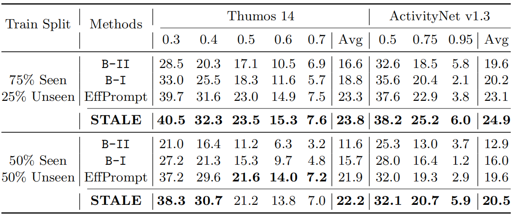

　　表1。zero-shot动作检测结果

　　从表2的结果中，我们观察到，对于更多的标记数据，我们的方法也常常在很大程度上超过了现有的TAD方法。这在两个数据集上是一致的。因此，文本嵌入确实对我们的设计有帮助。我们还观察到，当我们使用不同的特征主干(如CLIP)时，我们的方法获得了相似的性能提升。从而证明了我们的设计是特征不可知的。另一个关键的观察结果是，我们的单阶段基线(B-II)在两个数据集的平均mAP中比[17]性能明显好至少5%。因此，我们的并行设计是基于CLIP的方法的更好选择。

## 4.2.消融

　　**定位错误传播分析** 为了验证定位误差传播对之前TAD模型的影响，我们设计了一个概念验证实验，通过测量地面真实提议和伪提议之间的性能下降。由于[17]中没有训练代码，我们仔细地按照[17]中的细节重新创建了B-I。对于我们的STALE模型，我们对比了ground-truth和output mask。实验在ActivityNet上进行，标签分裂率为75%。表3显示，基于TAD基线的建议几乎遭受了定位(即定位)的双重性能下降。由于其顺序定位和分类设计的错误。这验证了STALE并行设计的优势。

　　**表示掩码的必要性** 为了验证表征掩码对分类器推广的作用，我们在75%分割设置下进行实验。首先，从STALE的流程中去除掩码转换器[8]，并传递时序特征Fvis 直接进入跨模态适配模块进行分类。如表4所示，我们观察到avg地图急剧下降14%，证明前景特征确实是对齐文本嵌入的必要条件。这个问题在DenseCLIP基线(B-II)中也很严重，如表1所示。我们还测试了掩码的另一种选择，例如vanilla 1-D CNN。很明显，Maskformer-Decoder受益于学习查询嵌入在vanilla1-D CNN。我们还观察到，增加查询的数量会提高整体定位性能，但会占用更多内存。此外，由于分类时解码器输出查询匹配步骤的内存限制，我们学习MLP来降低成本。我们验证了class-agnostic的表示掩码在定位未见过的动作类别方面具有更强的泛化能力。有趣的是，我们观察到最大STALE可以达到平均mAP的35.8%，这表明还有进一步改进的空间。

 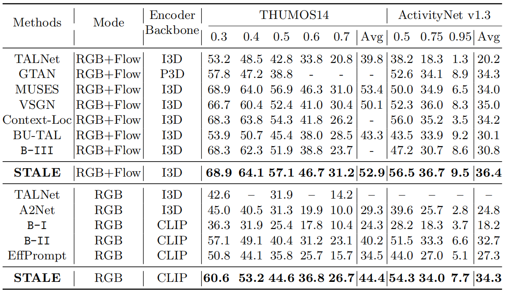

　　表2。与最先进的封闭设置比较　　

　　**文本编码器的重要性** 我们弱化了文本编码器微调的效果。注意，视频编码器由于内存限制而冻结。本实验使用CLIP[35]预训练文本transformer(记为CLIP-text)。从表5可以看出，使用文本编码器对于整体性能确实很重要。此外，由于剪辑预训练和TAD任务之间存在较大的领域差距，对文本编码器的微调也有效。

　　**时序建模召回率的影响** 本文采用多头Transformer(w/o位置编码)对过时时序建模。我们通过比较(I)具有3个扩张速率(1,3,5)的2层一维CNN和(II)多尺度时序卷积网络MS-TCN[10]来评估这种设计选择。每个CNN设计都替代了默认的Transformer，而保留了所有其他的。表6显示，Transformer明显优于CNN的两个替代品。这表明，即使在像ZS-TAD这样的低数据设置中，我们的默认设计也能捕捉到更强的上下文学习能力。

　　为了进一步证明跨模态适应的影响，我们使用STALE的CLIP预训练变体进行了详细的消融，结果如表7所示。为了更好地利用语言先验，我们使用transformer编码器[40]来使用掩码前景视频表示Fvisfg来条件化语言嵌入Flang。从表7中，我们见证了跨模态适应的平均mAP至少有1.4%的增长。我们观察到，这种增益在计算中可以忽略不计的增益。因此，在其余的实验中，我们都选择了跨模态适应。

 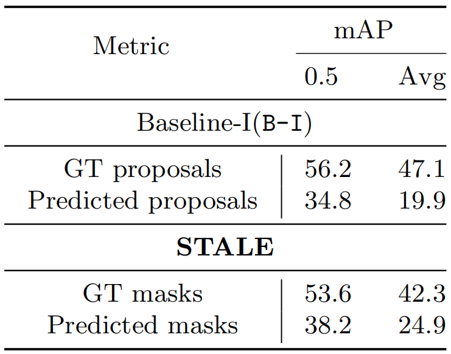

　　表3。基于ActivityNet75%分割的定位误差传播分析。GT:真实值。

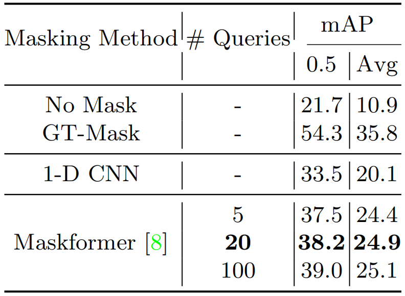

　　表4。对ActivityNet上75%的数据进行表征掩码分析

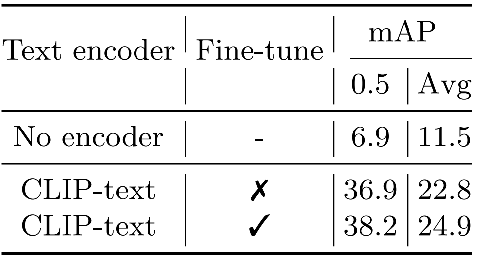

　　表5所示。在75%训练split上使用CLIP词汇的文本编码器重要性

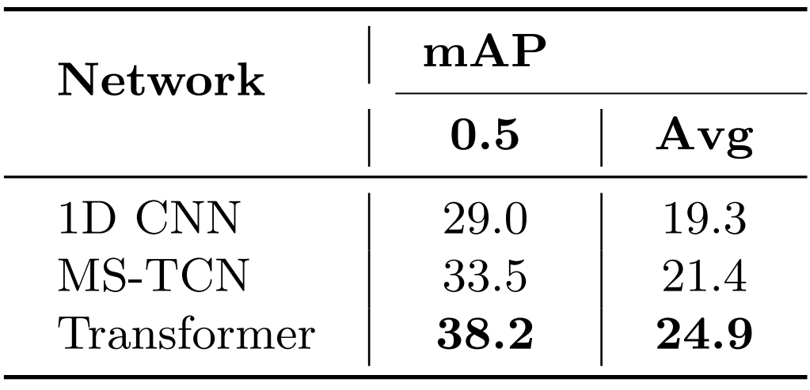

　　表6所示。Transformervs. CNN在ActivityNet上低于75%seen标签设置。 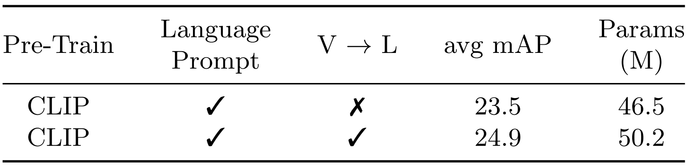

　　表7所示。我们证明，执行后模型视觉到语言的跨模态适应可以产生更好的性能与更少的额外故障点和参数。

　　文本上下文长度由于我们正在处理可学习的上下文，一个自然的问题是:应该使用多少上下文标记?拥有更多的上下文标记是不是更好?我们在ActivityNet数据集上研究了这一因素。表8中的结果提示，较长的上下文长度对TAD任务有益。这表明，上下文标记越多，性能越好;而将类标记定位在中间，上下文长度越长，性能越好。因此，我们将50作为实验的上下文长度。我们观察到一些单词与任务有一定的相关性，比如ActivityNet中的“玩”，“游泳”。但是，当将所有最近的单词连接在一起时，提示的意义就不像[54]中那样大了。我们推测，学习向量可能编码的含义是现有词汇之外的。然而，对于具有更大可学习上下文的视频理解任务，令其获益。

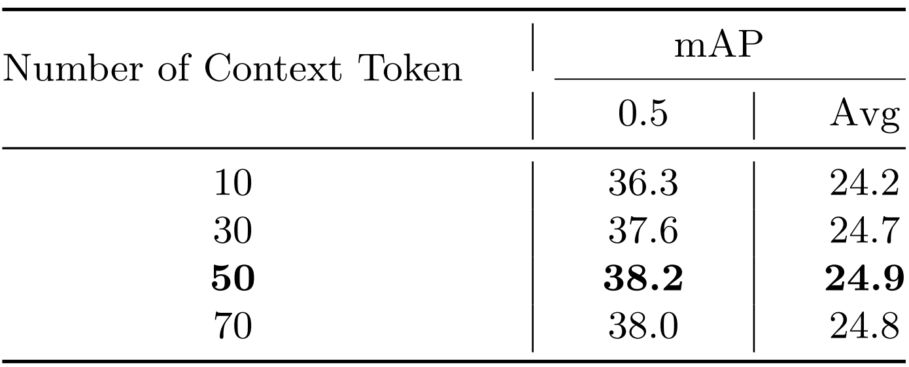

　　表8所示。在ActivityNet上对75%的文本上下文标记进行了分析

 

# 5.结论

　　针对目前研究较少但实用的zero-shot时序动作检测(Zero-Shot Temporal Action Detection, ZS-TAD)，提出了一种基于视觉语言提示(visual language prompt, STALE)的zero-shot时序动作检测方法。它的特点是采用并行定位(掩码生成)和分类结构，以解决传统ZS-TAD模型的定位误差传播问题。为了改进优化，我们进一步引入了分支间一致性正则化来利用它们的结构关系。在ActivityNet和THUMOS上的大量实验表明，我们的STALE在zero-shot和监督学习设置下都取得了最先进的性能