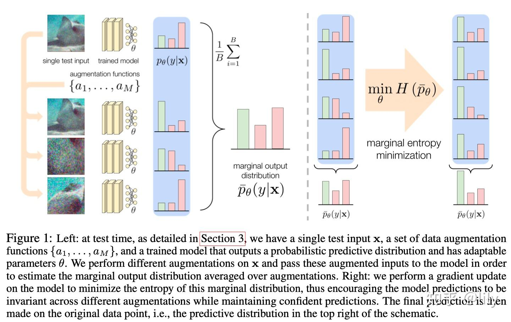

# **MEMO: Test Time Robustness via Adaptation and Augmentation**

https://zhuanlan.zhihu.com/p/579388728

**摘要：**本文关注测试时间鲁棒化的问题，即利用测试输入来提高模型的[鲁棒性](https://zhida.zhihu.com/search?content_id=216886511&content_type=Article&match_order=1&q=鲁棒性&zhida_source=entity)，对模型训练过程不做任何假设的方法，提出了一个简单的方法，可用于任何模型具有概率性和适应性的测试环境：**当遇到一个测试实例时，对数据点进行不同的数据增强，然后通过最小化模型的平均或边际输出分布的熵来适应（所有的）模型参数的增强。**直观地说，**这个目标鼓励模型在不同的增强中做出相同的预测，从而执行这些增强中编码的不变性，同时也保持对其预测的信心**。在我们的实验中，我们评估了两个基线ResNet模型、两个健壮的ResNet-50模型和一个健壮的视觉变换器模型，我们证明了这种方法比标准模型评估取得了1-8%的准确率，并且通常优于先前的增强和适应策略。在只有一个测试点的情况下，我们在ImageNet-C、ImageNet-R以及ResNet-50模型中的ImageNet-A[分布转换](https://zhida.zhihu.com/search?content_id=216886511&content_type=Article&match_order=1&q=分布转换&zhida_source=entity)基准上取得了最先进的结果。

## 一、问题描述

当前OOD泛化领域的大多数前期工作都集中**在训练时间鲁棒泛化**，包括：利用更大的模型和数据集[34]、各种形式的[对抗性训练](https://zhida.zhihu.com/search?content_id=216886511&content_type=Article&match_order=1&q=对抗性训练&zhida_source=entity)[39, 48]和积极的数据增强[51, 13, 24, 14]，然而采用这些技术的问题是：

（1）需要修改训练过程，可能会涉及繁重的计算或非公共数据。

（2）这些技术并不依赖于模型必须预测的测试点的任何信息，尽管这些测试点可能为改善模型的鲁棒性提供重要信息。

Test-Time Adaption的关键思想在于：**测试数据也具有鲁棒性改进的重要信息，因此不能只关注训练数据。**

在这项工作中，作者关注于测试时鲁棒性的方法，其中特定的测试输入可以被利用，以改善模型对该点的预测。

主要研究目标包括：

（1）提出的方法是 "即插即用 "的，即它们可以随时用于各种预训练的模型和测试设置。

（2）提出的方法能与其他鲁棒性技术协同工作，以达到比单独使用任何一种技术更高的性能。

因此，作者设计了一种基于适应和增强的新型测试时鲁棒性方法。如图1所示，当遇到一个测试点时，通过以不同的方式增强测试点来适应模型，同时鼓励模型做出一致的预测，从而尊重数据增强中的invariance编码。作者进一步鼓励模型做出有把握的预测，综上，**提出的方法是：使模型在测试点的增强版本中的预测的边际熵最小。**

> "边际熵" (marginal entropy) 是信息论中的一个概念，用于衡量一个随机变量的不确定性或信息量。对于一个离散随机变量 $ X $，其边际熵 $ H(X) $ 可以通过下面的公式来计算：
>
> $ H(X) = -\sum_{x \in X} P(x) \log P(x) $
>
> 其中 $ P(x) $ 是随机变量 $ X $ 取值为 $ x $ 的概率，而求和是对 $ X $ 所有可能的取值进行的。
>
> 在机器学习中，边际熵可以用来衡量模型对某个输入样本的预测不确定性。如果一个模型对某个样本的预测边际熵很高，意味着模型对该样本的预测结果非常不确定，可能是因为样本本身具有较高的不确定性，或者模型对该样本的特征学习不够充分。相反，如果边际熵较低，则表示模型对该样本的预测相对确定，模型对该样本的特征学习较为充分。
>
> 在上下文中提到的"使模型在测试点的增强版本中的预测的边际熵最小"，意味着在模型训练或优化过程中，要让模型在测试样本的增强版本上的预测结果尽可能确定，即降低模型对这些样本的预测不确定性。这样可以提高模型的鲁棒性和准确性，使其在面对不同版本的测试样本时，能够给出更为稳定和可靠的预测结果。

## **二、相关工作**

在许多框架下[36]，包括[领域适应](https://zhida.zhihu.com/search?content_id=216886511&content_type=Article&match_order=1&q=领域适应&zhida_source=entity)[41, 6, 47]、[领域泛化](https://zhida.zhihu.com/search?content_id=216886511&content_type=Article&match_order=1&q=领域泛化&zhida_source=entity)[5, 32, 9]和分布稳健优化[4, 16, 39]，都对分布转移进行了研究。这些框架通常利用额外的训练或测试假设，以使分布转移问题更具有可操作性。在很大程度上独立于这些框架，各种经验方法也被提出来处理转移问题，如增加模型和训练数据集的大小或使用大量的训练增强[34, 51, 14]。这项工作的重点是对这些工作的补充。MEMO适用于广泛的预训练模型，包括那些通过鲁棒性方法训练的模型，并且可以通过测试时间的适应性实现进一步的性能提升。

之前的测试时间适应方法一般都会做出重要的训练或测试时间假设。一些方法使用测试输入的批次甚至整个数据集来更新模型，例如通过计算测试集上的[批次归一化](https://zhida.zhihu.com/search?content_id=216886511&content_type=Article&match_order=1&q=批次归一化&zhida_source=entity)（BN）统计数据[25, 19, 33, 40]，计算类原型[18]，或最小化跨批次测试数据的模型预测的（条件）熵[46]。后一种方法与MEMO密切相关。**不同的是，MEMO使用单个测试点和数据增强来最小化边际熵，并且适应所有的模型参数，而不仅仅是与[归一化层](https://zhida.zhihu.com/search?content_id=216886511&content_type=Article&match_order=1&q=归一化层&zhida_source=entity)相关的参数，因此不需要多个测试点或特定的[模型架构](https://zhida.zhihu.com/search?content_id=216886511&content_type=Article&match_order=1&q=模型架构&zhida_source=entity)。**其他测试时间适应方法可以应用于单个测试点，但需要特定的训练程序或模型[44, 17, 40, 1, 3]。测试时间训练（TTT）[44]需要一个带有旋转预测头的专门模型和一个不同的程序来训练这个模型。Schneider等人[40]表明，即使只有一个测试点，BN适应也是有效的。正如我们在第3节所讨论的，MEMO与这种 "单点 "BN适应技术有很好的协同作用。Mao等人[29]提出了一种基于输入扰动的测试时间适应方法，以提高对对抗性攻击的鲁棒性。与我们的工作同时，Sivaprasad和Fleuret[43]提出了一个类似的测试时间适应方法，鼓励对数据增强的不变性，他们在被破坏的CIFAR和VisDA[35]数据集上测试他们的方法。

许多工作都指出，训练集上不同形式的强数据增强可以提高所产生的模型的鲁棒性[51, 13, 24, 14]。数据增强有时也直接用于测试数据，通过在测试点的增强副本中对模型的输出进行平均化[23, 42]，即根据模型的边际输出分布进行预测。当使用种植作为增强时，这种技术通常被称为多作物评估[22]。我们使用测试时间增强（TTA）这一术语，因为我们使用了种植以外的额外增强[13]。**TTA已被证明对提高模型精度和校准[2]以及处理分布转移[31]都很有用。我们通过明确地调整模型，使其边际输出分布具有低熵，使这一想法更进一步。这就为改进模型提取了一个额外的学习信号，此外，适应的模型可以对干净的测试点而不是增强的副本进行最终预测。**我们在第4节中实证表明，这些差异导致了比非自适应TTA基线更好的性能。

## 三、 Augmenting and Adapting at Test Time

Test time robustness指直接操作预训练模型和单一测试输入的技术。

**3.1 Marginal Entropy Minimization with One test point**

首先我们来看看对于一个输入x，和一个batch的augmentation操作来说，模型的平均输出分布（或者是[边缘分布](https://zhida.zhihu.com/search?content_id=216886511&content_type=Article&match_order=1&q=边缘分布&zhida_source=entity)）表达如公式（1）所示：

给定一个测试点 $ \mathbf{x} $ 和一组增强函数 $ \mathcal{A} $，我们从 $ \mathcal{A} $ 中采样 $ B $ 个增强并将其应用于 $ \mathbf{x} $，从而生成一批增强数据 $ \tilde{\mathbf{x}}_1, \dots, \tilde{\mathbf{x}}_B $。模型对这些增强点的平均（或边缘）输出分布定义为：

$
\bar{p}_\theta (y | \mathbf{x}) \triangleq \mathbb{E}_{\mathcal{U}(\mathcal{A})} \left[ p_\theta (y | a(\mathbf{x})) \right] \approx \frac{1}{B} \sum_{i=1}^B p_\theta (y | \tilde{\mathbf{x}}_i),
$

其中期望是针对从增强分布 $ a \sim \mathcal{U}(\mathcal{A}) $ 中均匀采样的增强而计算的。

> **解释**
>
> 1. **输入和增强**：
>    - 测试点 $ \mathbf{x} $：这是测试时需要进行预测的输入。
>    - 增强函数 $ \mathcal{A} $：一组可以对输入 $ \mathbf{x} $ 进行增强（例如旋转、裁剪、噪声添加等）的操作。
>    - 通过从 $ \mathcal{A} $ 中采样 $ B $ 个增强函数 $ a $，我们生成 $ B $ 个增强版本的输入 $ \tilde{\mathbf{x}}_1, \dots, \tilde{\mathbf{x}}_B $。
>
> 2. **平均分布**：
>    - $ \bar{p}_\theta (y | \mathbf{x}) $：表示模型对输入 $ \mathbf{x} $ 的边缘预测分布，是通过对多个增强版本的预测结果 $ p_\theta(y | \tilde{\mathbf{x}}_i) $ 取平均来近似得到的。
>    - 公式中，$ \mathbb{E}_{\mathcal{U}(\mathcal{A})} $ 表示期望值是针对从增强分布 $ \mathcal{U}(\mathcal{A}) $ 中均匀采样的增强函数 $ a $。
>
> 3. **简化形式**：
>    - 为了近似计算，使用了有限的增强样本 $ \tilde{\mathbf{x}}_1, \dots, \tilde{\mathbf{x}}_B $，并通过对它们的预测取平均值来估计真实的边缘分布。

然后，需要思考：我们希望从这个边缘分布来获得什么属性？

作者在这里的目标有两个：

- **目标一**：模型 $f_\theta$ 的预测在 test point 的 augmentation 版本中应该是不变的。（即保持 **invariance**）
- **目标二**：模型 $f_\theta$ 应该对它的预测具有信心，即使对 test point 的大量 augmentation 版本也是如此。（即提高 **置信度** 的输出）

为了解决这两个目标，本文提出了一个优化目标：

$
\ell(\theta; \mathbf{x}) \triangleq H(\bar{p}_\theta(\cdot|\mathbf{x})) = - \sum_{y \in \mathcal{Y}} \bar{p}_\theta(y|\mathbf{x}) \log \bar{p}_\theta(y|\mathbf{x})。
\tag{2}
$

请注意，这个目标与优化模型预测分布的平均条件熵不同，即：

$
\ell_{CE}(\theta; \mathbf{x}) \triangleq \frac{1}{B} \sum_{i=1}^B H(p_\theta(\cdot|\tilde{\mathbf{x}}_i))。
\tag{3}
$

**公式 (2) 和公式 (3) 的区别在哪里？**

- 公式 (3) 表示的是模型预测分布的平均条件熵，最小化公式 (3) 只能保证提高 **置信度**（目标二）。
- 而公式 (2) 不仅满足目标二，还能满足目标一，因为其最小化求解不是针对单个类别分布来求解，而可以保证 **invariance**（最小化熵）的同时，保证每个标签类的不变性。

算法简介

算法 1 介绍了整体方法 MEMO。其让损失最小化到利用梯度更新网络参数，然后预测，一气呵成。

### 算法 1：通过 MEMO 实现测试时的鲁棒性

**Require:** 训练好的模型 $f_\theta$，测试点 $\mathbf{x}$，增强数量 $B$，学习率 $\eta$，更新规则 $G$。

1. 从增强集合 $ \mathcal{A} $ 中独立同分布 (i.i.d.) 采样 $a_1, \dots, a_B $，并生成增强后的数据点 $\tilde{\mathbf{x}}_i = a_i(\mathbf{x})$，其中 $i \in \{1, \dots, B\}$。
2. 计算估计值：
   $
   \tilde{p} = \frac{1}{B} \sum_{i=1}^B p_\theta(y|\tilde{\mathbf{x}}_i) \approx \bar{p}_\theta(y|\mathbf{x}),
   $
   和
   $
   \tilde{\ell} = H(\tilde{p}) \approx \ell(\theta; \mathbf{x}),
   $
   即公式 (2)。
3. 使用更新规则 $G(\theta, \eta, \tilde{\ell})$ 根据参数调整模型：$\theta' \leftarrow G(\theta, \eta, \tilde{\ell})$。
4. 预测输出：
   $
   \hat{y} \triangleq \arg \max_y p_{\theta'}(y|\mathbf{x}).
   $

**3.2 Composing MEMO with Prior Methods**

MEMO的另一个好处是，它可以与其他处理分布变化的方法协同工作。特别是，MEMO可以与先前的训练鲁棒性模型和适应模型统计的方法组成，从而利用每种技术的性能改进。

**Pretrained robust models.** 由于MEMO对模型训练过程不做任何假设或修改，在预训练的稳健模型上进行适应性训练，比如那些用大量数据增强训练的模型，就像使用任何其他预训练的模型一样简单。最重要的是，我们发现，在实践中，测试增量的集合A并不一定要与用于训练模型的增量相匹配。为了简单和高效，我们使用了容易取样并直接应用于模型输入x的增强。这些特性对于诸如基于图像翻译模型的数据增强技术，如DeepAugment[14]，或特征混合，如时刻交换[24]，并不成立。然而，我们仍然可以使用用这些数据增强技术训练的模型作为我们适应的起点，从而使我们能够在其最先进的结果基础上进行改进。如上所述，对于需要复杂或专门的训练程序和模型架构的适应方法，如TTT[44]或ARM[52]，使用预训练的模型并不那么容易完成。在我们的实验中，我们使用AugMix作为我们的增强集[13]，因为它满足了上述属性，并且在应用时仍能产生显著的多样性，如图2所描述。请注意，AugMix明确地不使用与CIFAR-10-C和ImageNet-C测试集[12, 13]中的腐败相似的增强。

以下是对该段内容的解释：

- **MEMO对模型训练过程不做任何假设或修改**：MEMO方法不需要对模型的训练过程进行任何特定的假设或修改，它可以直接应用于各种预训练的模型。这意味着无论模型在训练时使用了什么数据、架构或训练策略，MEMO都可以在测试时对其进行适应性训练，以提高模型在面对分布偏移时的鲁棒性。
- **在预训练的稳健模型上进行适应性训练**：MEMO可以在那些已经通过大量数据增强训练过的稳健模型上进行适应性训练。这些稳健模型在训练时已经通过数据增强提高了对输入变化的鲁棒性，MEMO进一步在测试时对这些模型进行适应，使其能够更好地应对测试数据中的分布偏移。
- **测试增量的集合A并不一定要与用于训练模型的增量相匹配**：在实践中，用于测试时数据增强的增量集合A可以与训练模型时使用的增量不同。也就是说，即使测试时使用的数据增强方式与训练时不同，MEMO仍然可以有效地工作。这为测试时的数据增强提供了更大的灵活性，可以根据实际情况选择合适的增强方式.
- **使用容易取样并直接应用于模型输入x的增强**：为了简化和提高效率，MEMO使用了那些容易取样并可以直接应用于模型输入x的数据增强方式。这些增强方式不需要复杂的操作或专门的模型架构，可以直接对输入数据进行变换，从而生成增强后的数据用于模型的适应性训练.
- **使用用这些数据增强技术训练的模型作为适应的起点**：尽管某些数据增强技术，如基于图像翻译模型的DeepAugment或特征混合的时刻交换，可能不满足MEMO使用的简单和高效特性，但我们可以使用通过这些技术训练的模型作为MEMO适应的起点。这样，MEMO可以在这些已经具有较高鲁棒性的模型基础上，进一步通过测试时的适应性训练来提升模型的性能.
- **对于需要复杂或专门的训练程序和模型架构的适应方法，使用预训练的模型并不那么容易完成**：一些适应方法，如TTT或ARM，需要复杂的训练程序或特定的模型架构，这使得在这些方法上使用预训练的模型变得困难。相比之下，MEMO不需要对模型架构或训练程序进行特殊要求，可以直接在预训练的模型上进行适应性训练.
- **使用AugMix作为增强集**：在实验中，作者选择了AugMix作为数据增强集，因为它满足了简单、高效且可以直接应用于模型输入的特性，并且在应用时能够产生显著的多样性。AugMix通过混合多种数据增强方式来生成增强后的数据，从而提高模型对输入变化的鲁棒性。需要注意的是，AugMix并不使用与CIFAR-10-C和ImageNet-C测试集中的腐败相似的增强，这有助于避免在测试时对模型的预测产生负面影响.

**Adapting BN statistics.** Schneider等人[40]的研究表明，即使在只有一个测试点的情况下，部分调整模型中每个批次的激活的估计平均值和方差归一化（BN）层的模型，在某些情况下仍然可以有效地处理[distribution shift](https://zhida.zhihu.com/search?content_id=216886511&content_type=Article&match_order=1&q=distribution+shift&zhida_source=entity)。在这种情况下，为了防止对测试点的过度拟合，通道的均值和方差 [μ , σ2 ]与在训练期间根据先验强度N计算出的平均数和方差[μ , σ2 ]混合。也就是说，对于ν∈{μ,σ2}，在训练期间，根据先验强度N计算出的平均数和方差：

