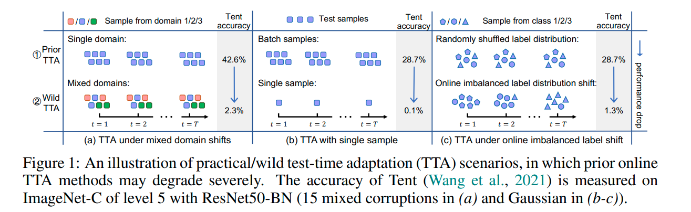
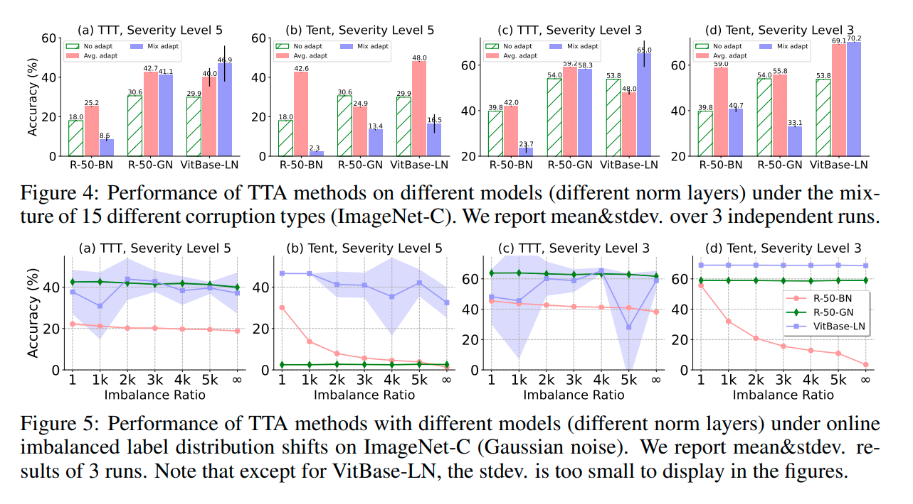
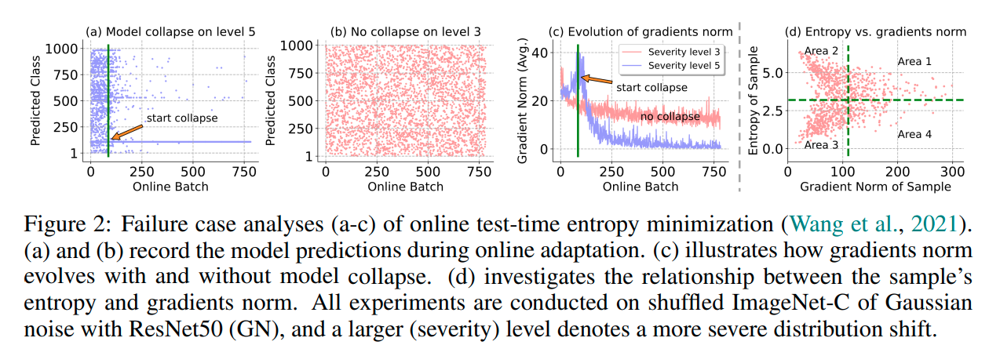
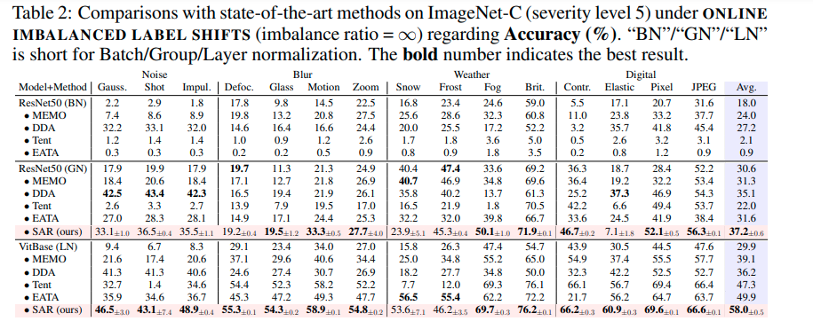
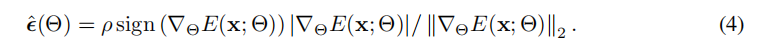

# [ICLR'23 top 5%] Towards Stable Test-time Adaptation in Dynamic Wild World

> https://blog.csdn.net/qq_42740834/article/details/129427416

作者：Shuaicheng Niu, Jiaxiang Wu, Yifan Zhang, Zhiquan Wen, Yaofo Chen, Peilin Zhao, Mingkui Tan

[Transfer Learning]

这篇文章讨论了开放世界中的 test-time adaptation 问题。在开放世界中存在着各种分布变化，导致部署的模型性能不如预期，test-time adaptation 希望能够通过网络一次forward或较少的forward令模型给出适应于分布变化的预测，实现高效的迁移学习。

这篇文章讨论了test-time adaptation中的三类问题，1）混合域偏移，2）单样本test-time预测，3）在线类别比例偏移。

通过实验，文章指出在这三类问题中以往的test-time adaptation （TTA）方法面临着严重的性能衰退。

作者首先指出神经网络中的batch-norm层可能是TTA效果不如预期的原因，batch-norm统计每个batch内样本的均值和方差并进行归一化操作。

对于第一类混合域偏移，一般认为一个域分布有其具体的均值方差，直接在batch内估计混合分布的均值方差比较不稳定，第二类一个batch中只有一个样本，BN的统计不准确，第三类不同batch中类别比例不同，BN层同样统计不准。

据此，作者提出用其它归一化层， group norm，layer norm，GN和LN来代替BN层，不同于BN在batch内进行统计，这些归一化层更好地考虑了全局数据的分布信息，从而提供更稳定的均值方差统计。

作者通过实验验证了GN层和LN层能够有效提高TTA在这些偏移问题上的性能。

进一步地，作者发现TTA中常用的熵最小化策略（如Tent方法）在GN层上（见上图中 figure 4-b）存在明显的性能衰退。

通过实验，作者发现熵最小化在带GN层的模型中容易导致预测坍缩到某一类，如上图a中，在经过若干batch后，模型倾向于一直给出某个类的预测。作者发现在出现坍缩的时候，模型的梯度norm正好出现了一个剧烈的上升，然后快速下降到接近0（图c内蓝线）。作者认为这是因为某些具有特别高梯度norm的样本被选中更新后将模型带偏了。据此，作者提出了一种基于sharpness的选择机制来讲梯度norm过大的样本筛去，不使用它们来进行test-time 更新。

结合GN/LN层加上选择性熵最小化，作者所提出的方法在一系列偏移上展现了优秀的性能。

这篇文章的内容主要基于实验展开，从常用的神经网络BN层在不同偏移中遇到的问题出发，提出了有效的解决方案。从问题到分析到方法，描述清晰流畅，值得学习借鉴。文章对分析与解决开放世界中不同偏移对特定模型、基于分布统计的方法造成的问题具有启发意义。

# 锐度感知和可靠的测试时熵最小化（SAR）算法

## 输入参数
- 测试样本集 $\mathcal{D}_{\text{test}} = \{x_j\}_{j=1}^M$
- 模型 $f_{\Theta}(\cdot)$ 及其可训练参数 $\tilde{\Theta} \subset \Theta$
- 步长 $\eta > 0$
- 邻域大小 $\rho > 0$
- 熵阈值 $E_0 > 0$
- 模型恢复阈值 $e_0 > 0$

## 输出
- 预测结果 $\{\hat{y}_j\}_{j=1}^M$

## 算法步骤
1. 初始化 $\tilde{\Theta}_0 = \tilde{\Theta}$，熵的移动平均值 $e_m = 0$。
2. 对于每个测试样本 $x_j \in \mathcal{D}_{\text{test}}$：
   - 计算熵 $E_j = E(x_j; \Theta)$ 并预测 $\hat{y}_j = f_{\Theta}(x_j)$。
     - 如果 $E_j > E_0$，则跳过当前样本。
   - 计算梯度 $\nabla_{\tilde{\Theta}} E(x_j; \Theta)$。
   - 根据公式(4)计算 $\hat{\epsilon}(\tilde{\Theta})$。
   - 计算梯度近似：$g = \nabla_{\tilde{\Theta}} E(x_j; \Theta)|_{\Theta + \hat{\epsilon}(\tilde{\Theta})}$。
   - 更新参数 $\tilde{\Theta} \leftarrow \tilde{\Theta} - \eta g$。
   - 更新熵的移动平均值：
     $
     e_m = 0.9 \times e_m + 0.1 \times E(x_j; \Theta + \hat{\epsilon}(\Theta)) \quad \text{如果 } e_m \neq 0 \text{ 否则 } E(x_j; \Theta + \hat{\epsilon}(\Theta))
     $
   - 如果 $e_m < e_0$，则恢复模型权重 $\tilde{\Theta} \leftarrow \tilde{\Theta}_0$。

