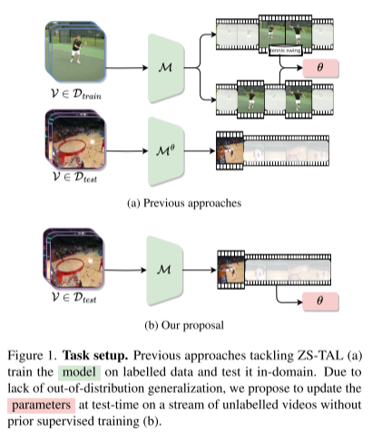
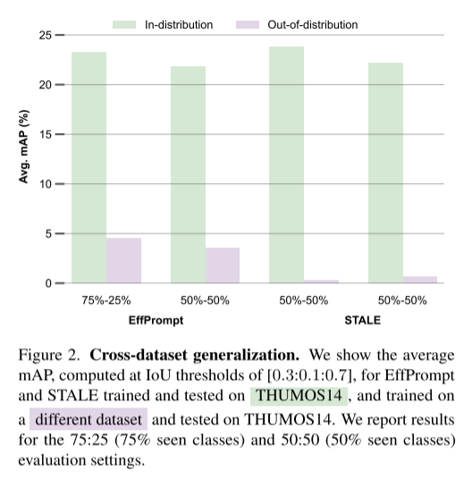

# **Test-Time Zero-Shot Temporal Action Localization**

https://github.com/benedettaliberatori/T3AL

### 摘要

零样本时间动作定位（Zero-Shot Temporal Action Localization, ZS-TAL）旨在识别并定位未裁剪视频中在训练期间未见过的动作。现有的ZS-TAL方法通常需要在大量标注的训练数据上微调模型。尽管这些方法有效，但基于训练的ZS-TAL方法假设了监督学习中标注数据的可用性，而这在某些应用中可能是不现实的。此外，训练过程自然会将领域偏差引入模型，这可能会对模型在任意视频上的泛化能力产生负面影响。

这些考虑促使我们从一个全新的角度解决ZS-TAL问题，放宽对训练数据的需求。为此，我们提出了一种新颖的方法，进行时间动作定位的测试时适应（Test-Time Adaptation for Temporal Action Localization，T³AL）。简而言之，T³AL 通过适配一个预训练的视觉语言模型（Vision and Language Model, VLM）来完成任务。**T³AL 的操作分为三个步骤：首先，通过整合整个视频的信息，计算动作类别的伪标签；然后，采用一种受自监督学习启发的新程序来执行动作定位；最后，使用与先进字幕模型结合的帧级文本描述对动作区域提议进行优化。**

我们通过在 THUMOS14 和 ActivityNet-v1.3 数据集上的实验验证了 T³AL 的有效性。结果表明，T³AL 显著优于基于最先进视觉语言模型（VLMs）的零样本基线方法，证明了测试时适应方法的优势。

## 1. Introduction

零样本学习时间动作定位(ZS-TAL)旨在定位和识别任何视频序列中的动作，从而识别训练期间未见过的类别。大规模视觉和语言模型(VLMs)[1,12,22,28,31]因其**在网络规模的图像-文本数据集上进行广泛的预训练而具有出色的泛化能力而闻名**，优于传统的图像分类方法[4,13,32]。然而，**当应用于视频域时，vlm通常需要微调以考虑图像-视频结构域移位**[11,26,28]。

最近利用vlm进行ZS-TAL的方法也遵守了这一限制，要求训练数据学习视频域并在测试时定位未见动作[9,20,30] (see Fig. 1(a)).。

**尽管模型微调有着明确的目标，即学习视频表示，从而能够有效地在未裁剪的视频中定位动作，但它也假设了一个前提：需要有大量标注数据集的可用性。**然而，在某些应用中，这样的数据集可能并不存在。此外，微调本质上还存在一个固有缺点，即生成的模型在跨领域泛化能力方面会有所下降 [35]。这一问题对于零样本时序动作定位（ZS-TAL）来说尤为严重。

一项初步研究（参见第 3 节）表明，在跨领域环境下评估的最先进的 ZS-TAL 方法，其性能会出现显著下降。这显然引发了对现有 ZS-TAL 方法适应性和鲁棒性的担忧，尤其是在实际应用场景中，比如由于隐私问题无法获取训练数据，或当数据分布随时间发生重大变化时，这些问题变得更加突出。

受这些观察结果的启发，在本研究中，我们提出从一个全新的角度研究零样本时序动作定位（ZS-TAL）的问题，特别是针对训练数据不可访问的相关场景。即使借助强大的视觉语言模型（VLMs），在没有训练的情况下定位和识别动作无疑是具有挑战性的，因为与图像相比，视频具有额外的复杂性，这些复杂性源于场景的杂乱以及建模时间动态的困难 [19]。

尽管如此，我们认为，即使在缺乏训练数据的情况下，推理时可用的视频仍然可以作为时序动作定位的重要信息来源，提供丰富的信息来解决这一问题。

受到近期关于测试时适应（Test-Time Adaptation, TTA）[24, 25]研究的启发，我们提出了**T³AL**，即**Temporal Action Localization（TAL）测试时适应**。与以往的工作不同，T³AL采用了未经训练数据微调的预训练视觉语言模型（VLM）。**我们的解决方案是在推理过程中对输入视频序列进行直接适应（如图1(b)所示）。**

T³AL 的方法包括以下三个主要步骤：
1. 首先，我们通过聚合从 VLM 图像编码器中提取的每帧语义信息，计算与动作类别对应的视频级伪标签。
2. 接下来，根据**视频伪标签生成初步的时序动作定位结果**，这一过程基于**自监督学习启发**的新颖流程 [5]。
3. 最后，使用从最先进的文本生成模型中**提取的帧级文本**描述对计算出的**视频动作建议进行细化**。

我们在两个公开基准数据集（THUMOS14 [7] 和 ActivityNet-v1.3 [6]）上对 T³AL 进行了评估。与未采用 TTA 的 VLM 方法相比，T³AL 实现了相对提升：THUMOS14 提升了 **6.3%**，而 ActivityNet-v1.3 提升了 **13.5%**。

通过一系列的验证实验，我们进一步展示了方法改进的潜在空间。这表明，测试时零样本 TAL（ZS-TAL）是一种用于定位和识别任意视频序列中动作的可行方法。我们希望这些研究发现能为该领域的后续研究带来启发。

我们的贡献总结如下：
•我们在训练数据不可用的新实际场景中解决了ZS-TAL问题。我们证明这是一个具有挑战性的问题，因为最先进的任务方法在没有训练的情况下泛化得很差。

•我们提出了T3AL，这是第一种利用预训练VLM在没有训练数据的情况下处理ZS-TAL的方法。T3AL受益于有效的TTA策略和从生成的标题中获得的外部知识。

•我们的经验证明，适应未标记的数据流是解决ZS-TAL当前基于训练的方法的不分布问题的可行方案。

## **2. Related work**

我们的工作与现有的零样本时序动作定位和测试时适应（TTA）文献紧密相关，我们将在本节简要回顾。

**零样本时序动作定位（ZS-TAL）**

时序动作定位（TAL）方法同时执行动作定位和识别。现有的工作通常采用两种策略：依次处理的两阶段方法 [3, 9, 27, 34]，或并行处理的一阶段方法 [2, 15, 20, 30]。**两阶段方法首先识别与类别无关的区域提议（Region Proposals），然后对每个提议进行分类。一阶段方法则同时完成动作定位和分类。**

**传统上，无论是一阶段还是两阶段方法，都在封闭集场景下工作**，即训练数据和测试数据共享相同的动作类别。然而，最近 EffPrompt [9] 引入了一种新的 ZS-TAL 设置，取消了上述前提条件，训练和测试阶段的动作类别完全隔离。**为了解决这一新设置，EffPrompt 使用两阶段架构：利用现成的检测器 [14] 生成动作提议，并使用 CLIP [22] 对这些提议进行分类。**

与此不同，**STALE [20] 提出了一个基于 CLIP 的、无需提议的模型，该模型通过两个并行的分支同时完成定位和分类。**定位分支专注于学习类别无关的特征屏蔽（Masking），**而分类分支将屏蔽后的特征与各类别的文本嵌入对齐**，从而贡献最终的分类输出。

更近期的 **UnLoc [30] 使用 CLIP 提取视频-文本对的联合特征，并将其输入一个专用的融合模块。**特征金字塔架构进一步利用这些精炼输出，建立层次化连接，**预测每帧的相关性分数以及起始/结束时间的偏移量。**

尽管现有的 ZS-TAL 方法效果显著，但它们需要在训练集上进行模型学习，这导致了若干固有的局限性。正如上文所述，这些局限性包括对跨领域数据泛化的挑战、高计算需求，以及对标注数据的依赖。

我们提出了一种更加实用但更具挑战性的 ZS-TAL 设置，即训练集不可访问的情况。我们的方法属于一阶段方法类别，以综合的方式解决 ZS-TAL 的挑战。

**测试时适应（Test-Time Adaptation, TTA）**

在测试时适应（TTA）中，预训练模型需要对未知的测试分布进行适应，**该分布通常以无标签数据流的形式表现出来 [24, 25]**。许多研究针对图像分类任务提出了 TTA 方法。例如，**TENT [25] 通过最小化批次预测概率分布的熵来在测试时调整预训练网络。同样，MEMO [33] 通过减少增强后的边际分布的熵，克服了对多个样本的需求。**

近期的一些研究将这些概念扩展到大规模视觉语言模型（VLMs） [17, 18, 23]。例如，**TPT [18] 通过熵最小化学习文本上下文向量，以适应 CLIP 模型。SwapPrompt [17] 使用一种在线提示与其历史移动平均值之间的交换机制，以提高适应效果并稳定过程。PromptAlign [23] 则通过多模态提示的微调来完成测试时适应，其方法是在测试时通过多种增强视图获得单个测试图像的分布统计，并将其与训练数据的分布统计对齐。**

这些方法表明 TTA 的概念可以有效扩展到多种任务和模型架构中，尤其是在应对未知分布时具有显著潜力。

尽管所有这些方法都在图像领域解决了TTA（测试时自适应）问题，但视频领域仍然大部分未被探索。**一个显著的例外是ViTTA [16]，它为视频动作识别执行测试时自适应，处理分布偏移，并在线对齐测试和预先计算的训练统计数据。该领域另一个贡献是RNA++ [21]，它提出了一种TTA方法来解决第一人称动作识别中的领域偏移问题。这在无监督领域自适应方法虽然有效但因目标分布数据不可用而不切实际时尤其相关。**我们的研究与[16, 21]显著不同，因为我们适应的模型并不是专门设计来解决TAL（测试时学习）任务的。这要求模型推断出一个之前未遇到的任务。

## 3. 跨数据集泛化分析

我们提出一个初步实验来进一步激发本工作中提出的新颖研究方向。目标是测试零样本动作定位（ZS-TAL）领域内最先进的方法的泛化能力，通过跨数据集设置测试它们的动作定位性能。

具体来说，我们考虑了两种最先进的方法，EffPrompt [9] 和 STALE [20]。对于EffPrompt [9]，我们使用他们现成的检测器[14]以及在HMDB51 [10]上训练的动作识别模型。对于STALE [20]，我们使用他们在ActivityNet-v1.3上训练的ZS-TAL模型。我们使用THUMOS14作为目标数据集进行了这两项实验。请注意，我们的跨域协议评估了这些在更具挑战性和多样性数据集（即ActivityNet-v1.3，200个类别；HMDB51，51个类别）上训练的模型，在一个更简单的数据集（即THUMOS14，20个类别）上的表现。为了参考，我们还报告了在域内设置下获得的结果，即两种方法都在THUMOS14上进行训练和测试。

我们的经验证明，适应未标记的数据流是解决ZS-TAL当前基于训练的方法的不分布问题的可行方案。我们的初步调查结果表明，EffPrompt和STALE不能泛化分布外样本，**尽管i)经过训练以提高它们的零样本学习能力(即，它们识别未见类的能力)和ii)使用vlm中编码的先验知识。图显示了两种方法在域内和跨域设置下的性能比较**。该图显示，当测试数据集与用于模型微调的数据集不同时，两种方法的性能都会急剧下降(即在两种设置中都高于15% mAP)。我们将这种行为与以下事实联系起来:VLM权重的扰动提高了域内预测能力，但阻碍了域外泛化。受这些实验结果的启发，我们设计了一种在不需要注释训练数据的情况下在不同数据集上实现鲁棒的性能的方法。

## 4. T3AL：时间动作定位的测试时间适应

### 4. T³AL: 用于时间动作定位的测试时适应

在本节中，我们首先定义问题，然后详细说明 T³AL 的主要步骤：视频级伪标签、自监督预测优化以及基于文本引导的区域抑制。

#### 4.1 问题定义

**一个零样本时间动作定位 (ZS-TAL) 算法旨在识别并分类未裁剪视频中的动作。对于每个检测到的时间区域，模型预测其类别，并指出它的开始和结束时间。尽管类的集合是已知的，但它们不同于模型训练时所见的类别。**

现有关于 ZS-TAL 的文献 [9, 20, 30] 通常**包含一个标注的训练集 $ D_{train} $ 和一个测试集 $ D_{test} $，两者的动作类别集合不重叠。**然而，正如第 3 节所述，当前的先进方法极大地依赖于 $ D_{train} $，这导致当两个数据集来源于不同分布时泛化能力较差。

在本文中，我们提倡研究一个不同的 ZS-TAL 场景——对实际应用更为相关的场景——**即缺乏领域内训练数据的情况**。

**给定一个视频 $ \mathcal{V} $，我们的目标是定位区域并从类别集合 $ \mathcal{C} $ 中为这些区域分配对应的动作，而无需访问 $ D_{train} $。**模型预测的动作提议被定义为 $ \{(y_i, t_i)\}_{i=1}^M $，其中 $ y_i \in \mathcal{C} $ 是类别，$ t_i \in \mathbb{R}^2 $ 是每个动作的开始和结束时间的位移。

T³AL 基于一个预训练的视觉语言模型 $ \mathcal{M} $，由视觉编码器 $ \mathcal{E}_V $ 和语言编码器 $ \mathcal{E}_L $ 组成，**如图 3 所示。T³AL 直接在推理时仅利用单个视频帧来处理 ZS-TAL。首先，从视觉帧中通过 $ \mathcal{E}_V $ 提取的帧级表示被平均化，并与类别文本表示进行比较，以识别视频伪标签**。然后，**计算视觉帧的得分，并在测试时通过自监督对 $ \mathcal{M} $ 进行适应**。最后，**我们利用字幕模型生成字幕并执行附加的抑制步骤**。T³AL 是基于样本的应用方法。一旦对一个样本完成预测，$ \mathcal{M} $ 的优化参数将被恢复到初始状态。

#### 4.2 视频级伪标签

**在测试时，唯一可访问的信息是未标注样本 $ \mathcal{V} = \{x_i\}_{i=1}^N $ 和动作类别集合 $ \mathcal{C} $。**然而，我们可以通过以下方法缓解监督缺乏的问题：

首先，**利用视觉编码器从视频 $ \mathcal{V} $ 提取的 $ N $ 帧的潜在表示的平均值，计算 $ \mathcal{V} $ 的紧凑表示**：

$
\hat{\mathcal{V}} = \frac{1}{N} \sum_{i=1}^N \mathcal{E}_V (x_i) \quad (1)
$

在这个紧凑表示中，视频中非信息帧带来的噪声得到了减弱。**因此，我们可以利用 $ \hat{\mathcal{V}} $ 来计算整个视频 $ \mathcal{V} $ 的伪标签 $ y^* $，选择余弦相似性最大的标签**：

$
y^* = \arg\max_{y \in \mathcal{C}} \cos (\hat{\mathcal{V}}, \mathcal{E}_L (y)) \quad (2)
$

其中 $ \cos(\cdot, \cdot) $ 表示余弦相似性。我们提出使用 $ y^* $ 引导定位过程，为更细粒度的时间预测提供基础。

#### 4.3 自监督预测优化

本方法第二步的目标是优化该粗粒度的视频预测，以有效定位动作。

注：在图 3 中，伪标签被表示为星号。

在视频中，动作类别 $ y^* $ 发生的区域为 $ \mathcal{V} $。**视频包含捕获伪标签 $ y^* $ 的帧，以及与其无任何对应关系的帧。**模型 $ \mathcal{M} $ 可以轻松分类这些极端帧，但在介于两者之间的帧上表现较差，因为这些帧包含与 $ y^* $ 在语义上相关的视觉线索，但忽略了动作的实际执行。

基于这一直觉，**我们选择使用模型 $ \mathcal{M} $ 确定性较高的帧，以减少预测中不确定帧带来的噪声**。因此，我们计算视频中每帧与 $ y^* $ 的语义相似度，并赋予如下得分：
$
s_i = \cos(\mathcal{E}_V(x_i), \mathcal{E}_L(y^*)),
$
其中，每帧 $ x_i $ 的特征表示为 $ z_i = \mathcal{E}_V(x_i) $。

**得分较高的帧更可能与前景相关联（即，视频中存在的动作），而得分较低的帧更可能与背景相关联，代表与动作无关的内容。**基于这一考量，我们旨在通过**自监督目标策略性地利用这些帧，来优化初始预测**。

具体而言，我们从得分较高的特征中形成一个正样本集合 $ Z^+ $，从得分较低的特征中形成一个负样本集合 $ Z^- $：
$
Z^+ = \{(z_i^+, s_i^+)\}_{i=1}^K, \quad Z^- = \{(z_i^-, s_i^-)\}_{i=1}^K,
$
其中，为了避免样本选择的集中化并确保多样性，这些 $ K $ 个特征在时间维度上分布并受到随机噪声 $ \epsilon $ 的微扰。

我们的自监督目标可以表示为：
$
(\theta_P^V, \theta_P^L, \tau^*) = \arg\min_{\theta_P, \tau} \mathcal{L},
$
其中，仅优化两个投影 $ \theta_P = (\theta_P^V, \theta_P^L) $ 的参数和温度参数 $ \tau $。

损失函数 $ \mathcal{L} $ 可以进一步分解为两个部分：一个基于帧的视觉表示，另一个基于得分：
$
\mathcal{L} = \mathcal{L}_z + \mathcal{L}_s,
$
其中，$ \mathcal{L}_z $ 是表示损失，$ \mathcal{L}_s $ 是分离损失。

表示损失 $ \mathcal{L}_z $ 专门应用于正样本集合 $ Z^+ $，以在嵌入空间中将正帧拉近。相对地，我们避免对负样本应用相同目标，因为视频背景帧可能包含与动作无关的视觉线索，信息种类丰富。在没有共享语义保证的情况下，不应强制这些帧在嵌入空间中具有一致的表示。

为了解决上述问题，我们采用了 BYOL（Bootstrap Your Own Latent）[5] 损失函数，该损失函数通常用于自监督学习，尤其是在缺乏明确负样本的情况下。

该表示损失（Representation Loss）通过强化视觉和语义的接近性，尤其是视频中可能重复的同一动作实例之间的接近性来发挥作用。此外，我们假设语义知识是一个连续函数，例如，在时间 $t$ 的帧中的信息可能与相邻帧相似，从而将它们纳入正样本集合。

尽管 BYOL 损失通常需要样本的增强视图，但我们利用了视频的自然时间维度，可以免费获得多个视图。因此，上述所有正样本都可以视为增强视图，用于计算损失：
$
\mathcal{L}_z = 2 - 2 \cdot \frac{\langle z_i^+, z_j^+ \rangle}{\|z_i^+\|_2 \cdot \|z_j^+\|_2},
$
其中 $ z_i^+ $ 和 $ z_j^+ $ 在每一步中随机采样。

**分离损失（Separation Loss）则同时应用于正样本集合 $ Z^+ $ 和负样本集合 $ Z^- $，旨在将正样本的得分推向  1，将负样本的得分推向 0，从而促进两者的分离**。分离损失同样以 BYOL 损失的形式实现（此组件在 5.2 节中进行了消融实验）。**具体而言，我们定义预测向量为正负得分的拼接**：
$
\mathbf{s} = \text{concat}(\{s_i^+\}_{i=1}^K, \{s_i^-\}_{i=1}^K) \in \mathbb{R}^{2K},
$
并相应地定义二元目标向量：
$
\mathbf{b} = [\mathbf{1}_K, \mathbf{0}_K] \in \mathbb{R}^{2K}.
$
然后，损失计算为：
$
\mathcal{L}_s = 2 - 2 \cdot \frac{\langle \mathbf{s}, \mathbf{b} \rangle}{\|\mathbf{s}\|_2 \cdot \|\mathbf{b}\|_2}.
$

在测试时适应的每一步中，我们都会重新计算 $ Z^+ $ 和 $ Z^- $。经过 $T$ 步后，调整后的模型为视频中每一帧分配一个最终得分。我们对这些得分进行移动平均，以进一步增强时间一致性。然后，我们根据阈值 $ \gamma $ 过滤，得到时序动作提议（即，起始/结束时间偏移量 $\{t_i\}_{i=1}^M$）。为了避免使用固定阈值，我们将 $ \gamma $ 设置为视频中所有得分的平均值。过滤后，我们将连续帧分组为区域提议，并根据区域级别表示与类别的余弦相似性更新每个区域标签 $ y_i $，区域级别表示被定义为其帧的平均值。

#### **4.4 文本引导的区域抑制**

最后一步的目标是减少可能的错误动作提议。为此，**我们利用现有字幕生成模型的语义引导，从文本模态中识别语义变化**，以帮助改进动作提议的准确性。

首先，将属于选定动作提议的所有帧进行字幕生成（Captioning）。接着，我们将生成的字幕输入语言编码器 $ \mathcal{E}_L $，通过对每个时序动作提议 $ \tilde{t}_i $ 的文本表b示进行平均，生成一个区域级别的表示 $ d_i $，其中包含语义信息。

我们通过计算所有这些表示的两两余弦相似性建立拒绝标准。为此，定义两两余弦相似性矩阵为：
$
\mathbf{D} = [d_{ij}], \quad d_{ij} = \cos(d_i, d_j).
$

然后，我们以阈值 $ \beta $ 将其二值化，得到 $ \hat{\mathbf{D}} $。通过对该二值矩阵按列求和，我们得到一个得分向量 $ \mathbf{d} = \hat{\mathbf{D}} \cdot \text{diag}(\mathbf{I}_M) \in \mathbb{R}^M $，用于衡量每个动作提议与其他提议的相似性。

**最后，如果某个提议 $ \tilde{t}_i $ 的得分 $ \mathbf{d}_i $ 低于阈值 $ \alpha $，则其相关联的文本表示被认为与其他提议不够接近，因此被抑制（suppressed）。这样，我们得到 $\{(y_i, \tilde{t}_i)\}_{i=1}^M$，其中 $ M \leq \tilde{M} $。在视频 $ \mathcal{V} $ 上完成预测后，优化过的参数 $ (\theta_P^V, \theta_P^L, \tau^*) $ 被丢弃，并重新初始化为原始参数。**

我们采用了 CoCa [31] 模型。该模型采用了双编码器架构，并包含一个额外的文本解码器，同时通过对比损失和字幕生成损失进行训练。对于我们的方法来说，这种模型特别有用，因为它允许我们在共同的嵌入空间内表示和比较文本/视觉表示，从而增强模型性能。

## **5. 实验**

**数据集和设置：**  
我们在两个广泛使用的未裁剪视频数据集上进行了实验，即 ActivityNet-v1.3 [6] 和 THUMOS14 [7]。ActivityNet-v1.3 包含 19,994 个描述 200 个动作类别的视频，而 THUMOS14 包含 413 个属于 20 个类别的视频。按照 [9]，我们通过将数据集划分为训练和测试部分来验证我们的方法。我们考虑了 50%-50% 和 75%-25% 的划分比例。为了保证统计显著性，我们对每个划分重复类别采样，并报告其平均结果。

**评价指标：**  
我们报告了在不同 IoU 阈值下的平均精度 (mAP)。参考之前的工作 [9, 20]，我们的表格中包括在以下 IoU 阈值下的 mAP：对于 THUMOS14 数据集是 [0.3:0.1:0.7]，对于 ActivityNet-v1.3 数据集是 [0.5:0.05:0.95]。

**实现细节：**  
我们提取了 RGB 帧，保持了原始帧速率，并将其调整为 224 × 224 的分辨率。动作类别名称被与提示 “a video of action {CLS}” 相结合，用于 T³AL 和第 5.1 节中定义的基线方法。我们使用 CoCa（ViT-L/14）并基于 [8] 的实现进行实验。在 THUMOS14 上我们设置最大步数 \( T = 50 \)，在 ActivityNet-v1.3 上设置 \( T = 25 \)，在损失收敛时提前停止。如果连续5个步骤后损失仍未减少，则停止适应过程，继续进行最终预测。对于THUMOS14和ActivityNet-v1.3，我们使用学习率为1e−5的Adam优化器，设置α = 0.5， β = 0.75, K = 4/20。我们的经验观察到，从视觉特征中减去y *可以提高THUMOS14的性能，增强了属于动作前景和背景的特征之间的区分。我们在activitynet v1.3上观察到相反的情况，并将这种行为归因于不同的平均视频长度。因此，我们只删除THUMOS14的背景信息。所有的实验都是在一个NVIDIA V100的浮点精度GPU上进行的。