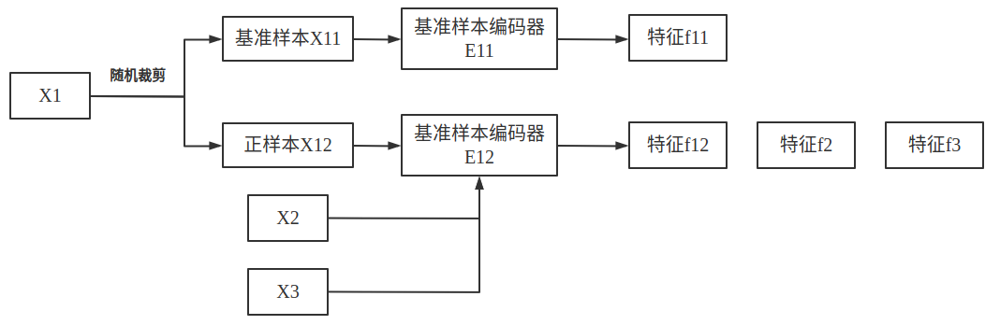
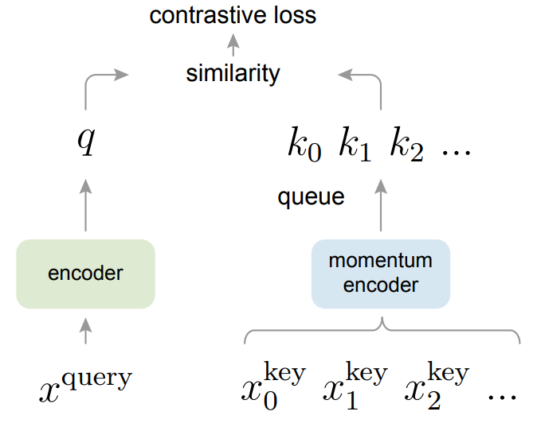
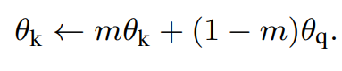
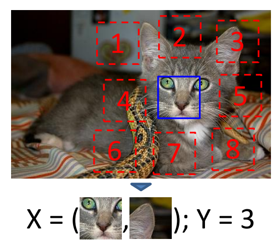
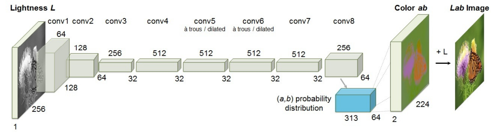
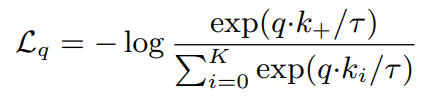
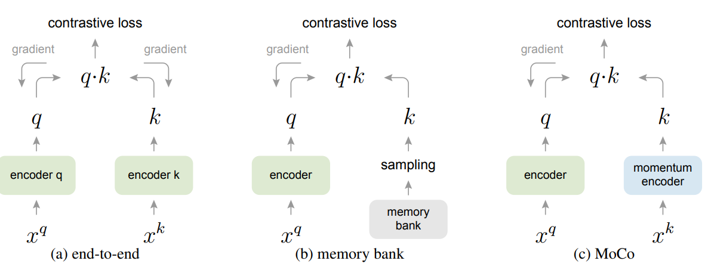
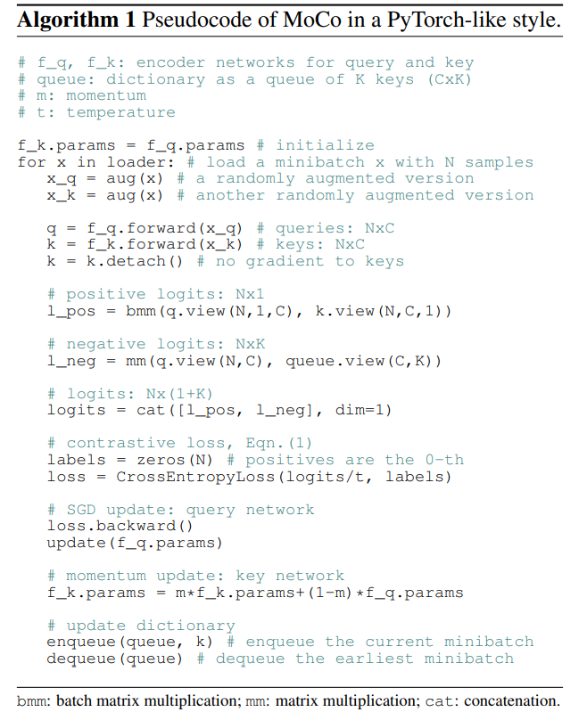

- https://zhuanlan.zhihu.com/p/579170120
- https://blog.csdn.net/weixin_37958272/article/details/119146821【翻译】
- https://blog.csdn.net/u013010889/article/details/103132778【一些基础】

- 谈到CV领域的自监督学习，离不开的就是恺明大神的MoCo和Hinton团队的SimCLR，之所以选择MoCo来进行解读，主要是MoCo相较SimCLR对GPU友好太多，可以让普通学生也有机会能去跑一下对比学习的实验。 本文以MoCo论文原文自顶向下的方式进行阐述（主要follow朱毅老师解读的角度），希望让读者阅读完除了对MoCO算法理解，对自监督和对比学习领域也能入门。

## **Introduction**

最近有一些基于对比学习的无监督学习的工作取得了不错的效果，这类对比学习方法的本质上是构造一个动态的字典。我们先解释一下对比学习。

举个例子，比如现在我们有3张图片，分别是x1、x2、x3。（1）**定义正负样本**：先对x1做2次随机裁剪，得到x11和x12两张新的图片，我们会先选择一张图片作为anchor基准点，比如我们选择x11为anchor，那么x12就为正样本positive，即相对于x1来说，x2是正样本（因为他们都是从同一张图片裁剪出来的）。剩下的x2和x3就为负样本negetive（因为他们根本就不是一张图片）。（2）**提取特征**：定义好正负样本之后，接下来就是将样本通过编码器得到对应的特征，基准样本x11会通过基准编码器E11得到一个基准特征f11，正样本x12会通过正样本编码器E12得到特征f12，负样本x2和x3也会通过正样本编码器得到特征f2和f3.之所以负样本和正样本用一个编码器是因为正负样本都是相对于基准样本来说的。（3）**对比学习**：对比学习就是让(基准样本特征f11,正样本特征f12)这样的特征对在特征空间里尽可能相近，让（基准样本f11，负样本f2 f3）在特征空间里尽可能远离，这样我们就理解了什么叫对比学习。

那为什么对比学习可以理解为一个动态的字典，是因为我们可以将基准样本特征f11看做是一个query，然后正负样本的特征当做是key，那么对比学习就转换为一个字典查询的问题，具体来说对比学习就是去训练一些编码器，从而进行字典查找的任务，查找的目的就是将已经编码好的query（f11），尽可能和他匹配的那个key的特征相似（f12），和其他负样本的key远离（f2 f3），因此就变成了一个最小化对比学习损失的问题（具体loss后面会介绍）。

从将对比学习当做动态字典的角度来看，作者认为要有好的结果这个字典需要有2个特性，第一个就是这个字典必须要大，第二个就是在训练的过程中要保持一致性。**（1）字典越大，就能更好的从这个连续高维的视觉空间抽样，因为字典里的key越多，所能表示的视觉信息视觉特征就越多，那么当你拿query去和key做比对的时候，你就更能学到将物体分开，更本质的特征。（如果特征太少，可能模型就走了捷径，通过某个不是本质的特征来进行分类）**。（2）一致性指的是字典里的key，都应该用相同或相似的编码器去产生得到的，这样你跟query去对比时，才能保证对比时尽量一致，否则如果不同的key使用不同的编码器得到的，那么query可能会选择和它本身使用相同或相似编码器得到的key，这样也就是变相走了捷径。但是目前所有已有的对比学习方法，都至少不满足其中一个特性。（后面具体展开）

MoCo本质上是希望给无监督学习构造一个又大又有一致性的字典，具体架构如上图所示。首先我们有一个query的图片，还有一些key的图片，这些图片分别通过各自的编码器得到一系列特征，然后query的特征去跟所有key的特征做对比，最后用对比学习的loss去训练整个模型。和前面的不同主要在于queue和momentum encoder。

**为什么我们要用一个队列去存储key的特征而不是用字典呢？**主要是受限于显卡的内存。因为如果字典很大，那我们对应就要输入很多图片，那显卡的内存肯定是吃不消的，所以我们需要想一个办法，**让这个字典的大小和每次模型去做前向过程时的batch size大小剥离开**，于是作者就想到一个巧妙的方法，即用队列这种数据结构来完成这种任务。具体来说就是这个队列可以很大，但是我们每次更新这个队列都是一点一点进行的，**即我们现在读入一个mini-batch的图片，那么最早的那个mini-batch就移出队列，这样就把batch size和队列大小分开了，这样队列的大小可以设为非常大，因为每次更新只更新这个队列里面mini-batch大小的特征梯度。**

但是作者前面提到字典里面的key需要保持一致性，**即最好是用同一个或者相似的编码器产生得到的。如果这个字典每个mini-batch的更新都是用不同的编码器，那得到的特征不就不一致了吗？所以作者提出momentum encoder**。具体如上图所示，θq代表query的编码器，θk代表key的编码器，**这样虽然key的编码器最开始是由query编码器初始化而来，可是在后面的每次更新中，如果我们选择了一个很大的动量（m），那么这个动量编码器θk的更新是非常缓慢的，**它不会跟着θq快速的改变，这样就保证了字典里的每个特征都是由相似的编码器得到的，尽最大可能保持了一致性。

说完了MoCo的架构，接下来该说应该选用**什么样的代理任务来充当自监督信号进行模型的训练了**。**因为MoCo只是建立中间模型的一个方式，它只是为对比学习提供了一个动态的字典，本文选择了一个比较简单的instance discrimination任务作为代理任务**。instance discrimination即一个query和一个key，**是同一个图片不同的视角（如裁剪），那么这个query就能和key配上对**。

**无监督的表征学习，最主要的目的就是在一个很大没有标注的数据集做完预训练后，这个预训练好的特征是可以直接迁移到下游任务上的**。MoCo在7个下游任务中都能超过用ImageNet做预训练的有监督学习方式！另外作者为了实验完整性，又做了一个新的实验，还把MoCo在facebook自己的一个十亿数据上做了预训练，结果也还能提升，证明MoCo可以在真实图片，并且有亿级规模图片的数据集上做的很好。**因此这些结果证实了MoCo可以在很多CV任务上把无监督学习和有监督学习的坑填平，甚至可以在真实应用中取代大家之前一直使用的用ImageNet预训练的模型。**

## **Related Work**

无监督学习或者自监督学习，一般就是在代理任务（pretext task）和目标函数上做文章。因为无监督学习区别于有监督学习最大的区别就是他的数据没有人工标注的label，那这个时候我们就可以**使用代理任务去生成“label”这种自监督的信号**，然后再用一些特别的目标函数去梯度反传训练模型，因此related work从这两块展开。

**代理任务一般指的是那些大家不太感兴趣的任务，即不是分类 分割 检测这种有实际应用的任务，这类任务的提出主要是为了学习一个好的特征。**而MoCo主要就是从目标函数上下手，他提出的又大又一致的字典主要影响的是后面InfoNCE这个目标函数的计算。

## **目标函数**

**一般无监督学习分为生成式和判别式。****生成式的无监督学习的损失函数就是去衡量模型的输出和应该得到的那个固定的目标之间的差异，比如用auto-encoders，输入一张低分辨的图，通过编码器解码器还原出一张高分辨率的图**，这里你可以使用L1 loss或L2 loss衡量原图和新建图之间的差异；

**判别式无监督学习有一些不同的做法。比如上图Unsupervised Visual Representation Learning by Context Prediction这篇文章的做法，如果有一张图片打成九宫格，现在将中间这个格子给你，再随机从剩下的格子中挑一格给你，代理任务就是预测随机挑选的格位于给你的格子的哪个方位，即把代理任务转换为8分类的任务。**再比如下图Colorful Image Colorization这篇文章，他的代理任务就是输入图像的灰度图，预测图片的色彩

除了判别式和生成式这种常见的目标函数，还有对比型的目标函数和对抗性的目标函数。**对比学习的目标函数主要是去一个特征空间里，衡量各个样本对之间的这个相似性，达到的目标就是让相似物体特征尽量拉近，不相似物体之间的特征推开尽量远**。对比学习和前两种目标函数最大的不同是**生成式（重建整张图）和判别式（预测8个位置）的目标都是一个固定的目标**，但是**对比学习的目标在训练过程中是不停的改变的，目标是由一个编码器抽出来的这个数据特征而决定的，也就是MoCo这篇文章的字典**。

**还有一种方法就是对抗型的目标函数，他主要衡量的是两个概率分布之间的差异，一开始主要是用来做无监督的数据生成的。**但是后来也有一些对抗性的方法拿来去做特征学习了，因为大家觉得要是能生成很好的图片，那应该是学到了这个数据的底层分布，那这样模型学出来的特征也是不错的。

## **代理任务**

代理任务的类型就比较多了，**比如有的文章的代理任务是重建整张图，有的任务是重建重建整个patch，还有很多代理任务是去生成一些伪标签，比如exemplar image，即给一张图片做不同的数据增广，这些生成的图片都是同个类等等**。

无监督/自监督学习方法通常涉及两个方面：pretext tasks和损失函数。"pretext"一词意味着被解决的任务不是真正感兴趣的，而只是为了学习一个好的数据表示的真正目的而解决的。损失函数通常可以独立于pretext任务进行研究。MoCo专注于损失函数方面。接下来我们讨论这两个方面的相关研究。

Loss functions. 定义损失函数的常见方法是测量模型的预测和固定目标之间的差异，例如通过L1或L2损失重建输入像素（如自动编码器），或通过交叉熵或margin-based losses将输入分为预先定义的类别（如八个位置[13]，颜色分栏[64]）。其他替代方案，如接下来描述的，也是可能的。

对比性损失[29]测量样本对在一个表示空间中的相似性。在对比性损失公式中，不是将一个输入与一个固定的目标相匹配，而是将 输入与一个固定的目标相匹配，而在对比性损失公式中 目标可以在训练过程中实时变化，并且可以定义为 可以用网络计算的数据表示法来定义。 [29]. 对比性学习是最近几个无监督学习的核心 的核心[61, 46, 36, 66, 35, 56, 2]。我们将在后面的内容中详细介绍（第3.1节）。

对抗性损失[24]衡量概率分布之间的差异。它是一种广泛成功的无监督数据生成技术。代表性学习的对抗性方法在[15, 16]中进行了探讨。生成式对抗网络和噪声对比估计（NCE）[28]之间存在着关系（见[24]）。

Pretext tasks. 已经提出了一系列广泛的Pretext任务。例子包括在某些破坏下恢复输入，例如去噪自动编码器[58]，上下文自动编码器[48]，或跨通道自动编码器（着色）[64, 65]。一些借口任务通过以下方式形成伪标签，例如，单个（“典范”）图像的变换[17]，patch排序[13, 45]，跟踪[59]或在视频中分割物体[47]，或聚类特征[3, 4]。

Contrastive learning vs. pretext tasks. 各种Pretext 任务都可以基于某种形式的对比性损失函数。instance discrimination method [61]与exemplar-based task[17]和NCE[28]有关。对比性预测编码（CPC）[46]中的Pretext 任务是上下文自动编码的一种形式[48]，而在对比性多视图编码（CMC）[56]中，它与着色有关[64]。

## **对比学习和代理任务**

不同的代理任务是可以和某种形式的对比学习目标函数配对使用，比如MoCo使用的instance discrimination的方式，就和examplar-based代理任务很相关

## **Method**

## **对比学习和字典查找**

对比学习可以认为就是训练一个编码器来做字典查找的任务。假设有一个编码好的query q，还有一系列编码好的样本特征k组成一堆key，假设字典里只有一个key和query是配对的，把这个key叫做k+。之所以这么考虑和我们前面举的个体判别的代理任务有关，我们会先拿出一个图片，裁剪成2张图片，那么这就是唯一的一对正样本对。定义好了正样本和负样本，就需要定义对比学习的目标函数了。对比学习的目标函数最好满足下面的特性：当q和唯一的正样本k+相似时，loss的值比较低，当query q和其他所有key不相似时，这个loss也应该低，如果达到了这两种状态证明我们的模型基本训练好了。在MoCo里就采用InfoNCE loss的方式来训练整个模型。

我们从softmax开始讲起。softmax表达式大家都很了解，即如下式所示

softmax(x)i=exi∑jexj

如果在有监督学习范式下，即我们有一个one-hot向量，那我们就可以在softmax前加上一个-log，就成为了cross entropy loss

crossentropy(x)i=−logexi∑jexj

这里的k指的是这个数据集一共有多少类别，比如ImageNet的话就是1000类，是一个固定的数字。对比学习理论上也是可以使用交叉熵去学习，但是实际上行不通。比如我们使用instance discrimination这个代理任务去当自监督信号的话，那这里的类别数k将会是一个巨大的数字，比如在ImageNet下这个k就不是1000了，而是128万了，即有多少图片就有多少类。但是softmax操作在有这么多类别时是没法计算的，而且这里还有exp的操作，当这个向量维度是几百万的时候，计算复杂度是相当高的，如果每个前向都要算一次这样的loss，训练时间会被大大延长。因此NCE（noise contrastive estimation） loss就被提出来了。

前面提到因为类别太多造成无法计算，那么NCE就简化成了一个二分类问题。一个类别就是数据类别data sample，一个类别就是噪声类别noise sample，每次只要拿数据样本和噪声样本对比即可。但是如果还是把整个数据集剩下的图片都当做是负样本，但是计算复杂度还是没有降下来，那还有什么办法可以加速计算呢？只能取近似了。即与其在整个数据集上算loss，不如从这个数据集里去选一些负样本算loss就可以了。但是我们也知道，按照一般的规律如果这里选择的样本很少，效果就没那么近似了，所以MoCo一直在强调字典要足够大，这样做近似才能足够准。

InfoNCE就是NCE的一个简单变种，他认为如果只把问题看作是二分类，可能对模型学习没那么友好，毕竟在那么多噪声样本里大家很可能不是一个类，所以还是看做一个多分类的问题比较合适。因此InfoNCE就被提出了：

这里的q乘k+相当于是logit，类比于softmax里面的x，这里的τ是一个温度的超参数，如果这个超参数变大，就会让分布里的数值都变小，尤其经过exp之后就变得更小了，最后就会导致这个分布变得更平滑。相反取的超参数变小，会导致分布更集中。如果温度设的越大，那对比损失对所有负样本都一视同仁，导致模型的学习没有轻重，如果设置的越小，会让模型只关注那些特别困难的负样本，而这些特别困难的负样本可能是潜在的正样本（很难判断是负样本的样本自然可能是正样本），如果模型过分关注这类样本，会导致模型很难收敛或者学好的特征不好去泛化。

这里还要注意，InfoNCE中的k指的是负样本的数量，公式下面的sum是在一个正样本和k个负样本上做的，仔细想想这个InfoNCE loss就是一个cross entrpy loss，它做的就是一个k+1类的分类任务，目的就是把q这个图片分成k+这个类，所以读到这InfoNCE大家就理解了。

现在我们有了代理任务，有了目标函数，接下来就该讨论下输入和模型大概是什么了。这个具体的输入是由代理任务决定的，比如在代理任务不一样时，输入的xq和xk既可以是图片，也可以是图片块，或者是含有上下文的一系列图片块。对于模型，query编码器fq和key 编码器fk可以是想等的（架构一样且参数共享），也可以是参数部分共享，也可以是彻底不一样的两个网络。

## **Momentum Contrast**

### **把字典看作是队列**

在intruduction我们提到，McMo把字典看作是一个队列，每次有一批新的key进来，就有一批老的key移出去。所以作者说用队列的好处，可以让我们重复用那些已经编码好的key，而这些key是从之前的那些mini-batch里得到的，这样就可以把batch的大小和字典的大小剥离开了，就可以在模型的训练过程中使用一个比较标准的mini-batch size，一般就是128或者256，但是字典大小变得非常大，可以当做一个超参数一样单独设置。这个字典是所有数据的一个子集，我们前面提过InfoNCE算loss的时候，只是取一个近似，而不是在整个数据集上算一个loss。另外使用队列这个数据结构，可以让维护这个字典的计算开销非常小。

最后作者又重复了一下为什么要使用队列这个数据结构的原因，使用队列是因为队列里有这个先进先出的特性，这样每次移出队列，都是最早的那些mini-batch，这样对对比学习来说是很有利的，因为从一致性的角度来说，最早计算的那些mini-batch的key是最过时的，即跟最新算的mini-batch是最不一致的（因为最早产生的mini-batch的更新 是用最老的编码器产生的）。

### **动量更新**

用队列的思想可以让字典变得非常大，但是因为使用了非常大的字典，所以我们没法对队列里所有的元素去进行梯度反传了，即key编码器没法通过反向传播更新他的参数。那该怎么更新key编码器呢？很简单，每个训练iter结束后，把更新好的query编码器参数fq直接复制过来给key编码器fk，这个方式很简单但是效果很不好。这样更新的方法很不好，因为快速更新的key编码器，降低了队列里所有key的这个特征的一致性（队列里大量的key是由很不同的编码器产生的），因此作者提出了动量更新的方式：

这里introduction介绍过了就不重复了。熟悉RL的小伙伴估计已经看出了这和我们double DQN的思想非常一致。。。因为用了动量更新的方式，所以虽然队列里的key都是由不同的编码器得到的，但是因为编码器之间的区别太小，所以key的一致性还是很强的。在作者的实验里，用了相对比较大的动量，就是0.999，效果比0.9好得多。因此说明了动量更新对队列一致性的重要性。

### **和之前方法的对比**

如上图a所示，之前的方法第一种类型为端对端学习。端对端学习顾名思义即query和key的编码器都可以通过梯度回传来更新模型参数，这里两个编码器是同一个编码器，用的数据也都是一个mini-batch的数据，做一次forward就能得到所有样本的特征，而且这些样本特征因为是通过同样编码器得到，所以也是高度一致的。但是这种方法的局限性就在于字典的大小，因为在端对端的学习框架中，字典的大小和mini-batch size的大小是等价的，那如果我们想要一个很大的字典，里面有成千上万个key的话，也就意味着mini batch的大小也是成千上万的，这样难度就很高的，因为现在的GPU一般塞不下这么大的batch size的。就算你的GPU能塞下这么大的batch size，大batch size的优化也是一个难点，如果处理不得当，模型是很难收敛的。因此端对端学习的方式就是受限于字典的大小。另一篇很出名的SimCLR就是这种端对端训练的方式，当然他用了更多的这个数据增强，而且提出了在编码器之后再用一个projector会让学到的特征大大变好，他们之所以这么做，因为google有tpu，tpu内存大，所以可以用大的batch size，他们就是用了8192为batch size，这样最后负样本的规模就可以做端到端的学习了。

看完端对端的学习后，我们发现他的优点在于编码器是可以实时更新的，所以他字典里的一致性是非常高的，但他的缺点在于字典的大小就是mini-batch的大小，导致这个字典不能设的过大，否则硬件吃不消。因此第二种方式应运而生：关注字典的大，而不太关注一致性。在memory bank里，只有一个query编码器，是可以通过梯度回传更新的。memory bank就是把整个数据集的特征都存在一起，比如imagenet的memory bank就有128万个特征，听起来虽然很大，但是每个特征只有128维，所以这样算下来整个memory bank也只需要600兆的空间就能都存下来。有了memory bank后，每次训练只需要从这个memory bank里去随机抽样很多key当字典即可。但这样的话由于memory bank里不同的key是由不同时刻不同的编码器计算出来的，所以每次抽出来若干个key进行计算时，无法保证这些key的特征具有一致性。

## **伪代码**

最后作者提供了一个伪代码：首先我们初始化一个query编码器，然后把参数复制给key编码器。接下来从dataloader拿一个batch的数据，接下来就是得到正样本对。所以从x开始，先做一次数据增强，得到了一个query图片，然后再做一次数据增强，得到了一个key图片。然后将query图片通过query编码器得到特征，key图片通过key编码器得到特征，当然这里key的特征需要用detach做梯度截断来保证key编码器不更新。接下来就是算NCE loss，对query编码器更新，对key编码器进行动量更新，最后将新的key入队，老的key退出队列。

- 实验部分我就不做一一解读了，总之就是MoCo潜力很大，在很多CV任务超过了有监督的方法，而且学到的特征可以很好的迁移到下游任务中，至此本文介绍结束，如果读者一直阅读到这关于MoCo的细节和无监督，对比学习应该也已经了解了。

Review Unsupervised/self-supervised
Pretext tasks
首先做无监督CV的表示学习，需要想一个pretext，比如NLP中的完形填空：抽取小说中一段话，随机扣除一个词，预测出改词。
CV中pretext有

- 去噪：原图加一些噪声送入网络输出去噪后的图
- 上色：将原图变成灰度图送入网络输出上色后的图
- 旋转图片预测角度
- 扣除原图的某一个patch，要求网络补出来
- 将图片切分几块后打乱，要求给出每块正确的位置
- 打乱一段视频帧给出正确的顺序或者判断一段视频帧是否被打乱过
- GAN中数据生成
- 对图片进行随机augmentation(crop，颜色抖动等等)，然后判断一对图片是否来自于同一张图片，本文采用的该pretext
- 等等

Loss functions

- L1 or L2 losses：比如pretext去噪上色等任务都可以用
- cross-entropy or margin-based losses：比如pretext给出打乱图片块的正确位置
- Adversarial losses：测量两个分布的差异，常用于GAN，无监督数据生成
- Contrastive losses：测量一对样本在表示空间里的相似度，起源于Yann LeCun “Dimensionality Reduction by Learning an Invariant Mapping”
- 主要是用在降维中，即本来相似的样本，在经过降维（特征提取）后，在特征空间中，两个样本仍旧相似；而原本不相似的样本，在经过降维后，在特征空间中，两个样本仍旧不相似。

1、与无监督学习比较

无监督：至少一个特征与相同类相同，至少一个特征具有足够的差异性与其他类不同。对输入分布进行建模。

自监督：学习在输入样本之间进行判别的表示。

2、评估了增强参数对分类性能的影响

NCE:https://blog.csdn.net/weixin_31866177/article/details/115527760

https://zhuanlan.zhihu.com/p/586247367