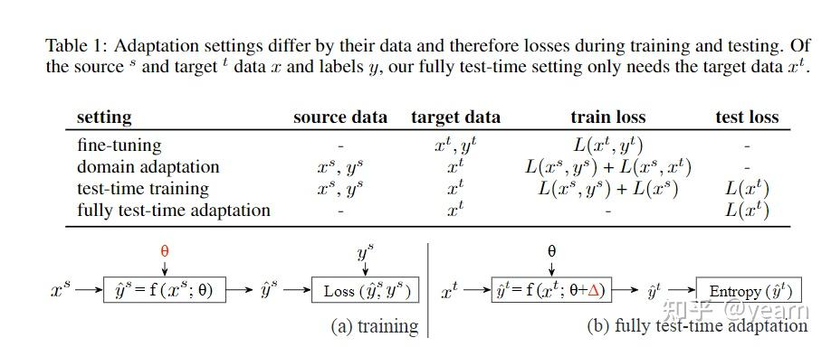

# Test time adaptation方法总结

https://zhuanlan.zhihu.com/p/559916666

Domain generalization（DG: 域泛化）一直以来都是各大顶会的热门研究方向。DA假设我们有多个个带标签的训练集（源域），这时候我们想让模型在另一个数据集上同样表现很好（目标域），但是在训练过程中根本不知道目标域是什么，这个时候如何提升模型泛化性呢？核心在于如何利用多个源域带来的丰富信息。DG最困难的地方在于test-sample的不可知，训练时不可用，**近期有一系列方法开始尝试假设test sample以online的形式出现，**然后利用其信息增强泛化性，下表总结了test time adptation方法与传统DA，DG方法的区别

- 传统dg方法就是在源域finetune预训练模型，然后部署时不经过任何调整。

- DA方法可以根据无标签的目标域数据在训练时调整模型，
- test-time training方法在测试时会有一些无监督损失比如检测旋转角度等，然后对每个test sample也会进行旋转角度的检测，
- 本文所述的fully test-time adaptation在training 的时候不需要无监督损失，而只需要在test的时候进行[adaptation](https://zhida.zhihu.com/search?content_id=212558585&content_type=Article&match_order=2&q=adaptation&zhida_source=entity)。