# Test-Time Adaptation 1

> https://zhuanlan.zhihu.com/p/631274637

不同于 DA 和 DG ，TTA 方法通过在线地利用测试数据调整模型来克服 domain shift 问题，目前主流方法大致有两类：Test-Time Training 与 Fully TTA

## 1. Test-Time Training

- **TTT**

[[ICML 2020$ Test-Time Training with Self-Supervision for Generalization under Distribution Shifts.](https://link.zhihu.com/?target=https%3A//arxiv.org/abs/1909.13231)

- https://yueatsprograms.github.io/ttt/home.html

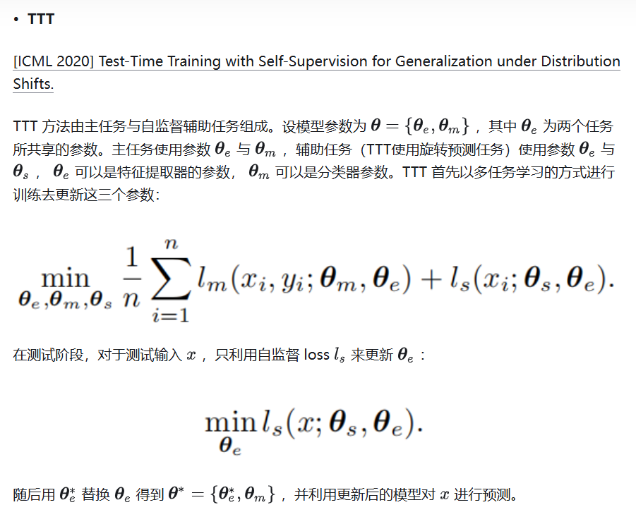

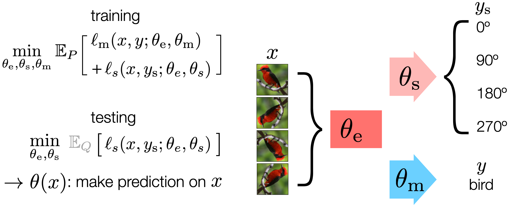

我们使用自监督方法从未标注的输入中创建标签。这里使用的自监督形式是旋转预测（Gidaris 等，2018），它通过将输入图像以 90° 的倍数旋转，并要求模型解决一个四分类问题。我们的模型包括一个自监督头部 $ \theta_s $ 和一个主任务头部 $ \theta_m $，它们基于一个共享的特征提取器 $ \theta_e $。

在训练阶段，我们联合优化自监督损失 $ \ell_s $ 和主任务损失 $ \ell_m $，基于训练分布 $ P $，其中主任务标签 $ y $ 是可用的。在测试阶段，我们无法获取主任务标签，但仍然可以基于从 $ Q $ 中抽取的单一测试输入优化自监督损失（由于该期望值可能存在噪声，故将其灰显）。这产生了 $ \theta(x) $，然后我们使用它对 $ x $ 进行预测。

- **TTT++**

[[NeurIPS 2021$ TTT++: When Does Self-Supervised Test-Time Training Fail or Thrive?](https://link.zhihu.com/?target=https%3A//papers.nips.cc/paper/2021/hash/b618c3210e934362ac261db280128c22-Abstract.html)

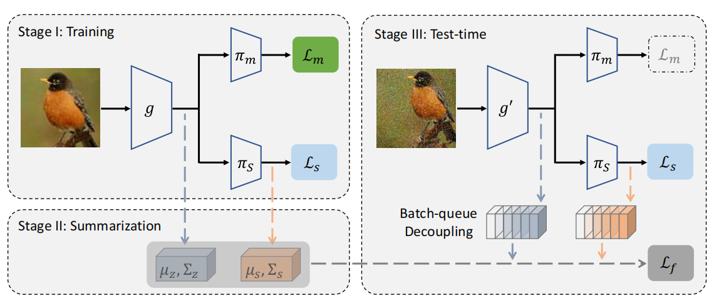

> 图 2: 我们修改后的测试时间训练版本 (TTT + +)。我们的方法包括三个阶段： 模型训练、离线特征汇总和在线测试时间自适应。(i) 在训练过程中，针对主要任务和辅助对比自监督任务联合优化模型。(ii) 训练完成后，以一阶矩和二阶矩的形式总结了编码器和自监督头后的特征分布。(iii) 在测试时，我们通过在线特征对齐 (第 3.2 节) 和自我监督学习 (第 4.2 节) 来调整编码器。在批量有限的情况下，我们维持一个大的动态队列的特征向量鲁棒矩估计 (第 3.3 节)。

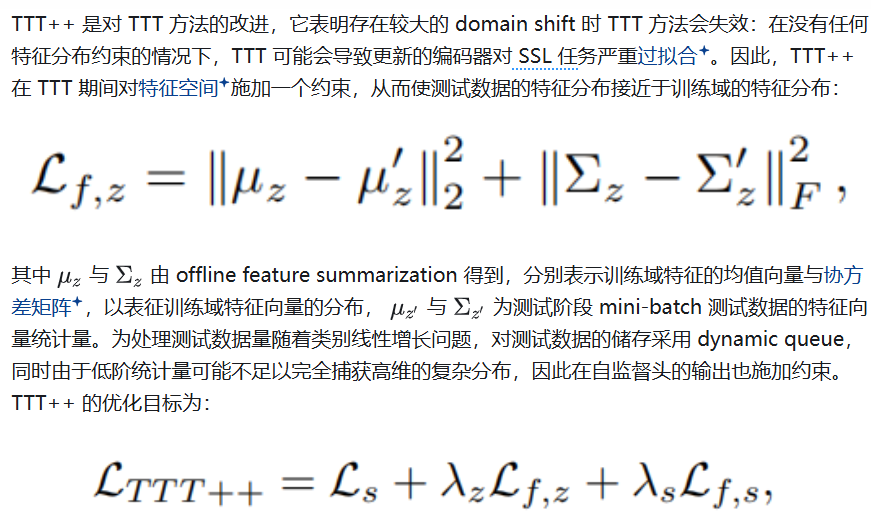

> 解释上面最后一行公式，在线矩匹配的基本形式可能存在局限性，因为低阶统计量可能不足以完全捕捉高维空间中的复杂分布，例如，标准 ResNet-50 的维度为 2048。为了解决这个问题，我们在编码器输出和自监督头输出的特征分布上进行对齐，这些输出的维度较低，例如，在第 4.2 节中描述的对比学习情况下为 128。我们在测试时的最终目标是加权组合自监督损失 $ \mathcal{L}_s $、编码器处的特征对齐损失 $ \mathcal{L}_{f,z} $ 和自监督头的损失 $ \mathcal{L}_{f,s} $，即：
>

> $
> \mathcal{L}_{TTT++} = \mathcal{L}_s + \lambda_z \mathcal{L}_{f,z} + \lambda_s \mathcal{L}_{f,s},
> $
>
> 其中 $ \lambda_z $ 和 $ \lambda_s $ 是控制每项权重的超参数。

> SSL 任务："SSL 任务"指的是自监督学习（Self-Supervised Learning）任务

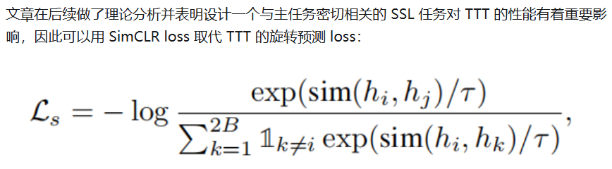

> 解释 优化目标：**通过对比学习进行测试时训练**
>
> 我们上文的理论分析揭示了在测试时训练中引入一个与主任务高度相关的自监督任务的重要性。一种量化两个任务之间关系的实际方法是测量从一个任务学习到的表示转移到另一个任务的可迁移性 [32]。考虑到对比方法在视觉表示预训练方面的显著结果 [9, 12, 33, 34]，我们假设它们也可以作为测试时训练的合适选择。
>
> 因此，我们用 SimCLR [12] 中的旋转预测任务替代了视觉识别的上下文。给定包含 $B$ 张图像的小批量数据，我们对每张图像进行数据增强以生成两个视图，并将这两个视图对视为正样本对，而其他图像对视为负样本对。每张图像 $x_i$ 的特征向量 $z_i = g(x_i)$ 通过我们的自监督头 $h_i = \pi_s(z_i)$ 被投影到一个低维空间中。来自正样本对 $\langle h_i, h_j\rangle$ 的投影嵌入被假设比负样本对的嵌入更接近。
>
> 通过以下损失函数，我们计算投影嵌入之间的距离：
>
> $
> \mathcal{L}_s = - \log \frac{\exp(\text{sim}(h_i, h_j)/\tau)}{\sum_{k \neq i}^{2B} \mathbb{1}_{k \neq i} \exp(\text{sim}(h_i, h_k)/\tau)},
> $
>
> 其中，$\tau$ 是温度缩放参数。投影嵌入之间的相似性通过余弦相似性度量：
>
> $
> \text{sim}(u, v) = \frac{u^T v}{\|u\| \|v\|}。
> $

## 2. Fully TTA

相较于 TTT 方法，Fully TTA 并不改变训练过程，其只能利用预训练好的模型和测试时的输入。以下方法大部分都为 Fully TTA。

### 2.1. **Entropy Minimization**

- **TENT**

  [[ICLR 2021$ Tent: Fully Test-time Adaptation by Entropy Minimization.](https://link.zhihu.com/?target=https%3A//arxiv.org/abs/2006.10726)

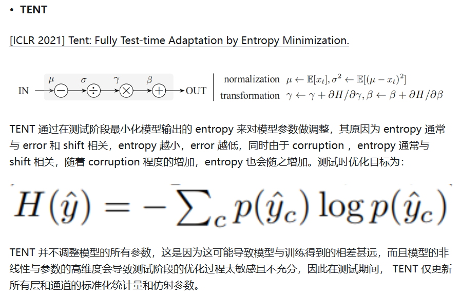

- **MEMO**

[NeurIPS 2022 MEMO: Test Time Robustness via Adaptation and Augmentation.](https://link.zhihu.com/?target=https%3A//arxiv.org/abs/2110.09506)

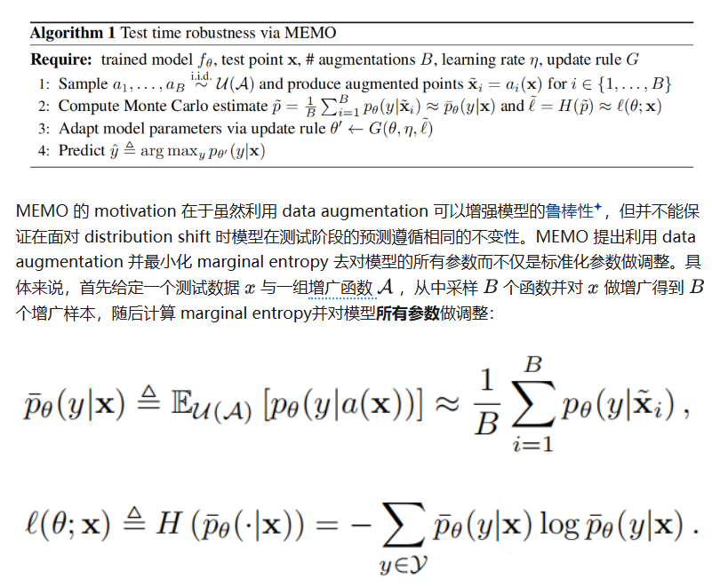

> "边际熵" (marginal entropy) 是信息论中的一个概念，用于衡量一个随机变量的不确定性或信息量。对于一个离散随机变量 $ X $，其边际熵 $ H(X) $ 可以通过下面的公式来计算：
>
> $ H(X) = -\sum_{x \in X} P(x) \log P(x) $
>
> 其中 $ P(x) $ 是随机变量 $ X $ 取值为 $ x $ 的概率，而求和是对 $ X $ 所有可能的取值进行的。
>

算法简介

算法 1 介绍了整体方法 MEMO。其让损失最小化到利用梯度更新网络参数，然后预测，一气呵成。

算法 1：通过 MEMO 实现测试时的鲁棒性

**Require:** 训练好的模型 $f_\theta$，测试点 $\mathbf{x}$，增强数量 $B$，学习率 $\eta$，更新规则 $G$。

1. 从增强集合 $ \mathcal{A} $ 中独立同分布 (i.i.d.) 采样 $a_1, \dots, a_B $，并生成增强后的数据点 $\tilde{\mathbf{x}}_i = a_i(\mathbf{x})$，其中 $i \in \{1, \dots, B\}$。
2. 计算估计值：
   $
   \tilde{p} = \frac{1}{B} \sum_{i=1}^B p_\theta(y|\tilde{\mathbf{x}}_i) \approx \bar{p}_\theta(y|\mathbf{x}),
   $
   和
   $
   \tilde{\ell} = H(\tilde{p}) \approx \ell(\theta; \mathbf{x}),
   $
   即公式 (2)。
3. 使用更新规则 $G(\theta, \eta, \tilde{\ell})$ 根据参数调整模型：$\theta' \leftarrow G(\theta, \eta, \tilde{\ell})$。
4. 预测输出：
   $
   \hat{y} \triangleq \arg \max_y p_{\theta'}(y|\mathbf{x}).
   $

- **SAR**

[[ICLR 2023\] Towards Stable Test-Time Adaptation in Dynamic Wild World.](https://link.zhihu.com/?target=https%3A//arxiv.org/abs/2302.12400)

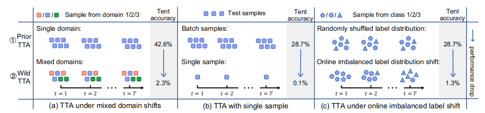

这份工作主要研究的是开放世界中的 TTA ，相较于先前的 TTA ，开放世界中的 TTA 会面临三个问题：(1) 存在多种 distribution shift；(2) 小的 test batch size；(3) 在线的不平衡 label distribution shift。

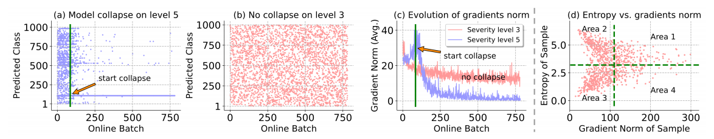

作者首先指出 BN 层是导致开放世界 TTA 性能不佳的关键阻碍，并依据上述三个问题给出了三个原因。随后作者提出利用能更好地利用全局数据分布信息的 GN/LN 来代替 BN。然而实验结果表明直接在 GN 上利用 entropy minimization 做调整会导致模型坍缩，作者提出对测试样本进行筛选来解决这一问题，即只需要 Area 3 中的样本，这可以通过两个方面实现：

(1) 筛掉高 entropy 样本：

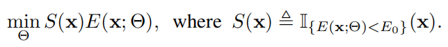

(2) 引入模型的 sharpness 使模型不对 Area 4 中样本产生的高梯度敏感：

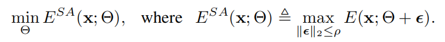

总的来说，优化目标为：

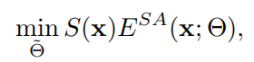

其中 $\tilde{\Theta} \subset \Theta$ 为要被调整的参数。优化完成后，便可以用调整后的模型对测试输入做预测。

### 2.2. Batchnorm Statistics Adaptation

- [[NeurIPS 2020\] Improving robustness against common corruptions by covariate shift adaptation.](https://link.zhihu.com/?target=https%3A//arxiv.org/abs/2006.16971)

这篇文章提出通过将 source domain 与 target domain 的 BN 统计量进行结合来调整原先的 BN 统计量，以减轻 intermediate covariate shift，提升对于 corruption 的鲁棒性。

- **TNN**

[[ICLR 2023\] TTN: A Domain-Shift Aware Batch Normalization in Test-Time Adaptation.](https://link.zhihu.com/?target=https%3A//arxiv.org/abs/2302.05155)