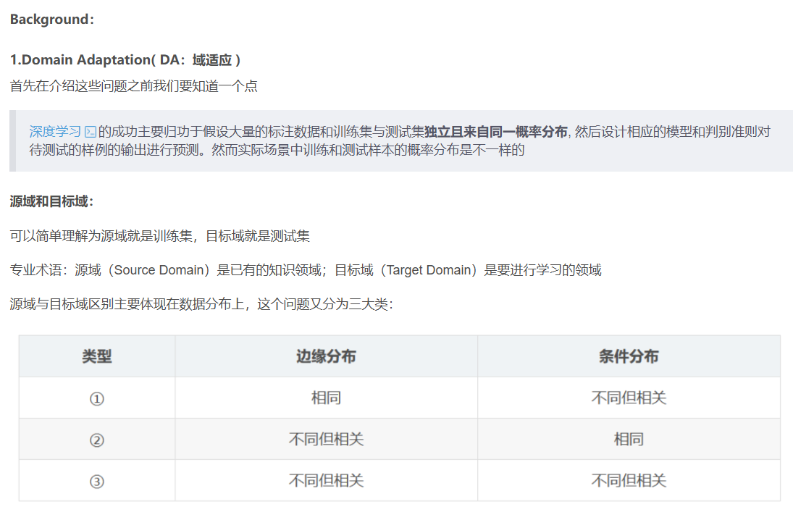
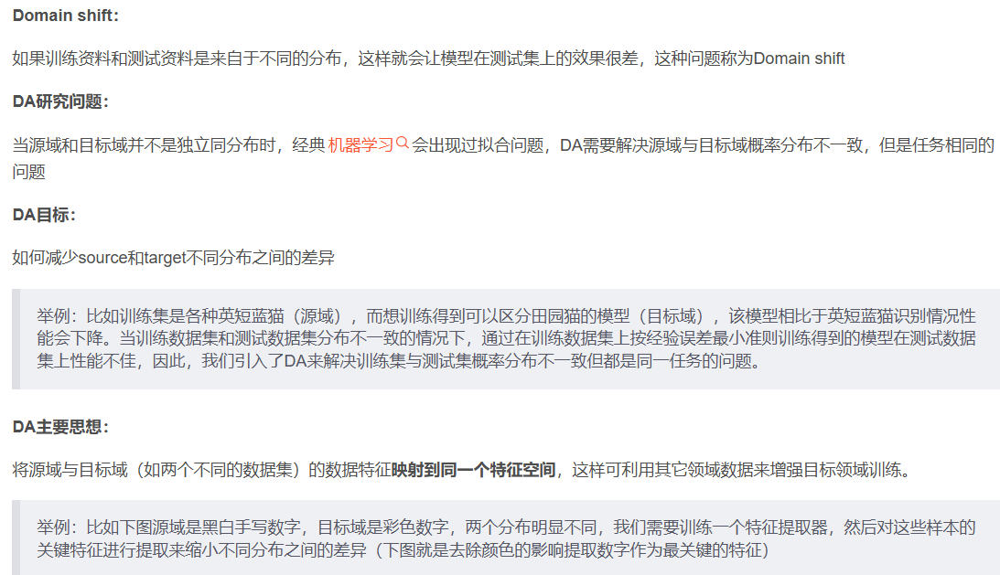
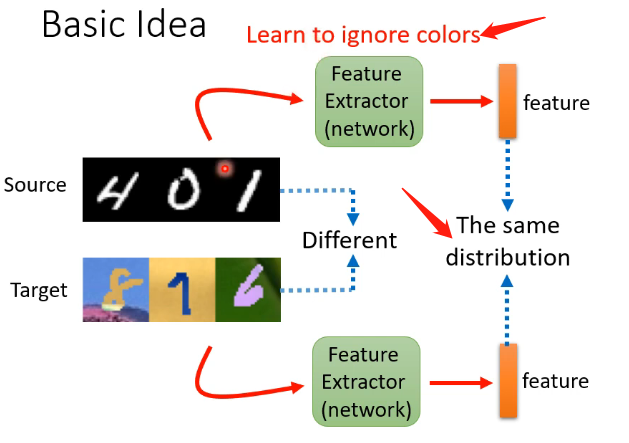
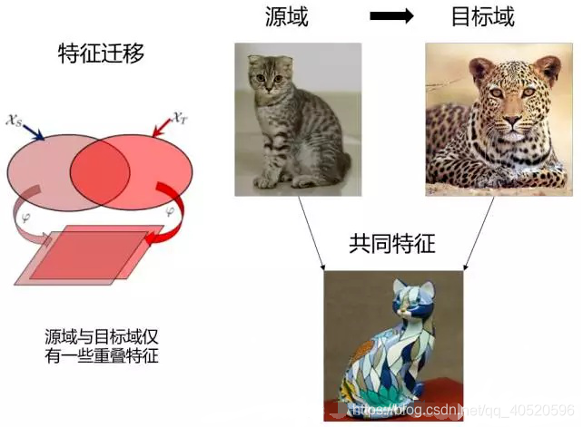

- https://blog.csdn.net/goodenough5/article/details/138326187
- https://blog.csdn.net/Scabbards_/article/details/135823589

**分布变化下的Test-Time adaption 综述**

Background
传统机器学习假设训练和测试数据是分开的。然而当测试分布(目标)与训练分布(源)不同时，**我们面临分布移位distribution shifts的问题。**e.g天气，相机等

域泛化domain generalization(DG)[5]旨在使用来自一个或多个源域的数据来学习模型，该模型可以很好地泛化到任何非分布的目标域。另一方面，领域自适应(domain adaptation, DA)[6]遵循转导学习原理，将知识从标记的源领域转移到未标记的目标领域。DG只在训练阶段操作，**而TTA的优势在于能够在测试阶段从目标域访问测试数据。这使得TTA能够通过适应可用的测试数据来提高识别性能。**

Classification

- 测试时域自适应 (Test-time Domain Adaptation, TTDA):

定义： 在测试时，模型通过对目标域的数据进行适应来提高性能，以便更好地适应新的领域。

特点： 主要关注在测试时适应模型，以适应目标领域的分布，从而提高性能。

- 无源域自适应 (Source-Free Domain Adaptation, SFDA):

定义： 类似于测试时域自适应，但是在这种情况下，模型在没有目标域标签的情况下进行适应。

特点： SFDA关注在没有目标域标签的情况下适应模型，这对于目标领域没有标签信息的情况下非常有用。

- 测试时批次自适应 (Test-time Batch Adaptation, TTBA):

定义： 在测试时，模型根据目标领域的一批样本进行适应，而不是整个领域。

特点： TTBA注重通过处理目标领域中的一小批样本来进行适应，以更好地适应该批次的分布。

- 在线测试时自适应 (Online Test-time Adaptation, OTTA):

定义： 在测试时，模型通过动态地从目标领域中获取适应数据来进行实时适应。

特点： OTTA强调在测试时实时地适应模型，以便模型能够根据不断变化的目标领域动态调整。

- 测试时先验自适应 (Test-time Prior Adaptation, TTPA):

定义： 在测试时，模型利用先验知识或先验信息来进行适应，以提高性能。
特点： TTPA强调在测试时利用模型之前学到的先验知识，以便更好地适应新的任务或领域。

## 域适应与域泛化

DA三种方法：

样本自适应Instance adaptation：将源域中样本重采样，使其分布趋近于目标域分布；从源域中找出那些长的最像目标域的样本，让他们带着高权重加入目标域的数据学习。

特征自适应 Feature adaptation：将源域和目标域投影到公共特征子空间，这样两者的分布相匹配，通过学习公共的特征表示，这样在公共特征空间，源域和目标域的分布就会相同。

模型自适应 Model adaptation：考虑目标域的误差，对源域误差函数进行修改。假设利用上千万的数据来训练好一个模型，当我们遇到一个新的数据领域问题的时候，就不用再重新去找几千万个数据来训练，只需把原来训练好的模型迁移到新的领域，在新的领域往往只需相对较少的数据就同样可以得到很高的精度。实现的原理则是利用模型之间存在的相似性。

DA中又分别可以根据目标域数据的打标签情况分为监督的、半监督的、无监督的DA。学术界研究最多的是无监督的DA，这个比较困难而且价值比较高。

如果目标域数据没有标签，就没法用Fine-Tune把目标域数据扔进去训练，这时候无监督的自适应方法就是基于特征的自适应。因为有很多能衡量源域和目标域数据的距离的数学公式，那么就能把距离计算出来嵌入到网络中作为Loss来训练，这样就能优化让这个距离逐渐变小，最终训练出来的模型就将源域和目标域就被放在一个足够近的特征空间里了。

具体用于无监督DA的DDC，MADA，RevGrad等算法后期需要再进行阅读

2.Domain generalization( DG：域泛化 )
DG是DA的进一步推广，DG与DA的区别：

DA在训练时可以拿到少量目标域数据，这些目标域数据可能是有标签的（有监督DA），也可能是无标签的（无监督DA），但是DG在训练时看不到目标域数据

DG研究问题：

通过带标签的源域学习一个通用的特征表示，并希望该表示也能应用于未见过的目标域

DG目标：

学习域无关的特征表示

DA和DG优点：

- DA关注如何利用无标注的目标数据，而DG主要关注泛化性
- DA不够高效，每来一个新域，都需要重复进行适应，而DG只需训练一次；
- DA的强假设是目标域的数据是可用的，显然有些情况是无法满足的，或者代价昂贵。
- DA的性能比DG的性能要高，由于使用了目标域的数据；
- 简单说DA由于要使用目标域中的数据，因此DA性能高，而DG去学习一个通用特征表示，因此DG泛化性更强

毫无疑问，DG是比DA更具有挑战性和实用性的场景：毕竟我们都喜欢“一次训练、到处应用”的足够泛化的机器学习模型。

DG分类：

DG主要分为单源域DG和多源域DG

3. Test-time adaptation (TTA)
TTA研究问题：

在测试样本上在线对模型进行调整，在拿到样本后模型需要立刻给出决策并更新。

TTA目标:

最终使得调整后的模型可以拟合目标域数据分布或者将目标域特征映射到源域特征分布。

TTA、DA、DG区别：

DG需要对目标域进行预先假设，在源域 finetune 预训练模型，然后部署时不经过任何调整。

> ### 句子逻辑梳理
>
> 1. **对目标域进行预先假设**：在DG方法中，由于无法直接获取目标域的标注数据，因此需要对目标域的特性进行一定的假设。这些假设可能是关于目标域数据分布的某些规律、特征的相似性等方面。例如，假设目标域的数据在某些关键特征上与源域数据有一定的相似性，或者假设目标域的数据分布不会发生剧烈变化等。这些预先假设为模型的设计和训练提供了一个大致的方向和依据，帮助模型在没有目标域标注数据的情况下，能够朝着适应目标域的方向进行学习。
> 2. **在源域finetune预训练模型**：首先，使用源域的数据对一个预训练模型进行微调。预训练模型通常是在大规模的数据集上训练得到的，已经具备了一定的通用特征表示能力。通过在源域数据上进行微调，模型可以进一步优化其参数，使其更加贴合源域的特征和规律。这一步的目的是让模型在源域上达到较好的性能，同时也为后续的域泛化打下基础。例如，如果是一个图像分类任务，源域是动物图像数据，那么在源域微调过程中，模型会学习到如何区分不同动物的特征，如形状、纹理、颜色等。
> 3. **部署时不经过任何调整**：当模型经过在源域的微调后，直接将其部署到目标域上，而不再对模型进行任何额外的调整。这意味着模型需要依靠在源域学习到的知识和特征表示，以及对目标域的预先假设，来直接在目标域上进行预测或完成任务。这体现了域泛化的挑战性，即模型需要具备足够的泛化能力，能够在没有目标域标注数据的情况下，自动适应目标域的数据分布，并给出合理的输出。例如，将经过在城市A交通图像数据微调的模型，直接部署到城市B的交通监控系统中，用于识别车辆类型等任务，而无需再对模型进行针对城市B数据的调整。

DA在源域上训练，根据无标签的目标域在训练时调整模型

TTA不需要像DG一样对目标域进行预先假设，也不需要像DA一样依赖源域，而需要在测试时进行 adaptation

TTA与DG不同的是，TTA在于在线调整模型需要及时做出判断，DG在于离线学习一种通用的特征表示，DA在训练时调整模型