# DERT:End-to-End Object Detection with Transformers

> 1. 将目标检测任务直接看成是**集合预测**的问题。
>
> 2. 提出了一个全局的二分图匹配的损失函数：a set-based global loss that forces unique predictions via bipartite matching
> 3. 结合了Transformer结构，在解码器的部分进行并行的出框。

https://blog.csdn.net/weixin_46167190/article/details/142481686

在没有深入的学习目标检测网络具体的细节之前。对这一个过程进行一.个直观的信息描述，

- 首先经过一个CNN网络提取一部分的特征得到对应的特征图，并将得到的特征进行拉直处理。准备送入之后的Transformer结构中去。

- 将拉直之后的token送入编码器的结构部分，（endcode去进一步学习全局的特征信息。为我们decode出预测框的部分做铺垫。）使用endcode可以认为是将图片中的每一个点和其他的点之间就有交互信息了。就可以知道大概那一块是那个物体。

- 对同一个物体就出一个检测框的结果。通过query和我们的特征就可以确定要出多少检测框（论文中固定出框数为100）

- 最后一步就是我得出的这100个框，如何和我的Ground Truth框之间做一个关联匹配问题呢 计算loss 没有匹配的框则会标记为没有物体。


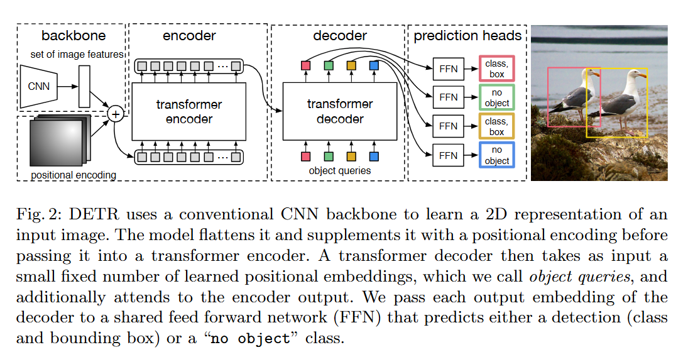

目标检测相关工作

大多数现代目标检测方法都会根据一些初始猜测进行预测。两级检测器[37,5]根据建议预测boxes，而单级方法根据锚[23]或可能的物体中心网格[53,46]进行预测。最近的工作[52]表明，这些系统的最终性能在很大程度上取决于这些初始猜测的确切设置方式。

在之前的目标检测的相关工作中作者就提到了，之前相关的目标检测的工作，取决于我们的先验猜测，双阶段的候选框proposals，单阶段的anchors于 centernet的中心点检测取决于，中心点选取的位置。


目标函数
DETR infers a fixed-size set of N predictions, in a single pass through the decoder, where N is set to be significantly larger than the typical number of objects in an image N=100

二分图匹配问题+匈牙利算法。找到一个唯一解使得最后可以完成最后的一个分配。（代价矩阵的构建就可以看成是，将100个预测框和Ground Truth框之间进行二分图匹配.

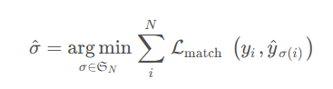

最后匹配完成之后就可以和之后的目标检测差不多的损失函数。

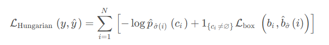

简单的看也就是分类损失加上回归损失的表达形式。


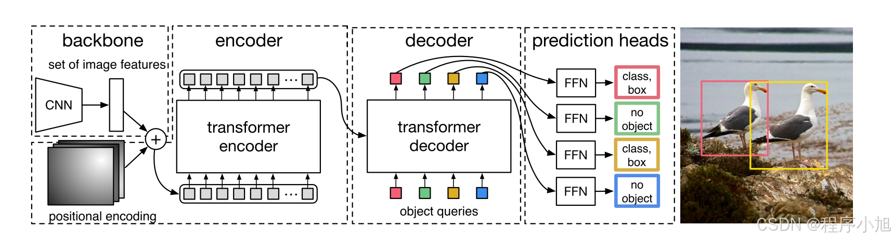

这一个更为详细的图里面就引出了另外的一个十分重要的概念object Queries（**是一个可学习的参数**）**在经过学习之后就可以确定出哪些查询会对应哪些目标，从而避免重复的操作。**

> 连接一个分类头完成最终的结果的一个预测。论文中给出的简化的版本代码编写。

```python
class DETR(nn.Module):
	def __init__(self, num_classes, hidden_dim, nheads,
    num_encoder_layers, num_decoder_layers):
        super().__init__()
        # We take only convolutional layers from ResNet-50 model
        self.backbone=nn.Sequential(*list(resnet50(pretrained=True).children())[:-2])
        self.conv = nn.Conv2d(2048, hidden_dim, 1)

        self.transformer = nn.Transformer(hidden_dim, nheads, num_encoder_layers, num_decoder_layers)

        self.linear_class = nn.Linear(hidden_dim, num_classes + 1)

        self.linear_bbox = nn.Linear(hidden_dim, 4)

        self.query_pos = nn.Parameter(torch.rand(100, hidden_dim))

        self.row_embed = nn.Parameter(torch.rand(50, hidden_dim // 2))

        self.col_embed = nn.Parameter(torch.rand(50, hidden_dim // 2))

    def forward(self, inputs):

        x = self.backbone(inputs)

        h = self.conv(x)

        H, W = h.shape[-2:]
        pos = torch.cat([
        self.col_embed[:W].unsqueeze(0).repeat(H, 1, 1),
        self.row_embed[:H].unsqueeze(1).repeat(1, W, 1),
        ], dim=-1).flatten(0, 1).unsqueeze(1)

        h = self.transformer(pos + h.flatten(2).permute(2, 0, 1), self.query_pos.unsqueeze(1))

        return self.linear_class(h), self.linear_bbox(h).sigmoid()

    detr = DETR(num_classes=91, hidden_dim=256, nheads=8, num_encoder_layers=6, num_decoder_layers=6)
    detr.eval()
    inputs = torch.randn(1, 3, 800, 1200)
    logits, bboxes = detr(inputs)
```


主干网络与预处理的部分
根据论文官方的代码对模型的结构进行说明：

输入时一个800 x 1066的三通道图片，将其输入到主干网络提取器ResNet50中进行特征的提取 得到的特征图大小是 25x34(下采样了32倍) 将通道数拓展为2048。

将得到的特征图经过一个1x1的卷积层输入的通道数是2048 输出的通道数是 256得到了**[ 25 34 256]的结构**

将最后的两个维度进行一个展平的操作步骤得到了 [850 ,256]的结构

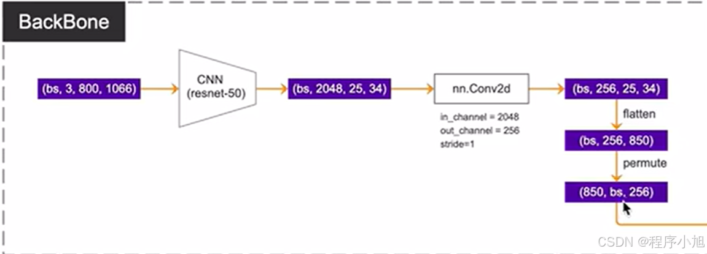


其中的850就是我们后面使用的Transformer中token的个数，256即为特征向量的长度。

### Transformer结构部分

论文中也给出了一个改进之后的Transformer结构。**结构之前的Transfomer结构给出类比的结果。**


在标准的Transformer中位置编码只作用在输入的位置处，并且只作用一次。而在DERT的Transformer中位置编码是在每一个编码器，和解码器的部分都需要操作一次的。

学习这个网络模型的难点就在需要注意，模型之间的连线来确定好各个Q K V是通过哪些变量的计算来生成的（结合源码）

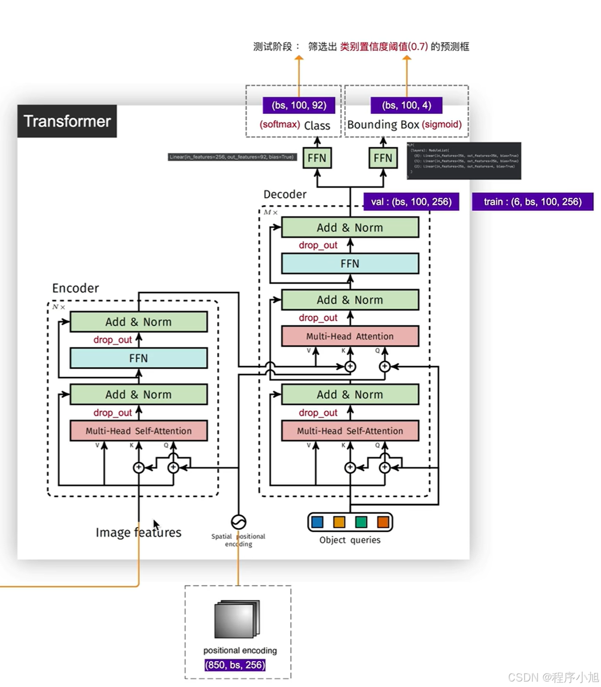

区别：

1. Q的来源不同
    * Transformer中Q直接来自输入序列embedding
    * DETR中Q是一组需要学习的目标先验框编码， 随机初始化
2. K和V的来源不同
    * Transformer中K和V来自同一输入序列
    * DETR中K和V来自输入图像的特征图
3. 维度的处理
    * Transformer中Q,K,V维度是一致的
    * DETR中需要将图像特征图的展平,并做线性映射到模型维度
4. 添加位置编码
    * Transformer在序列embedding上添加位置编码，Query(Q)、Key(K)和Value(V)都包含了位置编码信，一次位置编码
    * DETR只在Q和K上添加位置编码,而不在V上添加，而且在每一个encode中，都要加上位置编码一次，N次
    因为q和k是用来计算图像特征中各个位置之间计算相似度/相关性的，加上位置编码后计算出来的全局特征相关性更强，而v代表原图像，所以并不需要加位置编码


### 解读细节

Encoder完成的任务得到各个目标的注意力结果，准备好特征，等解码器来选

> 一组参考点的编码器自注意力。 编码器能够分离各个实例。 使用基线 DETR 模型对验证集图像进行预测。


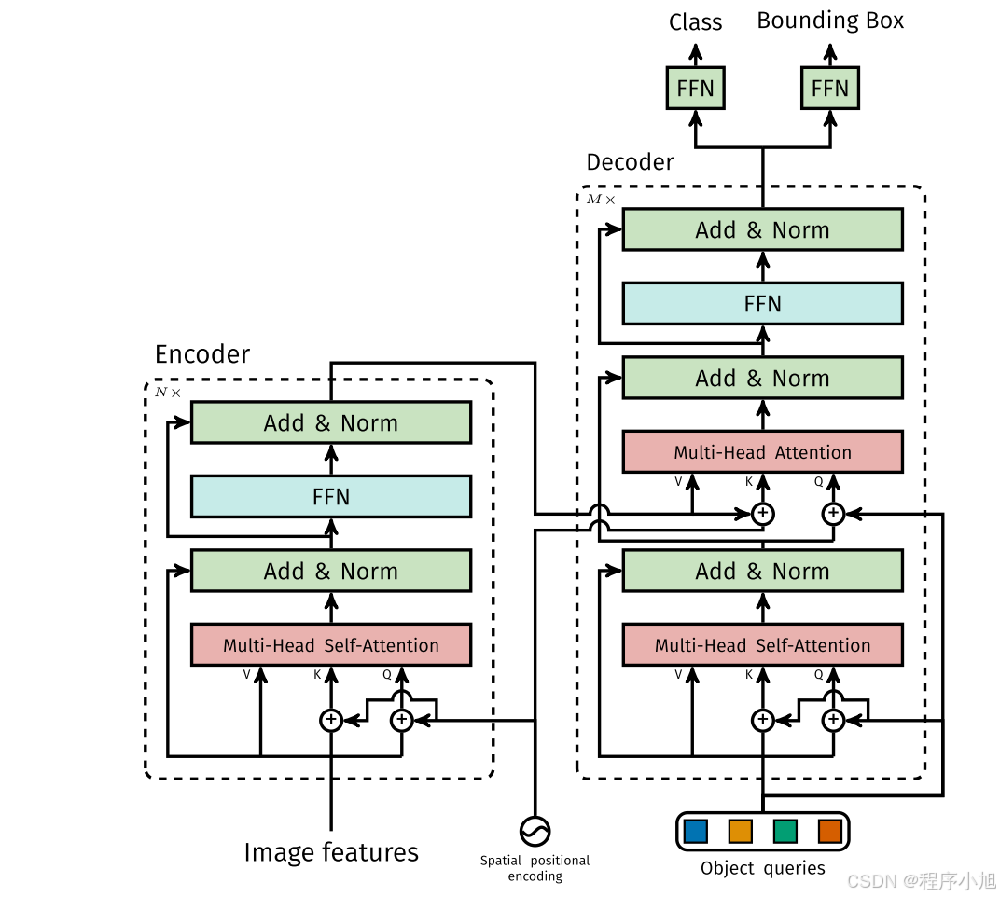


解码器的第一部分：个人感觉可以简单的理解为通过我们初始化的Object Queries查询向量 这一个可以学习的参数来整合查询的过程，告诉第二部分，每一个查询向量应该对应那一部分的区域信息。

将它作为一个查询向量Q输入到下一层和编码器中包括的信息（如上图所示）进行整合 最后进行分类和回归得到最后的结果。得到的长度为100


### 损失函数

1. 从100个预测框中，找出和真实标注框所匹配的N个框（**图中对应的是两个框**），也就是说我们在训练集样本中标注了几个框，就需要在那100个得到的预测框中筛选出几个框（**N**）来进行匹配

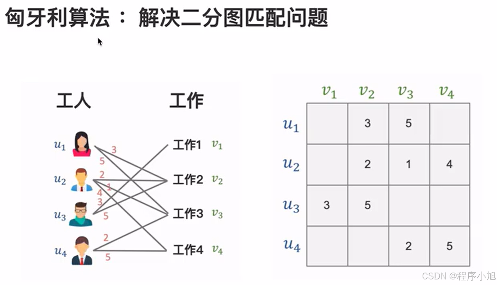


我们需要做的任务就是向代价矩阵中进行填值使得匹配的结果最为合适

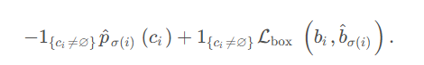

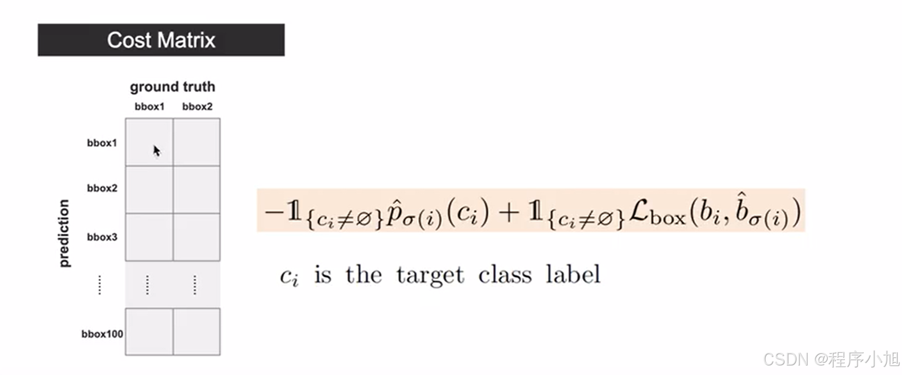

**我们首先看公式的前半部分:即为对应的类别损失：Class Cost**

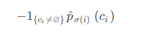

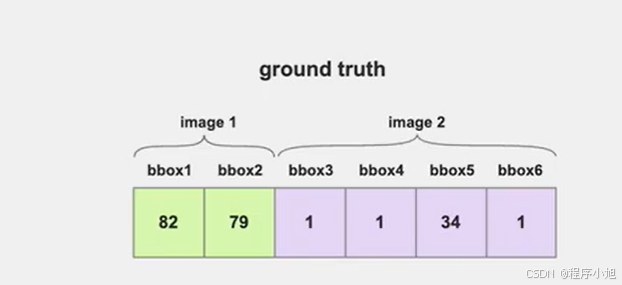

- 先要提取出GT中的坐标框对应的类别信息（**第一张图有两个框，第二张图中有四个框。值为类别编号**）
- 对应两个图片给出的200个预测框的值（2N）我们将其进行拼接，计算出包含真实类别的概率值。

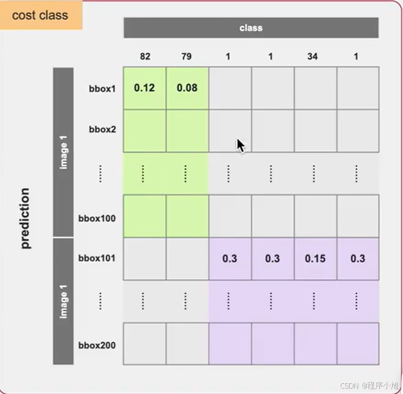

在计算的时候Cost class这个张量需要加符号用来计算损失函数的值

- 第二部分我们对应的是边界框回归的一个损失。

  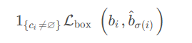

**总结一下：也就如果和之前一样使用常规的L1损失来作为回归损失，可能会导致，大小检测框的相对计算一致。因此在这个基础上引出了GIOU损失与L1损失相结合的最终回归损失部分。**

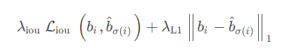

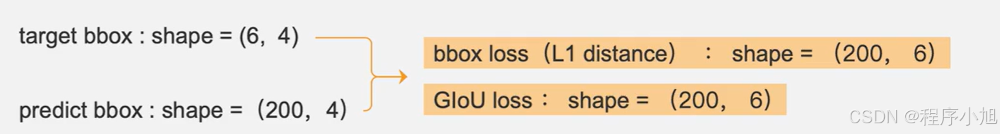

#### match操作

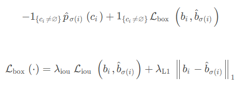

- 我们对应代码部分实际的计算步骤就是：cost = -cost_class + 5 × cost_bbor - 2 × cost_GIoUs
- 把计算得到的结果填写入矩阵之中，就可以得到两个图片总的代价矩阵，我们在使用split操作将其分开得到两个代价矩阵的结果。

（分别进行匈牙利匹配）

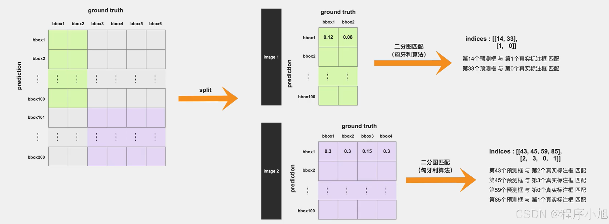

#### 计算损失并反向传播

在这个地方论文中提出了一个新的损失函数。—匈牙利损失函数。使用筛选出的预测框与真实标注框计算损失。

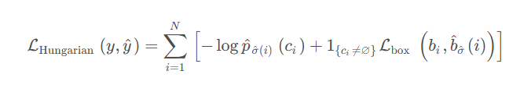

和之前代价矩阵计算所用的那个函数其实差不多（类别损失+坐标损失）。区别主要在于一下几点。

- 这里在计算类别损失的时候我们是使用N也就是100个预测框来参与运算。而不是只计算标注类别的损失。

- 加了 log也就是使用交叉熵损失函数（计算平均值）
- 中间层的输出也是参与了损失计算的。(主网络损失+网络中间层的损失)

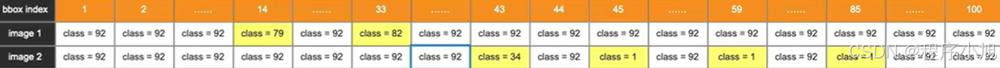

用预测结果与真实的结果计算交叉熵损失（所有的框 92代表背景）

在回归损失中，公式也给出了只使用真实的标注框不含背景。

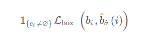

**最后就可以得到最终的结果了：结合反向传播对整个网络进行训练和优化**

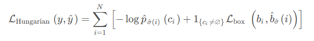

### 什么是集合预测？

​        直接预测一个目标集合，而不是单独预测集合中的每个元素。在目标检测任务中，集合预测问题可以被理解为直接预测图像中所有感兴趣物体的边界框和类别标签的集合。
​        在传统的目标检测方法中，集合预测通常是通过间接的方式来实现的，这些方法首先生成大量的候选区域（ 锚点（anchors）或提议（proposals）），然后对这些候选区域进行分类和边界框回归。这些方法通常需要额外的后处理步骤（如非极大值抑制，NMS）来消除重复的检测结果。
​        集合预测方法试图直接从输入数据（图像）中预测出一个不包含重复元素的目标集合。这种方法的优势在于它可以避免复杂的后处理步骤，简化模型的推理过程，并可能提高模型对目标之间关系的理解。

### 二分图

二分图又称作二部图，是图论中的一种特殊模型。

设G=(V,E)G=(V,E)是一个无向图。

如顶点集V可分割为两个互不相交的子集（A, B），并且图中每条边(i，j)所关联的两个顶点 i 和 j 就都分属两个不同的子集。则称图G为二分图，因此将上边顶点集合称为X 集合，下边顶点结合称为Y集合，如下图，就是一个二分图。

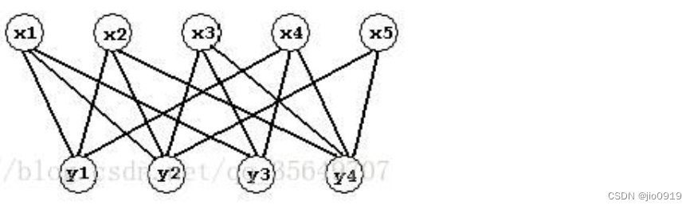

给定一个二分图G(无向图)，在G的一个子图M中，M图中的任意两条边都不依附于同一个顶点，则称M是一个匹配.

选择这样的边数最大的子集称为图的最大匹配问题

如果一个匹配中，图中的每个顶点都和图中某条边相关联，则称此匹配为完全匹配，也称作完备匹配。

增广路（交错路）：路径的起点和终点都是还没有匹配过的点，并且路径经过的连线是一条没被匹配，一条已经匹配过，再下一条又没有匹配这样交替的出现。找到这样的路径过后，显然路径里没有被匹配的连线比已经匹配了的连线多一条，于是修改匹配图，把路径里所有匹配过的连线去掉匹配关系，把没有匹配的连线变成匹配的，这样匹配数就比原来多1个。

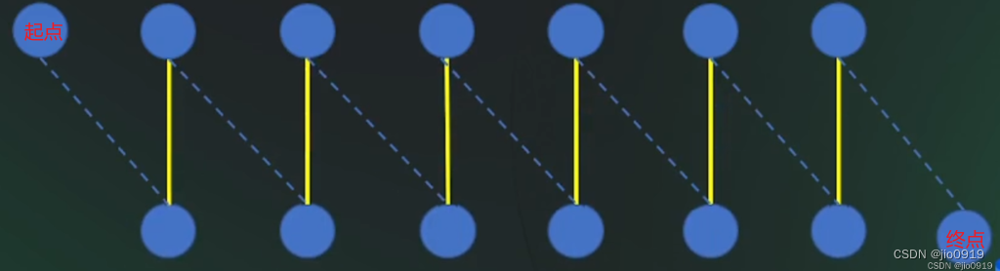

### **匈牙利算法**求解-二分图最大匹配

> https://blog.csdn.net/2301_80610560/article/details/136280357