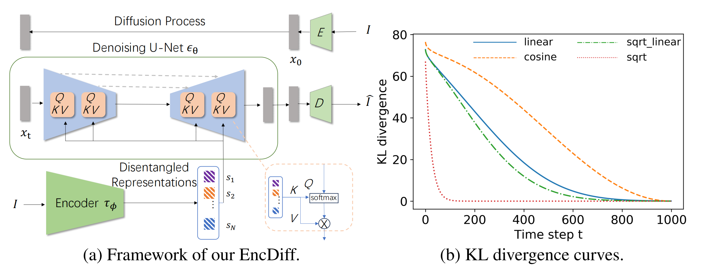
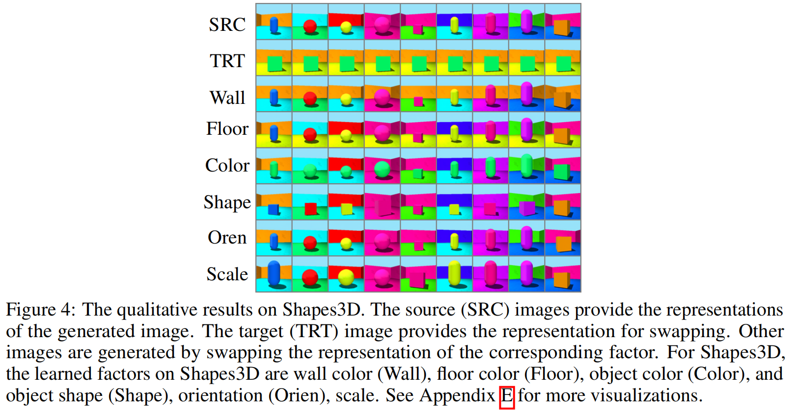

# 《EncDiff：基于扩散模型和交叉注意力的解纠缠表示学习新框架》

\*

***

### 一段话总结&#xA;

本文提出 EncDiff 框架，将图像编码为概念 tokens 作为潜在扩散模型的条件，通过交叉注意力连接编码器与扩散模型的 U-Net，利用扩散过程中时变的信息瓶颈和交叉注意力作为归纳偏置促进解纠缠表示学习。实验表明，该框架无需额外正则化，在 Shapes3D、MPI3D 等基准数据集上的解纠缠性能超越所有先前方法，消融研究验证了扩散建模和交叉注意力交互的关键作用，为解纠缠表示学习提供了新视角。



好的，根据论文，EncDiff 网络的输入和输出主要涉及以下几个部分：

**1. 整体框架 (EncDiff) 的输入与输出：**

* **输入：** 单张图像 $I$ [cite: 4, 46, 88]。
* **输出：**
    * 重建的图像（与输入图像 $I$ 相似）[cite: 4]。
    * 一组解耦的表示（概念标记 $\mathcal{S}=\{s_{1},\cdot\cdot\cdot,s_{N}\}$）[cite: 46]。

**2. 图像编码器 ($\tau_{\phi}$) 的输入与输出：**

* **输入：** 单张图像 $I$ [cite: 90]。
* **输出：** 一组概念标记 $\mathcal{S}=\{s_{1},\cdot\cdot\cdot,s_{N}\}$ [cite: 90]。
    * 具体来说，编码器首先将图像 $I$ 转换成一个特征图，然后通过一个全连接层得到一个特征向量 [cite: 92]。该特征向量的每一个维度被视为一个解耦的因子（标量）[cite: 93, 178]。接着，每一个标量因子通过一个**非共享**的多层感知机（MLP）映射为一个向量，这个向量即为一个“概念标记” $s_i$ [cite: 93, 179]。

**3. 扩散模型 (Latent Diffusion Model) 的输入与输出：**

* **输入：**
    * 噪声化的潜在表示 $x_t$ [cite: 107, 52]。这是从原始图像的潜在表示 $x_0$ 经过 $t$ 步加噪得到的 [cite: 105, 106]。
    * 时间步 $t$ [cite: 107]。
    * 条件输入：图像编码器产生的概念标记集 $\mathcal{S}$ [cite: 107]。
* **输出 (U-Net $\epsilon_{\theta}$ 部分的直接输出)：** 预测的噪声 $\epsilon$ [cite: 107]。
* **最终输出 (整个扩散模型解码过程的输出)：** 重建的图像潜在表示，之后通过解码器 $D$ 得到重建图像 [cite: 48]。

**4. 交叉注意力 (Cross-Attention) 模块的输入：**

在扩散模型的 U-Net 内部，交叉注意力模块的输入具体为：
* **查询 (Query, Q)：** 来自 U-Net 中间层的空间特征图 [cite: 97]。
* **键 (Key, K)：** 图像编码器产生的概念标记 $\mathcal{S}$ [cite: 97]。
* **值 (Value, V)：** 图像编码器产生的概念标记 $\mathcal{S}$ [cite: 97]。

总结来说，整个 EncDiff 流程是：一张图像输入到图像编码器，编码器输出一组概念标记。这些概念标记作为条件，与加噪的图像潜在表示一起输入到扩散模型的 U-Net 中。U-Net 通过交叉注意力机制利用这些概念标记来预测噪声，并最终重建出图像。同时，编码器输出的概念标记本身就是学习到的解耦表示。


**特征的可控性与可解释性：** 虽然最终重建的是原始图像，但由于中间特征是解耦的，这意味着我们可以潜在地**独立控制**这些特征。例如，在论文的实验中，他们通过交换两个不同图像的某个特定概念标记（比如物体颜色），然后观察生成图像的变化（如图4所示） 。如果只改变颜色标记就能只改变生成图像的颜色而不影响其他属性（如形状），就证明了颜色这个属性被成功解耦了。这种可控性是解耦表示学习的重要目标之一，它能增强模型的可解释性，让我们理解模型到底学到了哪些独立的视觉因素。




**因子交换与可视化观察 (Factor Swapping and Visual Inspection):** 这是最常用的方法，在论文的图4中有所展示。

- 首先，从数据集中选取两张源图像 (SRC) 和目标图像 (TRT)。

- 将源图像编码得到一组概念标记。

- 然后，用目标图像的某个特定概念标记替换掉源图像对应位置的标记（或者说，替换掉源图像学习到的第 *i* 个概念标记）。

- 用这组修改后的概念标记去生成新的图像。

- 通过观察新生成的图像与源图像相比发生了哪些变化，来推断被替换的那个概念标记主要控制了哪个视觉属性。例如，如果替换了第3个概念标记后，生成图像的物体颜色从红色变成了蓝色（目标图像的物体颜色），而其他属性（如形状、背景）基本保持不变，那么研究人员就可以推断第3个概念标记主要控制了“物体颜色”。

  

- 论文中提到，在Shapes3D数据集上，通过这种方式，他们识别出了分别对应墙壁颜色、地板颜色、物体颜色、物体形状、方向和大小的标记。


用途三：可控的图像编辑与生成（核心应用）

输入： 两张图片，一张“源图像SRC”（提供基础结构），一张“目标图像TRT”（提供要替换的属性）。


过程： a. 分别用编码器得到源图像和目标图像的概念标记 S_src 和 S_trt。 b. 假设通过实验我们知道第 i 个标记控制“物体颜色”。 c. 我们创建一个新的概念标记集 S_new：它的大部分标记来自 S_src，但第 i 个标记被替换为 S_trt 中对应的第 i 个标记 。 d. 使用这组混合后的 S_new 来驱动扩散模型生成图像。

输出： 一张全新的图像。这张图像拥有源图像的形状、方向等属性，但拥有目标图像的物体颜色 。


***

### 思维导图&#xA;


```mindmap
## **研究背景**
- 解纠缠表示学习挑战：需无监督分解数据内在因素，传统方法依赖定制损失或结构设计
- 扩散模型启发：文本到图像生成中交叉注意力与语义空间对齐，暗示扩散结构可能促进解纠缠
## **核心方法**
- **EncDiff框架**
  - 图像编码器：将图像转为概念tokens，作为扩散模型条件
  - 扩散模型：含交叉注意力，连接编码器与U-Net进行图像重建
- **归纳偏置分析**
  - 信息瓶颈：扩散过程中KL散度随时间变化，约束概念tokens信息容量
  - 交叉注意力：促进概念token与空间特征对齐，类似文本语义与空间映射
## **实验结果**
- 性能对比：在Shapes3D（FactorVAE分数0.999，DCI 0.969）、MPI3D等数据集超越所有基线
- 消融研究
  - 扩散模型必要性：替换为普通解码器性能显著下降（FactorVAE分数从0.999→0.537）
  - 交叉注意力作用：替换为AdaGN导致DCI从0.969→0.637
  - 方差调度影响：余弦调度性能最优
## **结论与贡献**
- 首次证明扩散模型+交叉注意力可作为强归纳偏置促进解纠缠
- 提出简洁框架EncDiff，无需正则化实现SOTA
- 为扩散模型在解纠缠领域的研究提供新方向
```


***

### 详细总结&#xA;

#### 一、研究背景与目标&#xA;


1.  **解纠缠表示学习挑战**：旨在提取数据内在因素，传统方法（如 VAE、GAN-based）依赖复杂正则化或结构设计，但效果有限。Locatello 等指出需模型和数据的归纳偏置。


2.  **扩散模型的潜力**：文本到图像生成中，条件扩散模型通过交叉注意力整合 “解纠缠” 文本 tokens，生成语义对齐图像，启发作者探索扩散结构是否可作为解纠缠的归纳偏置。


#### 二、核心方法：EncDiff 框架&#xA;


1.  **框架设计**

*   **图像编码器**：将图像 I 编码为概念 tokens 集合 S，每个 token 类似文本生成中的词嵌入，使用 CNN + 全连接层 + 非共享 MLP 实现。


*   **带交叉注意力的扩散模型**：基于潜在扩散模型（LDM），在潜在空间进行扩散去噪，通过交叉注意力将概念 tokens 作为条件输入 U-Net，公式为$Attention(Q,K,V)=softmax(\frac{QK^T}{\sqrt{d}})\cdot V$，其中空间特征为查询 Q，概念 tokens 为键 K 和值 V。


*   **端到端训练**：优化目标为重建噪声，与 LDM 一致。


1.  **归纳偏置分析**

*   **扩散中的信息瓶颈**：反向扩散过程中，KL 散度$C_t$随时间步变化（如图 2 (b)），时变瓶颈约束概念 tokens 的信息容量，类似 AnnealVAE 的动态信息分配，但无需手动设置常数。


*   **交叉注意力的交互作用**：促进概念 token 与空间特征对齐，如 Shapes3D 中不同 token 对应墙色、形状等区域，类似文本 token 与图像空间的语义映射。


EncDiff 框架的目标是研究扩散模型在解耦表示学习中的潜力，并证明即使没有额外的正则化项，该框架也具有很强的解耦能力 [cite: 85]。其核心在于两个关键的归纳偏置：扩散过程中的信息瓶颈和交叉注意力机制 [cite: 86]。

**3.1 框架 (Framework)**

EncDiff 框架主要由两部分组成（如图 2 (a) 所示）：一个图像编码器和一个作为解码器的扩散模型，两者通过交叉注意力连接 [cite: 88, 89]。

1.  **图像编码器 ($\tau_{\phi}$):**
    * 对于给定的输入图像 $I$，图像编码器的目标是生成一组“概念标记” (concept tokens) $\mathcal{S}=\{s_{1},\cdot\cdot\cdot,s_{N}\}$ [cite: 90]。这些概念标记在功能上类似于文本到图像生成中潜在扩散模型 (LDMs) 所使用的提示词嵌入 [cite: 90]。
    * 论文中使用了一个普通的卷积神经网络 (CNN) 作为图像编码器来获取概念标记 [cite: 91]。
    * 借鉴 VAE 编码器的设计，它使用一个全连接层将特征图转换为特征向量 [cite: 92]。该特征向量的每个维度被视为一个解耦的因子，然后通过**非共享**的多层感知机 (MLP) 层将每个因子映射为一个向量（即概念标记）[cite: 93]。(具体结构见图 3 [cite: 178, 179])

2.  **带有交叉注意力的扩散模型 (Diffusion Model with Cross Attention):**
    * 该框架遵循潜在扩散模型 (LDM) 的设计，在潜在空间中进行操作，因为 LDM 已证明具有卓越的生成能力 [cite: 94, 95]。
    * 为了在图像生成过程中引入概念标记作为条件，交叉注意力机制被用来将这些标记映射到扩散模型 U-Net 的中间表示中 [cite: 96]。
    * 交叉注意力的定义为：$Attention(Q, K, V) = \text{softmax}(\frac{QK^T}{\sqrt{d}}) \cdot V$，其中，扩散模型中间特征图中的空间特征作为查询 (Query)，概念标记作为键 (Keys) 和值 (Values) [cite: 97]。

3.  **端到端训练 (End-to-End Training):**
    * 编码器和扩散模型进行端到端的联合训练 [cite: 98]。
    * 优化目标是重建噪声，这与 LDM 中使用的方法一致 [cite: 98]。

**3.2 归纳偏置 (Inductive Biases)**

论文分析了该框架中存在的两个关键归纳偏置，它们共同促进了解耦表示的学习：

1.  **扩散过程中的信息瓶颈 (Information Bottleneck in Diffusion):**
    * 作者分析指出，扩散过程本身就内含一个时变的信息瓶颈 [cite: 101]。
    * 在潜在扩散模型中，图像的潜在表示 $x_0$ 通过 T 个步骤逐渐加入高斯噪声，得到一系列噪声样本 $x_1, \dots, x_T$ [cite: 105]。
    * 反向扩散过程中，在每个时间步 $t-1$，可以定义 $q(x_{t-1}|x_t, x_0)$ 与高斯先验分布 $p(x_{t-1})=\mathcal{N}(0,I)$ 之间的 KL 散度 $C_t$ [cite: 111]。
    * 如图 2 (b) 所示，随着时间步 $t$ 的减小（即反向扩散过程的进行），KL 散度 $C_t$ 逐渐增大，表明 $x_{t-1}$ 所携带的信息量增加，从而导致 $x_{t-1}$ 上的信息瓶颈越来越宽松 [cite: 114]。
    * 这种时变的信息瓶颈被认为对促进解耦起着重要作用 [cite: 115]。
    * 通过优化扩散模型，这个施加在 $x_{t-1}$ 上的信息瓶颈会转移到条件输入，即概念标记 $\mathcal{S}$ 上，从而鼓励概念标记的解耦 [cite: 121]。

2.  **用于交互的交叉注意力 (Cross-Attention for Interaction):**
    * 仅仅依靠信息瓶颈在理论上可行，但其有效性也依赖于扩散模型的结构设计 [cite: 131, 132]。
    * 条件扩散模型中的交叉注意力设计被认为是实现解耦的另一个关键归纳偏置 [cite: 133]。
    * 直观上，图像的某个空间位置可能与多个概念相关（例如 Shapes3D 数据集中的物体颜色和形状）[cite: 137]。每个空间特征由几个相关的基于概念的表示组成 [cite: 138]。
    * U-Net 中的交叉注意力扮演了类似的角色：每个空间特征作为查询，而学习到的概念标记作为键和值来优化这个查询 [cite: 139]。这种机制促进了概念标记与对应空间特征的对齐，从而有助于解耦。

通过这两个核心的归纳偏置，EncDiff 框架能够在不需要额外正则化损失的情况下，有效地学习到解耦的图像表示。


#### 三、实验验证&#xA;

1.  **数据集与指标**

*   数据集：Shapes3D、MPI3D、Cars3D、CelebA。


*   指标：FactorVAE 分数、DCI（解纠缠、完整性、稀疏性）、TAD、FID。


1.  **定量结果**

*   表 1 显示，EncDiff 在 Shapes3D（FactorVAE 0.999±0.000，DCI 0.969±0.030）、MPI3D（FactorVAE 0.872±0.049，DCI 0.685±0.044）显著优于所有基线，仅在 Cars3D 因标签因素分数略低，但可视化效果更好。


*   表 2 显示，在 CelebA 上 EncDiff 的 TAD（0.638±0.008）和 FID（14.8±2.3）均为最优。


1.  **消融研究**

*   **扩散模型必要性**：替换为普通 U-Net 解码器（EncDec w/o Diff），FactorVAE 分数从 0.999→0.537，DCI 从 0.969→0.178（表 3）。


*   **交叉注意力作用**：替换为 AdaGN（EncDiff w/ AdaGN），DCI 降至 0.637（表 3）。


*   **方差调度影响**：余弦调度下 DCI 最高（0.969），线性、sqrt 线性等次之（表 4）。


*   **表示形式**：标量值表示（EncDiff）比向量值（EncDiff-V）性能更优（表 5）。


1.  **可视化分析**

*   交叉注意力图显示，概念 tokens 与空间区域语义对齐，如 Shapes3D 中 “Wall”“Floor” 对应特定区域（图 5）。


*   解纠缠操作可视化：交换不同图像的概念 token，可独立控制颜色、形状等因素（图 4）。


#### 四、结论与贡献&#xA;


1.  **核心贡献**

*   发现扩散模型 + 交叉注意力可作为强归纳偏置，无需正则化促进解纠缠。


*   提出 EncDiff 框架，通过信息瓶颈和交叉注意力交互实现 SOTA。


*   消融研究验证扩散建模和交叉注意力为关键因素。


1.  **局限性与未来方向**

*   复杂数据上性能待提升，生成速度慢于 VAE/GAN。


*   可探索更高效采样策略加速推理。


#### 关键数据表格&#xA;


| 方法&#xA;            | Shapes3D（FactorVAE/DCI）&#xA; | MPI3D（FactorVAE/DCI）&#xA;    |
| ------------------ | ---------------------------- | ---------------------------- |
| FactorVAE&#xA;     | 0.840±0.066/0.611±0.082&#xA; | 0.152±0.025/0.240±0.051&#xA; |
| DisDiff&#xA;       | 0.902±0.043/0.723±0.013&#xA; | 0.617±0.070/0.337±0.057&#xA; |
| EncDiff（Ours）&#xA; | **0.999±0.000/0.969±0.030**  | **0.872±0.049/0.685±0.044**  |


***

### 关键问题与答案&#xA;

1.  **EncDiff 框架的核心创新点是什么？**

    答案：EncDiff 的核心创新在于将扩散模型与交叉注意力结合作为解纠缠的归纳偏置，无需额外正则化。具体通过图像编码器生成概念 tokens，作为扩散模型的条件，利用扩散过程的时变信息瓶颈和交叉注意力促进概念 token 与空间特征的语义对齐，从而实现高效解纠缠表示学习。


2.  **实验中 EncDiff 在哪些方面验证了其有效性？**

    答案：EncDiff 在三方面验证有效性：①定量上，在 Shapes3D、MPI3D 等数据集的 FactorVAE 和 DCI 指标超越所有基线，如 Shapes3D 的 DCI 达 0.969；②消融研究显示，移除扩散模型或替换交叉注意力会导致性能显著下降（如 DCI 从 0.969 降至 0.178 或 0.637）；③可视化表明，交叉注意力图呈现概念 token 与空间区域的语义对齐，解纠缠操作可独立控制图像因素。


3.  **与传统解纠缠方法（如 VAE、GAN）相比，EncDiff 的主要优势是什么？**

    答案：传统方法依赖复杂正则化（如 β-VAE 的 KL 约束、InfoGAN 的互信息）或多解码器设计（如 DisDiff），而 EncDiff 无需任何额外正则化，仅通过扩散模型的内在结构（信息瓶颈）和交叉注意力交互实现解纠缠，且在基准数据集上性能更优。例如，DisDiff 需复杂解纠缠损失，而 EncDiff 通过简单框架即实现 DCI 在 Shapes3D 上提升 0.246。


> （注：文档部分内容可能由 AI 生成）