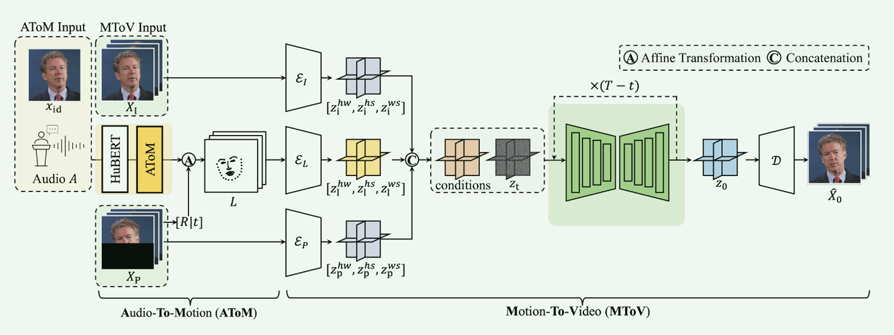
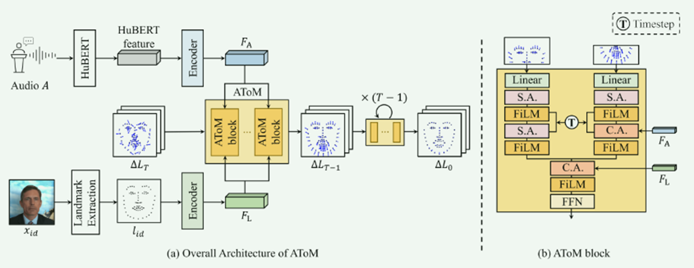
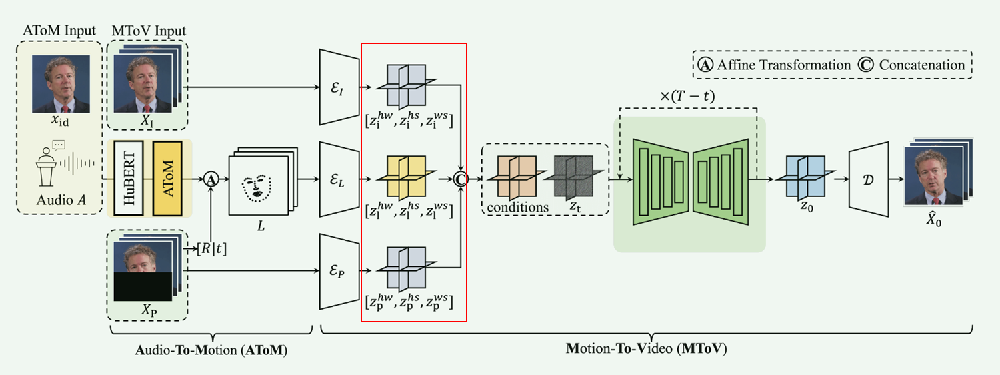
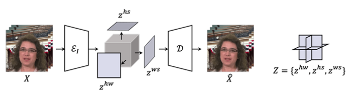
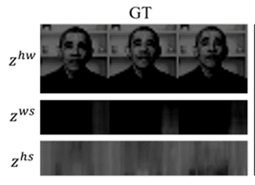

https://blog.csdn.net/weixin_51172489/article/details/146371612

###### 本文贡献

1.提出一个两阶段扩散模型框架，实现运动与视频生成的解耦

2.基于注意力机制的运动解耦，提升唇部同步精度

3.三平面扩散架构实现高效高保真视频合成

#### 方法

整体框架（如图）：
**1.Audio-to-Motion (AToM)：**
输入：音频 + 身份帧 → 生成唇部同步的3D面部标志点序列。
**2.Motion-to-Video (MToV)：**
输入：标志点序列 + 姿势帧 → 生成高保真视频。

作者设计了一个二阶段的模型，利用两个扩散模型分别对音频和面部特征信息、时域一致性做了处理和优化，最终通过一个解码器生成最终图像。

##### AToM

**输入：**

- 音频特征 A：Mel频谱（25fps） + 预训练的HuBERT语音编码。
- 参考身份帧 Xid：单张图像提取身份特征（ArcFace）。

**输出：**

- 3D面部标志点序列（52个点，含唇部20点、眉毛12点、头部姿态20点）。

扩散模型的目标函数： 

预测当前帧标志点与目标运动之间的残差（$\Delta L_0$） $$\triangle L_0 = F_{AToM}(E_{audio}, L_{t - 1})$$ 

解释： - $L_{\{t - 1\}}$：上一帧标志点状态（通过LSTM传递时序依赖）。  - $E_{\{audio\}}$：当前帧音频特征。 

**FiLM：Feature - wise Linear Modulation**（特征维度线性调制） 类似线性函数，对数据在特征维度上做一个线性调制。   $$\text{FiLM}(x, \gamma, \beta) = \gamma \cdot x + \beta$$

**AToM block**
输入中将面部标志点分为上半部分和下半部分。便于将编码得到的音频与标志点信息，分步骤输入，提高区域信息间的关联度。音频嵌入FA被专门注入到嘴唇相关块的交叉注意力模块中，而landmarks嵌入FL在两个块合并后进行调节。这种架构选择使模型能够只关注嘴唇运动，保留其他面部区域，并最终提高嘴唇同步保真度。

##### MToV

**三平面表示 tri-plane representations**

将视频的变化沿着时间、高度和宽度三个轴进行分解，视频序列被投影到三个二维平面上，得到低维的特征。在生成会说话头部视频时，hw 平面可以提供说话者特定的面部结构信息，而 hs 和 ws 平面则负责编码帧与帧之间的时间关系。

下方是投影的示意图：

投影得到数据的灰度图：

上述的投影操作由三个编码器完成。landmark autoencoder， pose autoencoder，identity encoder。再将三种tri编码从RGB编码至latent空间，使用扩散模型进行去噪。

**像素+重建损失**   $$\mathcal{L}_{\text{encoder}} = \lambda_1 \mathbb{E}_V \left[ \lVert V - \hat{V} \rVert_1 \right] + \lambda_2 \mathbb{E}_V \left[ \lVert \phi(V) - \phi(\hat{V}) \rVert_1 \right]$$  

**目标函数**   $$\mathcal{L}_{\text{MToV}} = \mathbb{E}_{X,t,\epsilon \sim \mathcal{N}(0,1), Z_L, Z_I, Z_P} \left[ \lVert X_0 - \mathcal{F}_{\text{MToV}}(X_t, t; Z_L, Z_I, Z_P) \rVert_2^2 \right]$$