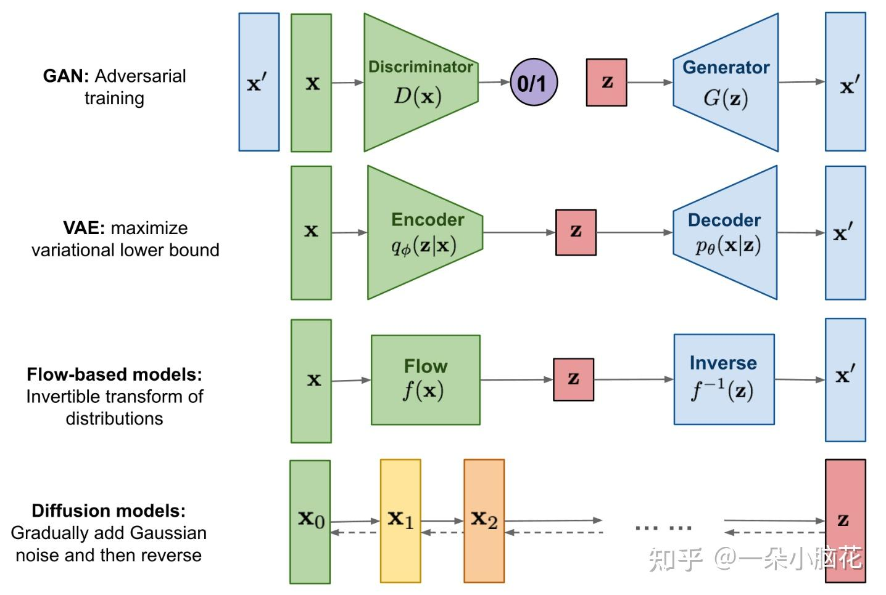

https://zhuanlan.zhihu.com/p/610012156

https://zhuanlan.zhihu.com/p/640545463

这是 **DDPM（Denoising Diffusion Probabilistic Models，去噪扩散概率模型）** 的核心训练（Training）和采样（Sampling）算法，分别对应模型 “学怎么加噪去噪” 和 “用噪声生成内容” 的流程，以下用大白话拆解：

### 一、Algorithm 1: Training（训练阶段 —— 让模型学会 “预测噪声”）

目标：训练神经网络 $\boldsymbol{\epsilon}_\theta$，让它学会从加噪数据里预测原始噪声，为后续 “反向去噪生成” 打基础。

1. **循环训练（repeat-until）**：反复迭代，直到模型收敛（预测足够准）。

1. **采样真实数据**（$\mathbf{x}_0 \sim q(\mathbf{x}_0)$）：从真实数据集（如图像库）选一张原始图片 $\mathbf{x}_0$（比如一张猫的照片 ）。

1. **随机选加噪步数**（$t \sim \text{Uniform}(\{1, \dots, T\})$）：选一个加噪步骤 $t$（比如总共有 $T=1000$ 步，随机选第 300 步 ），模拟 “不同程度加噪” 的情况。

1. **采样高斯噪声**（$\boldsymbol{\epsilon} \sim \mathcal{N}(0, \mathbf{I})$）：生成和图片同维度的标准高斯噪声（像电视雪花）。

1. **构造训练数据，计算损失**：

- - 用前向加噪公式，把原始图片 $\mathbf{x}_0$ 加到 $t$ 步的噪声图：       $     \text{加噪后数据} = \sqrt{\bar{\alpha}_t} \mathbf{x}_0 + \sqrt{1 - \bar{\alpha}_t} \boldsymbol{\epsilon}     $       （$\bar{\alpha}_t$ 是累计的加噪系数，控制每一步加噪幅度 ）     
  - - 让神经网络 $\boldsymbol{\epsilon}_\theta$ 预测这张加噪图里的噪声，和真实噪声 $\boldsymbol{\epsilon}$ 对比，用 MSE 损失（$\|\boldsymbol{\epsilon} - \boldsymbol{\epsilon}_\theta(\dots)\|^2$）反向更新模型，让预测越来越准。

### 二、Algorithm 2: Sampling（采样阶段 —— 从噪声生成真实内容）

目标：用训练好的 $\boldsymbol{\epsilon}_\theta$，从纯噪声出发，一步步 “去噪” 生成新内容（如图像 ）。

1. **初始化纯噪声**（$\mathbf{x}_T \sim \mathcal{N}(0, \mathbf{I})$）：从标准高斯分布采样，得到完全随机的噪声图（最 “糊” 的初始状态 ）。

1. **反向去噪循环**（$t = T, \dots, 1$）：从最后一步 $T$ 往第一步 $1$ 倒推，逐步去噪。

1. **采样噪声（控制随机性）**（$\mathbf{z} \sim \mathcal{N}(0, \mathbf{I})$ if $t>1$, else $\mathbf{z} = 0$）：

- - 除了最后一步（$t=1$），每一步加小噪声 $\mathbf{z}$，让生成结果更多样（避免 “deterministic 生成”，保留创造性 ）。

- - 最后一步（$t=1$）不加噪声，确保输出清晰。

1. **核心去噪公式**：

$   \mathbf{x}_{t-1} = \frac{1}{\sqrt{\alpha_t}} \left( \mathbf{x}_t - \frac{1 - \alpha_t}{\sqrt{1 - \bar{\alpha}_t}} \boldsymbol{\epsilon}_\theta(\mathbf{x}_t, t) \right) + \sigma_t \mathbf{z}   $

作用：用训练好的 $\boldsymbol{\epsilon}_\theta$ 预测当前 $\mathbf{x}_t$ 里的噪声，减去噪声后 “还原” 前一步更清晰的 $\mathbf{x}_{t-1}$，同时用 $\sigma_t \mathbf{z}$ 引入随机，保证多样性。

1. **输出结果**（return $\mathbf{x}_0$）：循环到 $t=1$ 后，得到去噪后的最终结果 $\mathbf{x}_0$（比如一张全新的猫图 ）。

### 关键逻辑总结

- **训练**：让模型学 “加噪数据 → 预测原始噪声”，本质是 “教 AI 识别噪声”。

- **采样**：让模型用 “识别噪声的能力” 反向操作，从纯噪声开始 “消噪”，逐步生成真实内容。

- 这俩算法是 DDPM 的基石，后续 Stable Diffusion 等模型，都是在这基础上优化（比如加文本引导、加速采样 ），但核心逻辑一致。

以下从 **为啥要改**、**怎么改的**、**改了有啥用** 三个角度，用大白话拆解 “修改$\boldsymbol{\beta}_t$（基于余弦的方差调度）” 的逻辑： 

---

### 一、为啥要改$\boldsymbol{\beta}_t$？   原 DDPM 里，$\boldsymbol{\beta}_t$ 是 **线性递增** 的（从很小的值慢慢变大）。但对归一化到 $[-1,1]$ 的图像来说，线性的 $\boldsymbol{\beta}_t$ 有个问题：   

- **前期加噪太“弱”，后期加噪太“猛”**：    前期（$t$ 小）图像还很清晰，线性 $\boldsymbol{\beta}_t$ 加的噪声少，模型学不到“强噪声下的去噪能力”；    后期（$t$ 大）图像快变纯噪声了，线性 $\boldsymbol{\beta}_t$ 加的噪声又太多，模型容易“学懵”，导致 **Loss 下不去**，生成效果也受影响。   所以需要换一种 $\boldsymbol{\beta}_t$ 的调度方式，让加噪更“均匀合理”，帮模型更稳定训练、降低 Loss。    

### 二、“基于余弦的方差”怎么改？   

核心思路：**用余弦函数的曲线，替代原来的线性曲线**，让 $\boldsymbol{\beta}_t$（或说 $\bar{\alpha}_t$）的变化更平滑、更贴合图像数据的分布。   

#### 1. 定义 $\boldsymbol{f}(t)$：

$ \boldsymbol{f}(t) = \cos\left( \frac{t/T + s}{1 + s} \cdot \frac{\pi}{2} \right)^2 $   - $t$：当前加噪步骤（从 0 到 $T$）；   - $T$：总加噪步数（比如 1000）；   - $s$：一个小常数（比如 0.008），**防止 $t$ 很小时 $\bar{\alpha}_t$ 太小**（避免前期加噪太猛，图像直接糊掉 ）。

#### 2. 计算 $\boldsymbol{\bar{\alpha}_t}$：   

$ \boldsymbol{\bar{\alpha}_t} = \frac{\boldsymbol{f}(t)}{\boldsymbol{f}(0)} $   - $\boldsymbol{f}(0) = \cos\left( \frac{0 + s}{1 + s} \cdot \frac{\pi}{2} \right)^2$，是初始值，保证 $\bar{\alpha}_0 = 1$（$t=0$ 时不加噪，$\mathbf{x}_0 = \mathbf{x}_0$ ）。   #### 3. 计算 $\boldsymbol{\beta}_t$：   $ \boldsymbol{\beta}_t = \text{clip}\left( 1 - \frac{\bar{\alpha}_t}{\bar{\alpha}_{t-1}}, 0.999 \right) $   - 用相邻两步的 $\bar{\alpha}$ 比值，间接计算 $\beta_t$（因为 $\alpha_t = 1 - \beta_t$，$\bar{\alpha}_t = \alpha_t \cdot \bar{\alpha}_{t-1}$，所以 $1 - \frac{\bar{\alpha}_t}{\bar{\alpha}_{t-1}} = \beta_t$ ）；   - $\text{clip}$ 是为了限制 $\beta_t$ 最大不超过 0.999，避免加噪太极端。    

### 三、改了有啥用？

#### 1. 让加噪更“均匀”：   

余弦曲线的特点是 **前期变化慢、后期变化平缓**（对比线性的“前期慢、后期陡”）。这样：   - 前期（$t$ 小）：加噪幅度更合理，模型能“循序渐进”学去噪；   - 后期（$t$ 大）：加噪幅度不会突然暴涨，模型能稳定处理强噪声。

#### 2. 降低 Loss：   

更合理的加噪调度，让模型在训练中更“舒服”——不会因为前期噪声太弱学不到东西，也不会因为后期噪声太强学懵。最终训练出的模型 Loss 更低，生成效果（如清晰度、多样性 ）更好。

#### 3. 适配图像数据：   

图像像素归一化到 $[-1,1]$ 后，余弦调度的 $\beta_t$ 能更好匹配图像的“分布特性”，让加噪过程更贴合真实数据的“噪声叠加规律”。

### 一句话总结   

原线性 $\boldsymbol{\beta}_t$ 对归一化图像不够友好（前期弱、后期猛），所以用 **余弦曲线** 重新设计 $\boldsymbol{\beta}_t$ 的调度方式，让加噪更均匀、模型训练更稳定，最终降低 Loss、提升生成效果。   （可以简单理解为：给模型设计一个“更科学的加噪节奏”，让它学去噪更轻松～）

**直接来说，标准训练过程（Text-to-Image），模型本身确实不具备直接对一张“输入图片”进行精细“属性编辑”的能力。**

标准的 `txt2img` 流程是“从无到有”：

- **输入**：文字描述 + 一团纯粹的随机噪声。
- **过程**：将噪声根据文字描述，一步步地变成一张全新的图片。
- **结果**：它生成了一张新图，而不是修改了一张旧图。

Stable Difusion可以通过扩散模型的"图像条件生成"能力对图像进行编辑，而非从完全随机的噪声开始。这种方法主要涉及以下步骤:
输入原始图像:
以输入图像作为初始点，，将其转化为扩散模型的潜空间表征。
加入噪声(扩散过程):。
对原始图像加入一定量的噪声，使其处于扩散过程中的某个中间阶段。3.结合文本引导去噪:
使用特定的文本作为引导条件，通过扩散模型逆过程逐步去噪，从而逐步调整图像，使其符合文本提示。最终输出:
修改后的图像既保留了原始图像的结构和质感，同时做到了根据文本描述的所需变化。
Stable Diffusion支持图像编辑功能的实现主要依赖于 img2img(lmage-to-lmage)接口。

