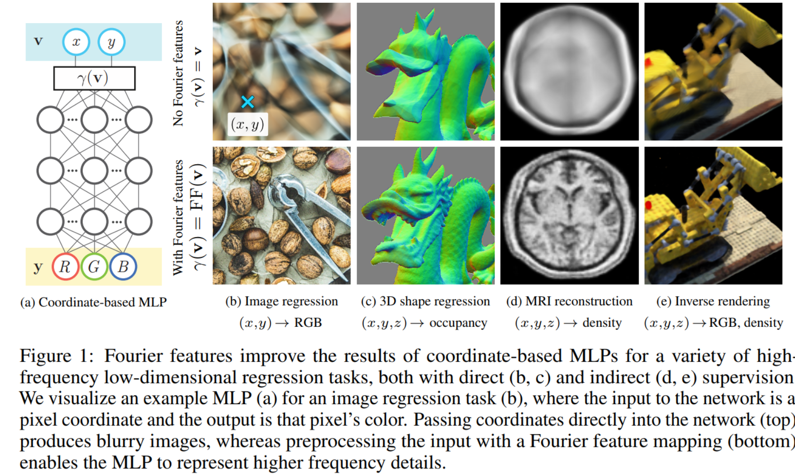

# Fourier features let networks learn high frequency functions in low dimensional domains

> - https://blog.csdn.net/weixin_45521594/article/details/108635022
> - https://zhuanlan.zhihu.com/p/668283780
> - code
>   - https://github.com/jmclong/random-fourier-features-pytorch
>   - https://github.com/tancik/fourier-feature-networks

### 一、简介

- 训练数据中即包含低频成分也包含高频成分；
- NTK理论表明：标准MLP无法很好的学习数据中的高频成分；
- 通过对输入数据进行随机傅里叶映射，可以改变标准MLP的NTK，形成一个合成NTK；
- 通过控制随机傅里叶映射的超参数可以改变合成NTK的行为，从而使得标准MLP更好的学习高频成分；

### 二、基础知识

https://zhuanlan.zhihu.com/p/668283780

### 三、论文动机

- “基于坐标的”MLPs，以低维坐标作为输入(通常是$R^{3}$ 中的点)，并被训练输出每个输入位置的形状、密度和/或颜色的表示. 这个策略是引人注目的，因为基于坐标的MLPs能够适应基于梯度的优化和机器学习，并且可以比网格采样表示更紧凑.

- 利用最近在深度网络行为建模方面的进展，使用核回归与神经切核(NTK)[16]从理论上和实验上表明，标准MLPs不适合这些低维的基于坐标的视觉和图形任务。MLPs在学习高频函数方面有困难，在文献中称为“光谱偏差”[3,33]。NTK理论认为，这是因为基于标准坐标的MLPs对应的内核频率衰减较快，这有效地阻止了它们能够代表自然图像和场景中出现的高频内容。即标准MLPs在表示高频内容上有困难
- 最近的一些研究[27,44]通过实验发现，输入坐标的一种`启发式正弦映射(称为“位置编码”)允许MLPs表示更高频率的内容`

- 考虑一个特别的例子，在输入到 MLP 前将 $\gamma$做这样的映射：

  $$
  \gamma(\mathbf{v}) = 
  \begin{bmatrix}
      a_1 \cos \left( 2\pi \mathbf{b}_1^\top \mathbf{v} \right), & 
      a_1 \sin \left( 2\pi \mathbf{b}_1^\top \mathbf{v} \right), & 
      \dots, & 
      a_m \cos \left( 2\pi \mathbf{b}_m^\top \mathbf{v} \right), & 
      a_m \sin \left( 2\pi \mathbf{b}_m^\top \mathbf{v} \right)
  \end{bmatrix}^\top
  $$
  然后发现这样的映射使得 NTK 转化为一个更稳定核，通过修正频率变量 $a_j$ 能调整 NTK 的频谱，从而能够控制频率范围，从而能被 MLP 很好的学习。如图 1 所示，采用了傅里叶特征的方法 MLP 学的更好。