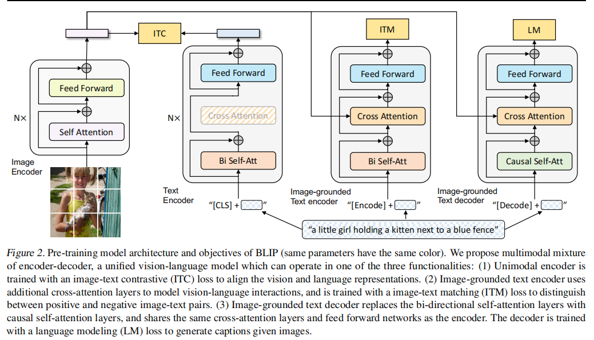
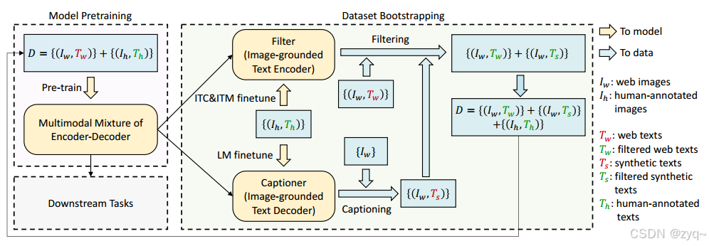
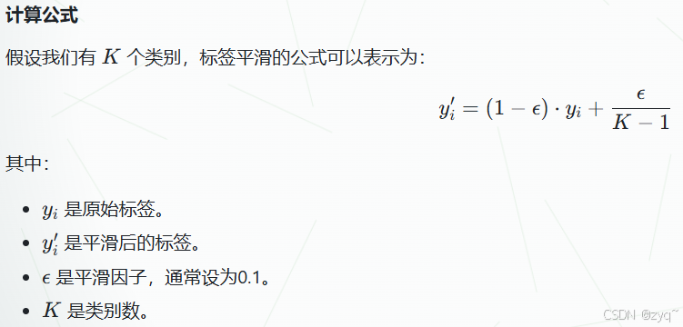
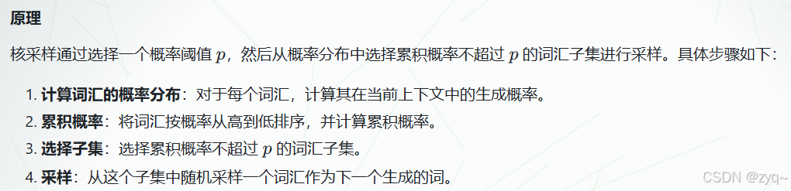
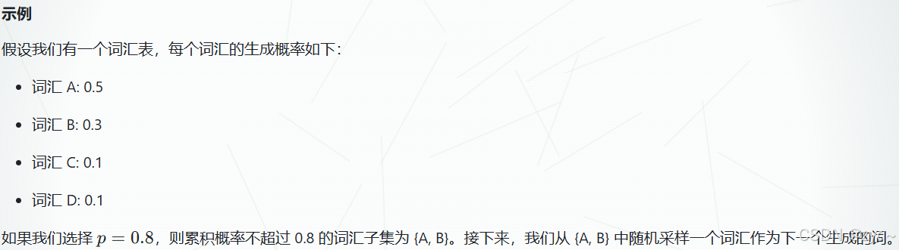
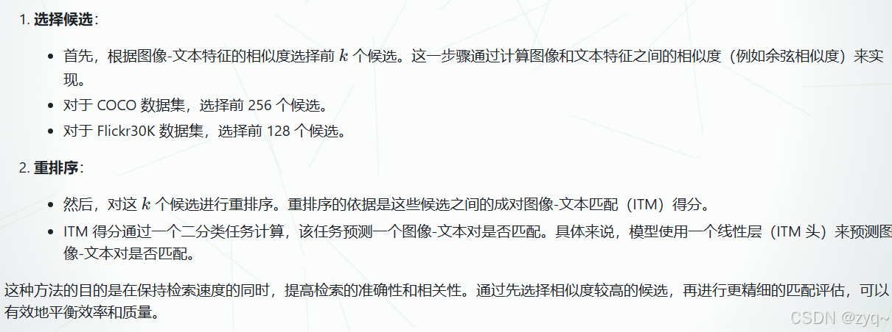
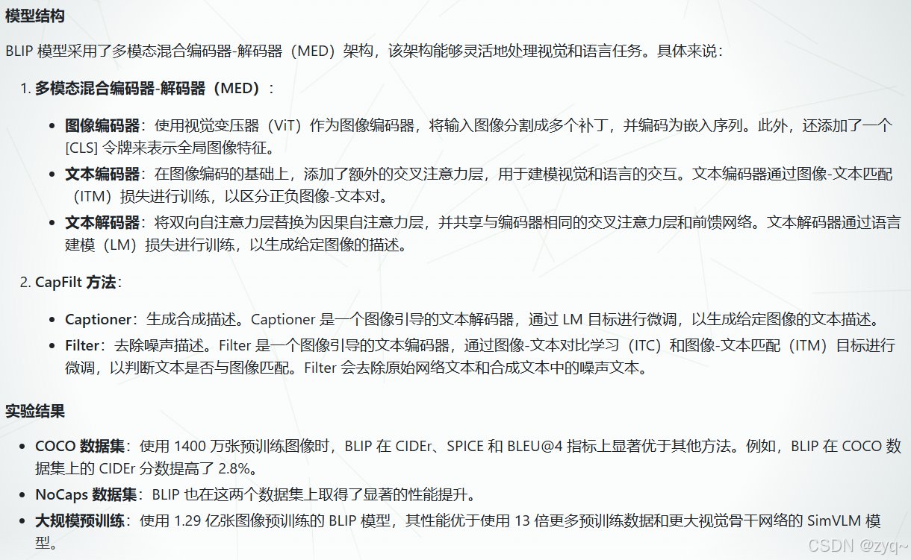
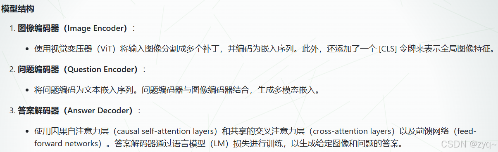
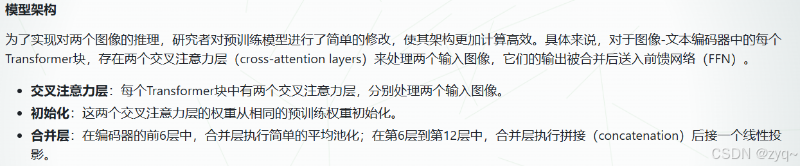
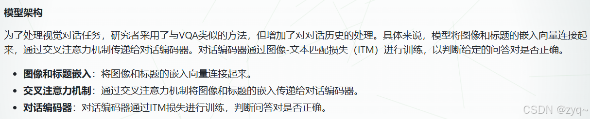

# **BLIP: Bootstrapping Language-Image Pre-training for Unified Vision-Language Understanding and Generation**

BLIP是一种基于VLP的新框架，统一并灵活地应用于视觉-语言理解任务和生成任务。BLIP通过引导生成[图像描述](https://so.csdn.net/so/search?q=图像描述&spm=1001.2101.3001.7020)来有效利用噪声网络数据，从而在多个下游任务上取得了最先进的性能。

图2. BLIP的预训练模型架构和目标（相同参数具有相同颜色）。我们提出了一个多模态编码器-解码器混合模型，这是一个统一的视觉-语言模型，可以执行以下三种功能之一：（1）单模态编码器使用图像-文本对比（ITC）损失进行训练，以对齐视觉和语言表示。（2）基于图像的文本编码器使用额外的交叉注意力层来模拟视觉-语言交互，并使用图像-文本匹配（ITM）损失进行训练，以区分正负图像-文本对。（3）基于图像的文本解码器将双向自注意力层替换为因果自注意力层，并与编码器共享相同的交叉注意力层和前馈网络。解码器使用语言建模（LM）损失进行训练，以根据图像生成标题。

## 3. Method

### 3.1 模型结构

  multimodal mixture of encoder-decoder (MED)是一个多任务模型，是一种具有理解和生成能力的统一模型，可以执行以下三种功能之一。

**Unimodal encoder （单峰编码器）**
  单峰编码器（Unimodal Encoder）是一种专门用于处理单一模态数据的神经网络模型。与多模态模型不同，单峰编码器专注于从一种特定类型的输入数据中提取特征，例如文本、图像或音频。这些编码器通常在大规模的单模态数据集上进行预训练，能够学习到丰富的语义表示。
  在BLIP中，单峰编码器可用于分别给图像和文本编码，在文本输入的开头附加一个[CLS]令牌以总结句子。

**Image-grounded text encoder （基于图像的文本编码器）**
  Image-grounded text encoder（图像导向文本编码器）：这是一种特殊的文本编码器，它通过引入视觉信息来增强文本编码。具体来说，它在每个Transformer块的自注意力（Self-Attention, SA）层和前馈网络（Feed Forward Network, FFN）之间插入了一个交叉注意力（Cross-Attention, CA）层，从而能够更好地建模图像和文本之间的关系。
  Self-Attention (SA) layer（自注意力层）：自注意力层是Transformer模型中的一个核心组件，它允许模型在处理序列数据时，关注到序列中的不同部分。在文本编码器中，自注意力层用于生成文本的上下文表示。
  Cross-Attention (CA) layer（交叉注意力层）：交叉注意力层用于在编码器和解码器之间传递信息。在图像导向文本编码器中，交叉注意力层使得文本编码器能够关注到图像中的相关信息，从而生成更准确的文本表示。
  Feed Forward Network (FFN)（前馈网络）：前馈网络是Transformer模型中的另一个重要组件，它用于对自注意力层的输出进行进一步的非线性变换，以增强模型的表达能力。
  [Encode] token（[Encode]标记）：这是一个特殊的标记，用于指示编码任务的开始。在图像导向文本编码器中，[Encode]标记被附加到文本的开头，其输出嵌入被用作图像-文本对的多模态表示。

### 3.2 训练目标

  在预训练阶段，BLIP模型联合优化了三个目标函数，分别是两个理解任务目标和一个生成任务目标。**每个图像-文本对只需要一次通过计算量较大的视觉Transformer，而文本Transformer需要三次前向传播，以激活不同的功能来计算这三个损失。**

  此外，文本编码器和文本解码器共享除SA层之外的所有参数。原因是编码和解码任务之间的差异最好由SA层捕获。

**Image-Text Contrastive Loss (ITC)（图像-文本对比损失）**
  ITC（Image-Text Contrastive Loss）的目标是通过对比学习来**对齐视觉Transformer和文本Transformer的特征空间**。具体来说，ITC损失鼓励正样本的图像-文本对在特征空间中更接近，而负样本的图像-文本对更远离。这有助于模型更好地理解图像和文本之间的关系。

**Image-Text Matching Loss (ITM)（图像-文本匹配损失）**
  I**TM损失通过一个二分类任务来训练模型，预测一个图像-文本对是否匹配（即正样本）或不匹配（即负样本）**。BLIP使用了硬负样本挖掘策略。

**硬负样本挖掘策略**
  硬负样本挖掘（Hard Negative Mining）策略的目的是在训练过程中选择更具信息量的负样本，以提高模型的性能。具体来说，通过选择与正样本相似度较高的负样本，可以更好地训练模型区分正样本和负样本。
  相似度计算：通常使用余弦相似度或欧氏距离来计算特征向量之间的相似度。

**Language Modeling Loss (LM)（语言模型损失）**
  语言建模损失（LM损失）的目标是训练模型生成给定图像的文本描述。具体来说，LM损失通过最大化生成文本的概率来优化模型，使模型能够根据图像生成连贯的文本描述。
  图像-文本对：LM损失使用图像-文本对进行训练，其中图像作为输入，文本描述作为目标。
  自回归生成：模型通过自回归的方式生成文本，即每次生成一个词，然后将生成的词作为输入的一部分，继续生成下一个词，直到生成完整的句子。
  在BLIP的具体实现中使用了0.1的标签平滑。

##### Label Smoothing（标签平滑）

  标签平滑（Label Smoothing） 是一种正则化技术。具体来说，标签平滑通过将一部分概率分配给非目标类，从而平滑了目标类的标签分布。这有助于模型在面对未见过的数据时更加鲁棒。

3.3. CapFilt （Captioning and Filtering）
  CapFilt 的目标：通过生成合成描述并过滤噪声描述，提高数据质量，从而提升模型在各种视觉-语言任务上的性能。
  它引入了两个模块：一个用于生成给定web图像的标题的c a p t i o n e r captionercaptioner，以及一个用于去除噪声图像-文本对的过滤器f i l t e r filterfilter

Captioner （生成器）
  功能：给定网络图像$I_{w}$，生成一个合成描述$T_{w}$

  结构：基于图像的文本解码器（text decoder），从预训练的 MED（Multi-Modal Encoder-Decoder）模型初始化。
  微调：生成器在 COCO 数据集上通过语言模型（LM）目标进行微调，以生成给定图像的文本描述。
  解码：生成器使用核采样（nucleus sampling）方法生成合成描述。核采样是一种随机解码方法，每次从累积概率质量超过阈值p 的标记集中采样。实验表明，p = 0.9时效果最佳。

核采样
  核采样（Nucleus Sampling）是一种在自然语言生成任务中用于生成文本的采样方法，特别是在生成式模型（如语言模型）中。这种方法旨在平衡生成文本的多样性和质量，避免生成过于平凡或过于奇异的文本。

  这样就不会只选择概率最高的A，而是给同样较高的B一个机会，增加灵活性和多样性，产生更多新信息（4.3中也有提到)

**Filter （过滤器）**
  功能：给定网络图像$I_{w}$和合成描述$T_{w}$ ，过滤器评估这些描述，并移除不匹配的文本。
  结构：基于图像的文本解码器（text decoder），从预训练的 MED（Multi-Modal Encoder-Decoder）模型初始化。
  微调：过滤器在 COCO 数据集上通过图像-文本对比（ITC）和图像-文本匹配（ITM）目标进行微调，以学习文本是否与图像匹配。
  评估：过滤器使用 ITM 头预测文本是否与图像匹配。如果预测为不匹配，则认为该文本是噪声并移除。

**ITM**
  ITM（Image-Text Matching，图像-文本匹配）是一种用于训练模型以捕捉视觉和语言之间细粒度对齐的二分类任务。具体来说，ITM旨在学习图像-文本多模态表示，能够区分图像-文本对是否匹配。在BLIP框架中，ITM通过一个ITM头（即一个线性层）来预测一个图像-文本对是否为正样本（即匹配）。

### 5.下游任务

#### 5.1 图像文字检索

Li等人（2021a）的方法
  这里提到的方法是一种用于图像-文本检索（Image-Text Retrieval）的两阶段候选选择和重排序方法。

zero-shot retrieval
  零样本检索（zero-shot retrieval）是指在没有针对特定任务进行微调或训练的情况下，直接将预训练模型应用于新任务的能力。具体来说，在图像-文本检索任务中，零样本检索意味着模型可以直接从一个数据集（例如 COCO）迁移到另一个数据集（例如 Flickr30K），而不需要在目标数据集上进行额外的训练。

#### 5.2 图像字幕

  这个任务就是生成文本描述图像。

#### 5.3 视觉问答 (VQA)

  视觉问答（VQA）任务要求模型根据给定的图像和问题生成答案。与将VQA视为多答案分类任务的方法不同，BLIP 模型将其视为一个生成任务，这使得模型能够进行开放式的VQA。

#### 5.4. 自然语言视觉推理 (NLVR2 )

  NLVR2（Suhr et al., 2019）是一项任务，要求模型判断一个句子是否描述了一对图像。这项任务需要模型具备跨模态推理的能力，即能够理解图像和文本之间的关系，并进行逻辑判断。

#### 5.5 视觉对话 （VisDial）

  视觉对话（VisDial）任务是视觉问答（VQA）的扩展，它在自然对话的背景下进行。在这个任务中，模型不仅需要根据图像和问题来预测答案，还需要考虑对话历史和图像的标题。具体来说，模型需要从一组候选答案中选择最合适的答案。

5.6 Zero-shot Transfer to Video-Language Tasks