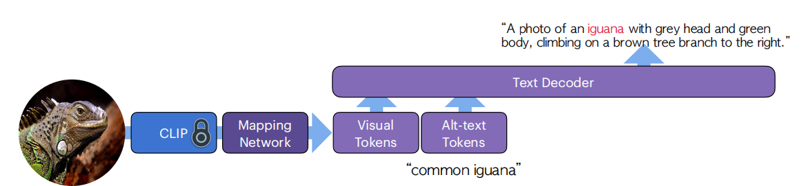
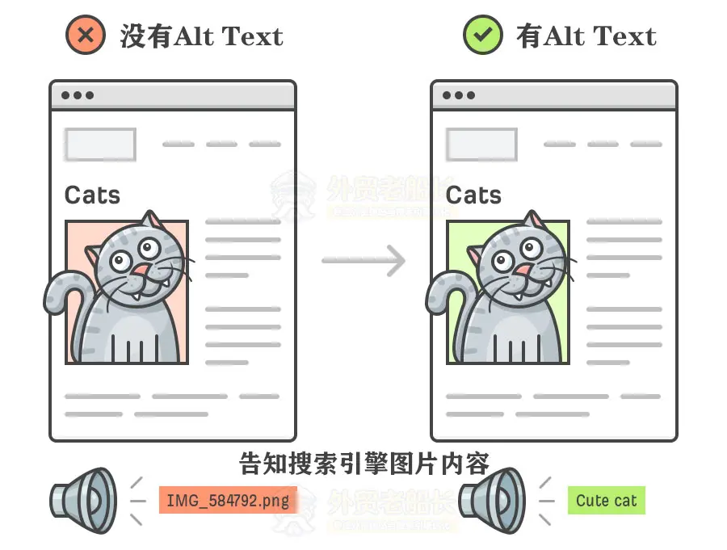
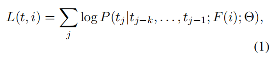

# Altogether: Image Captioning via Re-aligning Alt-text

本文专注于创建合成数据以提高图像标题的质量。现有工作通常存在两个缺点。首先，它们从头开始为图像生成标题，忽略了现有的alt文本元数据；其次，如果标题生成器的训练数据（例如GPT）未知，则缺乏透明度。在本文中，我们研究了一种基于编辑和重新对齐现有alt文本与图像相关联的关键思想的系统化方法 Altogether。为了生成训练数据，我们进行了人工注释，注释者从现有的alt文本开始，并在多轮中重新对齐到图像内容，从而构建了包含丰富视觉概念的标题。这与之前的工作不同，后者仅将人工注释作为一次性的基于图像和注释者知识的描述任务。我们在这些数据上训练了一个标题生成器，该生成器在大规模上概括了重新对齐alt文本的过程。我们的结果显示，我们的 Altogether 方法导致了更丰富的图像标题，这些标题还提高了文本到图像生成和零样本图像分类任务的性能。

图2：重新对齐alt文本：我们的字幕生成器接收视觉和alt文本输入。我们提取固定的CLIP图像嵌入，并将其转换为一定数量的视觉标记。给定alt文本，解码器能够将这些信息具体化，例如携带具体的视觉概念，以生成与图像对齐的更好字幕。

**1. 什么是Alt Text?**

Alt text 也叫Alternative text （替代文本），也称为alt attributes （Alt属性）, Alt Tags（Alt标签），是HTML代码中用于描述页面上图像外观的介绍。

## 方法

### 3.1图像字幕

我们通过预测基于图像嵌入的潜在空间的字幕标记来制定图像字幕。损失函数的定义为：

其中i表示一个图像，F (i)它的编码（例如，CLIP），tj−k：j−1是前面的字幕标记，Θ是字幕器的参数。该过程包括将图像编码到一个潜在空间中，并按顺序解码字幕标记。