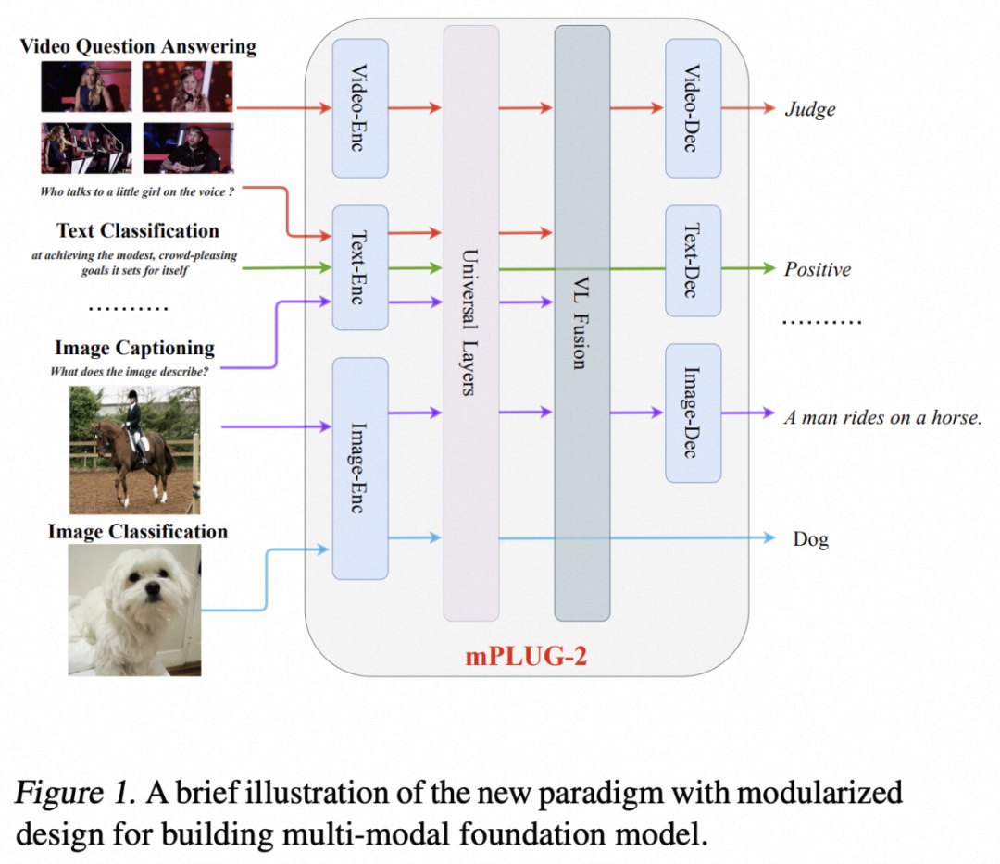
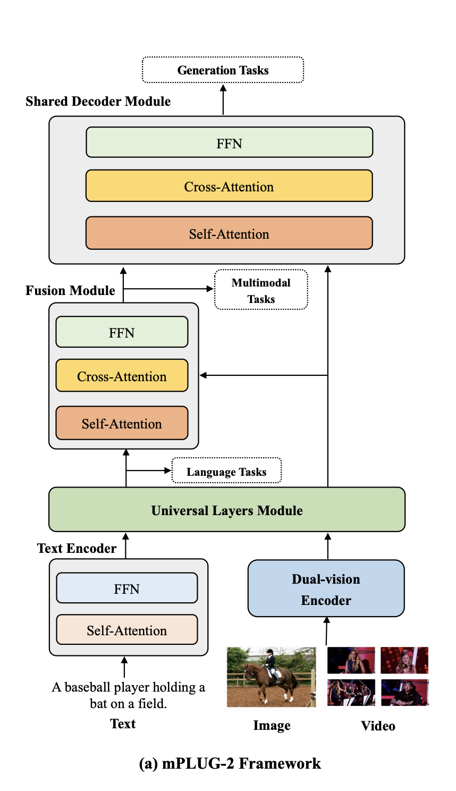
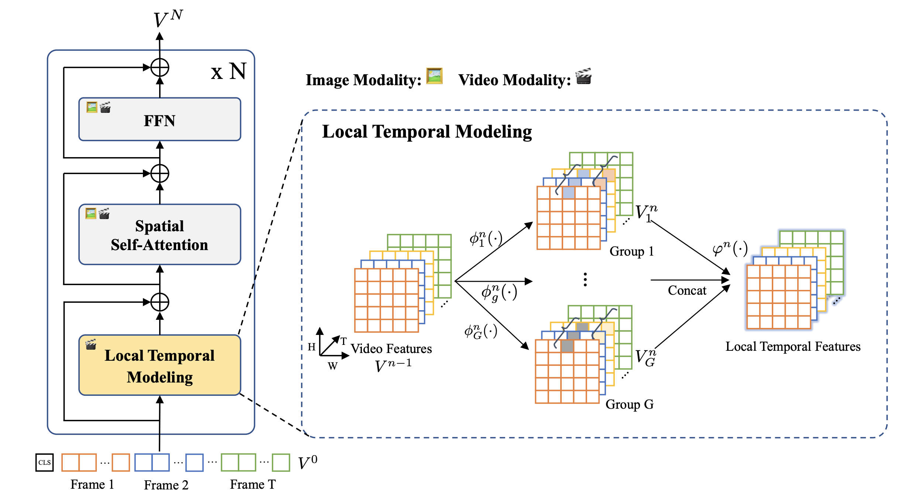
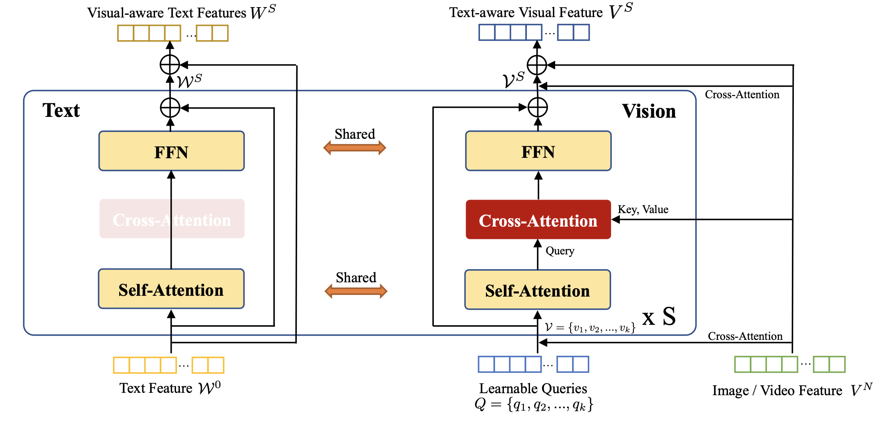

# **mPLUG-2: A Modularized Multi-modal Foundation Model Across Text, Image and Video**

> - https://blog.csdn.net/xijuezhu8128/article/details/132806373

## 1. [模型](https://ml-summit.org/cloud-member?uid=c1041&spm=1001.2101.3001.7020)设计

> - 多模态统一
> - 模块化设计

## 2. 模型结构

> - 文本编码器：BERT
> - 双视觉编码器：空间建模和局部时间建模
> - 通用层模块：文本和视觉特征共享参数
> - 多模态融合模块：文本和视觉特征cross attention融合
> - 共享解码器模块：接收多模态embedding输入，便于多任务处理

### 2.1 Dual-vision Encoder Module

为了提取图像、视频等视觉模态的信息，作者提出双视觉编码器。为了缓解视频时空建模中序列长度过大导致的学习困难问题，将视频分解为空间和时间表示，如下图所示，利用Transformer的自注意力层和前馈层进行空间建模，并针对视频输入，提出一种新颖的局部时序建模模块。该模块将视频特征在通道维度分组，对不同组的特征应用不同的时序建模参数(如时序卷积)，从而在不同的表征子空间中学习更为丰富的时序特征。此外，空间和时间信息的解耦，使得双视觉编码器能够实现图像和视频的参数共享，从而更加高效地学习空间和时间表征。

### 2.2 Universal Layers Module

为了使模型能够从不同模态数据的协作中受益，作者提出通用层模块使得视觉和语言模态共享语义空间。如下图所示，为了降低通用层的计算复杂度，作者设置固定数量的视觉query，**并将来自双视觉编码器的图像或视频特征作为交叉注意力层的输入**。在每个通用层中，视觉query和文本特征**通过共享参数的自注意力层来对齐语义**，然后视觉query通过交叉注意力从原始视觉特征中提取视觉信息，之后视觉query和文本特征通过共享参数的前馈层进行特征变换。

### 3. Unified Pre-training Objectives

对于文本编码器模块，我们使用BERT中的掩码语言建模(MLM)来学习文本表示。我们随机屏敝文本中15%的标记，并要求模型用上下文表示来预测这些被屏蔽的标记。

对于跨模态模块，我们采用了ALBEF中的跨模态匹配损失(CML)，它由视觉语言匹配(VLM)和视觉语言对比学习(VLC)组成。

基于指令的语言模型损失，我们采用了基于指令的语言模型损失来统一各种生成任务。我们使用手工制作的指今来区分任务和模式，其中包括视频图像-文本对、视频/图像字幕、视频图像问答、文本生成等。