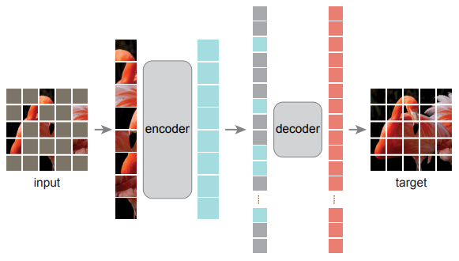
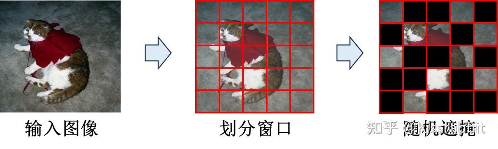
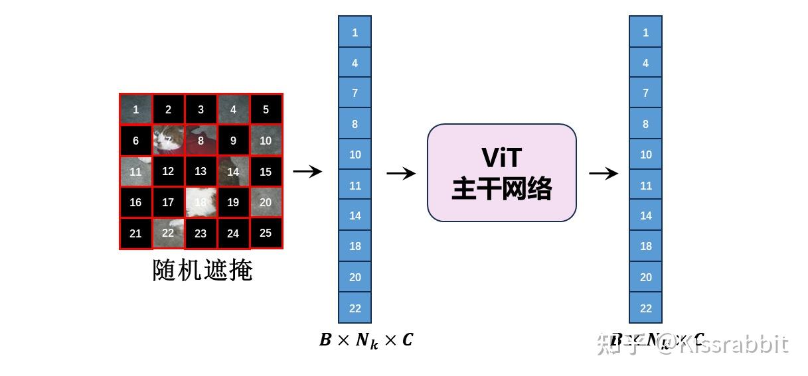
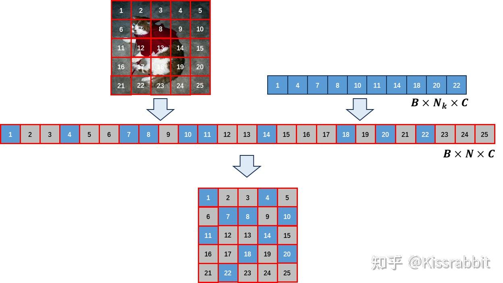
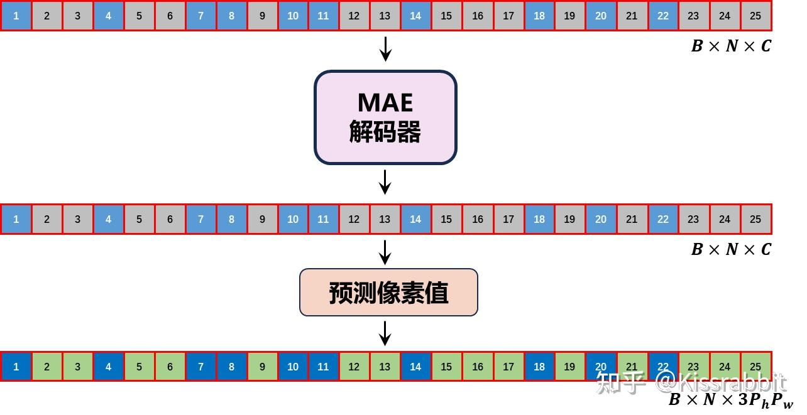
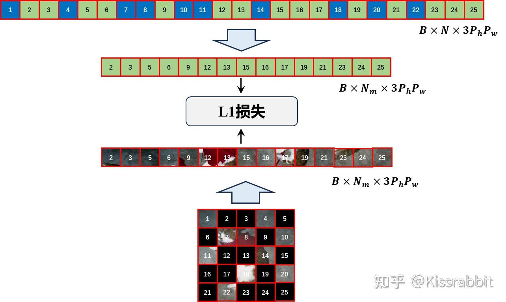

# Masked Autoencoders Are Scalable Vision Learners

MAE(Masked Autoencoders)是用于CV的自监督学习方法，优点是扩展性强的（scalable），方法简单。在MAE方法中会随机mask输入图片的部分patches，然后重构这些缺失的像素。MAE基于两个核心设计：（1）不对称的（asymmetric）[编码解码结构](https://zhida.zhihu.com/search?content_id=187409738&content_type=Article&match_order=1&q=编码解码结构&zhida_source=entity)，编码器仅仅对可见的patches进行编码，不对mask tokens进行任何处理，解码器将编码器的输出（latent representation）和mask tokens作为输入，重构image；（2）使用较高的mask比例（如75%）。MAE展现了很强的[迁移性能](https://zhida.zhihu.com/search?content_id=187409738&content_type=Article&match_order=1&q=迁移性能&zhida_source=entity)，在ImageNet-1K上取得了best accuracy（87.8%），且因为方法简单，可扩展性极强（scalable）

那么为什么自监督在CV领域的发展要滞后于NLP呢？论文中给了两个解释：（1）NLP主流方法是Transformer，视觉里CNN是主流方法，结构差异让视觉很难构造类似于“masked autoencoding”的任务。但是ViT的提出解决了这个问题；（2）语言和视觉的信息密度（information density）差异巨大，前者是强语义的，高信息密度的（highly semantic and information-dense），在NLP中即使只mask一个token，对模型来说可能都是很难的任务，因此模型可以通过学习获得复杂的语言理解能力（sophisticated language understanding），但是对视觉图像来说，信息是高度冗余的，缺失一个[patch](https://zhida.zhihu.com/search?content_id=187409738&content_type=Article&match_order=3&q=patch&zhida_source=entity)，可能并不会让模型产生多少困惑，模型可以通过周围的像素信息进行推断

所以MAE做的一件事就是mask很高比例的patches，制造高难度的学习任务，方法简单但是极其有效

## MAE算法流程

首先将input image切分为patches，执行mask操作，然后只把可见的patches送入encoder中，再将encoder的输出（latent representations）以及mask tokens作为轻量级decoder的输入，decoder重构整张image

**编码器：**编码器实际上就是ViT，将input image切分为不重叠的patches之后，执行linear projection，再加上[positional embeddings](https://zhida.zhihu.com/search?content_id=187409738&content_type=Article&match_order=1&q=positional+embeddings&zhida_source=entity) (the sine-cosine version) ，然后送入[transformer blocks](https://zhida.zhihu.com/search?content_id=187409738&content_type=Article&match_order=1&q=transformer+blocks&zhida_source=entity)

**解码器**：同样使用ViT，将[mask tokens](https://zhida.zhihu.com/search?content_id=187409738&content_type=Article&match_order=4&q=mask+tokens&zhida_source=entity)和encoded visible patches作为输入，加上[位置编码](https://zhida.zhihu.com/search?content_id=187409738&content_type=Article&match_order=1&q=位置编码&zhida_source=entity) (the sine-cosine version) 。decoder的最后一层是linear projection，输出通道数量和一个patch内的pixel数量相同（方便重构），然后再reshape，重构image。[损失函数](https://zhida.zhihu.com/search?content_id=187409738&content_type=Article&match_order=1&q=损失函数&zhida_source=entity)使用MSE，损失函数只对masked patches计算（和BERT相同）。同时作者也尝试了normalization的方式，即计算一个patch内像素值的均值和标准差，然后对patch执行normalization，此时encoder的重构任务发生了一些变化，需要重构normalized pixel values，实验表明这种方式效果更好一点

MAE中decoder的设计并不重要，因为预训练结束之后，只保留encoder，decoder只需要完成预训练时的图像重构任务。但是作者也表示[decoder](https://zhida.zhihu.com/search?content_id=187409738&content_type=Article&match_order=6&q=decoder&zhida_source=entity)决定了latent representations的语义级别（While in BERT the decoder can be trivial (an MLP) , we found that for images, the decoder design plays a key role in determining the semantic level of the learned latent representations）

## MAE的优势

（1）Scalable：encoder只操作可见patches，把mask tokens给本身参数就不多的decoder去运算，大大降低了计算量，尤其当mask的比例很高的时候，大大减少了预训练时间，让MAE可以很轻松的scale到更大的模型上（enabling us to easily scale MAE to large models），并且通过实验发现随着模型增大，效果越来越好

（2）高容量且泛华性能好（very high-capacity models that generalize well）：使用MAE预训练方法，可以训练很大的model，比如ViT-Large/Huge，当把预训练好的ViT-Huge迁移到下游任务时，模型表现非常好，甚至超过了使用监督预训练的相同模型（achieves better results than its supervised pre-training counterparts），这说明MAE预训练学习到的表示可以很好的泛化到下游任务（these pre-trained representations generalize well to various downstream task）

## 算法具体一点

### 2.1 随机掩码

所谓的masked image modeling范式，类似于masked language modeling，也是将输入图像中的部分区域掩盖掉，例如，用黑色的像素替换掉该局部的像素，如下方的图2所示。在ViT工作里，图像通常被切分为若干个patch，每一个patch所代表的局部图像都会被处理成一个特征向量。因此，可以通过将某些patch的特征向量全部赋值为0来实现等效的掩码操作。

图2. Patch尺度的随机遮掩

随后，将未被这样的patch转换成序列，输入进ViT主干部分，由自注意力机制来学习各个patch的特征向量之间的关联。每个patch的特征向量也被称为token，这是当下更加流行的称呼。图3展示了这一操作，为了方便区分被遮掩的和未被遮掩的token，我们将其标记了序号。

图3. 随机掩码后的ViT处理

需要说明的是，将未被遮掩的token组成序列后，显然在序列这个层面上，各个token之间的空间关联和此前不对应的，因此，在patch embedding操作后之后，必须要加“位置嵌入”，且采用的是正余弦的固定式的位置嵌入，而不使用可学习的位置嵌入，因为此时的[位置嵌入](https://zhida.zhihu.com/search?content_id=244760341&content_type=Article&match_order=5&q=位置嵌入&zhida_source=entity)是必须要要能明确表明每个token此前所在的图像位置，不需要它去学习什么更好的位置信息。这一点也是当下的Transformer方法的优势之一，在位置嵌入的加持下，随意打乱token的顺序也不会有影响，体现出了ViT相较于CNN的灵活性。

简而言之，相较于此前所讲的ViT内容，这一部分就是多了一个“**随机掩码**”的操作，被遮掩的patch就被丢弃，不会参与到ViT的计算中。当然，具体怎么个“随机”法是没有限制的，唯一要注意的就是需要记录下被保留下来的token在原图中的位置，以便后续去恢复图像。

在论文中，随机掩码的比例高达75%，即一张图像所得到的序列，只有大约四分之一会被输入进ViT中，因此，这部分的计算量往往并不大。这一部分也成为“编码器”，与论文题目中的“Masked Autoencoder”的说法是对应的。

### 2.2 恢复图像

经过ViT[主干网络](https://zhida.zhihu.com/search?content_id=244760341&content_type=Article&match_order=2&q=主干网络&zhida_source=entity)的处理后，未被遮掩的token之间已经在自注意力操作的处理下，被建立起了某些关联。接下来，就需要利用这些token的信息及其相互之间的关联来恢复那些被遮掩掉的图像patch，这一步便是体现MAE工作的魔法的时候了。这一步被称为“解码器”。

由于解码器的目标就是回复那些被掩盖的图像patch，为此，首先随机生成与之等数量的token，去和未被遮掩的token组成完整的序列。为了方便后续的损失计算，这里需要将为被遮掩的token放置到与在原始图像中对应的序列位置，如下方的图4所示。

图4. 序列与原始图像的位置对应

在上方的图4中，第一行网格标记了完整序列的位置与原始图像的patch之间的对应关系，第二行网格中的蓝色方形便是未被遮掩的token，灰色网格则是随机初始化生成的token，称为“mask token”，这些token后续将会用于预测被遮掩的图像patch的像素值。

随后，填充好的完整序列就会被送入到解码器中。MAE的解码器同样是基于自注意力机制的，通过自注意力操作来实现未被遮掩的图像token与[mask token](https://zhida.zhihu.com/search?content_id=244760341&content_type=Article&match_order=2&q=mask+token&zhida_source=entity)之间的交互，使得从图像token中解耦出被遮掩掉的图像信息，并存入mask token中。最后，借一个[线性层](https://zhida.zhihu.com/search?content_id=244760341&content_type=Article&match_order=1&q=线性层&zhida_source=entity)与为每一个token预测图像patch的像素值，由于每个patch包含 3P_hP_w 个像素值，因此该线性层的输出通道表示该值。下方的图5展示了解码过程。

图5. MAE的解码计算的示例图

由于解码器主要是去让mask token来恢复出被遮掩的图像patch的像素值，因此在计算损失时，只需要让**mask token对应的输出像素值**与**原始图像中的被遮掩的图像patch**去计算L1损失即可，如下方的图6所示。

图6. MAE的损失计算

至于未被遮掩部分的图像token，则没必要去计算损失，因为我们手中保留了这部分的[原始像素值](https://zhida.zhihu.com/search?content_id=244760341&content_type=Article&match_order=1&q=原始像素值&zhida_source=entity)，而我们的目标则是希望能根据这部分被保留下来的像素信息去恢复那些被遮掩的像素值。因而这种自回归方式就要求模型能够充分理解图像的结构信息，从而促进模型对视觉结构的理解。

