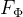
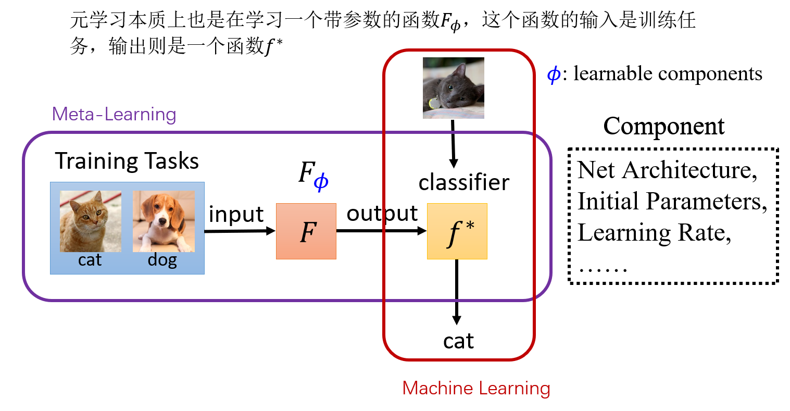
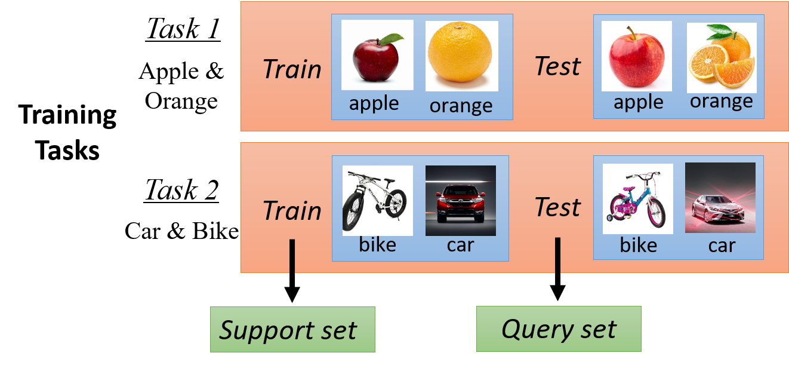

 元学习的主要研究内容是希望使得模型获取调整超参数的能力，使其可以在获取已有知识的基础上快速学习新的任务。学习什么呢？学习一个带**参数**的**函数**，然后再对特定任务进行训练（所以这个迁移学习有点像）。而**参数**可以是**初始化参数、网络架构、学习率**等。

## 二、支持集和查询集

在说支持集和查询集之前，这里再提一点关于元学习训练任务和测试任务的概念。训练任务就是说元学习里的训练数据，而测试任务就是说元学习的测试数据。其中，训练任务和测试任务中的任务是相似的。例如，训练任务中包括两个任务：①分类苹果和梨子，②分类自行车和小车；测试任务中包括一个训练任务：③分类猫和狗。其中，①②③都是二分类任务，它们是相似的。支持集和查询集的划分，无论是训练任务还是测试任务，都需要划分支持集和查询集，例如：

①苹果梨子二分类任务中，包含的数据集被划分为支持集S1和查询集Q1；
②自行车小车二分类任务中，包含的数据集被划分为支持集S2和查询集Q2；
③猫狗二分类任务中，包含的数据集被划分为支持集S3和查询集Q3。

为了更好地理解支持集和查询集，举一个元学习的例子：假设我们想要通过任务①和任务②来学习一个模型的初始化参数，然后通过任务③（当然这个任务③不一定是猫狗二分类，也可以是其他二分类问题）来微调参数，进而得到一个快速适用于任务③的模型。对于任务①和任务②，其中的支持集S1和S2主要用来学习初始化参数，而支持集Q1和Q2主要用来增加初始化参数的泛化性。对于任务③，其中的支持集主要用来微调初始化参数，而其中的查询集是用来测试最终模型的性能的。

三、训练集|验证集|测试集 VS 支持集|查询集
        共同点：训练集|验证集|测试集，这三个集合之间互不相交，而支持集|查询集也互不相交。

​    不同点：训练集|验证集|测试集要从围绕模型来考虑这三者的作用，训练集用来学习模型的参数，验证集用于模型的选择，测试集用于模型的评估。支持集|查询集要围绕任务来考虑这两者的作用，训练任务中的支持集和查询集都是用于模型参数的学习，而测试任务的支持集是用于模型参数的学习、查询集用于模型的评估。

------------------------------------------------

