# PointNet++

[https://arxiv.org/abs/1706.0241](https://link.zhihu.com/?target=https%3A//arxiv.org/abs/1706.02413)

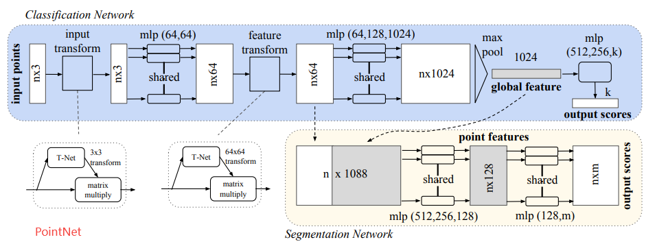
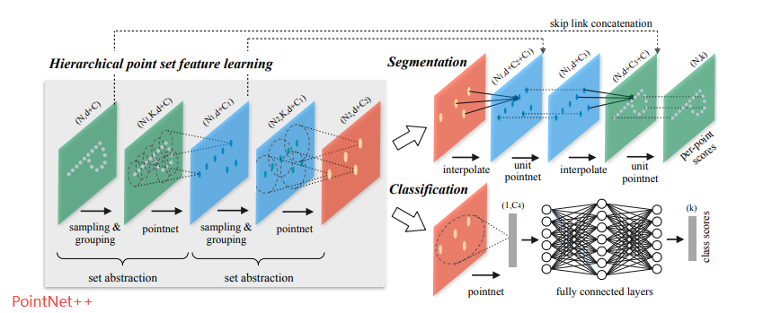

### 两者主要不同点

1. 考虑到PointNet特征提取时只考虑单点，不能很好的表示局部结构 ==> PointNet++引入了**sampling & grouping**，考虑局部领域特征
2. PointNet中global feature直接由max pool得到，容易造成信息丢失 ==> PointNet++**采用层级结构**，可以有效的依据不同的感受野大小来提取不同区域的局部特征
3. PointNet中采用TNet来保证点云特征旋转的不变性 ==> PointNet++采用**局部相对坐标**进行特征提取，剔除了TNet网络
4. 针对稀疏点云导致样本不均匀问题，PointNet未做处理 ==> PointNet++提出**多尺度方法MSG和多层级方法MRG**来解决样本不均匀问题
5. 对于分割网络来讲，PointNet直接整合global feature和local embedding特征 ==> PointNet++采用**Encoder - Decoder**结构，特征通过**skip link concatenation**进行连接

## PointNet++

前面我们提到了PointNet的一个缺陷，即**没有提取局部特征**这一过程。这在实际使用过程中该缺点往往会**导致模型[泛化能力](https://zhida.zhihu.com/search?content_id=162907217&content_type=Article&match_order=1&q=泛化能力&zhida_source=entity)有限**，特别是在复杂场景下。

作者在PointNet++文章中（总体结构图如上），主要针对三个问题，提出了三种解决方法，分别为：

***问题1：一个点云图往往有非常多的点，这会造成计算量过大而限制模型使用，如何解决？\***

因为考虑到现实场景中由雷达或者深度相机产生的点云数据往往数据量过大，导致模型的运算量大难以落地，且不同点云数据间点的数量不等，这在训练的时候很难进行**批量训练。**

作者的解决思路就是从所有的点云数据中（假设有N个点）采样 N′ 个点，而且希望 这 N′ 个点能够包含尽可能多的有用信息。所以作者提出了一种叫做 farthest point sampling (FPS) algorithm，中文翻译就是**最远点采样算法**来实现从N个点中采样 N′ 个点。

这个最远点采样算法（FPS）的流程如下：

- （1）随机选择一个点作为**初始点**作为**已选择采样点**；
- （2）计算**未选择采样点集**中每个点与**已选择采样点集**之间的距离distance，将距离最大的那个点加入已选择采样点集，
- （3）更新distance，一直循环迭代下去，直至获得了目标数量的采样点。

代码实现如下

```python
def farthest_point_sample(xyz, npoint):
    """
    Input:
        xyz: pointcloud data, [B, N, 3]
        npoint: number of samples
    Return:
        centroids: sampled pointcloud index, [B, npoint]
    """
    device = xyz.device
    B, N, C = xyz.shape
    centroids = torch.zeros(B, npoint, dtype=torch.long).to(device)
    distance = torch.ones(B, N).to(device) * 1e10
    farthest = torch.randint(0, N, (B,), dtype=torch.long).to(device)
    batch_indices = torch.arange(B, dtype=torch.long).to(device)
    for i in range(npoint):
        centroids[:, i] = farthest
        centroid = xyz[batch_indices, farthest, :].view(B, 1, 3)
        dist = torch.sum((xyz - centroid) ** 2, -1)
        mask = dist < distance
        distance[mask] = dist[mask]
        farthest = torch.max(distance, -1)[1]
    return centroids
```

***问题2：如何将点集划分为不同的区域，并获取不同区域的局部特征？\***

上面已经对原始点云数据进行了最远点采样，降低了数据的冗余度，减少了PointNet++模型的输入大小，但是并未进行局部特征的提取。

这里我们回忆一下CNN模型是如何进行局部特征提取的呢？

我们知道在CNN中，局部特征往往由图片/特征图的k×k区域与一个大小为 k×k 的卷积核通过**点乘求和**获得的。受到CNN的启发，作者也想在3D点集当中同样需要找到结构相同的**子区域**，和对应的**区域特征提取器，**一个名为Ball query方法的group策略应运而生。

具体作者怎么做的呢？可以总结如下：

（1）预设**搜索区域**的半径R与**子区域**的点数K

（2）上面提取出来了 N′ 个点，作为N′ 个centriods。以这N′ 个点为球心，画半径为R的球体（叫做query ball，也就是搜索区域）。

（3）在每个以centriods的球心的球体内搜索离centriods最近的的点（按照距离从小到大排序，找到K个点）。如果query ball的点数量大于规模K，那么直接取前K个作为**子区域**；如果小于，那么直接对某个点重采样，凑够规模K

（4）获取所有N′ 个centriods对应的N′个子区域，每个子区域K个点。这里的K个点有点CNN中k×k区域的感觉。

至此，作者介绍了如何像CNN那样，实现**子区域**的定义，进而实现局部特征的提取。

上面我们按照原文的思路对两个问题进行了解答，这两个在原文中被定义为**（1）Sampling layer（2）Grouping layer，**其实很好理解。

- 对Sampling layer而言，就是在所有的点云数据中（假设有N个点）采样 N′ 个点；假设网络的输入为 N×(d+C) 的张量，其中N是点云数据的数据点数量，d为xyz坐标（三维），C是点上的特征（用来形容点的属性的，一般为0），那么通过Sampling layer后，网络的输出就变成了N′×(d+C)。
- 对Grouping layer而言，就是以上面采样的 N′ 个点为中心找到N′ 个子区域，每个子区域包含K个点，每个点的维度为 (d+C) 。那么通过Grouping layer后，网络的输出就变成了N′×K×(d+C)。

以上两个层在结构图中表现如下

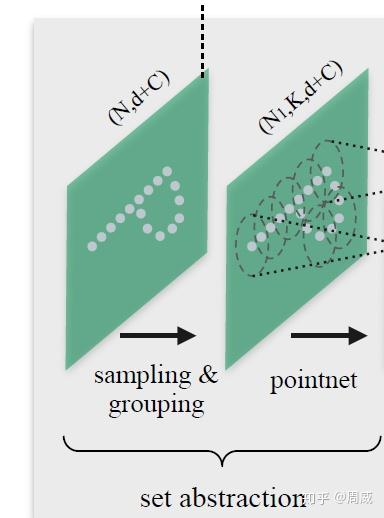

既然获得了N′ 个子区域，每个子区域怎么进行**区域特征提取**呢？

我们继续回忆下CNN中的区域特征提取，在CNN中区域特征提取是通过k×k区域与一个大小为 k×k 的卷积核通过**点乘求和**获得的。难道在PointNet++中也是通过这样的方式实现的吗？

在没看文章前我也以为是这样的方式，但是我想错了。

我们从上面的图中可以看出，通过Sample layer和Grounping layer后，网络后面紧跟着一个pointnet来进行**区域特征提取**。回忆一下在pointnet中，提取全局特征只有一个max pool操作，那么作者将这个max pool用在这个**子区域**上，也能够实现**区域特征提取。**在原文中，作者用了这样的图例进行说明（如下）。

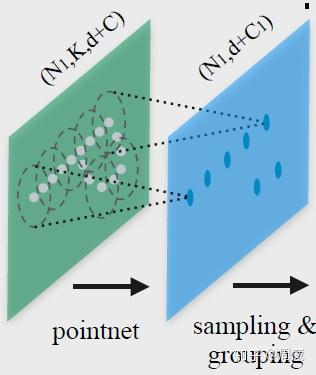

可能不够直观，我进行了额外的补充。

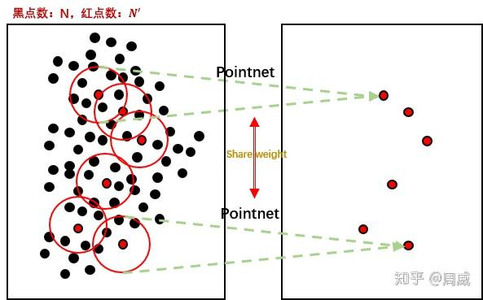

那么每个pointnet的结构如下

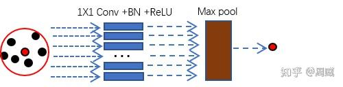

很明显融合局部信息的并不是加权求和，而是**max pool**。**作者通过不断的Sample layer/Grounping layer/Pointnet（三个合在一起叫做set abstraction），类似于CNN中不断堆叠卷积层，实现了对局部特征不断的提取**。

那么一个set abstraction的代码定义如下：

```python
class PointNetSetAbstraction(nn.Module):
    def __init__(self, npoint, radius, nsample, in_channel, mlp, group_all):
        super(PointNetSetAbstraction, self).__init__()
        self.npoint = npoint
        self.radius = radius
        self.nsample = nsample
        self.mlp_convs = nn.ModuleList()
        self.mlp_bns = nn.ModuleList()
        last_channel = in_channel
        for out_channel in mlp:
            self.mlp_convs.append(nn.Conv2d(last_channel, out_channel, 1))
            self.mlp_bns.append(nn.BatchNorm2d(out_channel))
            last_channel = out_channel
        self.group_all = group_all

    def forward(self, xyz, points):
        """
        Input:
            xyz: input points position data, [B, C, N]
            points: input points data, [B, D, N]
        Return:
            new_xyz: sampled points position data, [B, C, S]
            new_points_concat: sample points feature data, [B, D', S]
        """
        xyz = xyz.permute(0, 2, 1)
        if points is not None:
            points = points.permute(0, 2, 1)

        if self.group_all:
            new_xyz, new_points = sample_and_group_all(xyz, points)
        else:
            new_xyz, new_points = sample_and_group(self.npoint, self.radius, self.nsample, xyz, points)
        # new_xyz: sampled points position data, [B, npoint, C]
        # new_points: sampled points data, [B, npoint, nsample, C+D]
        new_points = new_points.permute(0, 3, 2, 1) # [B, C+D, nsample,npoint]
        for i, conv in enumerate(self.mlp_convs):
            bn = self.mlp_bns[i]
            new_points =  F.relu(bn(conv(new_points)))

        new_points = torch.max(new_points, 2)[0]
        new_xyz = new_xyz.permute(0, 2, 1)
        return new_xyz, new_points
```

***问题3：点云不均匀的时候，在密集区域学习出来的特征可能不适合稀疏区域，这个问题应该如何解决？***

上面基本介绍完了Pointnet++从**数据点采样**到**局部特征提取**的过程。但是作者在实践的过程中又发现了一个问题，原文中提到

> As discussed earlier, it is common that a point set comes with nonuniform density in different areas. Such non-uniformity introduces a significant challenge for point set feature learning. **Features learned in dense data** **may not generalize to sparsely sampled regions**. Consequently, models trained for sparse point cloud may not recognize fine-grained local structures.

于是作者提出了**两种特征融合方式**，分别为

（1）Multi-scale grouping (MSG);

（2）Multiresolution grouping (MRG).

大致的图示如下。

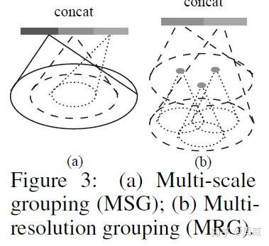

（1）对方法MSG而言，是对**不同半径的子区域**进行特征提取后进行**特征堆叠**，特征提取过程还是采用了PointNet，实现过程如下图所示。

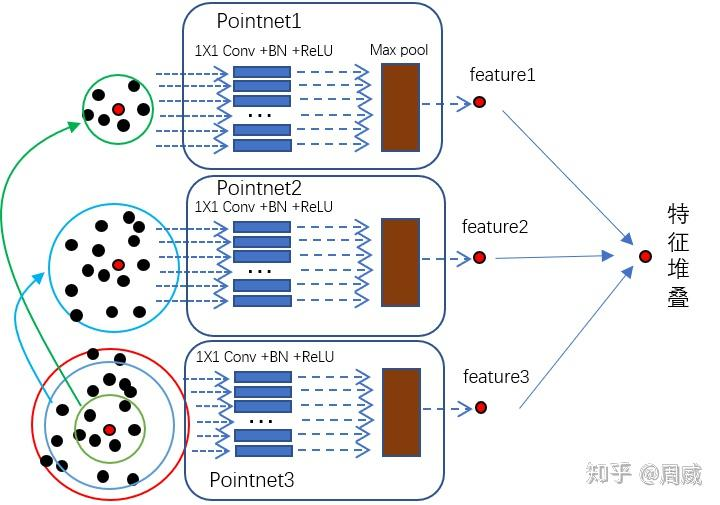

代码实现如下：

```python
        B, N, C = xyz.shape
        S = self.npoint
        new_xyz = index_points(xyz, farthest_point_sample(xyz, S))
        new_points_list = []
        for i, radius in enumerate(self.radius_list):
            K = self.nsample_list[i]
            group_idx = query_ball_point(radius, K, xyz, new_xyz)
            grouped_xyz = index_points(xyz, group_idx)
            grouped_xyz -= new_xyz.view(B, S, 1, C)
            if points is not None:
                grouped_points = index_points(points, group_idx)
                grouped_points = torch.cat([grouped_points, grouped_xyz], dim=-1)
            else:
                grouped_points = grouped_xyz

            grouped_points = grouped_points.permute(0, 3, 2, 1)  # [B, D, K, S]
            for j in range(len(self.conv_blocks[i])):
                conv = self.conv_blocks[i][j]
                bn = self.bn_blocks[i][j]
                grouped_points =  F.relu(bn(conv(grouped_points)))
            new_points = torch.max(grouped_points, 2)[0]  # [B, D', S]
            new_points_list.append(new_points)

        new_xyz = new_xyz.permute(0, 2, 1)
        new_points_concat = torch.cat(new_points_list, dim=1)
```

（2）作者是考虑到上述的MSG方法**计算量太大**，提出来的备选方案MRG。MRG用两个Pointnet对连续的两层分别做**特征提取与聚合**，然后再进行特征拼接。如下图所示（没在代码中找到就不详细解析了）。

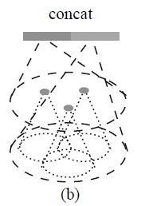

至此，问题1，2，3就解析完毕了，如果解析过程中有错，欢迎批评指正！

***问题4：连续的Set Abstraction（SA）层对原始点进行[下采样](https://zhida.zhihu.com/search?content_id=162907217&content_type=Article&match_order=1&q=下采样&zhida_source=entity)而获得数量更少的特征点，如何从这些特征点中实现原始点云数据的分割任务呢？\***

点云数据的分割任务实际上就是为原始点云中的每个点分配一个**语义标签**（车/人/非机动车/背景）。一个能想到的比较简单的方式就是在上述SA层的sample过程中，采样**所有的点**为圆心进行局部特征提取。

然而，这种方式确实**太耗时**了。

于是作者就在想，能否将已经进行特征提取的点，通过**[上采样](https://zhida.zhihu.com/search?content_id=162907217&content_type=Article&match_order=1&q=上采样&zhida_source=entity)**的方式，将这种特征传播给在SA**下采样过程中丢失的点（未参与特征提取的点）**呢？

答案是肯定的，作者提出了一种利用**基于距离插值**的分层**特征传播**（Feature Propagation）策略。

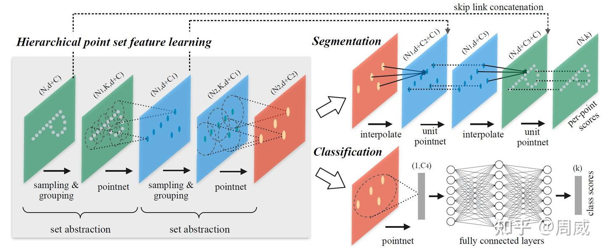

大致的过程是（配合上图理解效果更佳）：

（1）**基于k近邻的反向距离加权平均**的插值方式，实现了**丢失点（待插值点）**特征的求解。

这里假设丢失点（待插值点）x 的待求解特征为 $f^{(j)}(x)$ ，并假设其k个近邻点（特征已知）的特征为 ，$f_i^{(j)}$，i=1,2...,k 。那么$f^{(j)}(x)$的求解如下公式所示：

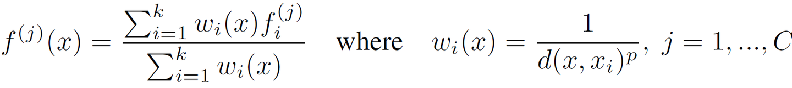

其中，d 是一种**衡量距离**的函数； w 是d 的倒数，距离 d 越小，权重越大。

（2）将**插值特征**与**SA阶段的特征**（两者具有相同数量的特征点）通过skip-link的结构连接后进行**特征堆叠。**

（3）堆叠的特征被输入到一个叫做“**unit pointnet”网络**（类似于 1×1 CNNs）中实现特征的进一步提取。

（4）执行上述步骤（1）（2）（3）若干次（代码中给了3次）。

（5）利用1×1卷积+BN+ReLU输出**分割预测结果**。

具体的分割网络的代码实现为：

```python
class get_model(nn.Module):
    def __init__(self, num_classes, normal_channel=False):
        super(get_model, self).__init__()
        if normal_channel:
            additional_channel = 3
        else:
            additional_channel = 0
        self.normal_channel = normal_channel
        self.sa1 = PointNetSetAbstractionMsg(512, [0.1, 0.2, 0.4], [32, 64, 128], 3+additional_channel, [[32, 32, 64], [64, 64, 128], [64, 96, 128]])
        self.sa2 = PointNetSetAbstractionMsg(128, [0.4,0.8], [64, 128], 128+128+64, [[128, 128, 256], [128, 196, 256]])
        self.sa3 = PointNetSetAbstraction(npoint=None, radius=None, nsample=None, in_channel=512 + 3, mlp=[256, 512, 1024], group_all=True)
        self.fp3 = PointNetFeaturePropagation(in_channel=1536, mlp=[256, 256])
        self.fp2 = PointNetFeaturePropagation(in_channel=576, mlp=[256, 128])
        self.fp1 = PointNetFeaturePropagation(in_channel=150+additional_channel, mlp=[128, 128])
        self.conv1 = nn.Conv1d(128, 128, 1)
        self.bn1 = nn.BatchNorm1d(128)
        self.drop1 = nn.Dropout(0.5)
        self.conv2 = nn.Conv1d(128, num_classes, 1)

    def forward(self, xyz, cls_label):
        # Set Abstraction layers
        B,C,N = xyz.shape
        if self.normal_channel:
            l0_points = xyz
            l0_xyz = xyz[:,:3,:]
        else:
            l0_points = xyz
            l0_xyz = xyz
        l1_xyz, l1_points = self.sa1(l0_xyz, l0_points)
        l2_xyz, l2_points = self.sa2(l1_xyz, l1_points)
        l3_xyz, l3_points = self.sa3(l2_xyz, l2_points)
        # Feature Propagation layers
        l2_points = self.fp3(l2_xyz, l3_xyz, l2_points, l3_points)
        l1_points = self.fp2(l1_xyz, l2_xyz, l1_points, l2_points)
        cls_label_one_hot = cls_label.view(B,16,1).repeat(1,1,N)
        l0_points = self.fp1(l0_xyz, l1_xyz, torch.cat([cls_label_one_hot,l0_xyz,l0_points],1), l1_points)
        # FC layers
        feat = F.relu(self.bn1(self.conv1(l0_points)))
        x = self.drop1(feat)
        x = self.conv2(x)
        x = F.log_softmax(x, dim=1)
        x = x.permute(0, 2, 1)
        return x, l3_points
```

其中，FeaturePropagation层的定义为：

```python
class PointNetFeaturePropagation(nn.Module):
    def __init__(self, in_channel, mlp):
        super(PointNetFeaturePropagation, self).__init__()
        self.mlp_convs = nn.ModuleList()
        self.mlp_bns = nn.ModuleList()
        last_channel = in_channel
        for out_channel in mlp:
            self.mlp_convs.append(nn.Conv1d(last_channel, out_channel, 1))
            self.mlp_bns.append(nn.BatchNorm1d(out_channel))
            last_channel = out_channel

    def forward(self, xyz1, xyz2, points1, points2):
        """
        Input:
            xyz1: input points position data, [B, C, N]
            xyz2: sampled input points position data, [B, C, S]
            points1: input points data, [B, D, N]
            points2: input points data, [B, D, S]
        Return:
            new_points: upsampled points data, [B, D', N]
        """
        xyz1 = xyz1.permute(0, 2, 1)
        xyz2 = xyz2.permute(0, 2, 1)

        points2 = points2.permute(0, 2, 1)
        B, N, C = xyz1.shape
        _, S, _ = xyz2.shape

        if S == 1:
            interpolated_points = points2.repeat(1, N, 1)
        else:
            dists = square_distance(xyz1, xyz2)
            dists, idx = dists.sort(dim=-1)
            dists, idx = dists[:, :, :3], idx[:, :, :3]  # [B, N, 3]

            dist_recip = 1.0 / (dists + 1e-8)
            norm = torch.sum(dist_recip, dim=2, keepdim=True)
            weight = dist_recip / norm
            interpolated_points = torch.sum(index_points(points2, idx) * weight.view(B, N, 3, 1), dim=2)

        if points1 is not None:
            points1 = points1.permute(0, 2, 1)
            new_points = torch.cat([points1, interpolated_points], dim=-1)
        else:
            new_points = interpolated_points

        new_points = new_points.permute(0, 2, 1)
        for i, conv in enumerate(self.mlp_convs):
            bn = self.mlp_bns[i]
            new_points = F.relu(bn(conv(new_points)))
        return new_points
```