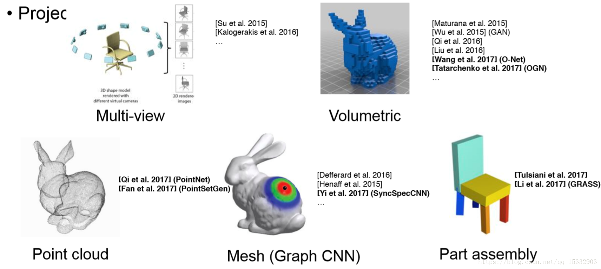
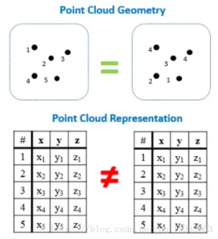
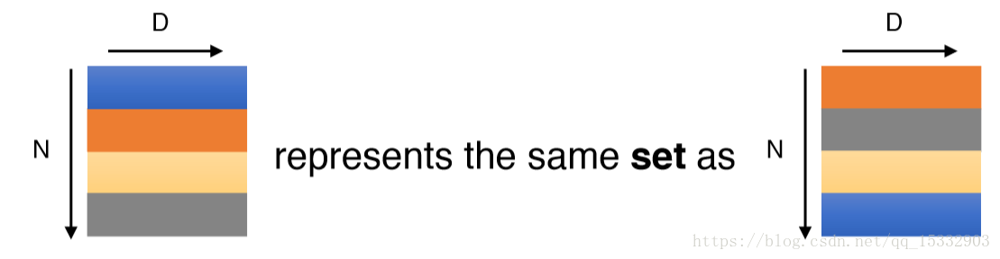
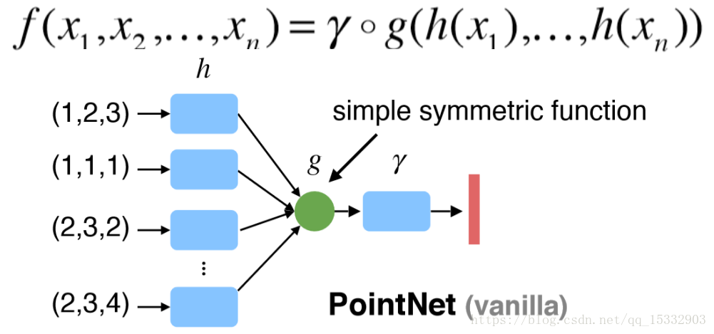
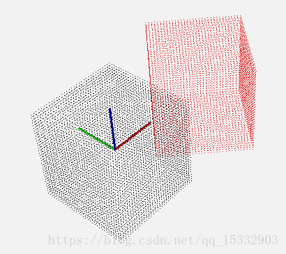
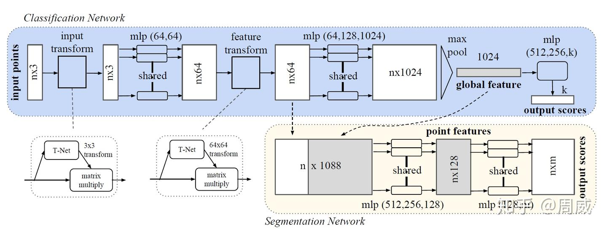
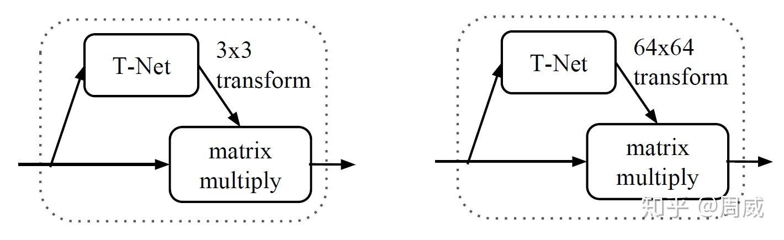
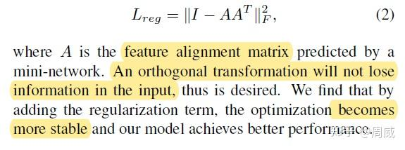
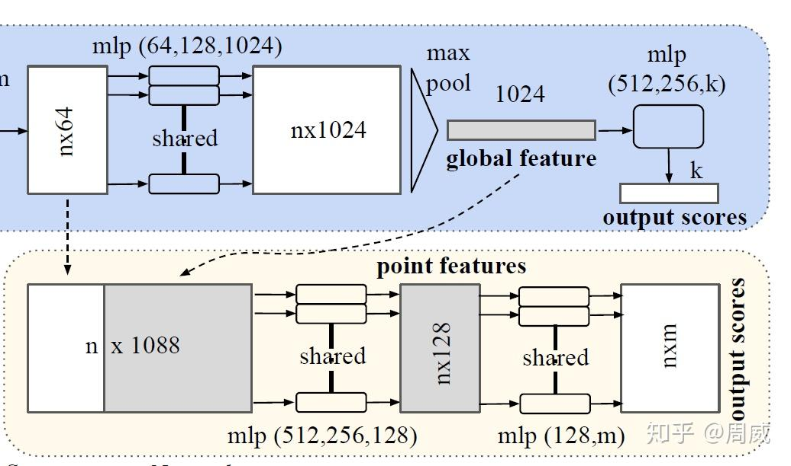

**PointNet**：[https://arxiv.org/abs/1612.0059](https://link.zhihu.com/?target=https%3A//arxiv.org/abs/1612.00593)

> https://zhuanlan.zhihu.com/p/336496973

一、三维深度学习简介

https://blog.csdn.net/qq_15332903/article/details/80224387

多视角（multi-view）：通过多视角二维图片组合为三维物体，此方法将传统CNN应用于多张二维视角的图片，特征被view pooling procedure聚合起来形成三维物体；
体素（volumetric）：通过将物体表现为空间中的体素进行类似于二维的三维卷积（例如，卷积核大小为5x5x5），是规律化的并且易于类比二维的，但同时因为多了一个维度出来，时间和空间复杂度都非常高，目前已经不是主流的方法了；
点云（point clouds）：直接将三维点云抛入网络进行训练，数据量小。主要任务有分类、分割以及大场景下语义分割；
非欧式（manifold，graph）：在流形或图的结构上进行卷积，三维点云可以表现为mesh结构，可以通过点对之间临接关系表现为图的结构。流形表达比较抽象，用到拉普拉斯特征什么的




二、点云存在的问题

无序性：点云本质上是一长串点（nx3矩阵，其中n是点数）。在几何上，点的顺序不影响它在空间中对整体形状的表示，例如，相同的点云可以由两个完全不同的矩阵表示。 如下图左边所示：

​	我们希望得到的效果如下图右边：N代表点云个数，D代表每个点的特征维度。不论点云顺序怎样，希望得到相同的特征提取结果。
​    

我们知道，网络的一般结构是：提特征-特征映射-特征图压缩（降维）-全连接。

  下图中x代表点云中某个点，h代表特征提取层，g叫做对称方法，r代表更高维特征提取，最后接一个softmax分类。g可以是maxpooling或sumpooling，也就是说，最后的D维特征对每一维都选取N个点中对应的最大特征值或特征值总和，这样就可以通过g来解决无序性问题。pointnet采用了max-pooling策略。



 2.旋转性：相同的点云在空间中经过一定的刚性变化（旋转或平移），坐标发生变化，如下图所示：

我们希望不论点云在怎样的坐标系下呈现，网络都能正确的识别出。这个问题可以通过STN（spacial transform netw）来解决。二维的变换方法可以参考这里，三维不太一样的是点云是一个不规则的结构（无序，无网格），不需要重采样的过程。pointnet通过学习一个矩阵来达到对目标最有效的变换。



三、pointnet网络结构详解

这里我们直接给出PointNet的网络结构，如下图所示。大致的运算流程如下（借鉴[美团无人配送：PointNet系列论文解读](https://zhuanlan.zhihu.com/p/44809266)）：

- 1、输入为一帧的全部点云数据的集合，表示为一个nx3的[2d tensor](https://zhida.zhihu.com/search?content_id=162907217&content_type=Article&match_order=1&q=2d+tensor&zhida_source=entity)，其中n代表点云数量，3对应xyz坐标。
- 2、输入数据先通过和一个T-Net**学习到的转换矩阵**相乘来对齐，保证了模型的对特定空间转换的不变性。
- 3、通过多次mlp对各点云数据进行特征提取后，再用一个T-Net对特征进行对齐。
- 4、在特征的各个维度上执行**[maxpooling](https://zhida.zhihu.com/search?content_id=162907217&content_type=Article&match_order=1&q=maxpooling&zhida_source=entity)**操作来得到最终的**全局特征**。
- 5、对分类任务，将[全局特征](https://zhida.zhihu.com/search?content_id=162907217&content_type=Article&match_order=2&q=全局特征&zhida_source=entity)通过mlp来预测最后的分类分数；对分割任务，将全局特征和之前学习到的各点云的局部特征进行串联，再通过mlp得到每个数据点的分类结果。



该网络根据任务的不用（分类还是分割）可以看成两个网络，一是做**分类任务**的蓝色区域，二是做**分割任务**的浅黄色区域，这在图上已经很明显了。

***问：那么网络的输入是什么呢？***

可以看出来，网络的输入是一个 n×3 的[张量](https://zhida.zhihu.com/search?content_id=162907217&content_type=Article&match_order=1&q=张量&zhida_source=entity)，其中n是点云数据包含的**点的个数**，3就是空间**位置坐标（x,y,z）**。为什么可以这么简单粗暴？但是的确作者就这么做的，而且实际中效果也是相当的好呀。

***问：那么图中的input transform和[feature transform](https://zhida.zhihu.com/search?content_id=162907217&content_type=Article&match_order=1&q=feature+transform&zhida_source=entity)是什么？***

这要从点云数据的**不变性**说出，也就是说点云数据所代表的**目标**对某些空间转换应该具有不变性，如旋转和平移等刚体变换，这应该很好理解，就和对图片做上下左右翻转后.



获取该 3×3 的input transform矩阵的python代码实现如下，我做了一些注释，便于大家理解：

```python
class STN3d(nn.Module):
    def __init__(self, channel):
        super(STN3d, self).__init__()
        self.conv1 = torch.nn.Conv1d(channel, 64, 1)
        self.conv2 = torch.nn.Conv1d(64, 128, 1)
        self.conv3 = torch.nn.Conv1d(128, 1024, 1)
        self.fc1 = nn.Linear(1024, 512)
        self.fc2 = nn.Linear(512, 256)
        self.fc3 = nn.Linear(256, 9)
        self.relu = nn.ReLU()

        self.bn1 = nn.BatchNorm1d(64)
        self.bn2 = nn.BatchNorm1d(128)
        self.bn3 = nn.BatchNorm1d(1024)
        self.bn4 = nn.BatchNorm1d(512)
        self.bn5 = nn.BatchNorm1d(256)

    def forward(self, x):
        batchsize = x.size()[0] # shape (batch_size,3,point_nums)
        x = F.relu(self.bn1(self.conv1(x))) # shape (batch_size,64,point_nums)
        x = F.relu(self.bn2(self.conv2(x))) # shape (batch_size,128,point_nums)
        x = F.relu(self.bn3(self.conv3(x))) # shape (batch_size,1024,point_nums)
        x = torch.max(x, 2, keepdim=True)[0] # shape (batch_size,1024,1)
        x = x.view(-1, 1024) # shape (batch_size,1024)

        x = F.relu(self.bn4(self.fc1(x))) # shape (batch_size,512)
        x = F.relu(self.bn5(self.fc2(x))) # shape (batch_size,256)
        x = self.fc3(x) # shape (batch_size,9)

        iden = Variable(torch.from_numpy(np.array([1, 0, 0, 0, 1, 0, 0, 0, 1]).astype(np.float32))).view(1, 9).repeat(
            batchsize, 1) # # shape (batch_size,9)
        if x.is_cuda:
            iden = iden.cuda()
        # that's the same thing as adding a diagonal matrix(full 1)
        x = x + iden # iden means that add the input-self
        x = x.view(-1, 3, 3) # shape (batch_size,3,3)
        return x
```

这其实在原论文中也提到

> The mininetwork itself resembles the big network and is composed by **basic modules of point independent feature extraction**, **max pooling** and **fully connected layers**

3×3 的input transform矩阵的获取还是比较简单，这么一套操作下来，这个 input transform矩阵就**不是固定**的了，它会根据网络的输入动态调整矩阵的权重。

关键代码解释

**构造变换矩阵**

```
x = F.relu(self.bn4(self.fc1(x)))
x = F.relu(self.bn5(self.fc2(x)))
x = self.fc3(x)
```

- 将全局特征通过全连接层，逐步降维：
  - `(batch_size, 1024)` → `(batch_size, 512)`
  - `(batch_size, 512)` → `(batch_size, 256)`
  - `(batch_size, 256)` → `(batch_size, 9)`

------

**加入单位矩阵偏移**

```
iden = Variable(torch.from_numpy(np.array([1, 0, 0, 0, 1, 0, 0, 0, 1]).astype(np.float32)))
iden = iden.view(1, 9).repeat(batchsize, 1)
if x.is_cuda:
    iden = iden.cuda()
x = x + iden
x = x.view(-1, 3, 3)
```

- `iden` 是一个单位矩阵（identity matrix）的向量形式 `[1, 0, 0, 0, 1, 0, 0, 0, 1]`。
- 将其加到`x`的输出上，确保网络输出的变换矩阵在初始化时接近单位矩阵，从而稳定训练。
- 最后，将`x` reshape 为 `(batch_size, 3, 3)`，表示3×3的变换矩阵。

------

**动态调整的意义**

- 这个模块的输出是一个 **动态可学习的3×3矩阵**，可以用来对输入点云进行对齐或变换。
- 原文中提到，这个模块结合了特征提取、全局聚合（通过最大池化），以及全连接层的多层感知器（MLP），确保变换矩阵是动态根据输入计算的，而不是固定的。

这个`STN3d`模块的主要功能是生成一个动态的3×3变换矩阵，能够对输入点云进行几何变换，从而对输入点云实现**旋转、平移或缩放的对齐操作**。这种动态调整可以提升模型对不同点云输入的鲁棒性和泛化能力。

和上面的input transform矩阵的获取方式类似，feature transform的 64×64 矩阵获取代码实现如下：

```python
class STNkd(nn.Module):
    def __init__(self, k=64):
        super(STNkd, self).__init__()
        self.conv1 = torch.nn.Conv1d(k, 64, 1)
        self.conv2 = torch.nn.Conv1d(64, 128, 1)
        self.conv3 = torch.nn.Conv1d(128, 1024, 1)
        self.fc1 = nn.Linear(1024, 512)
        self.fc2 = nn.Linear(512, 256)
        self.fc3 = nn.Linear(256, k * k)
        self.relu = nn.ReLU()

        self.bn1 = nn.BatchNorm1d(64)
        self.bn2 = nn.BatchNorm1d(128)
        self.bn3 = nn.BatchNorm1d(1024)
        self.bn4 = nn.BatchNorm1d(512)
        self.bn5 = nn.BatchNorm1d(256)

        self.k = k

    def forward(self, x):
        batchsize = x.size()[0]
        x = F.relu(self.bn1(self.conv1(x)))
        x = F.relu(self.bn2(self.conv2(x)))
        x = F.relu(self.bn3(self.conv3(x)))
        x = torch.max(x, 2, keepdim=True)[0]
        x = x.view(-1, 1024)

        x = F.relu(self.bn4(self.fc1(x)))
        x = F.relu(self.bn5(self.fc2(x)))
        x = self.fc3(x)

        iden = Variable(torch.from_numpy(np.eye(self.k).flatten().astype(np.float32))).view(1, self.k * self.k).repeat(
            batchsize, 1)
        if x.is_cuda:
            iden = iden.cuda()
        x = x + iden
        x = x.view(-1, self.k, self.k)
        return x
```

值得注意的是，论文中提到

> However, transformation matrix in the feature space has **much higher** dimension than the spatial [transform matrix](https://zhida.zhihu.com/search?content_id=162907217&content_type=Article&match_order=1&q=transform+matrix&zhida_source=entity), which greatly **increases the difficulty of optimization**.

也就是 64×64 的feature transform矩阵很难优化，但是作者发现如果这个矩阵约等于一个[正交矩阵](https://zhida.zhihu.com/search?content_id=162907217&content_type=Article&match_order=1&q=正交矩阵&zhida_source=entity)，那么优化就方便很多，也稳定很多。为了实现这个矩阵约等于一个正交矩阵，根据正交矩阵的性质，即**正交矩阵与其转置的乘积等于[单位矩阵](https://zhida.zhihu.com/search?content_id=162907217&content_type=Article&match_order=1&q=单位矩阵&zhida_source=entity)**。那么作者额外增加了一个[损失函数](https://zhida.zhihu.com/search?content_id=162907217&content_type=Article&match_order=1&q=损失函数&zhida_source=entity)，定义如下：



```python
def feature_transform_reguliarzer(trans):
    """ make the transformation matrix of input akin to orthogonal matrix"""
    d = trans.size()[1]
    I = torch.eye(d)[None, :, :]
    if trans.is_cuda:
        I = I.cuda()
    loss = torch.mean(torch.norm(torch.bmm(trans, trans.transpose(2, 1)) - I, dim=(1, 2)))
    return loss
```

***问：为什么做分割任务的时候，输入到[分割网络](https://zhida.zhihu.com/search?content_id=162907217&content_type=Article&match_order=1&q=分割网络&zhida_source=entity)的特征为1088？***

这里我们先放上图，如下所示



这个 n×1088 的张量由两部分组成，一个是[特征提取](https://zhida.zhihu.com/search?content_id=162907217&content_type=Article&match_order=3&q=特征提取&zhida_source=entity)网络的输出（大小为 n×64 ）,另一个是通过maxpooling后的global feature（大小为1024），在进行两者融合的时候，对global feature进行了广播，那么64+1024就是1088了。为什么要这么做呢？论文中这么提到

> After computing the global point cloud feature vector, we feed it back to per point features by **concatenating the global feature with each of the point features**. Then we extract new per point features based on the combined point features - this time the per point feature is aware of both the **local and global information**

答案就是作者想要融合**点的特征信息**（来自特征提取网络的输出）与**全局特征**（来自global feature）。

***问：这一套下来，作者一直在做点之间特征的单独提取，除了最后一层maxpool获取全局信息外，好像并没有将点与其周围点进行融合，提取局部特征呀？\***

的确，在PointNet这篇文章中确实没有做到像CNN那样**逐层提取局部特征。**我们知道在CNN中，一个点会与周围若干点进行[加权求和](https://zhida.zhihu.com/search?content_id=162907217&content_type=Article&match_order=1&q=加权求和&zhida_source=entity)（具体取决于卷积核大小），然后获取一个新的点，随着网络层数加深，深层网络的一个点对应原始图像的一个映射区域，这就是**[感受野](https://zhida.zhihu.com/search?content_id=162907217&content_type=Article&match_order=1&q=感受野&zhida_source=entity)**的概念。但是本文做的特征提取都是点之间独立进行的，这势必会造成一些问题，至于具体的问题解决，作者在PointNet++展开了说明。