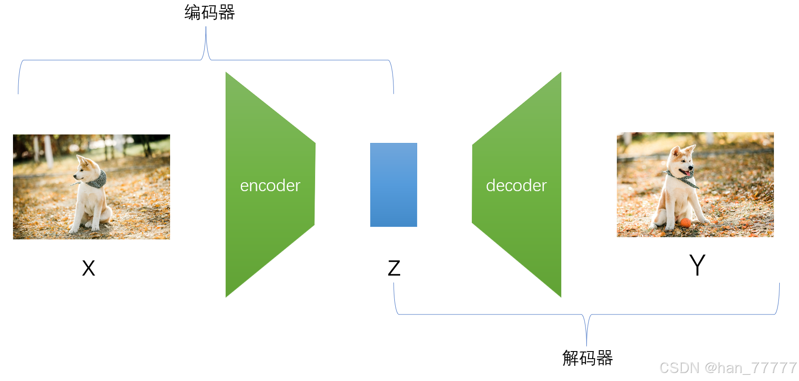
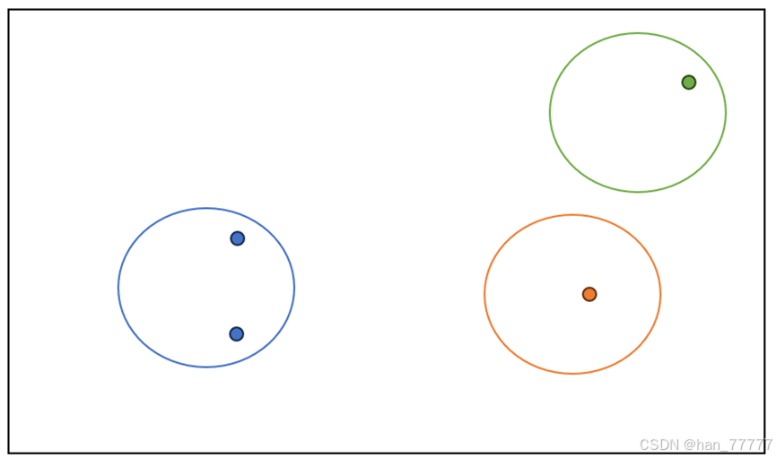
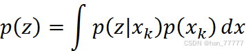
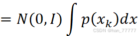
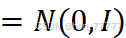
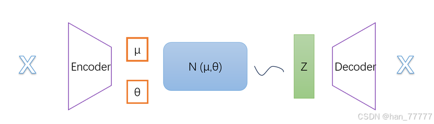
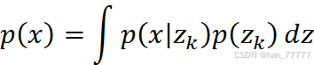
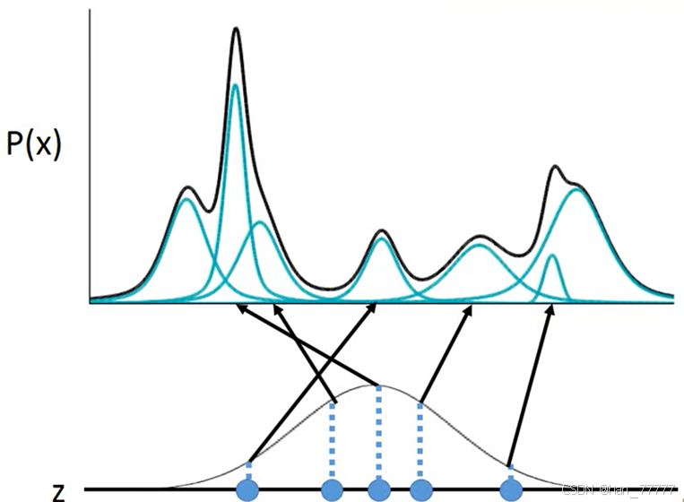
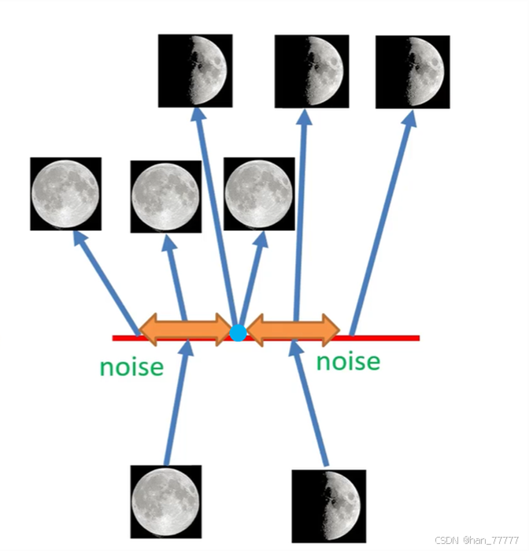
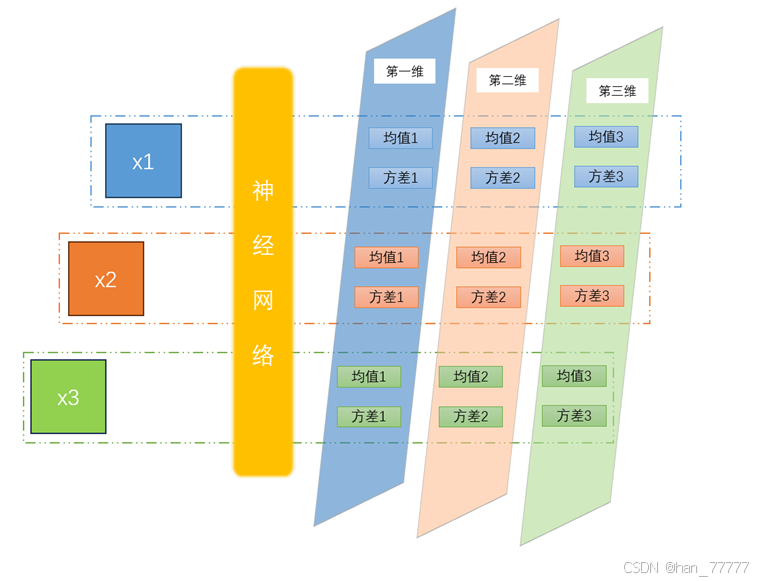

# **Variational Auto Encoder** 变分自编解码器

> https://blog.csdn.net/weixin_45651883/article/details/143809735

一、直接认识（感性认识）
在此之前，首先在潜意识里形成一个概念范式，生成模型一般是由编码与解码两个部分构成。

​	上图是vae模型的基本结构，可以看到它是由两个部分组成，分别为encoder编码器与decoder解码器，其中encoder编码器包括原图片X、编码器encoder以及隐变量Z ；decoder编码器包括隐变量Z、解码器decoder以及新生成图片Y。其中隐变量Z是对图像X的压缩，是生成图像X的关键信息、核心指标。

​	整个模型训练的工作流程是，先输入大量的训练数据，通过encoder编码器将数据编码为潜在空间上的分布（注意是一个连续分布，而非一单个点），而后通过从Z中采样，经过解码器生成新样本。 

   由于现实中，无法算出p(x)（关于p(x)可以理解为，假设x是一张图片，那么p(x)表示选这张图片输入到系统的概率，显然易见这个值无法得到），因此计划通过对p(x)进行降维，从而间接通过p(z)描述样本X。同时为便于后期采样解码，我们假设 Z 服从多维多元的标准正态分布（后面你会发现其实Z的每一维度表示一特征、一属性），也就是 p(Z)=N(0,I)，这样一来，待模型训练完成后，想要生成新的内容时，只需要从正态分布中采样，后经decoder解码即可。

   有了上面的假设，做进一步思考，假设现在要训练模型（默认大家都有神经网络的基础），那必然需要构建损失函数，函数中一定包含重构误差项（这个显而易见），也就是编解码出来的样本与原输入样本间的误差，为了降低此误差，如果直接从p(Z)=N(0,I)中采样，会发生模型无法调优，每次模型生成的新样本，跟当前输入样本毫无相关性，这样会导致重构误差一会大、一会小，导致模型无法收敛。

   但如果给定一个真实样本 Xk，假设存在一个专属于 Xk 的分布 p(Z|Xk)，并进一步假设这个分布是（独立的、多元的）正态分布（先透露一下，当然这个分布我们是无法求出，需要用神经网络去逼近），这样一来模型在训练中 选择生成样本时，就会有一定指向性、关联性。画一个图，进行解释，

通过上文可知，隐变量Z是多元多维高斯正态分布，上图黑色框内表示隐变量Z的某一维高斯图像全投影，同时也假设了每一个样本都有各自专属的多元多维高斯分布p(Z|Xk)，上图蓝色、橙色、绿色各表示对应样本在该维度下的高斯分布95%置信区间投影 ，假设现在需要训练蓝色分布，可以看到，当选择蓝色的点时，对模型的学习是有效的，但当选择橙色、绿色点时，对模型来说这样的学习无意义。 

 其实vae论文原文中，作者也是直接将p(Z|Xk)定义为多元多维高斯标准正态分布，并未对p(Z)进行定义，因为一旦p(Z|Xk)确定了，p(Z)自然也就确定了。

​	有了上面的理解，现在回过头重新整理头绪，重新审视一下vae的工作过程，假设有一个输入图片X，通过Encoder编码器，想要实现样本X的分布p(Z|Xk)=N(0,I)，因此将Encoder编码器设置为一个神经网络q(Z|X)，网络有两个输出，分别为高斯分布的均值（张量）与方差（张量），这样一来就可以通过反向传播算法实现X对应的高斯分布向标准正态分布逼近（假如输入X是一张图片，则它向Encoder神经网络中输入的是每一点的像素值，网络的损失函数是新生成的图片与原图片之间的差异，这个损失函数一般称为重构误差）。

   随后在均值与方差生成的多维高斯函数中随机取一值Z，再通过Decoder解码器生成图像，这里需要注意，vae中Decoder解码器并没有直接生成图片，而是输出一个多维多元高斯分布的均值和方差，近而通过均值、方差生成混合高斯分布，也就是生成了样本。同样，将Decoder解码器设置为一个神经网络P（X|Z），它有两个输出，分别为均值（张量）与方差（张量），在训练网络时，只对均值做限定，对对方差不做限定，也就是让均值尽可能接近原样本X。最终待模型完成学习后，只需要从p(Z)=N(0,I) 标准正态分布中随机采样，后经decoder解码即可产生新样本。

其实vae就是用无限的高斯分布去逼近、刻画原样本服从的分布p(x)

  上式中p(z)代表从标准正态分布N(0,I)中随机取一个值的概率，P(x|z)代表着解码器，也就是p(z)经过神经网络后生成的均值、方差所对应的高斯分布。下图可以看出，Z分布中的每一点，都与P（X）（混合高斯分布）中某一高斯分布相对应。

其实Vae整个学习过程是一种对抗、平衡学习，因为模型的初衷是想从标准正态分布中随机选择一点，然后通过解码器生成新的样本，为了实现这个目的，将所有原样本通过编码器（神经网络）生成正态分布，并通过不断学习使得该分布向标准正态分布逼近，这样一来，就可以实现后期在标准正态分布中取值时所有点都有意义，都能生成新样本，或者说是隐空间都是连续的。但是真实分布又不能完全与标准正态分布一样，假如我们通过学习让每个样本的真实分布与标准正态分布一样，那对于解码器来说，将学习不到任何有用的信息，因为任何样本经过编码器后对应的分布都是标准正态分布，显然没有任何意义。（当然，以上说的这个分布可以是均值等等其他分布，并不一定要求是标准正态分布）

在学习vae时，一直未理解“将原数据编码为潜在空间上的分布”这句话的深层含义，随着学习的深入，有所感悟，具体就是同一点可能被X1样本所对应的p(Z|X1)高斯分布所涵盖，也可能被X2样本所对应的p(Z|X2)高斯分所布涵盖等等，这样一来，当选择该点进行生成图像时，才有可能产生新样本，因为原数据经过神经网络对应的潜空间分布是连续的、平滑的。比如下面月相图片，可能拥有的原始样本只有满月和半月两类图片，通过对满月图片学习，可以得到其对应的正态分布如图左侧橙色区域，通过对半月图片学习，可以得到其对应的正态分布如图右侧橙色区域。现在假设在生成样本时，选择了下图蓝点，也就是在标准正态分布中选择了蓝点，这个点经过编码器会生成一张3/4月图片，这是因为这点既学到了满月的信息，又学习到了半月的信息，在经过解码器神经网络时，将两类信息进行了融合，因此产生一个全新的样本。这也就是为什么vae可以生成原始样本以外样本的原因。

  下面再举一个具体事例，再看看编码器Encoder部分，下图，现在有3个样本，分别为X1、X2、X3。样本X1经过神经网络后，假设生成一个3维高斯分布，第一维有他对应的均值、方差，第二维有他对应的均值、方差，第三维有他对应的均值、方差，在进行学习时，会让每一维度的均值、方差向标准正态分布N（0,1）逼近。同理，样本X2、X3也会生成自身唯一相对应的3维高斯分布。最终在模型学习完后，在生成新样本时，会在Z中取值，也就是标准正态分布，对应的这里的就是在一个3维标准正态分布中取值，这个值也一定是3维的，且每一维代表一特征 、一属性，比如要生成狗的图片，第一维可能代表毛色，第二维可能代表品种等等，这时就可以通过调节每一维度的值，对生成结果进行动态、指向调整。

当然这里的维度是一个超参数，需要人为设置。