# Faster RCNN

https://blog.csdn.net/weixin_42310154/article/details/119889682

Faster RCNN检测部分主要可以分为四个模块：
（1）conv layers。即特征提取网络，用于提取特征。通过一组conv+relu+pooling层来提取图像的feature maps，用于后续的RPN层和取proposal。
（2）RPN（Region Proposal Network）。即区域候选网络，该网络替代了之前RCNN版本的Selective Search，用于生成候选框。这里任务有两部分，一个是分类：判断所有预设anchor是属于positive还是negative（即anchor内是否有目标，二分类）；还有一个bounding box regression：修正anchors得到较为准确的proposals。因此，RPN网络相当于提前做了一部分检测，即判断是否有目标（具体什么类别这里不判），以及修正anchor使框的更准一些。
（3）RoI Pooling。即兴趣域池化（SPP net中的空间金字塔池化），用于收集RPN生成的proposals（每个框的坐标），并从（1）中的feature maps中提取出来（从对应位置扣出来），生成proposals feature maps送入后续全连接层继续做分类（具体是哪一类别）和回归。
（4）Classification and Regression。利用proposals feature maps计算出具体类别，同时再做一次bounding box regression获得检测框最终的精确位置

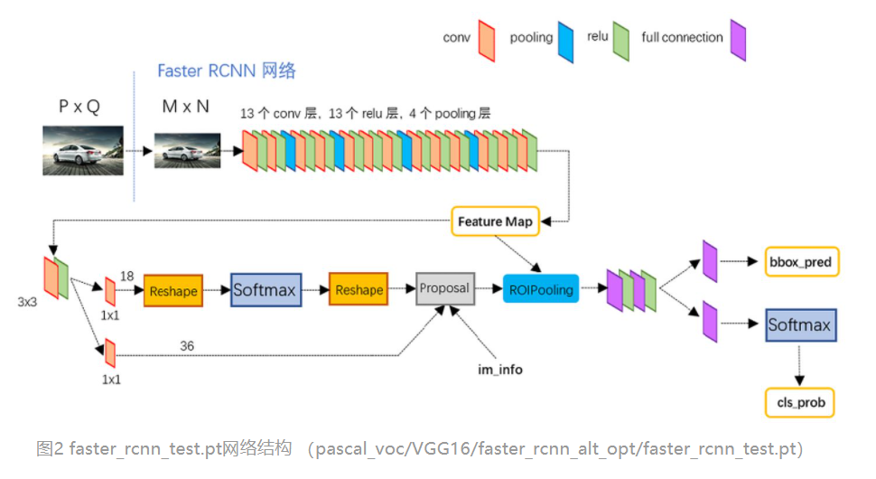

1.2 conv layers
该模块主要如图2所示，共有13个conv层，13个relu层，4个pooling层
conv：kernel_size=3，padding=1，stride=1
pooling：kernel_size=2，padding=0，stride=2

根据卷积和池化公式可得，经过每个conv层后，feature map大小都不变；经过每个pooling层后，feature map的宽高变为之前的一半。（经过relu层也不变）

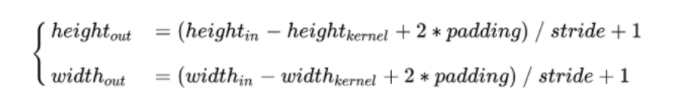

综上，一个MxN大小的图片经过Conv layers之后生成的feature map大小为(M/16)x(N/16)

1.3 RPN

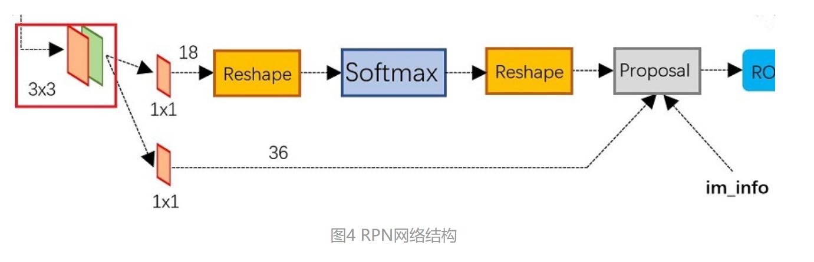

图4展示了RPN结构，有两条线。

上面一条通过softmax分类anchors获得positive和negative分类，下面一条用于计算对于anchors的bounding box regression偏移量，以获得精确的proposal。

最后的Proposal层则负责综合positive anchors和对应bounding box regression偏移量获取修正后的proposals，同时剔除太小和超出边界的proposals。其实整个网络到了Proposal Layer这里，就完成了相当于目标定位的功能。（只差分具体类别，还有更精准的再次框回归）

##### 1.3.1 anchors

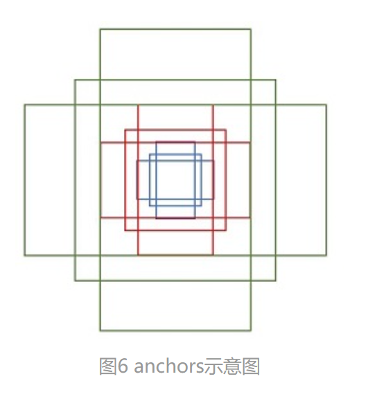

假设原始图片输入大小是MxN，**则RPN的输入feature map大小为(M/16)x(N/16)**。如图6所示，**在这个feature map上，对于每一个像素点，设置9个预设anchor（作者设置的9个）**。这9个anchor的大小按照三种长宽比ratio[1:1，1:2，2:1]设置，具体大小根据输入图像的原始目标大小灵活设置。

设置anchor是为了覆盖图像上各个位置各种大小的目标，那么原图上anchor的数量就是(M/16) x (N/16) x 9。这么多anchor，第一肯定不准确，第二肯定不能要这么多，所以后续还会淘汰一大批以及修正anchor位置。图8可视化后更清晰，这些anchor都会用于后续的分类和回归。

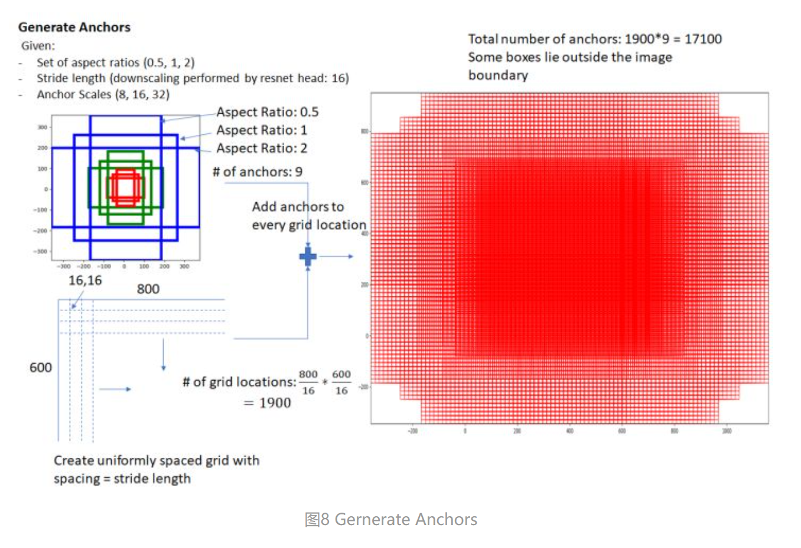

##### 1.3.2 cls layer——分类

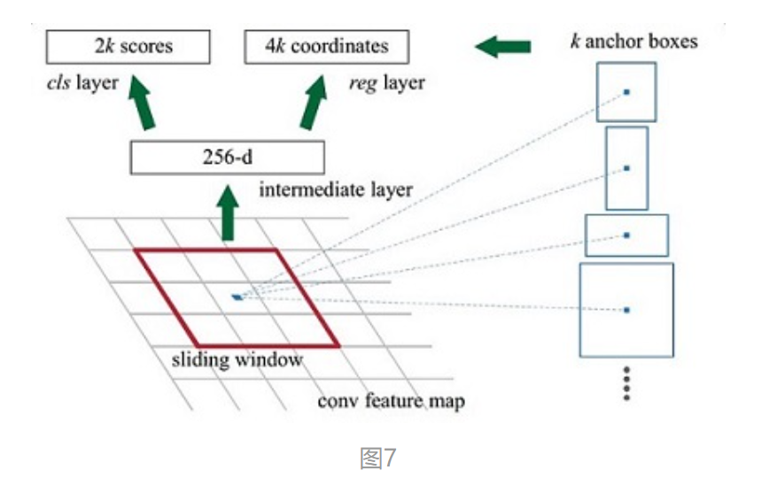

参照上面原文中的图来讲，首先，在拿到conv layers的feature map后，先经过一个3x3卷积（卷积核个数为256）红色框是一个anchor，所以通过这个卷积层后feature map的通道数也是256，k是anchor个数（文中默认是9）。

(M/16)x(N/16)x256的特征通过1x1卷积得到(M/16)x(N/16)x2k的输出，因为这里是二分类判断positive和negative，所以该feature map上每个点的每个anchor对应2个值，表示目标和背景的概率（为什么有2个，是因为这里是用的softmax，这两个值加起来等于1；也可以用sigmoid，就只需要1个值了）

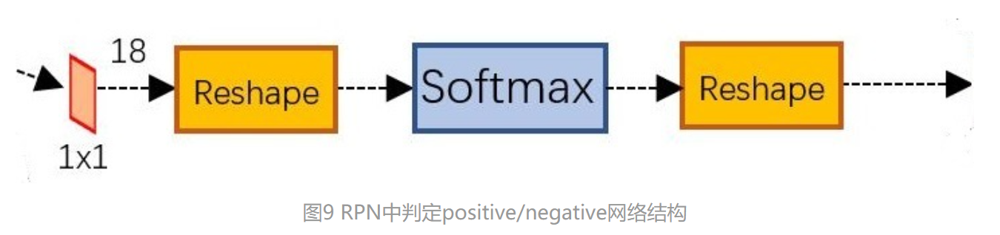
Reshape层是技术细节问题，对feature map进行维度变换，使得有一个单独的维度为2，方便在该维度上进行softmax操作，之后再Reshape恢复原状。

1.3.3 reg layer——回归

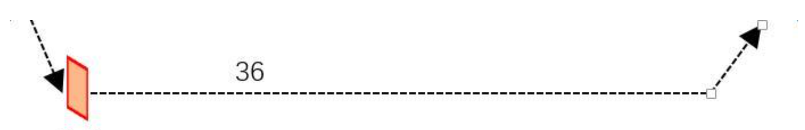

(M/16)x(N/16)x256的特征通过1x1卷积得到(M/16)x(N/16)x4k的输出，因为这里是生成每个anchor的坐标偏移量（用于修正anchor），[tx,ty,tw,th]共4个所以是4k。注意，这里输出的是坐标偏移量，不是坐标本身，要得到修正后的anchor还要用原坐标和这个偏移量运算一下才行。

偏移值计算公式：
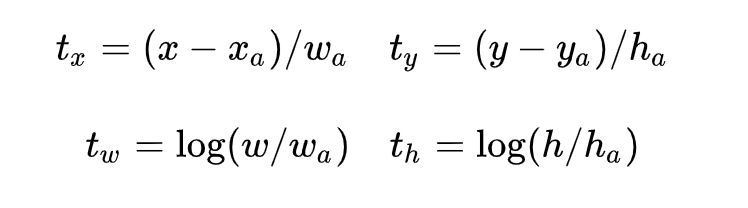
其中[xa,ya,wa,ha]是anchor的中心点坐标和宽高，[tx.ty,tw,th]是这个回归层预测的偏移量，通过这个公式计算出修正后的anchor坐标[x,y,w,h]。计算如下：

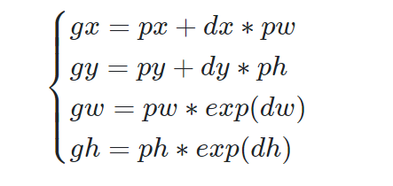
[px,py,pw,ph]表示原始anchor的坐标
**[dx,dy,dw,dh]表示RPN网络预测的坐标偏移**
[gx,gy,gw,gh]表示修正后的anchor坐标。

还不明白见下图：

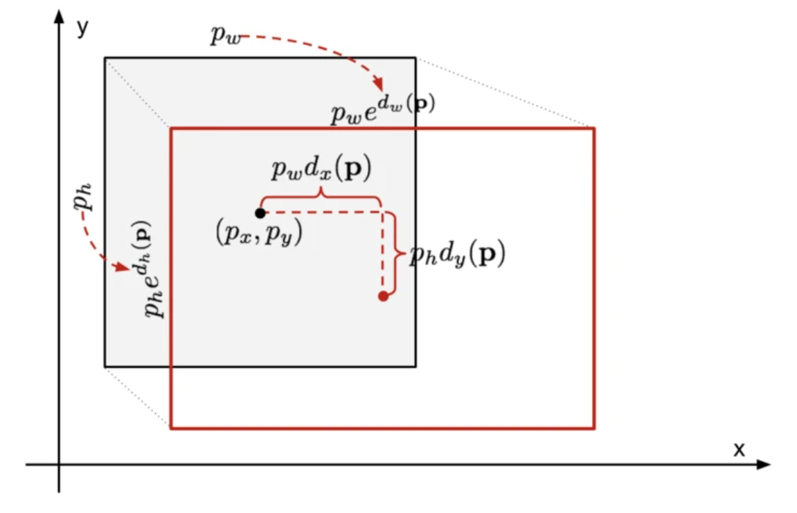

可能会有的疑问：
1、为什么不直接预测修正后的anchor坐标，而是预测偏移量？
（1）如果直接预测修正后的anchor坐标了，那要这个预设anchor有何用？正是因为预测了偏移量，才能和预设anchor联动起来生成修正后的anchor
（2）直接预测框坐标，数量级比较大，难以训练
（3）坐标偏移一方面大小较小，且偏移具有较好的数学公式，求导方便

##### 1.3.4 生成Proposal

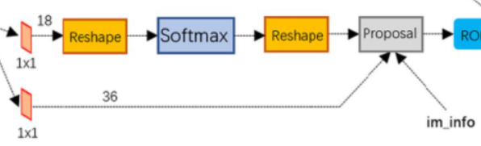

如上图Proposal层，这是RPN里最后一个步骤，输入有三个：

cls层生成的(M/16)x(N/16)x2k向量
reg层生成的(M/16)x(N/16)x4k向量
im_info=[M, N,scale_factor]
（1）利用reg层的偏移量，对所有的原始anchor进行修正
（2）利用cls层的scores，按positive socres由大到小排列所有anchors，取前topN（比如6000个）个anchors
（3）边界处理，把超出图像边界的positive anchor超出的部分收拢到图像边界处，防止后续RoI pooling时proposals超出边界。
（4）剔除尺寸非常小的positive anchor
（5）对剩余的positive anchors进行NMS（非极大抑制）
（6）最后输出一堆proposals左上角和右下角坐标值（[x1,y1,x2,y2]对应原图MxN尺度）

综上所述，RPN网络总结起来其实就上面四个小标题：
**生成anchors–>softmax分类器提取positive anchors–>bbox regression回归positive anchors生成偏移量–>生成最终Proposals**

1.4 RoI pooling
RoI Pooling层则负责收集proposal，并计算出proposal feature maps（从conv layers后的feature map中扣出对应位置），输入有两个：
（1）conv layers提出的原始特征feature map，大小(M/16)x(N/16)
（2）RPN网络生成的Proposals，大小各不相同。一堆坐标（[x1,y1,x2,y2]）

1.4.1 为什么需要RoI pooling
全连接层的每次输入特征size必须是相同的，而这里得到的proposal大小各不相同。传统的有两种解决办法：

从图像从crop（裁剪）一部分送入网络
将图像wrap（resize）成需要的大小送入网络

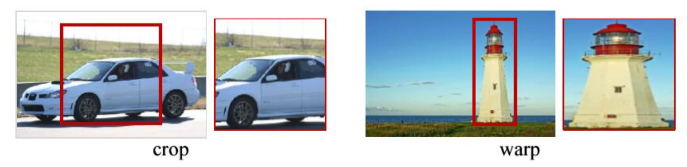

很明显看到，crop会损失图像完整结构信息，wrap会破坏图像原始形状信息。因此，需要一种能够把所有图像大小整合到一起又不会简单粗暴造成破坏的方法，这里使用的是RoI pooling，由SSP（Spatial Pyramid Pooling）发展而来。

1.4.2 RoI pooling原理
RoI pooling会有一个预设的pooled_w和pooled_h，表明要把每个proposal特征都统一为这么大的feature map
（1）由于proposals坐标是基于MxN尺度的，先映射回(M/16)x(N/16)尺度
（2）再将每个proposal对应的feature map区域分为pooled_w x pooled_h的网格
（3）对网格的每一部分做max pooling
（4）这样处理后，即使大小不同的proposal输出结果都是pooled_w x pooled_h固定大小，实现了固定长度输出，如下图

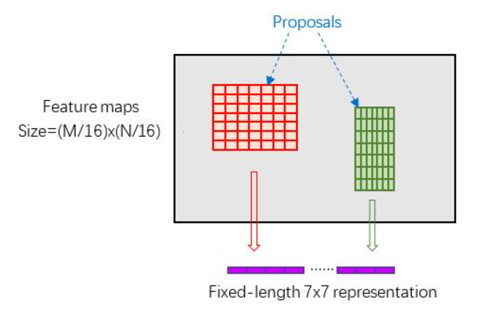

1.5 Classification
注意这里的分类和RPN中的分类不同，RPN中只是二分类，区分目标还是背景；这里的分类是要对之前的所有positive anchors识别其具体属于哪一类。

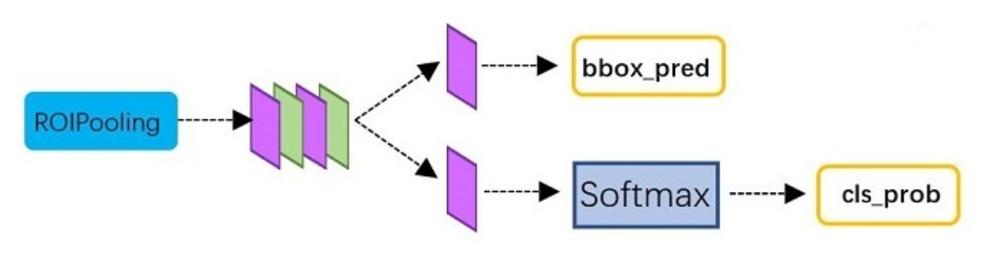

从RoI pooling处获取到pooled_w x pooled_h大小的proposal feature map后，送入后续网络，做两件事：

（1）通过全连接层和softmax对所有proposals进行具体类别的分类（通常为多分类）
举例说明：
假设pooled_w和pooled_h都为7，那么这些proposals在经过RoI pooling后的特征向量维度为[7, 7, 256]，假设一共输出了300个proposals，那么所有的proposals组合起来维度就是[300,7,7,256]，经过最后一个全连接层之后（会有拉平操作），维度应该是[300, 类别数]，则该向量就能反应出每个proposal属于每一类的概率有多大。最终就知道每个proposal是属于哪一类，根据proposal索引来找到具体是图上哪个proposal。

（2）再次对proposals进行bounding box regression，获取更高精度的最终的predicted box
举例说明：
同上，假设一共输出了300个proposals，回归这里的全连接层输出维度应该是[300, 4]，4还是代表偏移量。最终用proposal原始坐标加上偏移量，修正得到最最最终的predicted box结果。

2 训练（Train）
2.1 训练步骤
Faster RCNN由于是two-stage检测器，训练要分为两个部分进行，一个是训练RPN网络，一个是训练后面的分类网络。为了清晰描述整个训练过程，首先明确如下两个事实：

RPN网络 = 特征提取conv层（下面简称共享conv层） + RPN特有层（3x3卷积、1x1卷积等）
Faster RCNN网络 = 共享conv层 + Faster RCNN特有层（全连接层）
详细的训练过程如下：

第一步：先使用ImageNet的预训练权重初始化RPN网络的共享conv层（RPN特有层可随机初始化），然后训练RPN网络。训练完后，共享conv层和RPN特有层的权重都更新了。

第二步：根据训练好的RPN网络拿到proposals（和测试过程一样）

第三步：再次使用ImageNet的预训练权重初始化Faster RCNN网络的贡献conv层（Faster RCNN特有层随机初始化），然后训练Faster RCNN网络。训练完后，共享conv层和Faster RCNN特有层的权重都更新了。

第四步：使用第三步训练好的共享conv层和第一步训练好的RPN特有层来初始化RPN网络，第二次训练RPN网络。但这次要把共享conv层的权重固定，训练过程中保持不变，只训练RPN特有层的权重。

第五步：根据训练好的RPN网络拿到proposals（和测试过程一样）

第六步：依然使用第三步训练好的共享conv层和第三步训练好的Faster RCNN特有层来初始化Faster RCNN网络，第二次训练Faster RCNN网络。同样，固定conv层，只fine tune特有部分。

图解如下：

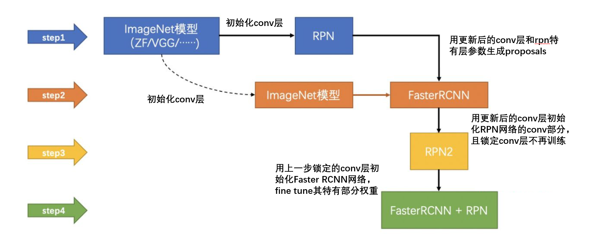

2.2 训练RPN网络
RPN网络训练有两个Loss：

Lcls：softmax loss，用于分类anchors属于前景还是背景（也有说用二分类交叉熵Loss的）
Lreg：smooth L1 loss，用于修正anchor框，前面乘了一个pi*表示只回归有目标的框

参数详细解释如下（为了方便输入公式，使用word截图）

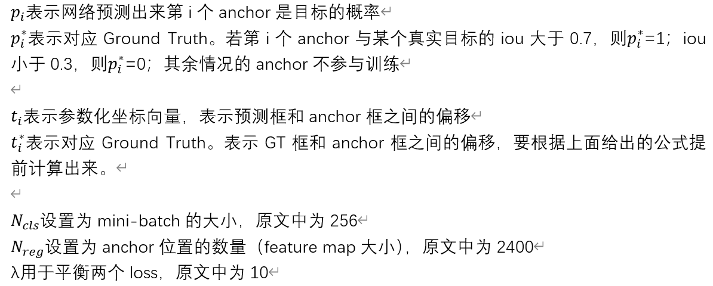

smooth L1 loss如下：

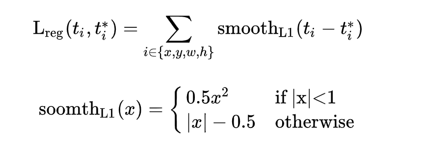

2.3 训练Faster RCNN网络
由于两块网络的loss用的是一样的，所以过程一样，只不过这里是多分类向量维度上有所变化，其他一毛一样。

三 总结
更深入的技术细节请读作者源代码，本文内容足够对Faster RCNN的逻辑有一个全面掌握了，有问题随时更新~

Faster RCNN与SSD的anchor区别在于：
（1）前者在一个特征图上预设了anchor，先进行初步修正与筛选，之后再进行分类与回归
（2）后者在多个特征图上预设了anchor（多尺度），并直接在所有这些anchor上进行分类与回归（单阶段）