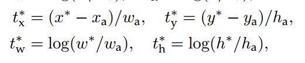

# RPN(Region Proposal Network)

https://openmmlabbook.gitbook.io/openmmlab-book/object-detection/two-stage/rpn

# RPN

RPN 全称是 Region Proposal Network 区域提取网络，是 Ren 等人在 2015 年提出的一个模型，用以替代 Fast RCNN 等两阶段方法中的外部 region proposal 算法，提高整个检测 pipeline 的速度。RPN 和 FasterRCNN 是在同一篇 论文中提出的，且 RPN 是 Faster RCNN 的一个模块。 但**RPN 也可以单独使用，在图像上产生物体的 proposal，或者直接用于特定物体的检测**。 RPN 算法对于理解 SSD、YOLO 和 RetinaNet 等单阶段检测方法也有所帮助。**通过对比分析可以发现 RPN 和 SSD、RetinaNet 非常类似**。为了方便理解，本教程也将单独对 RPN 讲解。

## 1 算法分析

在 faster rcnn 算法中 RPN 的主要作用是提取 Region Proposal，也就是图像领域中常说的 roi。其**主要要求是不要漏掉前景物体，且尽可能多的提取前景区域**，然后输入给 rcnn 模块进行 refine 操作。RPN 也可以认为是一个 one-stage 目标检测算法，故其也包括 backbone，neck 和 head 模块，只不过这里的 neck 可有可无(FPN 算法的引入才有了 neck)。下面先介绍 anchor 的基本概念和作用，然后对 RPN 网络进行深入分析。

### 1.1 Anchor

Anchor 概念是在 faster rcnn 中第一次提到，是目前 anchor-base 算法中非常重要的一个超参，其参数设置对最终结果有巨大影响，理解 Anchor 的核心思想才能完整把握整个算法流程。

Anchor 字面意思是锚，是用于固定船的部件，锚点放置在哪个位置，那么船就只能在其约束的范围内飘动。在计算机视觉中也是同一个意思，假设在图片的某个位置设置了一个锚点，该锚点不仅有位置信息还有宽高属性，那么相应的物体 bbox 预测就受到该锚点的约束(即正负样本属性定义)，相当于提供了先验。

目标检测需要解决两个问题：物体在图片的哪个位置，以及该物体是何类别。只有先确定了物体在哪个位置才能进一步确定其属于何种类别，故物体的位置预测属性非常关键。在传统目标检测算法中，为了能够在一张图片中同时检测多个物体，会采用滑动窗口做法进行遍历，具体是：设定一个具有宽高属性的框，然后将框按照从左到右，有上到下的顺序移动，对每个窗口内的图片判断是否有物体即可。滑动窗口做法思想是不错的，但是其存在一些问题：窗口宽高设置多少？滑动密度是多少？对于存在大小和密疏不同的场景，这个设置比较难进行，为此后人提出多窗口多步长密集滑动做法，即可以设置 n 个不同大小、宽高比例的窗口，然后采用不同的步幅依次进行滑动检测，最终结果可以全部经过 nms 后得到。

以上简单思想，在现代目标检测算法中就演变为了 Anchor，其做法是在原图或者特征图上铺设指定大小、宽高比的 K 个窗口，如果有物体落在窗口所负责范围内，则该窗口负责预测该物体。只要 anchor 铺设的够多，够密，能够覆盖几乎所有 gt bbox 分布，那么由于提供了 anchor 先验，从而将**滑动窗口分类问题变成了基于 anchor 的可学习变换问题**，整个 anchor-base 目标检测算法训练就更加容易，理论上就可以构建完美目标检测器。

举个简单例子说明 anchor 的作用。假设某一张图片就一个 gt bbox，其 x1y1wh 坐标是(200,300,100,120)，如果采用固定宽高滑动窗口方法,假设窗口 wh 是(100,100)，那么最好的预测情况也仅仅是(200,300,100,100)，如果采用 anchor 做法，在原图上均匀铺设 wh 为(100,100)的 anchor，那么假设在所有 anchor 中，存在一个 cxcywh 坐标为(200+100/2=250,300+120/2=360,100,100)的 anchor,并且该 anchor 负责预测唯一的 gt bbox。为了充分利用 anchor 的信息，我们可以设置网络输出的 4 个值 txtytwth 为 anchor 和 gt bbox 的相对值，具体做法非常多，一个非常简单的做法是 txty 表示 gt bbox 中心点和 anchor 中心点的相对偏移，而 twth 表示 gt bbox 的宽高除以 gt bbox 的宽高，这样就将 gt bbox 和 anchor 先验进行绑定了，从而能够实现又快又好收敛。


### 1.2 backbone

原版 RPN 网络采用的骨架是 vgg，但是由于 vgg 性能以及设计思想过于陈旧，目前基本上都是采用 resnet，故 mmdet 里面实现的 RPN 算法采用的是 resnet50，配置如下所示：

Copy

```
backbone=dict(
    type='ResNet',
    depth=50,
    num_stages=3,
    strides=(1, 2, 2),
    dilations=(1, 1, 1),
    out_indices=(2, ),
    frozen_stages=1,
    norm_cfg=dict(type='BN', requires_grad=False),
    norm_eval=True,
    style='caffe'),
```

上述每个参数含义请参考 mmdet 官方文档，核心参数是 out_indices=(2, )，表示 backbone 的输出是 1 个尺度，且 stride 为 16，对于 resnet50 而言，输出特征图 shape 为(batch,1024,h//16,w//16)

### 1.3 head

在上述输出特征图基础上可以构建 **RPN head 网络，**输出分类和回归两个分支。 以 mmdet 复现为例进行分析，**假设每个位置一共 K 个 anchor**，分类分支仅仅需要区分前后景即可，不需要区分具体类别(因为 rcnn 会进行区分)，如果分类 loss 采用 softmax+ce，那么分类分支输出 shape 是(batch,2*K,h/16,w//16),如果分类 loss 采用 sigmoid+bce，那么该分支输出是(batch,1*K,h/16,w//16),mmdet 里面采用的是 sigmoid+bce 模式。对于回归分支，其输出 shape 为(batch,4*K,h/16,w//16)。其网络构建代码如下：

Copy

```
self.rpn_conv = nn.Conv2d(1024, 1024, 3, padding=1)
self.rpn_cls = nn.Conv2d(1024,self.num_anchors * 1, 1)
self.rpn_reg = nn.Conv2d(1024, self.num_anchors * 4, 1)
```

head 网络前向推理也非常简单：

Copy

```
# 通道变换
x = self.rpn_conv(x)
x = F.relu(x, inplace=True)
# 输出Head
rpn_cls_score = self.rpn_cls(x)
rpn_bbox_pred = self.rpn_reg(x)
return rpn_cls_score, rpn_bbox_pred
```

### 1.4 正负样本定义

在介绍正负样本定义前，需要先说明 RPN 网络的 Anchor 设定规则，其配置如下：

Copy

```
anchor_generator=dict(
    type='AnchorGenerator',
    scales=[2, 4, 8, 16, 32],
    ratios=[0.5, 1.0, 2.0],
    strides=[16]),
```

其中 strides 参数不能随便更改，应该和网络 stride 一致，scales 表示缩放尺度，ratios 表示高宽比例，通过 scales 和 ratios 可以看出每个位置一共 5x3=15 个 anchor，基本范围是 [(2×16)2，(32×16)2][(2×16)2，(32×16)2]，可以覆盖各种大小比例的物体，注意原论文是 9 个 anchor，scale 仅仅有(8,16,32)。假设输入图片大小是(800,600)，且 anchor 个数为 9，则整个效果如下所示：


[图片来源](https://zhuanlan.zhihu.com/p/31426458)

AnchorGenerator 代码实现分析如下所示：

(1) 先对单个位置(0,0)生成 base anchors

Copy

```
# base_size=strides=16
w = base_size
h = base_size
# 计算高宽比例
h_ratios = torch.sqrt(ratios)
w_ratios = 1 / h_ratios
# base_size乘上宽高比例乘上尺度，就可以得到5x3=15个anchor的原图尺度wh值
ws = (w * w_ratios[:, None] * scales[None, :]).view(-1)
hs = (h * h_ratios[:, None] * scales[None, :]).view(-1)
# 得到x1y1x2y2格式的base_anchor坐标值
base_anchors = [
    x_center - 0.5 * ws, y_center - 0.5 * hs, x_center + 0.5 * ws,
    y_center + 0.5 * hs
]
# 堆叠起来即可
base_anchors = torch.stack(base_anchors, dim=-1)
```

(2) 利用输入的特征图大小加上 base anchors，得到每个特征图位置的对于原图的 anchors

Copy

```
# 特征图大小，这里是(h//16,w//16)
feat_h, feat_w = featmap_size
# 遍历特征图上所有位置，并且乘上stride，从而变成原图坐标
shift_x = torch.arange(0, feat_w, device=device) * stride[0]
shift_y = torch.arange(0, feat_h, device=device) * stride[1]
shift_xx, shift_yy = self._meshgrid(shift_x, shift_y)
shifts = torch.stack([shift_xx, shift_yy, shift_xx, shift_yy], dim=-1)
shifts = shifts.type_as(base_anchors)
# (0,0)位置的base_anchor，假设原图上坐标shifts，即可得到特征图上面每个点映射到原图坐标上的anchor
all_anchors = base_anchors[None, :, :] + shifts[:, None, :]
all_anchors = all_anchors.view(-1, 4)
return all_anchors
```

在生成了 h//16xw//16x5x3 个 anchor 后，需要定义每个样本的正负属性，因为目标检测包括分类和回归分支，既然是分类问题那就肯定需要定义每个 anchor 样本的正负属性。RPN 网络采用的正负样本定义规则为 MaxIoUAssigner，其核心匹配规则是 iou 交并比，其配置如下：

Copy

```
assigner=dict(
    type='MaxIoUAssigner',
    pos_iou_thr=0.7,
    neg_iou_thr=0.3,
    min_pos_iou=0.3,
    ignore_iof_thr=-1),
```

MaxIoUAssigner 的操作包括 4 个步骤：

1. 首先初始化每个 anchor 的 mask 都是-1，表示都是忽略 anchor
2. 将每个 anchor 和所有 gt bbox 计算 iou，找出最大 iou，如果该 iou 小于 neg_iou_thr，则该 anchor 的 mask 设置为 0，表示是负样本(背景样本)
3. 将每个 anchor 和所有 gt bbox 计算 iou，找出最大 iou，如果其最大 iou 大于等于 pos_iou_thr，则设置该 anchor 的 mask 设置为 1，表示该 anchor 负责预测该 gt bbox，且是高质量 anchor
4. 3 的设置可能会出现某些 gt bbox 没有分配到对应的 anchor(由于 iou 低于 pos_iou_thr)，故下一步对于每个 gt bbox 还需要找出和最大 iou 的 anchor 位置，如果其 iou 大于 min_pos_iou，将该 anchor 的 mask 设置为 1，表示该 anchor 负责预测对应的 gt。通过本步骤，可以最大程度保证每个 gt bbox 都有相应的 anchor 负责预测，**如果其最大 iou 值还是小于 min_pos_iou，那就没办法了，只能当做忽略样本**了。从这一步可以看出，3 和 4 有部分 anchor 重复分配了，即当某个 gt bbox 和 anchor 的最大 iou 大于等于 pos_iou_thr，那肯定大于 min_pos_iou，此时 3 和 4 步骤分配的同一个 anchor。

从上面 4 步分析，可以发现每个 gt 可能和多个 anchor 进行匹配，每个 anchor 不可能存在和多个 gt bbox 匹配的场景。在第 4 步中，每个 gt 最多只会和某一个 anchor 匹配，但是实际操作时候为了多增加一些正样本，通过参数 gt_max_assign_all 可以实现某个 gt 和多个 anchor 匹配场景。**通常第 4 步引入的都是低质量 anchor，网络训练有时候还会带来噪声，可能还会起反作用。**

简单总结来说就是：如果 anchor 和 gt 的 iou 低于 neg_iou_thr 的，那就是负样本，其应该包括大量数目；如果某个 anchor 和其中一个 gt 的最大 iou 大于 pos_iou_thr，那么该 anchor 就负责对应的 gt；如果某个 gt 和所有 anchor 的 iou 中最大的 iou 会小于 pos_iou_thr，但是大于 min_pos_iou，则依然将该 anchor 负责对应的 gt；其余的 anchor 全部当做忽略区域，不计算梯度。该最大分配策略，可以尽最大程度的保证每个 gt 都有合适的高质量 anchor 进行负责预测。

下面结合代码进行分析：主要就是 assign_wrt_overlaps 函数，核心操作和注释如下：


在 RPN 中由于 anchor 非常多，所以设置 pos_iou_thr 值比较大为 0.7，保证正样本基本上都是高质量的，如果设置为 0.5，则会增加大量正样本，其中含有很多低质量样本。

### 1.5 正负样本采样

正负样本定义环节可以区分正负和忽略样本，但是依然存在大量的正负样本不平衡问题，**解决办法可以通过正负样本采样或者 loss 来解决**，RPN 网络是通过正负样本采样解决上述问题。其配置如下：

Copy

```
sampler=dict(
    type='RandomSampler',
    num=256,
    pos_fraction=0.5,
    neg_pos_ub=-1,
    add_gt_as_proposals=False)
```

其采样器比较简单，就是随机采样。num 表示采样后每张图片的样本总数，不包括忽略样本，pos_fraction 表示其中的正样本比例，这里意思是正负样本各自采样 128 个。add_gt_as_proposals 是为了防止正样本太少而加入的，可以保证前期收敛更快、更稳定，属于技巧。neg_pos_ub 表示正负样本比例，用于确定负样本采样个数上界，例如我打算采样 1000 个样本，正样本打算采样 500 个，但是可能实际正样本才 200 个，那么正样本实际上只能采样 200 个，如果设置 neg_pos_ub=-1，那么就会对负样本采样 800 个，用于凑足 1000 个，但是如果设置为 neg_pos_ub 比例，例如 1.5，那么负样本最多采样 200x1.5=300 个，最终返回的样本实际上不够 1000 个，默认情况 neg_pos_ub=-1。

其代码非常简单：


Copy

```
# 随机采样正样本
def _sample_pos(self, assign_result, num_expected, **kwargs):
    """Randomly sample some positive samples."""
    pos_inds = torch.nonzero(assign_result.gt_inds > 0, as_tuple=False)
    if pos_inds.numel() != 0:
        pos_inds = pos_inds.squeeze(1)
    if pos_inds.numel() <= num_expected:
        return pos_inds
    else:
        return self.random_choice(pos_inds, num_expected)
# 随机采样负样本
def _sample_neg(self, assign_result, num_expected, **kwargs):
    """Randomly sample some negative samples."""
    neg_inds = torch.nonzero(assign_result.gt_inds == 0, as_tuple=False)
    if neg_inds.numel() != 0:
        neg_inds = neg_inds.squeeze(1)
    if len(neg_inds) <= num_expected:
        return neg_inds
    else:
        return self.random_choice(neg_inds, num_expected)
```

对正负样本单独进行随机采样就行，如果不够就全部保留。

### 1.6 bbox 编解码

为了能够利用 anchor 信息进行更好的收敛，RPN 会对 head 输出的 bbox 分支 4 个值进行编解码操作，作用有两个：1.更好的平衡分类和回归分支 loss；2.训练过程中引入 anchor 信息。RPN 采用的编解码函数是 DeltaXYWHBBoxCoder，其配置如下：

Copy

```
bbox_coder=dict(
    type='DeltaXYWHBBoxCoder',
    target_means=[.0, .0, .0, .0],
    target_stds=[1.0, 1.0, 1.0, 1.0]),
```

target_means 和 target_stds 相当于对 bbox 回归的 4 个 txtytwth 进行额外变换，目的是更好的平衡 4 个输出值。先不考虑 target_means 和 target_stds，其编码公式如下：



x∗,y∗*x*∗,*y*∗ 是 gt bbox 的中心 xy 坐标，w∗,h∗*w*∗,*h*∗ 是 gt bbox 的 wh 值，xa,ya*x**a*,*y**a* 是 anchor 的中心 xy 坐标，wa,ha*w**a*,*h**a* 是 anchor 的 wh 值，t∗*t*∗ 是 bbox 分支输出的 4 个值对应 targets，此过程相当于 gt bbox 编码。容易看出其 tx,ty*t**x*,*t**y* 的预测值表示 gt bbox 中心相对于 anchor 中心点的偏移，并且通过处于 anchor 的 wh 进行归一化；而 twth 的预测值表示 gt bbox 的 wh 除以 anchor 的 wh，然后取 log 非线性变换即可

有了上述公式，对预测值进行 bbox 解码也非常容易，此处就不写了。 编码过程核心代码：

Copy

```
dx = (gx - px) / pw
dy = (gy - py) / ph
dw = torch.log(gw / pw)
dh = torch.log(gh / ph)
deltas = torch.stack([dx, dy, dw, dh], dim=-1)
# 最后减掉均值，处于标准差
means = deltas.new_tensor(means).unsqueeze(0)
stds = deltas.new_tensor(stds).unsqueeze(0)
deltas = deltas.sub_(means).div_(stds)
```

解码过程核心代码：

Copy

```
# 先乘上std，加上mean
means = deltas.new_tensor(means).view(1, -1).repeat(1, deltas.size(1) // 4)
stds = deltas.new_tensor(stds).view(1, -1).repeat(1, deltas.size(1) // 4)
denorm_deltas = deltas * stds + means
dx = denorm_deltas[:, 0::4]
dy = denorm_deltas[:, 1::4]
dw = denorm_deltas[:, 2::4]
dh = denorm_deltas[:, 3::4]
# wh解码
gw = pw * dw.exp()
gh = ph * dh.exp()
# 中心点xy解码
gx = px + pw * dx
gy = py + ph * dy
# 得到x1y1x2y2的gt 预测坐标
x1 = gx - gw * 0.5
y1 = gy - gh * 0.5
x2 = gx + gw * 0.5
y2 = gy + gh * 0.5
```

### 1.7 loss 计算

在确定了每个 anchor 的正负属性，并且已经得到每个正样本 anchor 所负责 gt bbox 的 bbox 编码值，就可以计算 loss 了。对于分类分支 mmdet 采用的是 bce loss，对于回归分支 mmdet 采用的是 l1 loss(原论文是 smooth l1 loss，实验效果表示 l1 loss 好一些)，并且回归分支仅仅计算正样本的 loss，配置如下：

Copy

```
loss_cls=dict(
    type='CrossEntropyLoss', use_sigmoid=True, loss_weight=1.0),
loss_bbox=dict(type='L1Loss', loss_weight=1.0)))
```