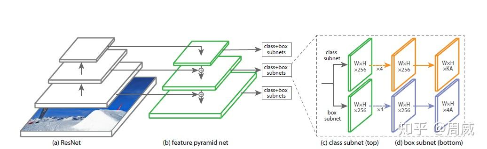
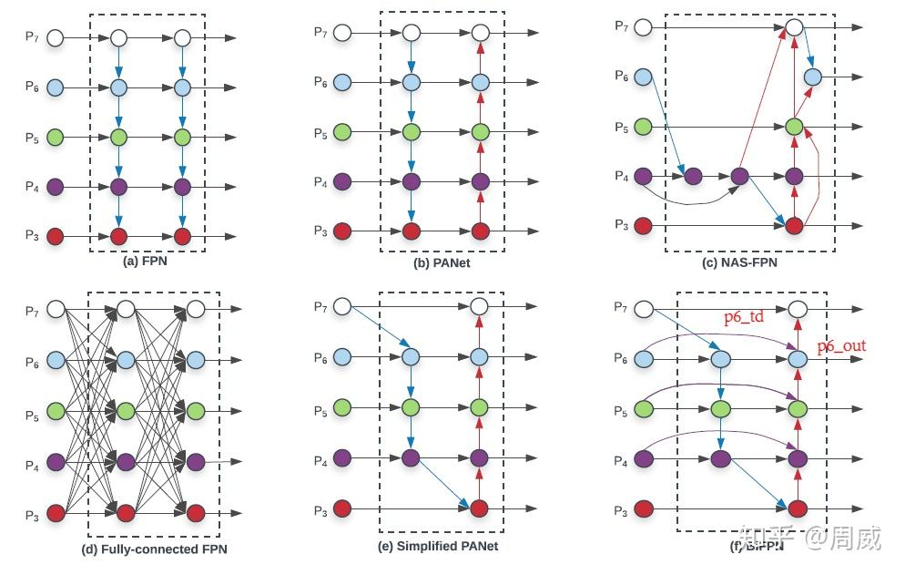

# RetinaNet

https://zhuanlan.zhihu.com/p/143877125

https://blog.csdn.net/qq_53144843/article/details/137082443

## 1.前言

RetinaNet是继SSD和YOLO V2公布**后**，YOLO V3诞生**前**的一款目标检测模型，出自何恺明大神的《[Focal Loss for Dense Object Detection](https://zhida.zhihu.com/search?content_id=120104929&content_type=Article&match_order=1&q=Focal+Loss+for+Dense+Object+Detection&zhida_source=entity)》。全文针对现有**单阶段法**（one-stage)目标检测模型中**前景**(positive)**和背景**(negatives)**类别的不平衡**问题，提出了一种叫做**Focal Loss**的损失函数，用来降低大量**easy negatives**在[标准交叉熵](https://zhida.zhihu.com/search?content_id=120104929&content_type=Article&match_order=1&q=标准交叉熵&zhida_source=entity)中所占权重（提高hard negatives所占权重)。为了检测提出的Focal Loss损失函数的有效性，所以作者就**顺便**提出了一种简单的模型**RetinaNet**。（所以RetinaNet不是本篇论文的主角，仅仅是附属物了呗？）

## 2. RetinaNet网络框架

论文中的图

上图为RetinaNet的结构图，我们可以看出，RetinaNet的特征提取网络选择了[残差网络](https://zhida.zhihu.com/search?content_id=120104929&content_type=Article&match_order=1&q=残差网络&zhida_source=entity)ResNet，特征融合这块选择了FPN（[特征金字塔网络](https://zhida.zhihu.com/search?content_id=120104929&content_type=Article&match_order=1&q=特征金字塔网络&zhida_source=entity)），以特征金字塔不同的尺寸特征图作为输入，搭建**三个**用于**分类和框回归**的子网络。分类网络输出的特征图尺寸为（W,H,KA)，其中W、H为特征图宽高，KA为特征图通道，存放A个anchor各自的类别信息（K为类别数）。

**2.2 FPN网络**

都2020年了，现在目标检测模型不来个特征融合都不好意思了，这里引用了EfficientDet中的一张图。可见，作为目标检测模型性能提升的一个点，FPN目前已经被研究的花里胡哨的。

当然了，RetinaNet刚提出的那会儿，FPN也没提出多久，所以中规中矩，RetinaNet用的图上的（a)那种自顶向下的FPN结构。采用FPN这种多尺度特征融合的目的，是为了对**较小物体**也能够保持检测的精度，就像SSD中的**[多尺度特征图](https://zhida.zhihu.com/search?content_id=120104929&content_type=Article&match_order=1&q=多尺度特征图&zhida_source=entity)**一样（虽然他没有进行**自顶向下**的融合）。

## 3. 先验框anchor

每次解析基于anchor的目标检测模型，就一定要对它的anchor部分进行一个详细介绍，RetinaNet也不例外。前面提到的RetinaNet网络的输出为5张大小不同特征图，那么不同大小的特征图自然是负责不同大小物体检测（和特征图所对应的感受野相关）。

## 4. Focal Loss损失函数

基于回归的目标检测算法由于没有候选区域生成这一步骤，因此在使用锚点对目标进行预测时，会出现正负样本不平衡和难易样本不平衡问题，这将使简单负样本占据网络模型训练中的大部分损失值，导致网络模型的优化效果不佳，影响网络模型对难样本的训练，进而使得网络模型对目标的检测效果不好。

对此， Focal Loss 有效解决了目标检测中存在的类别不平衡问题和难易样本不平衡问题，它通过控制正负样本和难易样本的权重，具体如下：

 $$ FL(p_t) = -\alpha(1 - p_t)^\gamma \log p_t $$ 

 $$ p_t = \begin{cases} 
p, & p = 1 \\
1 - p, & \text{otherwise}
\end{cases} $$ 

式中， $ p_t $  是预测框分类的得分； $ \alpha $  表示用于控制正负样本平衡的参数，取值为 0.25； $ \gamma $  表示调制因子参数，是降低易分类样本在学习中所占比重的参数，取值为 2。

当样本被错误分类且置信度较低时，调制因子  $ (1 - p_t)^\gamma $  接近 1，损失函数不受影响；当样本置信度较高时，调制因子  $ (1 - p_t)^\gamma $  接近于 0，可以有效减少易分类样本的损失权重。Focal Loss 不仅减少简单样本对分类损失函数的贡献，并扩大错误高难度样本的损失范围，实现对分类过程中的正负样本贡献均衡，提高单阶段检测模型的检测性能。

在retinanet网络中其损失函数如下所示：

 $$ Loss = \frac{1}{N_{POS}} \sum_i L_{cls}^i + \frac{1}{N_{POS}} \sum_j L_{reg}^j $$ 

其中  $ L_{cls} $  表示是Sigmoid Focal Loss； $ L_{reg} $  表示的是L1 Loss； $ N_{POS} $  表示的是正样本的个数； $ i $  表示所有的正负样本； $ j $  表示所有的正样本。

总损失依然分为两部分，一部分是分类损失，一部分是回归损失。Focal loss 比较独特的一个点就是正负样本都会来计算分类损失，然后仅对正样本进行回归损失的计算。

