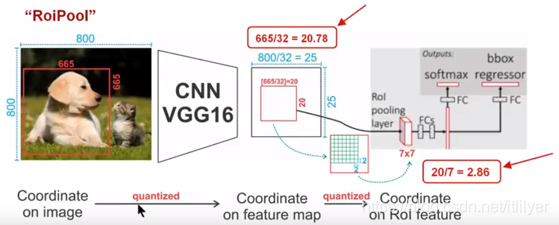
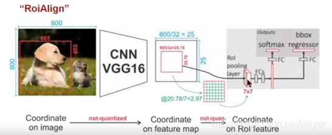
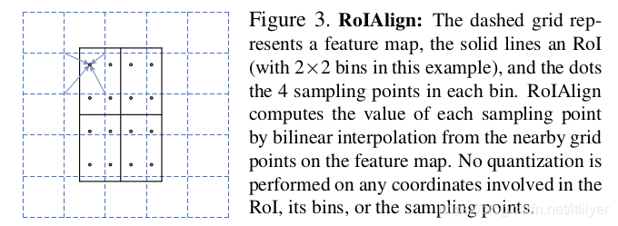

## RoIPool与RoIAlign的区别

https://aistudio.baidu.com/projectdetail/5218459?channelType=0&channel=0

https://www.cnblogs.com/harrymore/p/14870198.html

## RoIPooling

在SPP-net中对全连接层只接受固定输入的解决方案是添加一个SPP层。SPP层的输入的大小可以是不同的，但是输出的大小是固定的。到后面Fast R-CNN中的RoIPooling功能与SPP层类似，只不过是将RPN输出的RoI作为输入，这些RoI的大小是不同的。Fast R-CNN中RoI pooling层的输出是一个超参的配置。RoI的定义为(r，c，h，w)，(r, c)是左上角坐标,(h, w)是高和宽。

RoIPool的计算过程如下：

- 原始图片大小为800x800。假定骨干网络(这里是VGG16)的缩放步长为32，也就是最后得到的特征图的大小是原始图片大小的1/32，即25x25。
- 通过RPN网络选出一个665x665的RoI，RoI的坐标假定为(r, c, h, w)，对应的RoI映射到特征图的大小为(665/32)x(655/32)，即20.78x20.78。得到的是一个小数，会进行第一次的量化操作, 即取整得到20x20。
- 这里假定RoIPool层的输出为7x7。将RoI在特征图上大小为20x20的映射划分为7x7=49个小单元，每个单元的大小为20/7 = 2.86，这里进行了第二次量化操作，得到每个单元的大小为2x2。
- 划分好区域后执行max pool的操作，取每个单元的最大值，最终组成7x7的特征图作为全连接层的输入。

从声明的执行过程可以看出，两次量化操作使RoI在特征图上的映射发生了偏移，即Mask R-CNN中说的misalignment，这对于分类影响有限，但是对于位置回归或者像素级别的语义分割会产生很大的负面影响。这样就出现了新的解决方案，HE Kaiming等人在Mask R-CNN中提出的RoIAlign。

## RoIAlign

RoIAlign是在Mask R-CNN中提出的，用一种更优雅的方式解决全连接层固定输入的问题。与RoIPool的最主要区别是：1.去掉了所有对RoI边界的量化操作(上面讲到的两次量化过程)；2.使用双线性插值计算不存在的点的值。

RoIAlign的计算过程如下

- 同样输入还是800x800的图片，骨干网络的stride依然是32，最终得到的特征图大小为800/32=25，即25x25。
- RPN选出的RoI大小仍然是665x665，RoI在特征图上的映射为665/32=20.78，即大小为20.78x20.78，这里不执行量化操作
- 依然假定RoIPool的输出是7x7，这样就要把上面得到的RoI在特征图上的映射分为49个小单元，每个小单元的大小是20.78/7 = 2.97。这里也不执行量化的操作。
- 关键的一步来了，得到2.97x2.97大小的单元后并不直接执行max pool的操作，而是在每个小单元中取四个固定的点(取几个点对结果的影响有限，作者实验发现取4效果较好)，然后使用双线性插值的方法得出这四个点的值。
- **得到四个点的值后，对四个值取最大值或者平均值来代表该小单元，最终得到7x7的特征图**

下图是论文中的描述：

Figure 3. RoIAlign: 虚线网格代表特征图，实线代表感兴趣区域（RoI）（在这个例子中有2x2的网格），点代表每个网格中的4个采样点。RoIAlign通过双线性插值从特征图上的邻近网格点计算每个采样点的值。在RoI、其网格或采样点的任何坐标上都不进行量化。n.net/fillyer