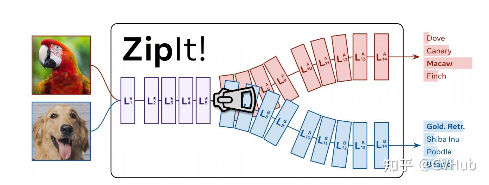
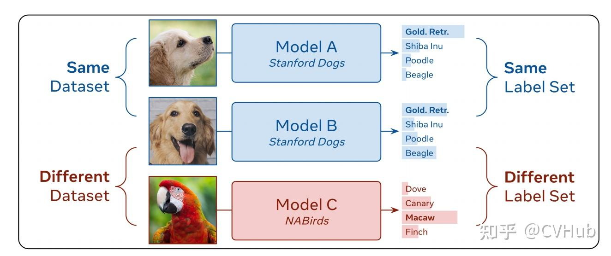
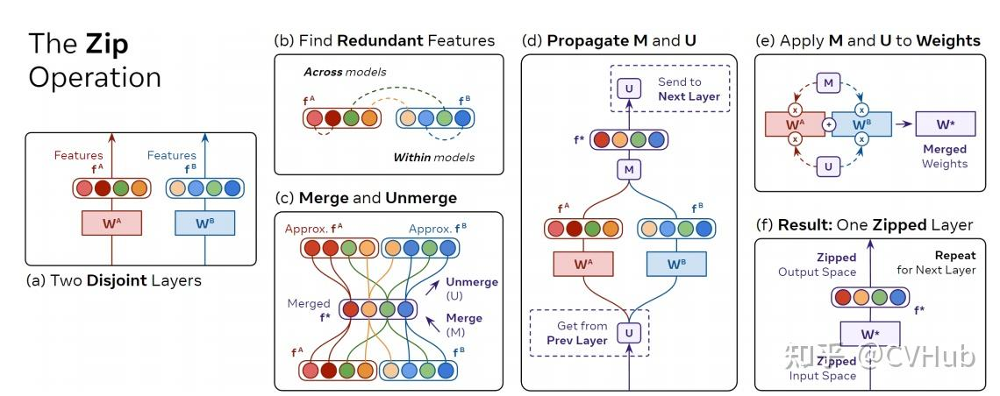
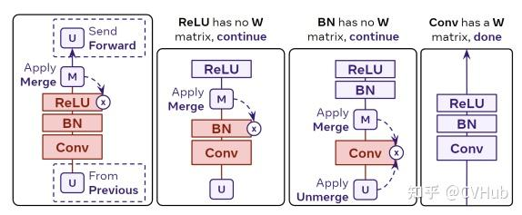

# Title: [ZipIt!](https://zhida.zhihu.com/search?content_id=229163491&content_type=Article&match_order=1&q=ZipIt!&zhida_source=entity) Merging Models from Different Tasks without Training

Paper: [https://arxiv.org/pdf/2305.03053.pdf](https://link.zhihu.com/?target=https%3A//arxiv.org/pdf/2305.03053.pdf)
Code: [https://github.com/gstoica27/Zi](https://link.zhihu.com/?target=https%3A//github.com/gstoica27/ZipIt)

典型的[深度视觉识别模型](https://zhida.zhihu.com/search?content_id=229163491&content_type=Article&match_order=1&q=深度视觉识别模型&zhida_source=entity)能够完成它们训练时的单一任务。在本文中，论文解决了**将完全不同的、有着不同初始化的、各自解决不同任务的模型合并成一个[多任务模型](https://zhida.zhihu.com/search?content_id=229163491&content_type=Article&match_order=1&q=多任务模型&zhida_source=entity)**这个极其困难的问题，而**不需要进行任何额外的训练**。以往的模型合并方法将一个模型置换到另一个模型的空间中，然后将它们相加。虽然这对于在相同任务上训练的模型有效，但论文发现这未能考虑到在不同任务上训练的模型之间的差异。因此，论文引入了一种名为“**ZipIt**!”的通用方法，用于合并同一架构的两个任意模型，它包含两个简单策略。首先，为了考虑到不在模型之间共享的特征，论文扩展了模型合并问题，使其允许在每个模型内部合并特征，定义了一种通用的“zip”操作。其次，论文添加了部分压缩模型以达到指定层的支持，自然地创建了一个多头模型。论文发现，这两个变化的结合使先前工作的性能提高了惊人的20-60%，使在不同任务上训练的模型的合并成为可能。

## **贡献**

图1：ZipIt！通过识别它们共享的特征，合并在完全独立的任务上训练过的模型，而不需要任何额外的训练

论文的主要贡献是：

1. 这篇论文介绍了一种新的方法“ZipIt!”，可以**将多个在不同任务上训练的深度学习模型合并成一个单一的多任务模型，而不需要额外的训练**。
2. 通过泛化模型合并和引入部分压缩，ZipIt！显著改进了在合并在不同任务上训练的模型方面的现有工作，相对于现有方法，它可以**获得高达20-60％的精度提高**。
3. 该论文提出了一种**基于图的算法，用于合并和取消合并模型**，该算法可以应用于相同架构的模型。此外，该论文分析和剖析了ZipIt！在不同场景中的能力，提供了关于ZipIt！的优点和局限性的见解。

## **方法**

图 2: Our Setting

在之前的工作中，重点放在合并来自相同数据集且具有相同标签集的模型上，例如将两个训练用于分类狗品种的模型进行合并。而在这项工作中，论文取消了这个限制，可以**“zip”来自不同数据集且具有不同标签集的模型**，例如合并一个分类狗品种的模型和一个分类鸟种的模型，如上图所示。

在本工作中，论文将模型合并视为将两个模型的checkpoints（即权重集合）联合组合成一个单一的checkpoints，可以执行其组成部分的所有任务。论文通过将一个模型的每一层与另一个模型的相应层合并，并同时修改两个模型来实现这一点（与基于排列的合并相反，后者仅对其中一个模型进行排列）。

论文的目标是从模型 $A$ 中获取layer  $L_i^A \in \mathcal{L}^A$ ，并从模型 $B$ 中获取  $L_i^B \in \mathcal{L}^B$ ，并将它们合并成一个层  $L_i^*$ ，该层结合了它们的特征空间，以便在  $f_i^*$  中保留来自  $f_i^A$  和  $f_i^B$  的信息。

### **The “Zip” Operation**

图 4: The “Zip” Operation

通过利用模型特征中的冗余性逐层合并模型

通过利用模型特征中的冗余性逐层合并模型

1. 从训练于不同任务的模型中获得具有权重  $W^A$  和  $W^B$  的完全不同的层。
2. 通过比较它们的激活  $f^A$  和  $f^B$  来匹配冗余特征。
3. 利用这个匹配来生成merge矩阵  $M$ ，将  $f^A$  和  $f^B$  组合成一个共享的特征空间  $f^*$ ，并生成相应的撤销合并操作的unmerge矩阵  $U$ 。
4. 为了对齐下一层的输入空间，将  $U$  向前传播到网络，并同时从上一层接收一个  $U$  矩阵。
5. 一旦同时拥有输出的  $M$  和输入的  $U$ ，就可以通过应用下面公式将层进行“zip”。

结果是一个具有共享输入和输出空间的单个层，然后可以从（1）开始处理下一层。

### **Zip Propagation**

图 5: Zip Propagation

大多数现代神经网络不仅仅是线性层的简单堆叠。在实践中，我们无法将合并和解合并矩阵应用于网络的每一层，因为局部的合并（上面公式）需要该层具有权重矩阵，即该层必须具有独立的输入和输出空间，以便可以解合并输入空间和合并输出空间。其他层（例如BatchNorm、ReLU）没有这样的权重矩阵。

如上图所示，只有当到达Conv层时，我们才能使用上面公式将  $M_i$  和  $U_i$  合并到其中（在这种情况下，将每个卷积核元素视为独立的）。